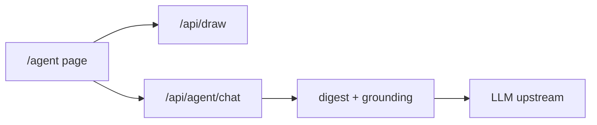

# AI Agent Zonelab

Advisor kondisi market berbasis LLM di atas engine Zonelab. Ia membaca hasil
`/api/draw` (zona, plan, advice, checklist, overlay) dan mengubahnya menjadi
diskusi plus checklist order. Ia tidak memprediksi arah dan tidak
menghasilkan angka sendiri: setiap reply dicek `grounding.check` terhadap
payload yang diberikan.

> [!NOTE]
> Dokumen definisi persona ada di [SOUL.md](SOUL.md). Prompt yang benar-benar
> berjalan hidup di `backend/app/agent.py` sebagai konstanta; kode yang
> ditest adalah sumber kebenaran.

## Cara pakai

```bash
# 1. API jalan (dobel-klik start.bat), lalu buka halaman agent
#    http://127.0.0.1:3100/agent

# 2. Isi Settings: base URL, API key, pilih model, Save.
#    Config tersimpan di backend/.agent.json (tidak pernah di-commit).

# 3. Pilih symbol, interval, bars, provider, klik Scan.
#    Halaman memanggil /api/draw yang sama dengan dashboard.

# 4. Tanya. Contoh:
#    - "kondisi market sekarang gimana?"
#    - "susun checklist order untuk zona terdekat"
#    - "kenapa zona ini placeable false?"
```

## Endpoint API

| Endpoint | Fungsi |
|---|---|
| `GET /api/agent/config` | config aktif (key dimasker) dan status available |
| `POST /api/agent/config` | simpan base_url / api_key / model, probe upstream |
| `POST /api/agent/chat` | satu putaran chat, body `{messages, context}` |

## Testing

```bash
cd backend && .venv/Scripts/python.exe -m pytest tests/test_agent.py
cd backend && .venv/Scripts/python.exe -m tools.agent_smoke   # endpoint sungguhan
cd backend && .venv/Scripts/python.exe -m tools.agent_stress  # concurrency
cd frontend && node e2e/agent.mjs                              # browser sungguhan
```

## Struktur



Dokumen lain di folder ini:

- [SOUL.md](SOUL.md): persona dan empat hukum
- [CLAUDE.md](CLAUDE.md): instruksi sesi Claude di folder ini
- [AGENTS.md](AGENTS.md): peran review

## Lisensi

Copyright 2026 PT Surya Inovasi Prioritas (SURIOTA).
