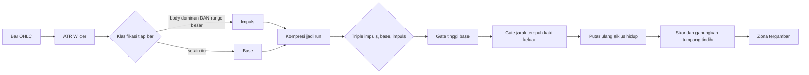

<h1 align="center">Zonelab</h1>
<p align="center">Mesin gambar teknikal otomatis untuk analisis chart. Zona Supply dan Demand digambar sendiri, lengkap dengan alasannya.</p>

<p align="center">
  
  
  
  
</p>

> [!NOTE]
> Tahap pertama sengaja dibatasi pada satu hal saja: menggambar Supply dan Demand
> secara akurat. Detektor ICT lain (FVG, Order Block, IFVG, liquidity sweep)
> menyusul lewat titik ekstensi yang sudah disiapkan, bukan lewat penulisan ulang.

## Daftar Isi

- [Apa ini](#apa-ini)
- [Menjalankan](#menjalankan)
- [Sumber data](#sumber-data)
- [Cara zona ditentukan](#cara-zona-ditentukan)
- [Apa yang sudah terukur](#apa-yang-sudah-terukur)
- [Multi-timeframe](#multi-timeframe)
- [Yang membuatnya dapat diaudit](#yang-membuatnya-dapat-diaudit)
- [Arsitektur](#arsitektur)
- [Pengujian](#pengujian)
- [Batasan yang diketahui](#batasan-yang-diketahui)
- [Langkah berikutnya](#langkah-berikutnya)

## Apa ini

Platform web yang berjalan di mesin lokal. Chart candlestick memuat data pasar
langsung, lalu backend memindai bar-nya dan mengembalikan bentuk yang harus
digambar. Setiap bentuk membawa bukti pembentuknya: indeks bar, ukuran dalam ATR,
dan rincian skornya.

Prinsipnya satu: **gambar yang tidak bisa dijelaskan tidak layak digambar.** Karena
itu setiap zona menyimpan asal-usulnya, dan setiap penyaringan dilaporkan. Chart
yang kosong karena memang tidak ada pola berbeda dari chart yang kosong karena
filternya terlalu ketat, dan panel kiri membedakan keduanya.

## Menjalankan

```powershell
pwsh -File start.ps1
```

Skrip itu membuat virtualenv, memasang dependensi, menyalakan API dan web app,
lalu membuka browser. Jalan pertama memakan beberapa menit; setelah itu beberapa
detik.

> [!TIP]
> Panel kirinya penuh istilah metode yang tidak bisa dipahami dengan
> memandanginya. Buku panduannya ada di **`/docs`** (`http://localhost:3100/docs`,
> tautannya di dasar panel): bentuk yang dicari, arti setiap slider, dan kolom
> yang menandai mana dari dua belas kontrol itu yang benar-benar punya bukti.
> Jawabannya dua.

Manual, bila lebih suka dua terminal:

```powershell
# Terminal 1, API
cd backend
python -m venv .venv
.\.venv\Scripts\python.exe -m pip install -r requirements.txt
.\.venv\Scripts\python.exe -m uvicorn app.main:app --port 8100

# Terminal 2, web
cd frontend
npm install
npm run dev -- --port 3100
```

Buka `http://localhost:3100`.

> [!IMPORTANT]
> Tanpa API key sekalipun aplikasi ini langsung menampilkan data pasar asli,
> karena provider bawaannya tidak memerlukan kunci. Salin `backend/.env.example`
> menjadi `backend/.env` hanya bila ingin memakai sumber lain.

## Sumber data

Semua string simbol di bawah sudah diverifikasi langsung ke vendornya pada
2026-08-13. Bagian inilah yang paling sering salah.

| Provider | Simbol | API key | Interval | Catatan |
|---|---|---|---|---|
| `binance` (bawaan) | `PAXGUSDT` | tidak perlu | 1m sampai 1w, termasuk 4h | Emas tersekuritisasi, bukan spot murni |
| `twelvedata` | `XAU/USD` | perlu, gratis | 1m sampai 1w, termasuk 4h | Spot XAU/USD asli, 800 request per hari |
| `polygon` | `C:XAUUSD` | perlu, gratis | 1m sampai 1w | Spot asli, 5 request per menit, riwayat 2 tahun |
| `yahoo` | `GC=F` | tidak perlu | tanpa 4h | Futures COMEX, bukan spot |
| `aurix` | `GOLD` | tidak perlu | 1m sampai 1w | Lewat instans Aurix lokal, harga broker sendiri |
| `synthetic` | apa saja | tidak perlu | semua | Deterministik, untuk kerja luring |

> [!WARNING]
> Simbol spot Yahoo sudah mati. `XAUUSD=X`, `XAU=X`, dan `GCUSD=X` semuanya
> membalas 404 per 2026-08-13; hanya `GC=F` yang masih hidup. Provider Yahoo di
> sini memang menunjuk ke futures, dan itu disengaja.
>
> Binance menyajikan PAXG, yaitu emas tersekuritisasi berdenominasi USDT. Strukturnya
> setia sehingga detektor bekerja normal, tetapi harganya membawa premi sendiri dan
> tetap berdagang pada akhir pekan. Untuk spot XAU/USD sesungguhnya, pakai Twelve Data.

## Cara zona ditentukan

Formasinya selalu tiga babak: kaki masuk, base tempat gerakan berhenti, lalu kaki
keluar. Pasangan arah kedua kaki itulah yang menentukan namanya.

| Kaki masuk | Base | Kaki keluar | Nama | Sisi |
|---|---|---|---|---|
| Turun | ..... | Naik | DBR | Demand, pembalikan |
| Naik | ..... | Naik | RBR | Demand, penerusan |
| Naik | ..... | Turun | RBD | Supply, pembalikan |
| Turun | ..... | Turun | DBD | Supply, penerusan |



Pemindaiannya satu lintasan. Bar dipartisi menjadi impuls atau base, dipadatkan
menjadi run, lalu setiap triple `impuls -> base -> impuls` menjadi kandidat.
Selebihnya adalah pengukuran, bukan pencarian.

Dua keputusan yang menentukan apakah keluarannya layak dipercaya:

1. **Semua ambang relatif terhadap ATR, tidak pernah absolut.** Candle 5 dolar
   adalah impuls pada sesi XAU yang sepi dan sekadar derau pada sesi yang liar.
2. **ATR pembanding dibaca dari bar sebelum objek yang diukur.** ATR Wilder pada
   bar ke-i sudah memuat true range bar ke-i sendiri, sehingga membandingkan bar
   itu dengan ATR-nya sendiri membuat candle terbesar justru lebih sulit lolos
   sebagai impuls. Hal yang sama berlaku pada tinggi base: base yang tinggi ikut
   menaikkan ATR, jadi mengukurnya terhadap ATR di dalam base membuat gerbang
   tinggi menelan sinyalnya sendiri.

### Siklus hidup zona

| Status | Arti |
|---|---|
| `fresh` | Harga belum pernah kembali sejak kaki keluar |
| `tested` | Harga masuk ke zona tetapi belum memakannya |
| `mitigated` | Penetrasi melampaui ambang mitigasi, bawaannya separuh tinggi zona |
| `broken` | Ada bar yang menutup melewati garis distal, zona mati |

Bar berurutan yang berdiam di dalam zona dihitung sebagai satu kunjungan, bukan
lima. Menghitung tiap bar akan membuat skor kesegaran kehilangan makna.

## Apa yang sudah terukur

Diukur pada 20.000 bar untuk masing-masing dari lima deret, dengan skor dibaca
sebagaimana diketahui **tepat sebelum** harga menyentuh zona, bukan sesudahnya.
Metode lengkap dan seluruh angkanya ada di [`docs/CALIBRATION.md`](docs/CALIBRATION.md);
jalankan ulang dengan `python -m tools.calibrate`.

| Klaim | Putusan |
|---|---|
| Zona yang digambar bertahan lebih sering daripada level di harga acak | **Terbukti**, +19 sampai +35 poin persen di tiga geometri |
| Gerbang `departure` menyaring sesuatu yang nyata | **Terbukti**, zona lolos 85.8% lawan 64.4% untuk formasi yang ditolak, p < 0.0001, n = 2707 |
| Gerbang itu bertahan di bar yang belum pernah dilihat | **Terbukti**, selisihnya menunjuk arah yang benar di 8 dari 8 potongan waktu, di ketiga geometri |
| `departure` di atas 2 ATR makin besar makin baik | **Terbantah**, held mendatar di atas bucket 2-3 ATR |
| `formation_score` memeringkat zona yang akan bertahan | **Terbantah**, AUC 0.46 dan 0.48, yaitu memeringkat terbalik |
| Tinggi kotaknya sendiri meramalkan hasil | **Terbukti, dan itu masalah**, 52.4% lawan 61.4% dari kuartil terpendek ke tertinggi. Stop yang jauh lebih jarang tersentuh, dan itu geometri bukan pasar |
| `tightness` mengukur mutu base | **Terbantah**, ia runtuh ke 0.50 di dalam pita tinggi yang sama; yang diperingkatnya adalah jarak stop |
| Odds enhancer doktrin memeringkat sesuatu | **Terbantah untuk hampir semuanya.** Kerapatan base, kepadatan, irisan antar bar, volume kaki keluar dan posisi kurva semuanya berbalik tanda ketika target diubah dari jarak ATR ke jarak setara-R, yang hanya bisa terjadi bila yang diukur adalah tinggi kotak |
| Zona yang lama menunggu lebih sering bertahan | **Terbantah setelah lolos walk-forward 8 dari 8.** Departure diukur sampai bar sentuhan, jadi umur dan departure terikat secara konstruksi; di dalam pita departure yang sama efeknya lenyap |
| Panjang jalan ke zona lawan memeringkat | **Terbukti di dalam sampel**, AUC 0.565 sampai 0.584, bertahan di kedua sisi, dan **menguat** jadi 0.56 sampai 0.60 ketika tinggi zona disamakan |
| ...dan layak dijadikan gerbang | **Tidak terbukti**, hanya 7 dari 8 potongan di luar sampel, jadi tetap mati |
| Kotaknya digambar persis di ekstrem base-nya | **Terbukti**, galat terburuk 0.000 pada 28476 zona, nol pelanggaran aturan |
| Harga berbalik di zona lebih sering daripada di kotak acak | **Terbantah**, pembalikannya nyata tetapi placebo melakukannya sama banyak, dan tetap begitu ketika besar lari masuk disamakan (0 dari 4 pita) |
| Zona meramalkan arah 40 bar ke depan | **Terbantah**, perpindahan bersihnya nol di semua kelompok |
| Jalan di depan zona meramalkan arah | **Terbantah**, +0.053 ATR dengan p = 0.88. Faktor itu meramalkan ketahanan, bukan arah |
| Zona yang sudah beberapa kali disentuh jadi lebih lemah | **Terbantah setelah tampak sangat kuat.** Mentahnya -27 poin persen dan bertahan ketika tautologi distalnya dibuang; runtuh jadi 77.2 / 77.2 / 77.1 persen di dalam pita umur yang sama |
| Umur zona memisahkan hasil | **Terbukti**, 93.6% di bawah 10 bar lawan 77.2% di atas 59 bar, pada sentuhan pertama yang sama |
| FVG dan Order Block menandai sesuatu yang nyata | **Terbukti**, +10 sampai +25 poin persen terhadap placebo di tiga geometri, dan keduanya kini lolos walk-forward 8 dari 8 di dua geometri |
| Harga meneruskan arah yang membuat kotaknya | **Terbantah**, t = 0.13 sampai 1.01 di horizon utama yang ditetapkan di depan; kriterianya menuntut t di atas 3.0. Hipotesis arah keempat yang gagal |
| Struktur pasar (BOS, CHoCH) membawa bias arah | **Tidak dikonfirmasi.** Pada swing besar DELTA +0.549 ATR, t = 2.27, hasil arah terkuat yang pernah ada di sini. Paruhnya membunuhnya: +1.02 lalu +0.08. Tanda tangan window fit |
| CHoCH lebih informatif daripada BOS | **Terbantah**, dan berlawanan dengan doktrinnya: CHoCH t = 0.26, BOS t = 1.09 pada swing kecil |
| Menembus level membawa arah | **Terbantah, dan literatur sudah tahu.** Huddart dkk. (Management Science 2009) menemukan menembus batas bawah memberi return berikutnya sama positifnya dengan menembus batas atas: peristiwanya punya besaran, tidak punya tanda |
| Kotaknya tidak saling bertabrakan | **Terbantah, lalu diperbaiki.** Belum pernah diukur: semua audit sebelumnya per-zona. Pada default lama, 201 kotak mengecat 39,6% chart rata-rata dan 52,4% di satu deret, dengan 258 redundansi di dalam satu detektor dan 31 kontradiksi berlawanan sisi. Setelah aturan "terakhir" order block ditegakkan dan cap diturunkan 12 ke 6: 131 kotak, 26,7% tinta, 80 redundansi, 20 kontradiksi |
| Order block adalah lilin berlawanan **terakhir** sebelum impuls | **Terbantah sampai 2026-08-16.** Kodenya menandai *setiap* lilin berlawanan, jadi tiga lilin turun beruntun sebelum satu reli menghasilkan tiga order block bertumpuk. n menggelembung ke 21.565 lawan 12.745 FVG di bar yang sama. Setelah diperbaiki, 6.915 kandidat ditolak dan n turun ke 16.194; **kesimpulan placebo-nya tidak berubah** |
| Zona searah bias struktur lebih baik daripada yang melawan | **Tidak dikonfirmasi, dan cara gagalnya yang penting.** FVG pada swing besar lolos ketiga kriteria yang ditetapkan di depan: demand +0.405 (t = 4.63), supply +0.266 (t = 3.06), kedua paruh positif, ketahanan +4.0 poin persen. Lalu kontrolnya jalan. Bar **acak** yang hanya membawa bias, tanpa kotak di mana pun, memisah +0.271 dan +0.184. Selisih-dari-selisih, yaitu apa yang benar-benar ditambahkan zonanya, cuma +0.134 (t = 1.25) dan +0.082 (t = 0.78), dan **negatif** untuk supply/demand maupun order block. Yang terukur adalah biasnya, dan biasnya adalah momentum |

> [!CAUTION]
> Angka-angka di atas berubah pada 2026-08-13 karena **populasinya dulu salah**.
> `tools/calibrate.py` menyetel `max_zones_per_side=100`, yaitu maksimum skema dan
> bukan mati, sedangkan batas itu memilih zona **terbaru**. Sampelnya karena itu
> hidup di 9.6% terakhir tiap deret sambil mengklaim 20.000 bar, dan n-nya 234
> bukan 2707. Nol kini berarti tanpa batas, dan sebuah pengujian menjaganya.
> Kesimpulan pokoknya bertahan dan menguat; setiap angkanya bergeser.

> [!NOTE]
> **Sudah seberapa ICT?** Sebagian, dan yang belum lebih penting daripada yang
> sudah. Geometri FVG, waktu-bisa-diketahuinya, invalidasi lewat penutupan,
> swing fractal berikut tunda konfirmasinya, dan BOS lawan CHoCH semuanya setia,
> dan penundaan ATR satu bar justru **lebih ketat** daripada kebanyakan skrip
> SMC yang beredar. Yang menyimpang: displacement dipakai sebagai lebar gap
> alih-alih lilinnya, order block tidak menuntut break of structure, sweep
> dikode tanpa syarat pembalikan, dan `curve` bukan premium/discount ICT.
> Yang belum ada dan paling penting: **Market Structure Shift** (H6 menguji BOS,
> CHoCH, dan SWEEP terpisah tapi tidak pernah konjungsinya) dan **inversion FVG
> / breaker block** (`break_index` sudah dihitung lalu dibuang). Rinciannya di
> [docs/FIDELITY.md](docs/FIDELITY.md).

> [!IMPORTANT]
> Deteksinya tervalidasi. Peringkat mutunya tidak. Karena itu angka skor sudah
> **dihapus dari label chart**: di atas chart, angka terbaca sebagai peringkat
> mutu, dan itu klaim yang tidak bisa didukung angka tersebut. Medannya juga
> diganti nama dari `strength` menjadi `formation_score`, karena "strength"
> menjanjikan sesuatu yang tidak dimilikinya.

Dua faktor dikeluarkan dari skor karena pengukuran, bukan karena kerapian kode.
`departure` ternyata ambang, bukan gradien, dan sudah ditegakkan sebagai ambang
oleh gerbangnya sendiri. `freshness` konstan tepat pada saat skor dibaca, karena
sebuah zona pasti masih segar pada sentuhan pertamanya. Keduanya dijaga oleh
`test_formation_score_holds_only_formation_factors` agar tidak masuk kembali
tanpa pengukuran baru.

Bobot tiga faktor sisanya **sengaja tidak dipaskan ke data**: sepertiga rata. Pada
sampel yang sudah diperbaiki, komposit itu bukan hanya gagal memeringkat, ia
memeringkat **terbalik** (AUC 0.46 dan 0.48), jadi memaskan bobot ke sana akan
memaskan sesuatu yang tandanya sendiri salah.

### Kesetiaan pada metode, diaudit terpisah

Kalibrasi menjawab "apakah zona ini membedakan hasil". Pertanyaan lain yang sama
pentingnya adalah "apakah kotaknya digambar di tempat yang benar menurut metodenya
sendiri", dan itu diaudit terhadap materi Sam Seiden dan panduan resmi Online
Trading Academy di [`docs/FIDELITY.md`](docs/FIDELITY.md).

Audit itu menemukan satu cacat yang penting: **garis distal digambar salah.**
Doktrinnya tidak ambigu, distal harus selalu ekstrem wick base, karena stop
diletakkan di luarnya dan distal yang digambar di body menaruh stop **di dalam
base yang seharusnya ia lindungi**. Parameter lama menggeser kedua tepi sekaligus,
sehingga mode "body" bukan varian konservatif maupun agresif. Sekarang hanya
proximal yang berpindah, dan invarian distal diverifikasi pada 200 zona nyata di
kedua varian, nol pelanggaran.

Audit yang sama juga menguji **aturan 1:3 milik doktrin**, satu-satunya angka
keras di dalamnya. Diukur, lututnya ada di sekitar 2 dan bukan 3, dan di atas itu
datar. Jadi aturannya tersedia sebagai knob tetapi mati secara bawaan.

## Multi-timeframe

Supply dan demand adalah metode top-down: zonanya milik timeframe lebih tinggi,
entrinya milik yang lebih rendah. Pilih HTF di header dan zona timeframe itu
digambar di atas chart yang sedang tampil, bergaris lebih tebal dan berlabel
timeframe asalnya.

Tiga aturan yang membuatnya benar, bukan sekadar masuk akal:

1. **Bucket ditambatkan ke epoch, bukan ke bar pertama di jendela.** Kalau tidak,
   setiap zona HTF bergeser saat pengguna mengubah jumlah bar, dan itu terlihat
   persis seperti bug detektor.
2. **Bar HTF terakhir dibuang bila belum selesai.** High dan low bar yang masih
   terbentuk masih bergerak, jadi zona di atasnya akan berpindah sendiri.
3. **Bucket kosong tidak diciptakan.** Akhir pekan meninggalkan lubang pada emas
   dan FX; mengisinya dengan bar datar akan mengarang justru bentuk konsolidasi
   yang dicari detektor ini.

Siklus hidup zona HTF dinilai pada bar HTF-nya sendiri. Zona demand H4 tidak mati
hanya karena satu candle M15 menutup beberapa sen di bawahnya.

## Yang membuatnya dapat diaudit

- **Setiap zona menyimpan anatominya.** Indeks bar kaki masuk, base, dan kaki
  keluar ada di dalam respons, sehingga keputusannya bisa diputar ulang manual.
- **Setiap zona menyimpan rincian skornya.** Lima faktor yang jumlahnya persis
  sama dengan `strength`, ditampilkan sebagai batang di panel inspektur.
- **Setiap penolakan dihitung.** Panel `Filter trace` melaporkan berapa formasi
  ditemukan dan gerbang mana yang membuang masing-masing.
- **Zona yang belum final ditandai.** Selama run kaki keluar masih run terbaru,
  bar berikutnya masih bisa memperpanjangnya dan menggeser zona. Zona seperti itu
  digambar putus-putus dan diberi label `forming`, tidak disajikan sebagai final.
- **Geometri tidak pernah repaint.** Dijamin oleh
  `test_confirmed_zone_geometry_never_changes_as_bars_arrive`, yang memutar ulang
  seri bar demi bar dan menuntut setiap zona terkonfirmasi tetap identik sampai
  akhir.

## Arsitektur

```
Zonelab/
+-- backend/                    FastAPI, Python 3.13
|   +-- app/
|   |   +-- main.py             4 endpoint
|   |   +-- models.py           Skema Pydantic, dipakai bersama API dan engine
|   |   +-- indicators.py       ATR Wilder, klasifikasi candle, kompresi run
|   |   +-- config.py           Setelan dari environment
|   |   +-- detect/
|   |   |   +-- __init__.py     Registry detektor, titik ekstensi
|   |   |   +-- supply_demand.py  Engine inti
|   |   +-- providers/
|   |       +-- base.py         Protocol, kosakata interval, normalisasi
|   |       +-- sources.py      Binance, Yahoo, Twelve Data, Polygon, Aurix
|   |       +-- synthetic.py    Data deterministik luring
|   +-- tests/                  22 pengujian fixture emas
|
+-- frontend/                   Next.js 16, React 19, Tailwind v4
    +-- src/
        +-- app/page.tsx        Shell tiga panel
        +-- components/
        |   +-- chart.tsx       Pembungkus lightweight-charts v5
        |   +-- zone-primitive.ts  ISeriesPrimitive kustom, penggambar kotak
        |   +-- toolbox.tsx     Parameter langsung plus jejak filter
        |   +-- zone-panel.tsx  Daftar zona plus inspektur
        +-- lib/                Klien API dan tipe
```

### Endpoint

| Metode | Rute | Kegunaan |
|---|---|---|
| `GET` | `/api/health` | Cek hidup |
| `GET` | `/api/config` | Provider, simbol, interval, detektor yang tersedia |
| `GET` | `/api/candles` | Hanya bar OHLCV |
| `POST` | `/api/draw` | Bar plus bentuk yang digambar di atasnya |

`/api/draw` mengembalikan candle dan zona dalam satu respons. Ini disengaja: chart
tidak akan pernah bisa menggambar zona yang dihitung dari bar yang tidak sedang
ditampilkannya.

### Menambah detektor baru

Tulis satu modul di samping `supply_demand.py` dengan tanda tangan
`detect(candles, params) -> (shapes, stats)`, lalu tambahkan satu baris di
`DETECTORS`. API dan frontend memberangkatkan panggilan lewat dict itu dan tidak
perlu diubah.

## Pengujian

Empat lapis, dan masing-masing menangkap hal yang tidak tertangkap lapis lain.

```powershell
# 1. Unit, fixture emas. Tidak butuh apa pun yang menyala.
cd backend
.\.venv\Scripts\python.exe -m pytest

# 2. Kalibrasi dan pengukuran hasil. Butuh internet pada jalan pertama,
#    lalu memakai cache. Empat pertanyaan yang berbeda.
.\.venv\Scripts\python.exe -m tools.calibrate    # apakah zonanya membedakan hasil
.\.venv\Scripts\python.exe -m tools.walkforward  # apakah itu bertahan di luar sampel
.\.venv\Scripts\python.exe -m tools.reaction     # apakah harganya benar-benar berbalik
.\.venv\Scripts\python.exe -m tools.refinement   # apa yang dibeli penyempurnaan zona
.\.venv\Scripts\python.exe -m tools.drawing_accuracy  # apakah kotaknya di tempat yang benar, setiap kali

# 3. Kontrak API. Butuh API menyala.
.\.venv\Scripts\python.exe -m tools.validate_api

# 4. End to end lewat browser. Butuh API dan web app menyala.
cd ..\frontend
npm run e2e                # 76 asersi: setiap kontrol, kontras, mobile
npm run e2e:resilience     # 12 asersi: API mati, pulih, API key salah
npm run e2e:pixels 15m     # baca ulang kanvas: tepi tercat lawan catatan zona
```

40 pengujian unit, semuanya lulus. Setiap seri harga dibangun dengan tangan
sehingga jawaban benarnya diketahui secara konstruksi, bukan dari mengamati
chart. Asersi geometrinya eksak: bila satu batas bergeser satu tik, itu
perubahan perilaku dan pengujiannya harus mengatakan demikian.

> [!TIP]
> Sapuan browser itu ada karena dua cacat lolos dari semua asersi DOM: label zona
> yang tertutup candle, dan chart yang kolaps setinggi nol di layar ponsel.
> Keduanya hanya terlihat pada tangkapan layar. Asersi `chart is actually tall
> enough to read` lahir dari kejadian kedua.

> [!TIP]
> Lapis kelima, `e2e:pixels`, ada karena keempat lapis di atas membandingkan
> angka dengan angka. Ia membaca kembali kanvasnya, mencari garis batas yang
> benar-benar tercat, lalu mengubahnya menjadi harga lewat skala chart. Itu yang
> menemukan tepi kiri kotak tertambat ke titik tengah bar base pertama, bukan ke
> tepinya, sehingga separuh bar itu berada di luar kotaknya sendiri dan garis
> batasnya terkubur di bawah candle. Rinciannya di
> [`docs/FIDELITY.md`](docs/FIDELITY.md).

<details>
<summary>Yang dijamin oleh pengujian</summary>

- Keempat formasi dikenali dengan batas atas, batas bawah, dan anatomi yang persis
- Garis proksimal dan distal berada pada sisi yang benar untuk demand maupun supply
- Kaki keluar yang lemah ditolak, dan penolakannya terhitung di `stats`
- Base yang terlalu tinggi ditolak
- Konsolidasi panjang dipotong ke bar tempat gerakan benar-benar berangkat
- Zona berubah `tested` lalu `broken`, dan tepi kanannya berhenti di bar patahan
- Bar berurutan di dalam zona terhitung satu kunjungan
- Zona tumpang tindih runtuh menjadi yang lebih kuat
- Base doji ditumbuhkan ke tinggi minimum, karena zona setinggi nol tidak akan
  pernah bisa tersentuh
- ATR tidak pernah NaN selama warmup
- Geometri zona terkonfirmasi tidak pernah berubah saat bar baru berdatangan
- Timestamp ganda dari provider diruntuhkan di batas provider

</details>

## Batasan yang diketahui

> [!CAUTION]
> Zonelab menggambar struktur, bukan sinyal dagang. Kalibrasi mengukur apakah
> zona bertahan saat harga kembali, **tanpa spread, tanpa slippage, tanpa biaya**.
> Itu bukan hasil perdagangan dan tidak boleh dibaca demikian.

- `formation_score` tidak terbukti memeringkat apa pun. Ia dipakai untuk urutan
  tampilan dan penggabungan zona bertumpuk, bukan untuk menilai peluang.
- Kalibrasi hanya menguji **sentuhan pertama**. Klaim bahwa zona segar lebih baik
  daripada zona yang sudah diuji belum diuji di sini.
- Kontrol placebo hanya menguji "level sembarangan". Klaim yang sah: zona
  mengalahkan harga acak dan mengalahkan formasi yang ditolak gerbang. Bukan:
  zona mengalahkan semua metode penandaan level.
- Tiga dari lima deret kalibrasi adalah kripto, dan emasnya diwakili PAXG. Ini
  bukan sampel XAU spot murni.
- Volume dari sebagian provider adalah tick volume, bukan kontrak yang benar-benar
  diperdagangkan. Faktor volume di sini adalah proksi keaktifan, bukan volume
  institusional.
- Zona multi-timeframe sudah ada dan kausal (bar HTF yang belum selesai dibuang),
  tetapi aturan bersarang yang disepakati semua aliran **tidak menunjukkan manfaat
  terukur** pada 2707 zona. Ia dilaporkan lewat `nested_in`, tidak diskor.
- Penyempurnaan zona menaikkan reward per satuan risiko sekitar 2.2 kali dan
  menurunkan tingkat bertahan 4 sampai 10 poin persen. Pertukaran itu hanya bisa
  diselesaikan oleh biaya transaksi trader, yang tidak dimodelkan di sini.
- Pemutaran siklus hidup melihat bar setelah zona terbentuk. Itu benar untuk
  menggambar riwayat, tetapi bukan mesin backtest dan tidak boleh dipakai sebagai
  backtest.

## Langkah berikutnya

- [x] Zona Supply dan Demand dengan siklus hidup dan penilaian
- [x] Beberapa provider data, jalan tanpa API key
- [x] Panel parameter langsung plus jejak filter
- [x] Inspektur zona dengan rincian skor
- [x] Kalibrasi terhadap 100.000 bar dengan dua kelompok kontrol
- [x] Penyempurnaan zona HTF memakai candle LTF, diukur berpasangan
- [x] Invalidasi saat zona lawan baru menutup jalan di depan
- [x] Uji reaksi sebelum dan sesudah sentuhan, dengan kontrol drift
- [x] Walk-forward dengan purging, delapan potongan di luar sampel
- [x] Detektor FVG dan Order Block, diukur lewat harness yang sama
- [x] Realtime, muat ulang saat bar tutup
- [ ] IFVG dan Breaker Block
- [ ] Liquidity sweep, BOS, dan CHoCH
- [ ] Zona multi-timeframe dengan stempel konfirmasi
- [ ] Streaming langsung lewat WebSocket
- [ ] Agen LLM yang membaca zona beserta buktinya lalu memberi pembacaan tertulis

---

Hak cipta 2026 PT Surya Inovasi Prioritas (SURIOTA).
