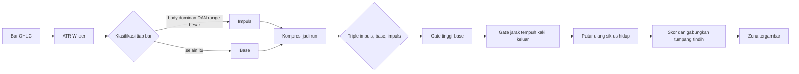

<h1 align="center">Zonelab</h1>
<p align="center">Mesin gambar teknikal otomatis untuk analisis chart. Zona Supply dan Demand digambar sendiri, lengkap dengan alasannya.</p>

<p align="center">
  
  
  
  
  
</p>

> [!NOTE]
> Yang dikirim menyala secara bawaan tetap satu hal saja: menggambar Supply dan
> Demand secara akurat. Empat detektor ICT lain (FVG, Order Block, IFVG, Breaker
> Block) dan sembilan overlay - struktur pasar, grid siklus, opening gap, event
> horizon, liquidity pool, CISD, level bernama (PDH/PWL dan seterusnya),
> proyeksi deviasi, dan kalender ekonomi - sudah ada lewat titik ekstensi yang
> sama, mati secara bawaan, dan tidak satu pun boleh dibaca sebagai arah. Rincian apa yang diadopsi
> dari `Referensi grup dan Bg Nas`, butir demi butir, ada di [`docs/ADOPSI.md`](docs/ADOPSI.md).

## Daftar Isi

- [Apa ini](#apa-ini)
- [Menjalankan](#menjalankan)
- [Sumber data](#sumber-data)
- [Cara zona ditentukan](#cara-zona-ditentukan)
- [Detektor lain dan overlay struktur](#detektor-lain-dan-overlay-struktur)
- [Apa yang sudah terukur](#apa-yang-sudah-terukur)
- [Biaya yang dibebankan](#biaya-yang-dibebankan)
- [Multi-timeframe](#multi-timeframe)
- [Dealing range di atas chart](#dealing-range-di-atas-chart)
- [Korelasi pasangan SSMT](#korelasi-pasangan-ssmt)
- [Yang membuatnya dapat diaudit](#yang-membuatnya-dapat-diaudit)
- [Arsitektur](#arsitektur)
- [Pengujian](#pengujian)
- [Batasan yang diketahui](#batasan-yang-diketahui)
- [Langkah berikutnya](#langkah-berikutnya)

## Apa ini

Platform web yang berjalan di mesin lokal. Chart candlestick memuat data pasar
langsung, lalu backend memindai bar-nya dan mengembalikan bentuk yang harus
digambar. Setiap bentuk membawa bukti pembentuknya: indeks bar, ukuran dalam ATR,
dan rincian skornya.

Prinsipnya satu: **gambar yang tidak bisa dijelaskan tidak layak digambar.** Karena
itu setiap zona menyimpan asal-usulnya, dan setiap penyaringan dilaporkan. Chart
yang kosong karena memang tidak ada pola berbeda dari chart yang kosong karena
filternya terlalu ketat, dan panel kiri membedakan keduanya.

## Menjalankan

Dobel-klik **`start.bat`**. Tidak ada yang perlu ditulis.

Ia membuat virtualenv, memasang dependensi, menyalakan API dan web app,
menunggu keduanya benar-benar menjawab, lalu membuka browser. Jalan pertama
memakan beberapa menit; setelah itu beberapa detik.

Matikan semuanya dengan dobel-klik **`stop.bat`**.

> [!NOTE]
> **Kenapa `.bat` dan bukan `.ps1`**, dan ini terukur di mesin ini bukan selera.
> `assoc .ps1` menjawab *"File association not found for extension .ps1"* - jadi
> sebuah `.ps1` tidak bisa dijalankan dengan dobel-klik sama sekali, ia hanya
> membuka dialog "Open with". `assoc .bat` menjawab `.bat=batfile`, dijalankan
> `cmd.exe` langsung.
>
> PowerShell adalah **bahasa** yang lebih baik untuk pekerjaan ini:
> `Get-NetTCPConnection` memberi PID pemilik socket sebagai objek alih-alih teks
> `netstat` yang harus diurai, dan penanganan errornya sungguhan. Tetapi ia bukan
> peluncur sekali-klik di Windows, dan itu syarat yang diminta. `start.ps1`
> dihapus, tidak disimpan berdampingan - dua peluncur akan masing-masing membawa
> nomor port, path venv, dan logika kill-nya sendiri, lalu berpisah.

**Satu window, kedua server.** Keduanya menulis log ke window yang sama dalam
urutan kejadiannya. Baris yang dimulai `INFO` adalah API, sisanya web app. Versi
sebelumnya membuka satu console per server dan itu justru lebih sulit dibaca:
dua window untuk dicari, dan begitu satu permintaan menyentuh keduanya, Anda
membaca dua log berdampingan untuk mengikuti satu peristiwa.

**`start.bat` memanggil `stop.bat /q` lebih dulu**, jadi menjalankannya dua kali
tidak menumpuk apa pun. Diukur atas empat start berturut-turut: tepat 4 proses
dan 3 listener setiap kali, tanpa drift, dan `stop.bat` sesudahnya
memverifikasi nol.

> [!TIP]
> Panel kirinya penuh istilah metode yang tidak bisa dipahami dengan
> memandanginya. Buku panduannya ada di **`/docs`** (`http://localhost:3100/docs`,
> tautannya di dasar panel): bentuk yang dicari, arti setiap slider, dan kolom
> yang menandai mana dari dua belas kontrol itu yang benar-benar punya bukti.
> Jawabannya dua.

Manual, bila lebih suka dua terminal:

```powershell
# Terminal 1, API
cd backend
python -m venv .venv
.\.venv\Scripts\python.exe -m pip install -r requirements.txt
.\.venv\Scripts\python.exe -m uvicorn app.main:app --port 8100

# Terminal 2, web
cd frontend
npm install
npm run dev -- --port 3100
```

Buka `http://localhost:3100`.

> [!NOTE]
> `frontend/package.json` memuat `"allowScripts": { "unrs-resolver": false }`, dan
> itu keputusan keamanan yang ditulis di sini karena JSON tidak bisa memuat
> komentar. npm 12 memblokir postinstall dari dependensi transitif secara bawaan
> lalu memperingatkan setiap install. Skrip itu **ditolak**, bukan diizinkan:
> binding native yang benar (`@unrs/resolver-binding-win32-x64-msvc`) sudah
> terpasang sebagai optionalDependency, `require("unrs-resolver")` memuat tanpa
> masalah, dan eslint jalan bersih tanpanya - jadi skripnya memang jalur mundur
> yang tidak terpakai di platform ini. Mengizinkannya berarti memberi hak
> eksekusi saat install kepada dependensi tingkat ketiga demi menghilangkan satu
> peringatan, dan itu pertukaran yang salah arah.

## Preset layer

Enam belas layer adalah keunggulan data dan sekaligus masalah fokus. Preset
menyelesaikan yang kedua **tanpa engine berpendapat apa pun**: pembaca memilih
satu set bernama, satu klik.

| preset | isinya |
|---|---|
| **Boxes** | lima detektor formasi, tanpa apa pun lagi |
| **Clock** | waktu saja: kuarter, true open, defining range |
| **Liquidity** | gap, pool, named level, perubahan delivery |
| **Cross-instrument** | SSMT plus checklist di belakangnya |

Plus set buatan sendiri, disimpan di browser.

> [!IMPORTANT]
> **Bukan deteksi fase otomatis, dan itu keputusan.** Engine sudah menghitung
> fasenya - `checklist.profile` mengembalikan hal seperti
> `{name: "XAMD", manipulation: "Q3"}` - jadi deteksinya bukan masalahnya.
> Masalahnya apa yang dilakukan switch otomatis pada pembaca: **layer yang
> disembunyikan inferensi tidak bisa dibedakan dari layer yang tidak menemukan
> apa-apa**, dan pembedaan itu satu-satunya properti yang seluruh engine ini
> dibangun untuk menjaganya. Ia juga berarti engine mengklaim "sekarang
> manipulasi, jadi lihat SSMT", yaitu klaim regime tanpa pengukuran.

Setiap preset membawa params minimum yang dibutuhkan layernya untuk **menggambar**,
dan itu bukan kenyamanan melainkan pembeda antara preset dan jebakan.

**Tiga** dari enam belas layer menggambar **nol** kalau dinyalakan dengan params
bawaan, dan angkanya diukur bukan ditaksir - menggambar tiap layer sendirian
dengan bawaan murni, `session`, `dfr`, dan `ssmt` kembali kosong dan dua belas
lainnya tidak:

```
session=0   dfr=0   ssmt=0
supply_demand=6  fvg=7  order_block=9  ifvg=8  breaker=8  structure=188
gaps=5  cisd=40  pools=12  liquidity=16  projections=2  news=8
```

Bawaan kosong itu sengaja: overlay yang menyalakan dirinya sendiri akan
membelanjakan anggaran ink yang sudah diperhitungkan orang lain. Tetapi ketiganya
**mengatakan** kalau sedang menggambar nol, karena chart kosong dan mesin rusak
tidak boleh terlihat sama. Terverifikasi di browser - Boxes 35 zona, tiga preset
lainnya 23 sampai 29 objek kanvas. Preset tidak pernah menyentuh ambang yang sudah
Anda tuning.

## Trade Snapshot dan Decision Engine

Dua hal yang dibangun untuk **shadow trading**, bukan untuk eksekusi. Zonelab
tidak mengirim order dan tidak akan.

```
POST /api/snapshot   {response, note, deduce?, draw?}
GET  /api/snapshots
GET  /api/snapshots/{id}
POST /api/deduce     {response, draw}
```

**Snapshot menyimpan respons yang sedang tampil, apa adanya.** Client mengirim
balik body `/api/draw` yang dipegangnya; backend **tidak** menggambar ulang.
Alasannya: `/api/draw` menjawab "apa yang benar sekarang", snapshot menjawab "apa
yang dilihat pembaca", dan di antara keduanya satu tick mendarat. Snapshot yang
digambar ulang adalah snapshot dari chart yang tidak pernah dilihat siapa pun,
dan tidak bisa dibedakan dari yang asli.

**Lag dipecah jadi empat angka, dan itu inti nilainya.** `feed_lag_seconds`
bukan staleness: ia `now - bar_closed_at`, jadi di chart 15 menit ia berjalan 0
sampai 900 semata karena waktu berjalan di dalam bar yang sedang terbentuk. Run
pertama mengukur 558 detik dan tidak ada yang salah - itu sembilan menit ke dalam
bar lima belas menit. Kalau dibaca sebagai staleness, auditnya akan salah sampai
satu bar penuh.

| field | arti |
|---|---|
| `intra_bar_seconds` | sudah sejauh mana di dalam bar yang terbentuk. Normal, bukan masalah |
| `overdue_seconds` | melebihi satu bar penuh. **Ini** sinyal staleness sungguhan |
| `screen_seconds` | server menjawab sampai snapshot diambil. Jeda pembaca sendiri |
| `total_seconds` | `overdue + screen`, dan **sengaja tidak** memasukkan intra-bar |

**Decision Engine menerapkan aturan yang Anda tulis, tanpa inferensi.** Satu
premis tidak bisa disediakan engine: `DOL Direction`. `liquidity.dol_candidates`
menolak menamainya, dan penolakan itu disengaja - likuiditas tegak selalu ada di
atas **dan** di bawah harga, jadi memilih satu adalah keputusan, bukan
pengukuran. Jadi caller yang menominasikannya, dan setiap klausa di hasilnya
membawa `source` berupa `measured` atau `nominated`.

> [!WARNING]
> Statusnya `RULE MET`, **bukan** "Valid Setup". Aturan itu belum diukur - tanpa
> walk-forward, tanpa placebo, tanpa base rate - sementara pengukuran proyek ini
> justru menunjuk arah lain: dua belas hipotesis arah pre-registered gagal, dan
> post-inversion touch terukur **negatif signifikan** di ketiga detektor. "Valid"
> berarti engine mendukung aturan yang dibantah buktinya sendiri. `RULE MET`
> hanya mengatakan sebanyak yang benar: syarat yang Anda tulis terpenuhi.

Snapshot tidak menyimpan entry, exit, profit, atau skor, karena ini berjalan di
waktu keputusan dan hasilnya belum bisa diketahui. Ia sisi kiri sebuah audit;
sisi kanannya statement broker Anda, dan menggabungkan keduanya itulah gunanya.

Tersimpan di `backend/.snapshots/`, tidak pernah di-commit.

> [!IMPORTANT]
> Tanpa API key sekalipun aplikasi ini langsung menampilkan data pasar asli,
> karena provider bawaannya tidak memerlukan kunci. Salin `backend/.env.example`
> menjadi `backend/.env` hanya bila ingin memakai sumber lain.

## Sumber data

Semua string simbol di bawah sudah diverifikasi langsung ke vendornya pada
2026-08-13, dan Dukascopy pada 2026-08-16. Bagian inilah yang paling sering
salah.

| Provider | Simbol | API key | Interval | Catatan |
|---|---|---|---|---|
| `binance` (bawaan) | `PAXGUSDT` | tidak perlu | 1m sampai 1w, termasuk 4h | Emas tersekuritisasi, bukan spot murni |
| `dukascopy` | `XAUUSD` | tidak perlu | dibangun dari tick, semua interval | Spot asli, dan satu-satunya sumber di sini yang menerbitkan bid dan ask, jadi spread-nya **diukur per bar** bukan diasumsikan. Hanya `XAUUSD` dan `EURUSD` yang divalidasi divisornya |
| `twelvedata` | `XAU/USD` | perlu, gratis | 1m sampai 1w, termasuk 4h | Spot XAU/USD asli, 800 request per hari |
| `polygon` | `C:XAUUSD` | perlu, gratis | 1m sampai 1w | Spot asli, 5 request per menit, riwayat 2 tahun |
| `yahoo` | `GC=F` | tidak perlu | tanpa 4h | Futures COMEX, bukan spot |
| `synthetic` | apa saja | tidak perlu | semua | Deterministik, untuk kerja luring |

> [!WARNING]
> Simbol spot Yahoo sudah mati. `XAUUSD=X`, `XAU=X`, dan `GCUSD=X` semuanya
> membalas 404 per 2026-08-13; hanya `GC=F` yang masih hidup. Provider Yahoo di
> sini memang menunjuk ke futures, dan itu disengaja.
>
> Binance menyajikan PAXG, yaitu emas tersekuritisasi berdenominasi USDT. Strukturnya
> setia sehingga detektor bekerja normal, tetapi harganya membawa premi sendiri dan
> tetap berdagang pada akhir pekan. Untuk spot XAU/USD sesungguhnya, pakai Twelve Data.

### Dua puluh instrumen, dan kenapa dua di antaranya cuma satu provider

Picker simbol dibuat dari tabel `SYMBOLS` di `app/providers/sources.py`, jadi
apa pun yang tidak ada di sana tidak terjangkau dari UI meski providernya
melayaninya. Itu terjadi: `US30` dan `GBPJPY` mengembalikan bar MT5 nyata selama
ini lewat jalur pass-through dan keduanya tidak ada di tabel, jadi hanya
terjangkau dengan menyunting URL. `DE40` dicoba dan broker ini tidak punya simbol
itu sama sekali; DAX di sini bernama `DE30`.

Lima ditambahkan 2026-08-20, masing-masing diukur sebelum dituliskan, mengikuti
aturan tabel itu sendiri: kolom MT5 dari `symbols_get()` terminalnya, kolom Yahoo
dari fetch yang benar-benar mengembalikan bar.

| Id | MT5 | Yahoo | Kenapa |
|---|---|---|---|
| `US30` | `US30` | `YM=F` | melengkapi kompleks indeks AS di samping NAS100 dan SPX500 |
| `USDJPY` | `USDJPY` | `USDJPY=X` | pasangan FX paling relevan ke emas setelah indeks dolar |
| `GBPJPY` | `GBPJPY` | `GBPJPY=X` | |
| `NGAS` | `XNGUSD` | `NG=F` | kaki energi di samping WTI dan BRENT |
| `DE30` | `DE30` | tidak ada | Yahoo tidak menerbitkan future DAX |

Future dipilih di atas indeks kas, dan itu keputusan sesi bukan selera: diukur di
window 5 hari 1h yang sama, `YM=F` memberi 90 bar sementara `^DJI` hanya 31,
karena indeks kas hanya mencetak pada jam bursa reguler. Menyelaraskan indeks kas
terhadap emas memotong grid ke sesi indeksnya dan membuang dua pertiga barnya.

Untuk DAX tidak ada future di Yahoo: `FDAX=F` menjawab 404 dan `DAX=F` menjawab
200 dengan nol bar. Indeks kas `^GDAXI` ada dengan 45 bar, dan aturan tabel ini
adalah indeks kas **ditinggalkan daripada ditawarkan sebagai jebakan**. Satu
provider adalah fakta tentang venue, bentuk yang sama dengan `US10Y` dan `US30Y`
secara terbalik.

> [!CAUTION]
> Satu id simbol adalah instrumen berbeda per sumber, dan selisihnya tidak selalu
> basis. Emas spot MT5 lawan future COMEX Yahoo berjarak sekitar 64 dolar, yang
> masuk akal. Tetapi `COPPER` tutup di **13968,59** di MT5 dan **6,44** di Yahoo -
> faktor dua ribu, karena unitnya berbeda. Korelasi return kebal terhadap itu, dan
> `aligned.py` memang diberi satu provider saja. Apa pun yang membandingkan HARGA
> lintas venue akan jadi omong kosong.

Smoke test seluruh matriks, 2026-08-20: **37 dari 37** pasangan simbol-provider
mengembalikan bar, dua puluh simbol lewat MT5 dan Yahoo.

### Kenapa bawaannya Binance, dan apa yang harus diketahui soal itu

Diukur pada menit yang sama, 2026-08-19:

| Sumber | Harga | Selisih dari spot | Bar terakhir |
|---|---|---|---|
| Acuan spot XAU/USD (`api.gold-api.com`) | 4359,00 | - | beberapa detik |
| `binance` PAXGUSDT | 4357,50 | **-1,50** (0,03%) | **1,9 menit** |
| `yahoo` GC=F | 4410,10 | **+51,10** (1,17%) | **10,1 menit** |

51 dolar itu **premi futures COMEX**, bukan kesalahan: GC=F memang kontrak
berjangka dan tidak seharusnya sama dengan spot. Ia juga tertunda. Keduanya
adalah alasan chart ini dulu tidak sepakat dengan terminal lain, dan alasan
bawaannya pindah.

> [!WARNING]
> **Binance hanya membawa tiga dari lima belas simbol**: `XAUUSD`, `BTCUSD` dan
> `ETHUSD`. Dua belas sisanya, dari `COPPER` sampai `US30Y`, hanya ada di Yahoo.
> Karena itu picker `Source` **mengikuti simbol**: memilih simbol yang tidak
> dibawa sumber terpilih memindahkan sumbernya ke yang membawanya, dan picker
> menampilkan yang benar-benar dipakai. Tanpa itu, dua belas simbol menjawab 502.
>
> PAXG tetap bukan spot. Untuk XAU/USD sungguhan, Twelve Data atau Dukascopy.

## Cara zona ditentukan

Formasinya selalu tiga babak: kaki masuk, base tempat gerakan berhenti, lalu kaki
keluar. Pasangan arah kedua kaki itulah yang menentukan namanya.

| Kaki masuk | Base | Kaki keluar | Nama | Sisi |
|---|---|---|---|---|
| Turun | ..... | Naik | DBR | Demand, pembalikan |
| Naik | ..... | Naik | RBR | Demand, penerusan |
| Naik | ..... | Turun | RBD | Supply, pembalikan |
| Turun | ..... | Turun | DBD | Supply, penerusan |



Pemindaiannya satu lintasan. Bar dipartisi menjadi impuls atau base, dipadatkan
menjadi run, lalu setiap triple `impuls -> base -> impuls` menjadi kandidat.
Selebihnya adalah pengukuran, bukan pencarian.

Dua keputusan yang menentukan apakah output-nya layak dipercaya:

1. **Semua ambang relatif terhadap ATR, tidak pernah absolut.** Candle 5 dolar
   adalah impuls pada sesi XAU yang sepi dan sekadar derau pada sesi yang liar.
2. **ATR pembanding dibaca dari bar sebelum objek yang diukur.** ATR Wilder pada
   bar ke-i sudah memuat true range bar ke-i sendiri, sehingga membandingkan bar
   itu dengan ATR-nya sendiri membuat candle terbesar justru lebih sulit lolos
   sebagai impuls. Hal yang sama berlaku pada tinggi base: base yang tinggi ikut
   menaikkan ATR, jadi mengukurnya terhadap ATR di dalam base membuat gate
   tinggi menelan sinyalnya sendiri.

### Siklus hidup zona

| Status | Arti |
|---|---|
| `fresh` | Harga belum pernah kembali sejak kaki keluar |
| `tested` | Harga masuk ke zona tetapi belum memakannya |
| `mitigated` | Penetrasi melampaui ambang mitigasi, bawaannya separuh tinggi zona |
| `broken` | Ada bar yang menutup melewati garis distal, zona mati |

Bar berurutan yang berdiam di dalam zona dihitung sebagai satu kunjungan, bukan
lima. Menghitung tiap bar akan membuat skor kesegaran kehilangan makna.

## Detektor lain dan overlay struktur

`DETECTORS` sekarang berisi **lima** entri, dan mereka bukan setara. Bedanya
diukur, bukan dinyatakan.

| Detektor | Yang digambar | Yang diukur tentangnya |
|---|---|---|
| `supply_demand` | Triple impuls, base, impuls | Gate `departure` tervalidasi, pada sentuhan pertama |
| `fvg` | Celah tiga lilin yang belum terisi | +10 sampai +25 poin persen lawan placebo, lolos walk-forward 8 dari 8 di dua geometri |
| `order_block` | Lilin berlawanan **terakhir** sebelum impuls | Sama, lewat rig yang sama |
| `ifvg` | FVG yang harganya sudah menutup melewatinya, dibaca dari sisi seberang | H8: **negatif signifikan** sebagai klaim arah |
| `breaker` | Order block yang mengalami peristiwa yang sama | H8: **negatif signifikan** sebagai klaim arah |

`ifvg` dan `breaker` bukan geometri baru. Keduanya persegi induk yang sama,
dimasuki dari sisi lain setelah harga menutup melewatinya, dan satu-satunya
keputusan yang ditambahkan modulnya adalah siklus hidup box terbalik dimulai
sesudah bar patahan. Karena box itu dibuat oleh sebuah penutupan dan bukan oleh
sebuah kaki, `departure_atr` di sana menggambarkan kaki yang membangun
**induknya**, dan `displacement` sengaja dibiarkan None.

> [!WARNING]
> Doktrin kedua box itu adalah klaim arah, dan klaim itu sudah diukur. H8
> membandingkan sentuhan pasca-inversi dengan kontrol yang cuma tahu gerak 20 bar
> terakhir dan tidak punya box di mana pun: box-nya **menambah** -0,179,
> -0,165, dan -0,274, ketiganya signifikan negatif. Keduanya digambar, dan tidak
> satu pun disajikan sebagai arah.

### Overlay struktur pasar

`structure` diiklankan **terpisah** dari daftar detektor, dan itu bukan soal
kerapian. Ia tidak menghasilkan satu box pun, jadi ia tidak bisa dibatasi per
sisi dan tidak boleh masuk daftar yang dipakai UI untuk membangun tombol box.

Yang digambar: swing berikut `confirmed_at`-nya, BOS, CHoCH, sweep dengan medan
penolakan `reversed_within`, dan MSS. Dua skala fraktal berjalan berdampingan,
dan untuk pertama kalinya keduanya **disilangkan** lewat `aligned_with_swing`.

Digambar demi kesetiaan, tidak pernah sebagai sinyal: H6 dan H9 mengukur persis
objek ini dan keduanya nol.

### Medan baru yang dilaporkan pada zona

| Medan | Arti |
|---|---|
| `dealing_range_pos` | Premium/discount ICT, dibaca **pada sentuhan pertama** di rentang swing-ke-swing. Berbeda dari `curve`, yang adalah bacaan Seiden dan dibekukan saat zona lahir |
| `displacement` | Kaki yang melayakkan box, sebagai objek: ke mana ia lari, seberapa besar, apakah ia menembus struktur, apakah ia meninggalkan gap. Bukan ambang |
| `inverted_at` | Kapan harga menutup melewati box induk. IFVG dan breaker saja |
| `structure_break_time` | Break yang dihasilkan impuls order block, hanya ketika `require_structure_break` dinyalakan |

> [!CAUTION]
> Dengan kelima detektor menyala, chart-nya **terukur lebih sulit dibaca**: 198
> box, 31,6% chart tercat rata-rata dan 42,3% pada deret terburuk, tumpukan
> terdalam 11. Baris proyek ini sendiri berlaku apa adanya: lewat kira-kira
> sepertiga chart, box berhenti menganotasi harga dan menjadi latar
> belakangnya. Bawaan yang dikirim tetap supply dan demand saja, dan cap-nya 6 per
> detektor per sisi, jadi lima detektor berarti sampai 60 box secara
> konstruksi.

### Empat overlay berbasis harga

Terdaftar dengan `kind` berupa `overlay`, bukan `detector`, karena tidak satu pun
menghasilkan box: tidak punya sisi, jadi tidak bisa dibatasi per sisi. Semuanya
mati secara bawaan, dan semuanya membaca bar yang sudah diambil, jadi **tidak ada
yang menambah panggilan provider**. Yang mereka belanjakan cuma ink.

| Overlay | Yang digambar | Batas tampilannya |
|---|---|---|
| `gaps` | NDOG dan NWOG sebagai pita, dengan garis tengah putus-putus (consequent encroachment) | `keep`, bawaan 5 |
| Event horizon | Satu harga di antara dua gap yang bertetangga **dalam urutan harga** | ikut `keep` |
| `pools` | Ekstrem sesi Asia dan London sebagai ray bernama, yang sudah diambil tetap digambar tapi diredupkan | `max_pools`, bawaan 12 |
| `cisd` | Level open dari *run* berlawanan terakhir, sebagai segmen sepanjang run itu | `max_events`, bawaan 40 |

> [!WARNING]
> Baca `approximate` pada setiap pita gap. ICT mensyaratkan bar 1m atau 5m untuk
> objek ini dan melarang membacanya dari chart harian, karena close bar harian
> adalah harga **settlement** dan settlement bukan harga terakhir yang benar-benar
> ditransaksikan sebelum 17:00. Engine tidak bisa menolak bar yang diberikan
> kepadanya, jadi ia menandai: bar 1 jam keluar eksak, bar 4 jam tidak pernah.
> Pita yang tidak eksak dibingkai putus-putus dan diberi tanda `~`.

> [!CAUTION]
> Level Event Horizon adalah **satu-satunya objek di engine ini yang nilainya
> tidak final saat lahir**. Gap baru yang muncul di antara dua gap lama akan
> mengurutkan ulang pasangannya dan memindahkan level yang sudah ada di chart,
> tanpa satu harga pun berubah. Setiap harness di repo ini dibangun di atas asumsi
> sebaliknya, jadi pengukuran wajib memakai `as_of` dan bukan keadaan sekarang.

Angka pada 1200 bar emas 1h, supaya batas tampilan di atas punya konteks: 53 gap,
212 pool, 131 CISD dari 585 delivery run.

## Grid siklus, dan checklist yang sengaja tanpa verdict

Selain box dan struktur, engine ini menggambar **waktu**. Grid kuarter New York
berjalan di delapan derajat, dari siklus empat tahun sampai nano 337 detik, dan
true open digambar sebagai ray bernama di edge kanan. Derajat terkasarnya
`quadrennial`: empat tahun, satu tahun per kuartal, Q2 tahun Pilpres Amerika -
jadi 2024 dan 2028 Q2, dan 2026 Q4. True open-nya butuh aturan approximate,
karena Q2-nya dibuka 1 Januari dan pasar tutup 1 Januari setiap tahun. Semuanya sadar DST: tidak ada offset
UTC yang dipatok mati di mana pun, dan `tools/session_accuracy.py` memaksa
window-nya memuat pergantian DST sebelum menyatakan apa pun tentang DST.

| Derajat | Kuarternya | Catatan |
|---|---|---|
| year | Januari, April, Juli, Oktober | true year open ada di April |
| month | empat siklus minggu dari **Senin pertama** bulan itu | jadi satu kuarter bulanan tepat satu minggu |
| week | Q1 Senin, Q2 Selasa, Q3 Rabu, Q4 Kamis, dibuka Minggu 18:00 | **Jumat bukan kuarter kelima** |
| day | 18:00, 00:00, 06:00, 12:00 New York | true day open adalah Q2, yaitu tengah malam |
| session | empat bagian sama dari kuarter harian | nominal 90 menit |
| micro | empat bagian sama dari kuarter sesi | nominal 1.350 detik, yaitu 22,5 menit |

Dua baris terakhir sengaja tidak dipatok pada 5.400 dan 1.350 detik. Pada dua hari
transisi DST setiap tahun, kuarter induk 6 jam sebenarnya berdurasi 5 atau 7 jam,
dan angka tetap akan melewati induknya atau meninggalkan lubang di dalamnya. Yang
dijaga adalah keduanya membagi induknya habis, dan itulah yang diuji.

Hari-hari sebelum Senin pertama sebuah bulan, dan minggu kelima sesudahnya, tidak
masuk kuarter bulanan mana pun. Itu konsekuensi dari memilih aturan Senin-pertama,
dan aturan kalender alternatif (tanggal 1-7, 8-14, 15-21, 22-akhir) sengaja tidak
dipakai karena kuarternya berhenti berupa minggu dan mulai di tengah minggu.

Hasil harness-nya **26/26 lolos pada 3 deret, 873 hari, 73.956 kuarter**, dan dua
lubang yang muncul di derajat week dan month adalah lubang yang diakui doktrinnya
sendiri, bukan cacat. Rinciannya, termasuk kenapa lubang mingguan berukuran 71, 72
atau 73 jam, ada di [`docs/FIDELITY.md`](docs/FIDELITY.md).

Di atas grid itu berdiri lima item checklist pemiliknya: defining range, profil
siklus, manipulation, in discount, dan SSMT, ditambah keselarasan bias di empat
timeframe.

> [!IMPORTANT]
> `ChecklistReport` **tidak membawa pass atau fail**, dan panel UI-nya dilarang
> mengarang satu. Kelima itemnya punya provenance berbeda: DFR bersumber tunggal
> dan belum diverifikasi ke materi kursusnya, manipulation adalah konjungsi bersih
> antara fase waktu dan sweep, dan laju SSMT bergantung penuh pada instrumen mana
> yang dipasangkan, dari 14,9% lawan perak sampai 59,5% lawan DXY. Satu centang
> hijau akan menyembunyikan item mana yang memikul bebannya. Panelnya punya **tiga**
> keadaan, bukan dua: terpenuhi, belum, dan **tidak bisa diketahui**, karena "Q1
> belum tutup" adalah fakta tentang jam dan bukan cek yang gagal.

Checklist adalah satu-satunya blok yang bisa menambah panggilan provider, satu per
timeframe bias dan satu per instrumen SSMT, dan responsnya melaporkan berapa yang
ia pakai.

## Apa yang sudah terukur

Diukur pada 20.000 bar untuk masing-masing dari lima deret, dengan skor dibaca
sebagaimana diketahui **tepat sebelum** harga menyentuh zona, bukan sesudahnya.
Metode lengkap dan seluruh angkanya ada di [`docs/CALIBRATION.md`](docs/CALIBRATION.md);
jalankan ulang dengan `python -m tools.calibrate`.

> [!TIP]
> Direktori `docs/` berisi 18 dokumen prosa dan 66 file bukti mentah.
> [`docs/README.md`](docs/README.md) memetakan mana membaca mana, dan tool mana
> yang menghasilkan tiap file bukti - termasuk cara mereproduksi satu angka.

| Klaim | Putusan |
|---|---|
| Zona yang digambar bertahan lebih sering daripada level di harga acak | **Terbukti**, +19 sampai +35 poin persen di tiga geometri |
| Gate `departure` menyaring sesuatu yang nyata | **Terbukti**, zona lolos 85.8% lawan 64.4% untuk formasi yang ditolak, p < 0.0001, n = 2707 |
| Gate itu bertahan di bar yang belum pernah dilihat | **Terbukti**, selisihnya menunjuk arah yang benar di 8 dari 8 potongan waktu, di ketiga geometri |
| `departure` di atas 2 ATR makin besar makin baik | **Terbantah**, held mendatar di atas bucket 2-3 ATR |
| `formation_score` memeringkat zona yang akan bertahan | **Terbantah**, AUC 0.46 dan 0.48, yaitu memeringkat terbalik |
| Tinggi box-nya sendiri meramalkan hasil | **Terbukti, dan itu masalah**, 52.4% lawan 61.4% dari kuartil terpendek ke tertinggi. Stop yang jauh lebih jarang tersentuh, dan itu geometri bukan pasar |
| `tightness` mengukur mutu base | **Terbantah**, ia runtuh ke 0.50 di dalam pita tinggi yang sama; yang diperingkatnya adalah jarak stop |
| Odds enhancer doktrin memeringkat sesuatu | **Terbantah untuk hampir semuanya.** Kerapatan base, kepadatan, irisan antar bar, volume kaki keluar dan posisi kurva semuanya berbalik tanda ketika target diubah dari jarak ATR ke jarak setara-R, yang hanya bisa terjadi bila yang diukur adalah tinggi box |
| Zona yang lama menunggu lebih sering bertahan | **Terbantah setelah lolos walk-forward 8 dari 8.** Departure diukur sampai bar sentuhan, jadi umur dan departure terikat secara konstruksi; di dalam pita departure yang sama efeknya lenyap |
| Panjang jalan ke zona lawan memeringkat | **Terbukti di dalam sampel**, AUC 0.565 sampai 0.584, bertahan di kedua sisi, dan **menguat** jadi 0.56 sampai 0.60 ketika tinggi zona disamakan |
| ...dan layak dijadikan gate | **Tidak terbukti**, hanya 7 dari 8 potongan di luar sampel, jadi tetap mati |
| Box-nya digambar persis di ekstrem base-nya | **Terbukti**, galat terburuk 0.000 pada 28476 zona, nol pelanggaran aturan |
| Harga berbalik di zona lebih sering daripada di box acak | **Terbantah**, pembalikannya nyata tetapi placebo melakukannya sama banyak, dan tetap begitu ketika besar lari masuk disamakan (0 dari 4 pita) |
| Zona meramalkan arah 40 bar ke depan | **Terbantah**, perpindahan bersihnya nol di semua kelompok |
| Jalan di depan zona meramalkan arah | **Terbantah**, +0.053 ATR dengan p = 0.88. Faktor itu meramalkan ketahanan, bukan arah |
| Zona yang sudah beberapa kali disentuh jadi lebih lemah | **Terbantah setelah tampak sangat kuat.** Mentahnya -27 poin persen dan bertahan ketika tautologi distalnya dibuang; runtuh jadi 77.2 / 77.2 / 77.1 persen di dalam pita umur yang sama |
| Umur zona memisahkan hasil | **Terbukti**, 93.6% di bawah 10 bar lawan 77.2% di atas 59 bar, pada sentuhan pertama yang sama |
| FVG dan Order Block menandai sesuatu yang nyata | **Terbukti**, +10 sampai +25 poin persen terhadap placebo di tiga geometri, dan keduanya kini lolos walk-forward 8 dari 8 di dua geometri |
| Harga meneruskan arah yang membuat box-nya | **Terbantah**, t = 0.13 sampai 1.01 di horizon utama yang ditetapkan di depan; kriterianya menuntut t di atas 3.0. Hipotesis arah keempat yang gagal |
| Struktur pasar (BOS, CHoCH) membawa bias arah | **Tidak dikonfirmasi.** Pada swing besar DELTA +0.549 ATR, t = 2.27, hasil arah terkuat yang pernah ada di sini. Paruhnya membunuhnya: +1.02 lalu +0.08. Tanda tangan window fit |
| CHoCH lebih informatif daripada BOS | **Terbantah**, dan berlawanan dengan doktrinnya: CHoCH t = 0.26, BOS t = 1.09 pada swing kecil |
| Menembus level membawa arah | **Terbantah, dan literatur sudah tahu.** Huddart dkk. (Management Science 2009) menemukan menembus batas bawah memberi return berikutnya sama positifnya dengan menembus batas atas: peristiwanya punya besaran, tidak punya tanda |
| Box yang sudah ditembus bekerja terbalik (breaker block, inversion FVG) | **Terbantah, dan ini uji arah pertama yang mengganti POPULASINYA, bukan cuma variabel pengkondisinya.** DELTA -0,015 / -0,002 / -0,110. Yang menentukan: dibanding kontrol yang cuma tahu gerak 20 bar terakhir, box-nya menambah **-0,179, -0,165, dan -0,274, ketiganya signifikan negatif**. Tahu box-nya terbalik membuat tebakan arah lebih buruk daripada tidak tahu |
| Sweep lalu MSS membawa arah, walau bagiannya sendiri tidak | **Terbantah.** H6 menguji BOS, CHoCH, dan SWEEP terpisah lalu memvonis strukturnya mati; itu celah logika, karena yang ICT klaim adalah konjungsinya. Diuji: t = -0,79 dan -0,12, tanda berbalik antar paruh, dan sweep-nya **menambah negatif** atas break biasa. Pada struktur besar konjungsinya cuma terjadi 7 dan 43 kali, terlalu langka untuk diuji |
| Momentum membawa arah, walau gambarnya tidak | **Tidak dikonfirmasi, dan cara gagalnya mengoreksi angka lama.** Gerak sebelumnya adalah satu-satunya hal yang pernah memisahkan arah di sini, t=3,83 sebagai kontrol H8. Diukur ulang dengan sampel **tidak bertumpang tindih**: t turun jadi 2,17 / 2,00 / 0,18 untuk lookback 20 / 60 / 120, ketiganya meluruh antar paruh. Versi tumpang tindihnya memberi t = 5,46 / 13,54 / 10,26 pada efek yang hampir sama besar - **t digelembungkan hampir tujuh kali** semata oleh tumpang tindih window. Itu angka yang dilaporkan setiap kontrol sebelumnya di proyek ini |
| Gambarnya masih bernilai setelah biaya dibebankan | **Terbukti pada satu instrumen, dan lolos semua ujiannya sendiri.** Pertama kalinya proyek ini membebankan apa pun, dan baru mungkin karena Dukascopy menerbitkan kedua sisi buku: XAUUSD 15m, spread **diukur per bar** (rata-rata 0,668). Setelah biaya, zona yang lolos gate departure memberi **+0,285 R** (t=4,87), yang di bawah gate **-0,252**, placebo acak -0,120, dan **placebo berjangkar -0,094** - yang terakhir itu menjawab keberatan bahwa keunggulannya cuma soal stop di ekstrem nyata. **Walk-forward 8 dari 8, p=0,0078**, uji paruh stabil. Batasnya tegas: kedelapan fold ada di dalam 2,5 bulan yang sama pada satu instrumen. Dan dua kesalahan saya sendiri ditemukan di sini, satu di antaranya menggeser jawaban 0,4R |
| Nilainya bertahan di luar emas | **Terpisah rapi jadi dua jawaban, dan keduanya penting.** Margin zona di atas placebo berjangkar positif di **enam dari enam deret** (+0,147 sampai +0,379), termasuk instrumen yang secara absolut rugi - jadi informasinya nyata dan kini terbukti lintas instrumen. Tetapi keuntungan absolutnya cuma bertahan di emas 15m, BTC 1j, dan ETH 1j. Sebabnya biaya, bukan gambar: komisi Binance 20 bp per putaran lawan emas 0,16 bp, **125 kali lipat**. Polanya konsisten, 15 menit rugi dan 1 jam menang, karena biaya adalah pecahan tetap dari harga sedangkan R adalah jarak stop, dan jarak stop mengecil di timeframe rendah |
| Keunggulan emasnya bertahan pada biaya yang bisa diverifikasi | **Tidak.** Konstanta biayanya diriset ke sumber primer, dan dua salah: slippage 0,05 bp keliru sepuluh kali (tick terukur bergerak 0,17 bp dalam 250 ms), dan swap semalam hilang sama sekali padahal 80 bar 15 menit menyeberangi satu rollover. Setelah dikoreksi, emas tetap **+0,234** (t=4,18, walk-forward 8/8). Tetapi pada satu-satunya jadwal komisi yang benar-benar bisa diambil (IBKR, 3,0 bp per putaran, **19 kali** angka retail yang beredar tanpa jadwal), ia turun ke **+0,082** (t=1,67) dan walk-forward 4/8. Marginnya atas placebo tetap +0,313, jadi informasinya bertahan; yang hilang adalah kemampuannya melewati biaya |
| Bertahan di broker yang benar-benar dipakai (Exness) | **Ya, +0,248 R (t=4,32), walk-forward 8 dari 8.** Terverifikasi dari Help Center Exness: Zero 5,50 USD/lot per sisi = 0,250 bp per putaran, dan swap benar-benar nol karena Indonesia ada di daftar swap-free Islami. Yang hampir mematikannya adalah biaya admin overnight 200 USD/lot = **4,545 bp per rollover** - lebih mahal dari tiga belas komisi putaran. Ternyata cuma **7,2%** trade menyeberanginya, bukan ~83% yang saya asumsikan. Dan aturan tutup-sebelum-rollover justru **merugikan** (+0,222), karena ia memotong semua trade demi menghindari biaya yang dibayar sepertiga belas di antaranya |
| Gate-nya bertahan lintas tahun dan lintas instrumen | **Ya, dan ini koroborasi terkuat di proyek ini.** Dua tahun emas 1 jam (13.725 bar) pada **futures COMEX**, bukan spot, tanpa satu parameter pun difit ulang: lolos gate **+0,299** (t=7,59), di bawah gate **-0,369**, placebo -0,135, **walk-forward 8 dari 8** dengan fold menanjak +0,184 ke +0,416. Keberatan roll kontrak diukur lalu gugur: cuma 2 bar dari 13.725 melompat di atas 5 ATR, dan **nol dari 831 zona gate** terbentuk melintasinya. Yang belum: ambang 2 ATR-nya dipilih dari data lebih awal, jadi ini uji ketahanan ambang, bukan uji independen atasnya |
| Ambang 2,0 ATR itu terlalu konservatif | **Terbantah setelah diulang di enam deret.** Klaim ini pernah dilaporkan di sini berdasarkan satu deret yang memilih 1,0 ATR dengan pemisahan +0,878. Angka itu dihitung pada departure berlookahead. Diulang pada populasi jujur di enam deret, pilihan butanya **berhamburan dari 0,5 sampai 5,0 tanpa kesepakatan** - tanda tangan derau, karena ambang optimal yang nyata akan membuat enam deret independen berkumpul. Sementara **2,0 punya t tertinggi di lima dari enam** dan pemisahan positif di keenamnya |
| Ambang gate-nya bukan hasil fitting | **Terbukti, dan ini celah metodologis terakhir yang tersisa.** Ambang dipilih **buta** pada paruh pertama deret, paruh kedua tidak dibaca sama sekali, lalu dievaluasi sekali. Pilihan butanya **1,0 ATR** (bukan 2,0 yang dikirim), pemisahan +0,854 di dalam sampel dan **+0,878 di luar sampel** (t=12,57) - **melebihi** yang di dalam sampel, kebalikan dari tanda tangan overfitting. Setiap ambang 1,0 sampai 6,0 memberi pemisahan positif, jadi efeknya bukan pisau di satu nilai. Bacaan pentingnya: gate ini **membuang yang terburuk, bukan memilih yang terbaik**, dan 2,0 yang dikirim membuang lebih banyak daripada perlu |
| Gate yang diukur adalah gate yang dikirim | **BUKAN, sampai 2026-08-17, dan ini koreksi terpenting di proyek ini.** `tools/calibrate.py` selalu memotong window departure di sentuhan pertama dan menyatakan alasannya di docstring-nya sendiri; detektor produknya tidak pernah memotong. Dua gate berbeda dengan satu nama, hidup berdampingan berbulan-bulan. Diukur di 24.000 bar: sentuhan pertama jatuh di dalam window lookahead pada **87%** zona tersentuh, dan **34%** zona yang digambar akan **gagal** gate yang diterapkan jujur - **0%** ke arah sebaliknya. Setelah dipotong, emas dua tahun turun dari +0,299 (t=7,59) ke **+0,235 (t=3,76)**, walk-forward tetap 8/8; emas 15 menit turun dari +0,248 ke **+0,205 (t=2,09)** dan tidak lagi melewati ambangnya. Pemisahan lolos-lawan-tidak runtuh dari 0,668 ke **0,291** |
| Bar yang belum tutup tidak pernah dipakai menggambar | **BUKAN, sampai 2026-08-17.** Empat dari enam provider mengirim bar berjalan; Yahoo bahkan menempelkan kuotasi hidup sebagai bar semu di luar grid dengan rentang nol. Diukur pada 599 pembentukan bar 15 menit nyata: **42 status zona berubah lalu berbalik di dalam satu bar**, 15 zona hilang lalu muncul lagi, dan risiko per unit sebuah stop berayun **14% dalam 90 detik tanpa satu bar pun tutup**. Sekarang bar berjalan dibuang di satu titik yang dilewati semua caller |
| Box-nya tidak saling bertabrakan | **Terbantah, lalu diperbaiki.** Belum pernah diukur: semua audit sebelumnya per-zona. Pada default lama, 201 box mengecat 39,6% chart rata-rata dan 52,4% di satu deret, dengan 258 redundansi di dalam satu detektor dan 31 kontradiksi berlawanan sisi. Setelah aturan "terakhir" order block ditegakkan dan cap diturunkan 12 ke 6: 131 box, 26,7% ink, 80 redundansi, 20 kontradiksi |
| Order block adalah lilin berlawanan **terakhir** sebelum impuls | **Terbantah sampai 2026-08-16.** Kodenya menandai *setiap* lilin berlawanan, jadi tiga lilin turun beruntun sebelum satu reli menghasilkan tiga order block bertumpuk. n menggelembung ke 21.565 lawan 12.745 FVG di bar yang sama. Setelah diperbaiki, 6.915 kandidat ditolak dan n turun ke 16.194; **kesimpulan placebo-nya tidak berubah** |
| Gate departure bekerja juga pada sentuhan kedua dan seterusnya | **Terbantah.** Pada sentuhan 2 ke atas selisihnya -0,2 / -2,5 / -4,3 poin persen di tiga geometri. Tandanya berbalik jadi +0,7 pada bracket setara-R, jadi yang negatif itu **tinggi zona**, bukan gate yang bekerja terbalik. Nilai gate ini adalah fenomena **sentuhan pertama** |
| Konjungsi sweep, displacement, lalu break membawa arah | **Terbantah (H11).** Gagal di keempat konfigurasi; dua di antaranya cuma 7 dan 39 peristiwa, terlalu langka untuk diuji. Kontrol yang hanya tahu gerak 20 bar terakhir masih mengalahkan setiap sel |
| Refinement dua tingkat memperburuk zona di luar aritmetika bracket | **Terbantah.** Pada jarak stop yang sama, zona hasil refine dua kali bertahan sama atau lebih tinggi, tidak pernah lebih rendah |
| Box hasil inversi digambar sejak zona induknya terbentuk | **Terbantah, lalu diperbaiki.** 9 dari 9 breaker digambar mulai sebelum inversinya terjadi; edge kirinya sekarang `inverted_at` |
| Zona searah bias struktur lebih baik daripada yang melawan | **Tidak dikonfirmasi, dan cara gagalnya yang penting.** FVG pada swing besar lolos ketiga kriteria yang ditetapkan di depan: demand +0.405 (t = 4.63), supply +0.266 (t = 3.06), kedua paruh positif, ketahanan +4.0 poin persen. Lalu kontrolnya jalan. Bar **acak** yang hanya membawa bias, tanpa box di mana pun, memisah +0.271 dan +0.184. Selisih-dari-selisih, yaitu apa yang benar-benar ditambahkan zonanya, cuma +0.134 (t = 1.25) dan +0.082 (t = 0.78), dan **negatif** untuk supply/demand maupun order block. Yang terukur adalah biasnya, dan biasnya adalah momentum |

> [!CAUTION]
> Angka-angka di atas berubah pada 2026-08-13 karena **populasinya dulu salah**.
> `tools/calibrate.py` menyetel `max_zones_per_side=100`, yaitu maksimum skema dan
> bukan mati, sedangkan batas itu memilih zona **terbaru**. Sampelnya karena itu
> hidup di 9.6% terakhir tiap deret sambil mengklaim 20.000 bar, dan n-nya 234
> bukan 2707. Nol kini berarti tanpa batas, dan sebuah pengujian menjaganya.
> Kesimpulan pokoknya bertahan dan menguat; setiap angkanya bergeser.

> [!NOTE]
> **Sudah seberapa ICT?** Lebih jauh daripada saat catatan ini pertama ditulis,
> dan sisanya tetap disebut. Geometri FVG, waktu-bisa-diketahuinya, invalidasi
> lewat penutupan, swing fractal berikut tunda konfirmasinya, dan BOS lawan CHoCH
> semuanya setia, dan penundaan ATR satu bar justru **lebih ketat** daripada
> kebanyakan skrip SMC yang beredar. Yang sudah ditutup: **inversion FVG dan
> breaker block** kini digambar, jadi `break_index` tidak lagi dihitung lalu
> dibuang; **Market Structure Shift** ada dan menuntut fair value gap **di dalam
> kaki**-nya, yaitu cara ICT sendiri mengoperasionalkan displacement di transkrip
> mentorship 2022-nya, bukan kelipatan ATR karangan; sweep melaporkan
> penolakannya lewat `reversed_within`; dan premium/discount ICT dilaporkan
> sebagai `dealing_range_pos` di samping `curve` milik Seiden. Yang masih
> menyimpang: order block tidak menuntut break of structure secara bawaan, dan
> yang **melayakkan** sebuah box masih ukuran dalam ATR walaupun kakinya kini
> dilaporkan sebagai objek struktural. Rinciannya di
> [docs/FIDELITY.md](docs/FIDELITY.md).

> [!IMPORTANT]
> Deteksinya tervalidasi. Peringkat mutunya tidak. Karena itu angka skor sudah
> **dihapus dari label chart**: di atas chart, angka terbaca sebagai peringkat
> mutu, dan itu klaim yang tidak bisa didukung angka tersebut. Medannya juga
> diganti nama dari `strength` menjadi `formation_score`, karena "strength"
> menjanjikan sesuatu yang tidak dimilikinya.

Dua faktor dikeluarkan dari skor karena pengukuran, bukan karena kerapian kode.
`departure` ternyata ambang, bukan gradien, dan sudah ditegakkan sebagai ambang
oleh gate-nya sendiri. `freshness` konstan tepat pada saat skor dibaca, karena
sebuah zona pasti masih segar pada sentuhan pertamanya. Keduanya dijaga oleh
`test_formation_score_holds_only_formation_factors` agar tidak masuk kembali
tanpa pengukuran baru.

Bobot tiga faktor sisanya **sengaja tidak dipaskan ke data**: sepertiga rata. Pada
sampel yang sudah diperbaiki, komposit itu bukan hanya gagal memeringkat, ia
memeringkat **terbalik** (AUC 0.46 dan 0.48), jadi memaskan bobot ke sana akan
memaskan sesuatu yang tandanya sendiri salah.

### Kesetiaan pada metode, diaudit terpisah

Kalibrasi menjawab "apakah zona ini membedakan hasil". Pertanyaan lain yang sama
pentingnya adalah "apakah box-nya digambar di tempat yang benar menurut metodenya
sendiri", dan itu diaudit terhadap materi Sam Seiden dan panduan resmi Online
Trading Academy di [`docs/FIDELITY.md`](docs/FIDELITY.md).

Audit itu menemukan satu cacat yang penting: **garis distal digambar salah.**
Doktrinnya tidak ambigu, distal harus selalu ekstrem wick base, karena stop
diletakkan di luarnya dan distal yang digambar di body menaruh stop **di dalam
base yang seharusnya ia lindungi**. Parameter lama menggeser kedua edge sekaligus,
sehingga mode "body" bukan varian konservatif maupun agresif. Sekarang hanya
proximal yang berpindah, dan invarian distal diverifikasi pada 200 zona nyata di
kedua varian, nol pelanggaran.

Audit yang sama juga menguji **aturan 1:3 milik doktrin**, satu-satunya angka
keras di dalamnya. Diukur, lututnya ada di sekitar 2 dan bukan 3, dan di atas itu
datar. Jadi aturannya tersedia sebagai knob tetapi mati secara bawaan.

## Biaya yang dibebankan

Sampai sekarang konstanta biaya hasil riset itu hidup **hanya** di harness
pengukuran, sehingga setiap angka reward yang ditampilkan produk adalah angka
tanpa gesekan: pengukurannya tahu berapa porsi R yang dimakan biaya, dan layarnya
tidak tahu apa-apa. `app/costs.py` sekarang satu-satunya tabel, dibaca produk
maupun harness, jadi koreksi atas satu biaya mendarat di keduanya atau di tidak
satu pun.

Rencananya melaporkan tiga medan: `cost_charged` (spread, komisi, slippage, dan
carry untuk malam yang diasumsikan, dalam satuan harga), `cost_share_of_reward`
(pecahan dari jarak ke target, angka yang menentukan apakah keunggulannya
selamat), dan `carry_per_night` terpisah, karena jumlah malamnya adalah asumsi
dan bukan pengukuran.

> [!IMPORTANT]
> Simbol yang tidak punya baris biaya dibebani **nol**, dan rencananya mengatakan
> demikian. Alternatifnya adalah membebankan baris milik instrumen lain, yaitu
> jadwal ongkos Binance dikenakan ke CFD emas, dan itu fiksi dengan sitasi
> tertempel.

## Multi-timeframe

Supply dan demand adalah metode top-down: zonanya milik timeframe lebih tinggi,
entrinya milik yang lebih rendah. Pilih HTF di header dan zona timeframe itu
digambar di atas chart yang sedang tampil, bergaris lebih tebal dan berlabel
timeframe asalnya.

**Lima detektor box bisa dibaca di timeframe lebih tinggi**, bukan satu:
supply/demand, fair value gap, order block, inverted FVG, dan breaker. Sampai
20 Agustus 2026 hanya supply/demand yang terhubung, jadi pembaca yang hanya
menyalakan FVG bisa memilih HTF 4h dan mendapat chart yang identik dengan
sebelumnya, tanpa peringatan apa pun. Layer yang **tidak** bisa dibaca di
timeframe lebih tinggi sekarang mengatakannya: cycle grid, defining range dan
opening gap sudah membawa derajatnya sendiri, jadi tidak ada timeframe lebih
tinggi untuk membacanya.

Tiga aturan yang membuatnya benar, bukan sekadar masuk akal:

1. **Bucket ditambatkan ke epoch, bukan ke bar pertama di window.** Kalau tidak,
   setiap zona HTF bergeser saat pengguna mengubah jumlah bar, dan itu terlihat
   persis seperti bug detektor.
2. **Bar HTF terakhir dibuang bila belum selesai.** High dan low bar yang masih
   terbentuk masih bergerak, jadi zona di atasnya akan berpindah sendiri.
3. **Bucket kosong tidak diciptakan.** Akhir pekan meninggalkan lubang pada emas
   dan FX; mengisinya dengan bar datar akan mengarang justru bentuk konsolidasi
   yang dicari detektor ini.

> [!WARNING]
> Anchor epoch benar untuk 4h dan 1d dan **salah fasenya untuk 1w**. 1 Januari
> 1970 hari Kamis, jadi `time // 604800` menaruh setiap batas mingguan di hari
> Kamis, sementara seri W1 broker sendiri mulai Minggu. Sebelum `WEEK_PHASE`
> ditambahkan, setiap zona mingguan salah empat hari. Sesudahnya, agregat kita
> mereproduksi bar W1 asli broker dengan **0 bar berbeda dari 49 timestamp
> bersama**. Yang harian sudah benar sejak awal, 0 dari 39, jadi tidak disentuh.

Siklus hidup zona HTF dinilai pada bar HTF-nya sendiri. Zona demand H4 tidak mati
hanya karena satu candle M15 menutup beberapa sen di bawahnya.

## Dealing range di atas chart

Toggle `Range frame` di layer Named levels menggambar kerangka premium dan
discount: kedua ekstrem range, ekuilibrium 50 persen, dan dua batas kuartil.

Mesin sudah lama menghitung range ini dengan benar dan anti-lookahead - itu asal
persentase di panel zona - tetapi rangenya sendiri tidak pernah sampai ke kanvas.
Jadi kerangka yang dipakai untuk menilai setiap box pembaca adalah satu-satunya
hal yang tidak bisa ia lihat.

| Label | Isi | Gaya |
|---|---|---|
| `RNG H` | ekstrem atas | solid |
| `PREM 75` | batas premium | putus |
| `EQ 50` | ekuilibrium | putus |
| `DISC 25` | batas discount | putus |
| `RNG L` | ekstrem bawah | solid |

Solid lawan putus bukan selera: dua yang solid adalah harga yang benar-benar
tercetak pasar, tiga yang putus adalah aritmetika atas keduanya.

Ambangnya **diimpor** dari `app/dealing_range.py`, konstanta yang sama yang diuji
`app/deduce.py`, jadi garis di layar dan batas di dalam putusan tidak bisa
berpisah. Dan angkanya adalah pilihan, bukan kutipan: tiga bacaan beredar - di
atas 0,50 di buku teks ICT, di atas 0,95 di `Smart Money Concepts [LuxAlgo]` yang
memakai pita 5 persen, dan di atas 0,75 di sini. Karena itu kerangka ini menggambar
`EQ 50` **dan** `PREM 75`, supaya kedua batas yang mungkin dimaksud pembaca
terlihat.

## Korelasi pasangan SSMT

Divergensi lintas instrumen hanya bermakna antar instrumen yang berkorelasi, dan
laju temuan layer ini melacak korelasi: emas berbeda arah dengan perak di 14,9
persen bacaan dan dengan DXY di 59,5 persen. Sampai 20 Agustus 2026 tidak ada satu
pun perhitungan korelasi di repo ini, dan yang berdiri di antara pembaca dan
pasangan tak bermakna adalah daftar tiga ticker yang di-hardcode.

Sekarang panel SSMT melaporkan Pearson atas **log return** - bukan atas harga, dua
deret yang sama-sama menanjak berkorelasi mendekati +1 tanpa alasan lain - di grid
terselaraskan yang sama tempat divergensinya dihitung. Dua window: seluruh
window dan kuartal terakhirnya, karena korelasi adalah sifat sebuah pasangan atas
suatu periode dan bukan sifat pasangannya. Kalau kedua window berbeda tanda,
panel mengatakannya.

Terukur pada XAUUSD 1h, 1067 pasang return: XAGUSD +0,856, DXY -0,588,
COPPER +0,536, NAS100 +0,397, WTI -0,332, BTCUSD +0,277, USDJPY -0,275. Daftar
hardcode yang lama tidak menyebut WTI maupun USDJPY.

Tandanya dilaporkan, tidak dinilai. Pasangan yang berkorelasi negatif bukan tidak
sah, ia pasangan yang divergensinya dibaca terbalik.

## Yang membuatnya dapat diaudit

- **Setiap zona menyimpan anatominya.** Indeks bar kaki masuk, base, dan kaki
  keluar ada di dalam respons, sehingga keputusannya bisa diputar ulang manual.
- **Setiap zona menyimpan rincian skornya.** Tiga faktor yang jumlahnya persis
  sama dengan `formation_score`, ditampilkan sebagai batang di panel inspektur.
  Dulu lima; dua dikeluarkan oleh pengukuran, bukan oleh kerapian kode.
- **Setiap penolakan dihitung.** Panel `Filter trace` melaporkan berapa formasi
  ditemukan dan gate mana yang membuang masing-masing.
- **Zona yang belum final ditandai.** Selama run kaki keluar masih run terbaru,
  bar berikutnya masih bisa memperpanjangnya dan menggeser zona. Zona seperti itu
  digambar putus-putus dan diberi label `forming`, tidak disajikan sebagai final.
- **Geometri tidak pernah repaint.** Dijamin oleh
  `test_confirmed_zone_geometry_never_changes_as_bars_arrive`, yang memutar ulang
  seri bar demi bar dan menuntut setiap zona terkonfirmasi tetap identik sampai
  akhir.

## Arsitektur

```
Zonelab/
+-- backend/                    FastAPI, Python 3.13
|   +-- app/
|   |   +-- main.py             17 endpoint. Fetch, dispatch, rakit respons
|   |   +-- fetching.py         Satu tempat kegagalan provider jadi status HTTP
|   |   +-- drawing.py          Satu loop atas registry layer, sinkron, tanpa I/O
|   |   +-- overlays.py         Layer yang membaca bar yang sudah diambil
|   |   +-- checklist.py        Lima item checklist, satu-satunya yang boleh fetch
|   |   +-- layers.py           Registry layer: satu daftar, urutan gambarnya
|   |   +-- models/             Skema Pydantic, dipakai bersama API dan engine
|   |   |   +-- primitives.py   Bar, kosakata zona, bukti yang dibawa tiap bentuk
|   |   |   +-- structure.py    Swing, peristiwa struktur, kuarter sesi
|   |   |   +-- gaps.py         Opening gap, berita, horizon di antaranya
|   |   |   +-- liquidity.py    Bacaan rentang, pool, level bernama, proyeksi
|   |   |   +-- cycle.py        Rantai kuarter, true open, CISD, input checklist
|   |   |   +-- zone.py         Zona itu sendiri, dan Drawing yang memuat semua
|   |   |   +-- params.py       Satu blok parameter per layer
|   |   |   +-- plan.py         Putusan checklist, tabel biaya, lot, rencana
|   |   |   +-- api.py          Body request dan response /api/draw
|   |   +-- indicators.py       ATR Wilder, klasifikasi candle, kompresi run
|   |   +-- config.py           Setelan dari environment
|   |   +-- costs.py            Satu tabel biaya, dibaca produk dan harness
|   |   +-- plan.py             Rencana dagang: ukuran, stop, target, biaya
|   |   +-- refine.py           Penyempurnaan zona HTF memakai candle LTF
|   |   +-- dealing_range.py    Premium/discount ICT pada sentuhan pertama
|   |   +-- advisor.py          Kalimat penjelasan, bersumber dari /docs
|   |   +-- llm.py              Model bahasa: menyusun kalimat, melihat chart
|   |   +-- grounding.py        Menolak angka yang tidak ada di payload
|   |   +-- detect/
|   |   |   +-- __init__.py     Registry fungsi detektor, titik ekstensi
|   |   |   +-- supply_demand.py  Engine inti
|   |   |   +-- imbalance.py    FVG dan order block
|   |   |   +-- inversion.py    IFVG dan breaker block
|   |   |   +-- structure.py    Overlay struktur, bukan detektor
|   |   +-- providers/
|   |       +-- base.py         Protocol, kosakata interval, normalisasi
|   |       +-- sources.py      Binance, Yahoo, Twelve Data, Polygon
|   |       +-- dukascopy.py    Tick bid dan ask, satu-satunya spread terukur
|   |       +-- synthetic.py    Data deterministik luring
|   +-- tests/                  1224 pengujian, seri harga dibangun dengan tangan
|
+-- frontend/                   Next.js 16, React 19, Tailwind v4
    +-- src/
        +-- app/page.tsx        Shell tiga panel
        +-- components/
        |   +-- chart.tsx       Pembungkus lightweight-charts v5
        |   +-- zone-primitive.ts  ISeriesPrimitive kustom, penggambar box
        |   +-- structure-primitive.ts  Swing, BOS, CHoCH, sweep, MSS
        |   +-- toolbox.tsx     Satu menu layer, dibangun dari registry backend
        |   +-- zone-panel.tsx  Daftar zona plus inspektur
        +-- lib/                Klien API dan tipe
```

### Endpoint

| Metode | Rute | Kegunaan |
|---|---|---|
| `GET` | `/api/health` | Cek hidup |
| `GET` | `/api/config` | Provider, simbol, interval, dan **katalog layer** |
| `GET` | `/api/candles` | Hanya bar OHLCV |
| `POST` | `/api/draw` | Bar plus bentuk yang digambar di atasnya |

`/api/draw` mengembalikan candle dan zona dalam satu respons. Ini disengaja: chart
tidak akan pernah bisa menggambar zona yang dihitung dari bar yang tidak sedang
ditampilkannya.

### Satu daftar layer, bukan dua mekanisme

Dulu menyalakan sesuatu butuh dua cara berbeda tergantung jenisnya: detektor
box disebut namanya di daftar `detectors`, sedangkan tujuh overlay
masing-masing membawa boolean `enabled` sendiri di dalam blok parameternya
sendiri. Maksud yang sama, dua ejaan, dan UI harus tahu yang mana yang mana.

Sekarang ada satu daftar nama, `layers`, dan `app/layers.py` adalah satu-satunya
tempat yang tahu apa saja yang bisa digambar. `_build` menjadi **satu loop** atas
registry itu, menggantikan rantai tiga belas `if`.

Urutan di registry itu **menentukan urutan gambar** dan bukan sekadar rapi:
`supply_demand` harus jalan pertama karena ia punya dua lintasan yang tidak
dimiliki yang lain (nesting HTF dan filter jalan di depan), dan keduanya hanya
boleh melihat zonanya sendiri. Sebelumnya urutan itu tersirat pada urutan
seseorang kebetulan menuliskan `if`-nya.

Setiap entri wajib membawa medan `evidence`, dan itu bukan hiasan: dua di
antaranya punya hasil terukur **negatif** sebagai klaim arah, dan sebagian besar
tidak punya pengukuran sama sekali. Menu yang membuat semua barisnya terlihat
sama-sama didukung akan menjadi benda paling menyesatkan di layar.

### Menambah detektor baru

Tulis satu modul di samping `supply_demand.py` dengan tanda tangan
`detect(candles, params) -> (shapes, stats)`, tambahkan satu baris di
`DETECTORS`, lalu satu entri `Layer` di `app/layers.py` yang menyatakan label,
jenis, blok parameter yang dibacanya, dan apa yang sudah diukur tentangnya.

Tidak ada langkah frontend. Menunya dibangun dari `/api/config`, jadi layer baru
langsung muncul di daftar tanpa satu baris pun disunting di TypeScript. Dan ada
tes yang gagal kalau sebuah fungsi detektor ada tetapi tidak ditawarkan menu, atau
sebaliknya, karena keduanya adalah kegagalan senyap: 200 OK, tanpa zona, tanpa
error.

Overlay memakai jalur pendaftaran yang sama tetapi tidak masuk `DETECTORS`. Ia
tidak menggambar box, jadi ia tidak bisa dibatasi per sisi, dan `kind` pada
entri layernya yang menyatakan itu.

## Pengujian

Empat lapis, dan masing-masing menangkap hal yang tidak tertangkap lapis lain.

```powershell
# 1. Unit, fixture emas. Tidak butuh apa pun yang menyala.
cd backend
.\.venv\Scripts\python.exe -m pytest

# 2. Kalibrasi dan pengukuran hasil. Butuh internet pada jalan pertama,
#    lalu memakai cache. Tiap baris satu pertanyaan yang berbeda.
.\.venv\Scripts\python.exe -m tools.calibrate    # apakah zonanya membedakan hasil
.\.venv\Scripts\python.exe -m tools.walkforward  # apakah itu bertahan di luar sampel
.\.venv\Scripts\python.exe -m tools.reaction     # apakah harganya benar-benar berbalik
.\.venv\Scripts\python.exe -m tools.refinement   # apa yang dibeli penyempurnaan zona
.\.venv\Scripts\python.exe -m tools.later_touches # apakah gate-nya ikut ke sentuhan kedua
.\.venv\Scripts\python.exe -m tools.costed       # apa yang tersisa setelah biaya dibebankan
.\.venv\Scripts\python.exe -m tools.collisions   # seberapa penuh chart-nya dilihat pengguna
.\.venv\Scripts\python.exe -m tools.drawing_accuracy  # apakah box-nya di tempat yang benar, setiap kali

# 3. Kontrak API dan beban. Butuh API menyala.
.\.venv\Scripts\python.exe -m tools.validate_api  # 120 asersi: tiap endpoint, tiap kegagalan
.\.venv\Scripts\python.exe -m tools.stress        # draw terberat, konkurensi, churn, memori

# 4. End to end lewat browser. Butuh API dan web app menyala.
cd ..\frontend
npm run check              # typecheck lalu lint, gagal keras kalau salah satunya gagal
npm run e2e                # 148 asersi: setiap kontrol, kontras, mobile
npm run e2e:clicks         # 194 asersi: setiap tombol, slider, tab, penjelasan
npm run e2e:wiring         # matriks per layer: toggle, ink, bukti, kontrol, gambar
npm run e2e:labels         # peta tabrakan label sebagai aritmetika, plus persegi logo
npm run e2e:viewports      # chart yang sama pada lima lebar, 1920 sampai 390
npm run e2e:ribbon         # jalur kuarter lawan derajat yang dinamainya
npm run e2e:clock          # 42 asersi: UTC, New York, WIB pada bar yang sama
npm run e2e:zones          # edge box lawan candle base yang membentuknya
npm run e2e:offscreen      # zona di luar rentang harga diumumkan, bukan hilang
npm run e2e:visual         # screenshot delapan timeframe
npm run e2e:chart          # audit chart berbantuan LLM (di luar produk)
npm run e2e:resilience     # 12 asersi: API mati, pulih, API key salah
npm run e2e:pixels 15m     # baca ulang kanvas: edge tercat lawan catatan zona
```

> [!CAUTION]
> **Jangan menilai sebuah gate dari ringkasan yang tersalur lewat `tail`, atau
> lewat proxy yang memformat ulang output-nya. Baca kode keluarnya.** Pada
> 2026-08-20 `eslint` mati sebelum memeriksa satu file pun - `typescript-eslint`
> menolak TypeScript 7 - dan ringkasan yang terbaca berbunyi `No issues found`.
> Itulah sebabnya `npm run check` ada: ia menjalankan keduanya dan meneruskan kode
> keluarnya, dan dibuktikan keluar 2 pada cacat tipe serta 1 pada pelanggaran lint.
> Pola ini sudah tiga kali menipu proyek ini, dan dua kali yang tertipu adalah
> instrumennya sendiri, bukan kodenya.

> [!TIP]
> `start.bat` menjalankan kedua server dengan `start /b`, jadi output-nya tampil
> langsung di window itu. Kalau menjalankannya terlepas (detached) dengan
> window tersembunyi, arahkan output-nya ke file - `backend/api.out.log`,
> `backend/api.err.log`, `frontend/web.out.log`, `frontend/web.err.log`, semuanya
> sudah tercakup `*.log` di `.gitignore`. Tanpa itu peringatan runtime server
> tidak terbaca oleh siapa pun: build bisa bersih dan console browser bisa
> bersih sementara uvicorn atau Next mengeluh ke stdout yang tidak ada yang
> membacanya.

> [!WARNING]
> Jalankan `e2e:resilience` **terakhir**. Ia mematikan API dengan sengaja untuk
> menguji pemulihan, jadi harness apa pun yang berjalan bersamaan akan gagal
> dengan alasan yang tidak ada hubungannya dengan dirinya.

1224 pengujian unit, semuanya lulus, diukur 4 September 2026.

> [!IMPORTANT]
> **Tidak ada yang boleh repaint**, dan itu ditegakkan oleh
> `tests/test_no_repaint.py`. Repaint adalah gambar yang berubah di masa lalu saat
> data baru datang - tampak hebat di belakang, tidak berguna secara langsung.
> Diuji dua arah: tumbuh ke kanan (chart hidup) dan **tumbuh ke kiri** (mengubah
> picker Bars). Arah kedua yang biasa terlupakan, dan di situlah dua cacat nyata
> ditemukan pada 20 Agustus 2026 - tujuh true open dan tiga defining range yang
> bergeser saat window-nya dipanjangkan ke belakang. Yang boleh berubah dinyatakan
> eksplisit: objek boleh MUNCUL, siklus hidup boleh MAJU (tidak pernah mundur),
> dan field yang menyatakan dirinya belum terukur boleh menjadi terukur. Geometri
> tidak boleh bergerak sama sekali. Setiap seri harga dibangun dengan tangan
sehingga jawaban benarnya diketahui secara konstruksi, bukan dari mengamati
chart. Asersi geometrinya eksak: bila satu batas bergeser satu tik, itu
perubahan perilaku dan pengujiannya harus mengatakan demikian.

> [!TIP]
> Sapuan browser itu ada karena dua cacat lolos dari semua asersi DOM: label zona
> yang tertutup candle, dan chart yang kolaps setinggi nol di layar ponsel.
> Keduanya hanya terlihat pada screenshot. Asersi `chart is actually tall
> enough to read` lahir dari kejadian kedua.

> [!TIP]
> `e2e:wiring` menjawab satu pertanyaan yang berulang: apakah **setiap** layer
> benar-benar terwire. Registry yang jadi sumbernya, jadi layer yang ditambahkan
> ke `app/layers.py` dan terlupakan di UI gagal di sini, bukan ditemukan pembaca
> yang menyalakannya lalu tidak melihat apa pun. Enam hal per layer: toggle ada,
> petak ink-nya ada, buktinya satu klik, panel kontrolnya muncul, ia
> **menggambar**, dan hitungannya dilaporkan. **63 dari 63 lulus** untuk keenam
> belas layer. Yang kelima itu yang paling penting - `dfr` pernah terdaftar,
> berpanel, dan punya primitive kanvas, lalu menggambar nol karena set dispatch
> di file lain masih menyebut lima layer.

> `e2e:labels` ada karena setiap harness lain memeriksa **satu** frame secara
> visual, dan satu manusia harus menyadari bahwa dua kata berbagi empat piksel di
> satu sudut. Ia membaca daftar klaim bersama yang dipakai setiap primitive dan
> memeriksa perpotongannya sebagai aritmetika. Diuji pada kepadatan maksimum -
> delapan layer, semua cap dilepas, 1149 klaim dalam satu frame - dan
> perpotongannya **nol**.
>
> Sejauh ini ia menangkap empat cacat yang tidak satu pun terlihat di tangkapan
> layar: tag DFR yang 2,6 piksel melewati edge pane, 25 label diklaim untuk level
> di luar pane, label box kuarter yang tidak dijepit ke edge kiri sehingga
> box terlebar justru tergambar separuh nama, dan tag SSMT yang melewati edge
> setelah huruf premium/discount memanjangkannya. `e2e:viewports` ada karena
> setiap harness lain membuka 1680x1000 dan tidak ada yang lain; ia yang
> menemukan pane hanya 374 piksel pada 1024x768.

> [!TIP]
> Lapis kelima, `e2e:pixels`, ada karena keempat lapis di atas membandingkan
> angka dengan angka. Ia membaca kembali kanvasnya, mencari garis batas yang
> benar-benar tercat, lalu mengubahnya menjadi harga lewat skala chart. Itu yang
> menemukan edge kiri box tertambat ke titik tengah bar base pertama, bukan ke
> edge-nya, sehingga separuh bar itu berada di luar box-nya sendiri dan garis
> batasnya terkubur di bawah candle. Rinciannya di
> [`docs/FIDELITY.md`](docs/FIDELITY.md).

<details>
<summary>Yang dijamin oleh pengujian</summary>

- Keempat formasi dikenali dengan batas atas, batas bawah, dan anatomi yang persis
- Garis proksimal dan distal berada pada sisi yang benar untuk demand maupun supply
- Kaki keluar yang lemah ditolak, dan penolakannya terhitung di `stats`
- Base yang terlalu tinggi ditolak
- Konsolidasi panjang dipotong ke bar tempat gerakan benar-benar berangkat
- Zona berubah `tested` lalu `broken`, dan edge kanannya berhenti di bar patahan
- Bar berurutan di dalam zona terhitung satu kunjungan
- Zona tumpang tindih runtuh menjadi yang lebih kuat
- Base doji ditumbuhkan ke tinggi minimum, karena zona setinggi nol tidak akan
  pernah bisa tersentuh
- ATR tidak pernah NaN selama warmup
- Geometri zona terkonfirmasi tidak pernah berubah saat bar baru berdatangan
- Timestamp ganda dari provider diruntuhkan di batas provider

</details>

## Batasan yang diketahui

> [!CAUTION]
> Zonelab menggambar struktur, bukan sinyal dagang. Kalibrasi inti mengukur
> apakah zona bertahan saat harga kembali, **tanpa spread, tanpa slippage, tanpa
> biaya**. Hanya lengan biaya (`tools.costed`) dan rencana di layar yang
> membebankan ongkos; sisa angka di halaman ini tetap angka tanpa gesekan, dan
> tidak satu pun dari keduanya adalah hasil perdagangan.

- **"API macet di bawah beban" bukan macet, dan sebabnya ada tiga. Ketiganya
  sudah diperbaiki.** Gejalanya: `/api/health`, yang tidak melakukan apa pun
  selain mengembalikan sebuah dict, memakan **8,96 detik**, dan setiap
  `POST /api/draw` timeout.

  Diagnosis pertama di tempat ini **salah**, karena mengukur proses yang salah.
  "CPU bertambah 0 detik dalam 6 detik, jadi loop-nya berhenti tanpa berputar"
  itu proses **induk**; uvicorn jalan sebagai dua proses dan induknya cuma
  launcher. Diukur pada proses **anak** saat kejadian: **6,05 detik CPU dalam 6
  detik**, satu core penuh. Upstream diperiksa saat itu juga dan tidak bersalah,
  Binance menjawab 0,13 detik.

  **Satu.** `asyncio.to_thread` memindahkan `_build` dari event loop tetapi tidak
  membuatnya paralel: kerjanya CPU-bound Python, jadi tiap thread adalah pesaing
  baru untuk GIL dan event loop hanyalah satu thread Python lain di antrean itu.
  Pool bawaannya `min(32, core + 4)`. Dibatasi jadi dua drawing serentak.

  **Dua.** Cache candle memakai **satu lock global** yang dipegang melintasi
  fetch, jadi permintaan untuk bar yang **berbeda** ikut mengantre di round trip
  jaringan milik orang lain. Terukur: `/api/candles` 5,23 detik sementara panggil
  Binance langsung 0,15 detik. Sekarang satu lock per key, dan sifat yang memang
  diinginkan tetap ada - burst geser slider yang meminta bar **sama** tetap jadi
  satu panggilan upstream.

  **Tiga, dan ini yang paling besar.** UI membatalkan drawing sebelumnya pada
  tiap ketukan slider, tetapi membatalkan hanya menutup socket - **server terus
  menghitung jawaban yang tidak akan pernah dibaca**. 40 permintaan yang
  ditinggalkan membuat proses pekerja membakar 5,33 detik CPU per 5 detik
  **menit-menit setelah semua kliennya menyerah**. Sekarang `/api/draw` memeriksa
  `is_disconnected()` dua kali: sebelum fetch, dan tepat sebelum bagian mahal.

  Diukur pada beban yang sama, 40 draw yang ditinggalkan cara browser
  meninggalkannya:

  | | sebelum | sesudah |
  |---|---|---|
  | `/api/health` terburuk | 8,955 s | **0,032 s** |
  | satu draw sungguhan di belakangnya | timeout 60 s | **0,05 s** |
  | CPU 5 detik sesudah burst | 5,33 s | **0,00 s** |

  Masalah keempat ditemukan sejalan: **proses server yang tertinggal**. Yang
  memegang socket adalah proses anak, sedangkan peluncurnya hanya tahu PID
  induk, jadi skrip lama menghentikan induknya saja - ditemukan empat proses
  uvicorn hidup dari dua kali jalan. Sekarang `stop.bat` menghentikan pemilik
  socket, dan **juga** proses server yang tidak memegang port sama sekali: sebuah
  Zonelab yang hidup adalah lima proses dan hanya dua di antaranya memiliki
  socket, jadi shim npm dan worker Turbopack akan lolos dari sapuan port. Ini juga menjelaskan suntingan backend yang seolah tidak berpengaruh:
  yang menjawab adalah server lama.

  Dua jalan buntu tetap dicatat supaya tidak diulang. Menghitung koneksi TCP
  **bukan bukti**: koneksi loopback tidak selalu muncul di tabel Windows. Dan
  memindahkan uvicorn ke selector event loop **akan merusak hal lain**:
  `app/llm.py` memakai `asyncio.create_subprocess_exec`, dan selector loop tidak
  mendukung subprocess di Windows.
- Kalender ekonomi hanya menerbitkan **minggu berjalan**; `nextweek`,
  `lastweek`, `thismonth` dan `thisyear` semuanya 404. Cukup untuk anotasi chart
  hidup, mustahil untuk backtest, jadi kaitan Power of 3 dengan NFP, CPI dan
  FOMC tetap tidak bisa diuji dari sumber ini. Host-nya juga membatasi laju di
  sekitar tiga sampai empat permintaan per dua menit.
- `formation_score` tidak terbukti memeringkat apa pun. Ia dipakai untuk urutan
  tampilan dan penggabungan zona bertumpuk, bukan untuk menilai peluang.
- Gate yang divalidasi adalah gate **sentuhan pertama**. Sentuhan kedua dan
  seterusnya sekarang sudah diukur, dan di sana selisihnya nol sampai negatif,
  jadi setiap zona yang sudah pernah disentuh melewati **tidak satu pun** filter
  yang pernah divalidasi proyek ini.
- Kontrol placebo hanya menguji "level sembarangan". Klaim yang sah: zona
  mengalahkan harga acak dan mengalahkan formasi yang ditolak gate. Bukan:
  zona mengalahkan semua metode penandaan level.
- Tiga dari lima deret kalibrasi inti adalah kripto, dan emasnya diwakili PAXG.
  Ini bukan sampel XAU spot murni. Emas spot asli (tick Dukascopy) dan futures
  COMEX dua tahun sudah diukur, tetapi di lengan biaya, bukan di kalibrasi inti.
- Volume dari sebagian provider adalah tick volume, bukan kontrak yang benar-benar
  diperdagangkan. Faktor volume di sini adalah proksi keaktifan, bukan volume
  institusional.
- Zona multi-timeframe sudah ada dan kausal (bar HTF yang belum selesai dibuang),
  tetapi aturan bersarang yang disepakati semua aliran **tidak menunjukkan manfaat
  terukur** pada 2707 zona. Ia dilaporkan lewat `nested_in`, tidak diskor.
- Penyempurnaan zona menaikkan reward per satuan risiko sekitar 2.2 kali dan
  menurunkan tingkat bertahan 4 sampai 10 poin persen. Pertukaran itu hanya bisa
  diselesaikan oleh biaya transaksi trader. Biayanya sekarang ada di satu tabel
  dan sampai ke rencana, tetapi pertukaran ini sendiri belum diukur ulang di
  bawahnya.
- Pemutaran siklus hidup melihat bar setelah zona terbentuk. Itu benar untuk
  menggambar riwayat, tetapi bukan mesin backtest dan tidak boleh dipakai sebagai
  backtest.

## Langkah berikutnya

- [x] Zona Supply dan Demand dengan siklus hidup dan penilaian
- [x] Beberapa provider data, jalan tanpa API key
- [x] Panel parameter langsung plus jejak filter
- [x] Inspektur zona dengan rincian skor
- [x] Kalibrasi terhadap 100.000 bar dengan dua kelompok kontrol
- [x] Penyempurnaan zona HTF memakai candle LTF, diukur berpasangan
- [x] Invalidasi saat zona lawan baru menutup jalan di depan
- [x] Uji reaksi sebelum dan sesudah sentuhan, dengan kontrol drift
- [x] Walk-forward dengan purging, delapan potongan di luar sampel
- [x] Detektor FVG dan Order Block, diukur lewat harness yang sama
- [x] Realtime, muat ulang saat bar tutup
- [x] IFVG dan Breaker Block
- [x] Liquidity sweep, BOS, dan CHoCH
- [x] Grid kuarter New York dan true open di delapan derajat, sadar DST
- [x] DFR, profil siklus, manipulation, SSMT, dan bias top-down
- [x] NDOG, NWOG, Event Horizon, CISD, liquidity pool, dan in discount
- [ ] Zona multi-timeframe dengan stempel konfirmasi
- [ ] Streaming langsung lewat WebSocket. Untuk 14 dari 15 instrumen di sini tidak
  ada feed push yang bisa diakses tanpa key berbayar, jadi sebuah WebSocket
  sekarang hanya akan menjadi backend yang melakukan polling lalu menyebutnya
  realtime. Yang jalan hari ini adalah polling 30 detik dengan alasan tertulis di
  kodenya, dan Binance satu-satunya provider yang benar-benar bisa di-stream
- [ ] Agen LLM yang membaca zona beserta buktinya lalu memberi pembacaan tertulis.
  Auditor chart-nya sudah **berjalan**, lewat jembatan CLI lokal dan tanpa API
  key, dan pemeriksaan grounding-nya menolak setiap angka yang tidak ada di
  payload yang diberikan ke modelnya

---

Hak cipta 2026 PT Surya Inovasi Prioritas (SURIOTA).
