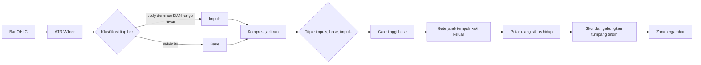

<h1 align="center">Zonelab</h1>
<p align="center">Mesin gambar teknikal otomatis untuk analisis chart. Zona Supply dan Demand digambar sendiri, lengkap dengan alasannya.</p>

<p align="center">
  
  
  
</p>

> [!NOTE]
> Tahap pertama sengaja dibatasi pada satu hal saja: menggambar Supply dan Demand
> secara akurat. Detektor ICT lain (FVG, Order Block, IFVG, liquidity sweep)
> menyusul lewat titik ekstensi yang sudah disiapkan, bukan lewat penulisan ulang.

## Daftar Isi

- [Apa ini](#apa-ini)
- [Menjalankan](#menjalankan)
- [Sumber data](#sumber-data)
- [Cara zona ditentukan](#cara-zona-ditentukan)
- [Yang membuatnya dapat diaudit](#yang-membuatnya-dapat-diaudit)
- [Arsitektur](#arsitektur)
- [Pengujian](#pengujian)
- [Batasan yang diketahui](#batasan-yang-diketahui)
- [Langkah berikutnya](#langkah-berikutnya)

## Apa ini

Platform web yang berjalan di mesin lokal. Chart candlestick memuat data pasar
langsung, lalu backend memindai bar-nya dan mengembalikan bentuk yang harus
digambar. Setiap bentuk membawa bukti pembentuknya: indeks bar, ukuran dalam ATR,
dan rincian skornya.

Prinsipnya satu: **gambar yang tidak bisa dijelaskan tidak layak digambar.** Karena
itu setiap zona menyimpan asal-usulnya, dan setiap penyaringan dilaporkan. Chart
yang kosong karena memang tidak ada pola berbeda dari chart yang kosong karena
filternya terlalu ketat, dan panel kiri membedakan keduanya.

## Menjalankan

```powershell
pwsh -File start.ps1
```

Skrip itu membuat virtualenv, memasang dependensi, menyalakan API dan web app,
lalu membuka browser. Jalan pertama memakan beberapa menit; setelah itu beberapa
detik.

Manual, bila lebih suka dua terminal:

```powershell
# Terminal 1, API
cd backend
python -m venv .venv
.\.venv\Scripts\python.exe -m pip install -r requirements.txt
.\.venv\Scripts\python.exe -m uvicorn app.main:app --port 8100

# Terminal 2, web
cd frontend
npm install
npm run dev -- --port 3100
```

Buka `http://localhost:3100`.

> [!IMPORTANT]
> Tanpa API key sekalipun aplikasi ini langsung menampilkan data pasar asli,
> karena provider bawaannya tidak memerlukan kunci. Salin `backend/.env.example`
> menjadi `backend/.env` hanya bila ingin memakai sumber lain.

## Sumber data

Semua string simbol di bawah sudah diverifikasi langsung ke vendornya pada
2026-08-13. Bagian inilah yang paling sering salah.

| Provider | Simbol | API key | Interval | Catatan |
|---|---|---|---|---|
| `binance` (bawaan) | `PAXGUSDT` | tidak perlu | 1m sampai 1w, termasuk 4h | Emas tersekuritisasi, bukan spot murni |
| `twelvedata` | `XAU/USD` | perlu, gratis | 1m sampai 1w, termasuk 4h | Spot XAU/USD asli, 800 request per hari |
| `polygon` | `C:XAUUSD` | perlu, gratis | 1m sampai 1w | Spot asli, 5 request per menit, riwayat 2 tahun |
| `yahoo` | `GC=F` | tidak perlu | tanpa 4h | Futures COMEX, bukan spot |
| `aurix` | `GOLD` | tidak perlu | 1m sampai 1w | Lewat instans Aurix lokal, harga broker sendiri |
| `synthetic` | apa saja | tidak perlu | semua | Deterministik, untuk kerja luring |

> [!WARNING]
> Simbol spot Yahoo sudah mati. `XAUUSD=X`, `XAU=X`, dan `GCUSD=X` semuanya
> membalas 404 per 2026-08-13; hanya `GC=F` yang masih hidup. Provider Yahoo di
> sini memang menunjuk ke futures, dan itu disengaja.
>
> Binance menyajikan PAXG, yaitu emas tersekuritisasi berdenominasi USDT. Strukturnya
> setia sehingga detektor bekerja normal, tetapi harganya membawa premi sendiri dan
> tetap berdagang pada akhir pekan. Untuk spot XAU/USD sesungguhnya, pakai Twelve Data.

## Cara zona ditentukan

Formasinya selalu tiga babak: kaki masuk, base tempat gerakan berhenti, lalu kaki
keluar. Pasangan arah kedua kaki itulah yang menentukan namanya.

| Kaki masuk | Base | Kaki keluar | Nama | Sisi |
|---|---|---|---|---|
| Turun | ..... | Naik | DBR | Demand, pembalikan |
| Naik | ..... | Naik | RBR | Demand, penerusan |
| Naik | ..... | Turun | RBD | Supply, pembalikan |
| Turun | ..... | Turun | DBD | Supply, penerusan |



Pemindaiannya satu lintasan. Bar dipartisi menjadi impuls atau base, dipadatkan
menjadi run, lalu setiap triple `impuls -> base -> impuls` menjadi kandidat.
Selebihnya adalah pengukuran, bukan pencarian.

Dua keputusan yang menentukan apakah keluarannya layak dipercaya:

1. **Semua ambang relatif terhadap ATR, tidak pernah absolut.** Candle 5 dolar
   adalah impuls pada sesi XAU yang sepi dan sekadar derau pada sesi yang liar.
2. **ATR pembanding dibaca dari bar sebelum objek yang diukur.** ATR Wilder pada
   bar ke-i sudah memuat true range bar ke-i sendiri, sehingga membandingkan bar
   itu dengan ATR-nya sendiri membuat candle terbesar justru lebih sulit lolos
   sebagai impuls. Hal yang sama berlaku pada tinggi base: base yang tinggi ikut
   menaikkan ATR, jadi mengukurnya terhadap ATR di dalam base membuat gerbang
   tinggi menelan sinyalnya sendiri.

### Siklus hidup zona

| Status | Arti |
|---|---|
| `fresh` | Harga belum pernah kembali sejak kaki keluar |
| `tested` | Harga masuk ke zona tetapi belum memakannya |
| `mitigated` | Penetrasi melampaui ambang mitigasi, bawaannya separuh tinggi zona |
| `broken` | Ada bar yang menutup melewati garis distal, zona mati |

Bar berurutan yang berdiam di dalam zona dihitung sebagai satu kunjungan, bukan
lima. Menghitung tiap bar akan membuat skor kesegaran kehilangan makna.

## Yang membuatnya dapat diaudit

- **Setiap zona menyimpan anatominya.** Indeks bar kaki masuk, base, dan kaki
  keluar ada di dalam respons, sehingga keputusannya bisa diputar ulang manual.
- **Setiap zona menyimpan rincian skornya.** Lima faktor yang jumlahnya persis
  sama dengan `strength`, ditampilkan sebagai batang di panel inspektur.
- **Setiap penolakan dihitung.** Panel `Filter trace` melaporkan berapa formasi
  ditemukan dan gerbang mana yang membuang masing-masing.
- **Zona yang belum final ditandai.** Selama run kaki keluar masih run terbaru,
  bar berikutnya masih bisa memperpanjangnya dan menggeser zona. Zona seperti itu
  digambar putus-putus dan diberi label `forming`, tidak disajikan sebagai final.
- **Geometri tidak pernah repaint.** Dijamin oleh
  `test_confirmed_zone_geometry_never_changes_as_bars_arrive`, yang memutar ulang
  seri bar demi bar dan menuntut setiap zona terkonfirmasi tetap identik sampai
  akhir.

## Arsitektur

```
Zonelab/
+-- backend/                    FastAPI, Python 3.13
|   +-- app/
|   |   +-- main.py             4 endpoint
|   |   +-- models.py           Skema Pydantic, dipakai bersama API dan engine
|   |   +-- indicators.py       ATR Wilder, klasifikasi candle, kompresi run
|   |   +-- config.py           Setelan dari environment
|   |   +-- detect/
|   |   |   +-- __init__.py     Registry detektor, titik ekstensi
|   |   |   +-- supply_demand.py  Engine inti
|   |   +-- providers/
|   |       +-- base.py         Protocol, kosakata interval, normalisasi
|   |       +-- sources.py      Binance, Yahoo, Twelve Data, Polygon, Aurix
|   |       +-- synthetic.py    Data deterministik luring
|   +-- tests/                  22 pengujian fixture emas
|
+-- frontend/                   Next.js 16, React 19, Tailwind v4
    +-- src/
        +-- app/page.tsx        Shell tiga panel
        +-- components/
        |   +-- chart.tsx       Pembungkus lightweight-charts v5
        |   +-- zone-primitive.ts  ISeriesPrimitive kustom, penggambar kotak
        |   +-- toolbox.tsx     Parameter langsung plus jejak filter
        |   +-- zone-panel.tsx  Daftar zona plus inspektur
        +-- lib/                Klien API dan tipe
```

### Endpoint

| Metode | Rute | Kegunaan |
|---|---|---|
| `GET` | `/api/health` | Cek hidup |
| `GET` | `/api/config` | Provider, simbol, interval, detektor yang tersedia |
| `GET` | `/api/candles` | Hanya bar OHLCV |
| `POST` | `/api/draw` | Bar plus bentuk yang digambar di atasnya |

`/api/draw` mengembalikan candle dan zona dalam satu respons. Ini disengaja: chart
tidak akan pernah bisa menggambar zona yang dihitung dari bar yang tidak sedang
ditampilkannya.

### Menambah detektor baru

Tulis satu modul di samping `supply_demand.py` dengan tanda tangan
`detect(candles, params) -> (shapes, stats)`, lalu tambahkan satu baris di
`DETECTORS`. API dan frontend memberangkatkan panggilan lewat dict itu dan tidak
perlu diubah.

## Pengujian

```powershell
cd backend
.\.venv\Scripts\python.exe -m pytest
```

22 pengujian, semuanya lulus. Setiap seri harga dibangun dengan tangan sehingga
jawaban benarnya diketahui secara konstruksi, bukan dari mengamati chart. Asersi
geometrinya eksak: bila satu batas bergeser satu tik, itu perubahan perilaku dan
pengujiannya harus mengatakan demikian.

<details>
<summary>Yang dijamin oleh pengujian</summary>

- Keempat formasi dikenali dengan batas atas, batas bawah, dan anatomi yang persis
- Garis proksimal dan distal berada pada sisi yang benar untuk demand maupun supply
- Kaki keluar yang lemah ditolak, dan penolakannya terhitung di `stats`
- Base yang terlalu tinggi ditolak
- Konsolidasi panjang dipotong ke bar tempat gerakan benar-benar berangkat
- Zona berubah `tested` lalu `broken`, dan tepi kanannya berhenti di bar patahan
- Bar berurutan di dalam zona terhitung satu kunjungan
- Zona tumpang tindih runtuh menjadi yang lebih kuat
- Base doji ditumbuhkan ke tinggi minimum, karena zona setinggi nol tidak akan
  pernah bisa tersentuh
- ATR tidak pernah NaN selama warmup
- Geometri zona terkonfirmasi tidak pernah berubah saat bar baru berdatangan
- Timestamp ganda dari provider diruntuhkan di batas provider

</details>

## Batasan yang diketahui

> [!CAUTION]
> Zonelab menggambar struktur, bukan sinyal dagang. Belum ada satu pun angka di
> sini yang diukur terhadap hasil perdagangan nyata. Skor `strength` adalah
> peringkat yang disusun dari lima faktor dengan bobot yang dipilih, bukan
> probabilitas terkalibrasi. Perlakukan sebagai alat bantu baca chart.

- Bobot skor belum dikalibrasi terhadap data apa pun. Kelima faktornya dipaparkan
  terpisah supaya bisa dinilai sendiri-sendiri.
- Volume dari sebagian provider adalah tick volume, bukan kontrak yang benar-benar
  diperdagangkan. Faktor volume di sini adalah proksi keaktifan, bukan volume
  institusional.
- Belum ada zona multi-timeframe. Zona timeframe tinggi yang diproyeksikan ke chart
  timeframe rendah membutuhkan stempel konfirmasi tersendiri agar tetap kausal.
- Pemutaran siklus hidup melihat bar setelah zona terbentuk. Itu benar untuk
  menggambar riwayat, tetapi bukan mesin backtest dan tidak boleh dipakai sebagai
  backtest.

## Langkah berikutnya

- [x] Zona Supply dan Demand dengan siklus hidup dan penilaian
- [x] Beberapa provider data, jalan tanpa API key
- [x] Panel parameter langsung plus jejak filter
- [x] Inspektur zona dengan rincian skor
- [ ] FVG dan IFVG
- [ ] Order Block dan Breaker Block
- [ ] Liquidity sweep, BOS, dan CHoCH
- [ ] Zona multi-timeframe dengan stempel konfirmasi
- [ ] Streaming langsung lewat WebSocket
- [ ] Agen LLM yang membaca zona beserta buktinya lalu memberi pembacaan tertulis

---

Hak cipta 2026 PT Surya Inovasi Prioritas (SURIOTA).
