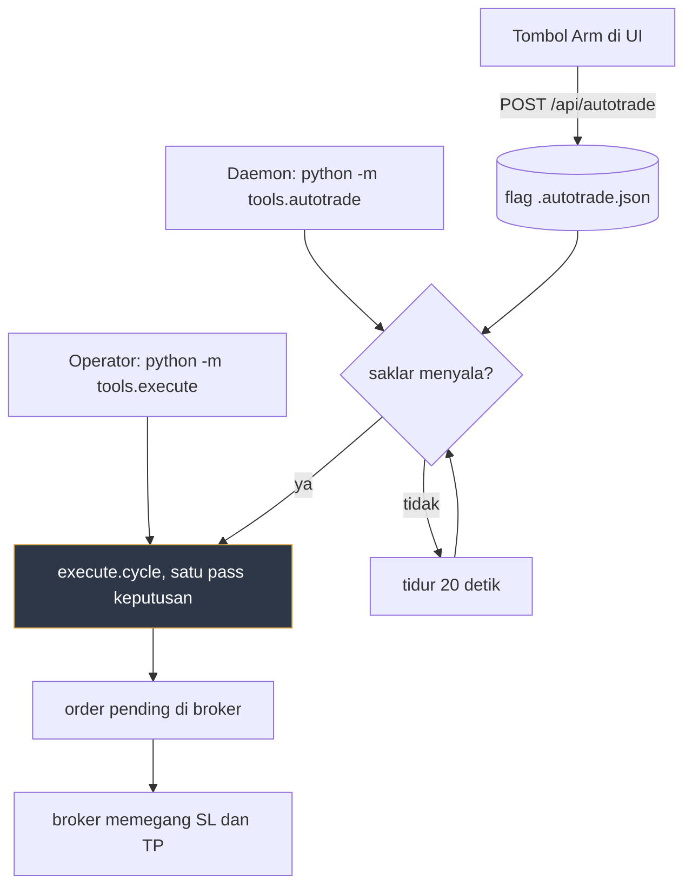
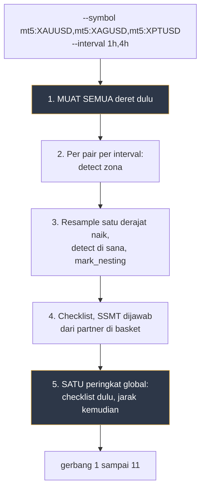
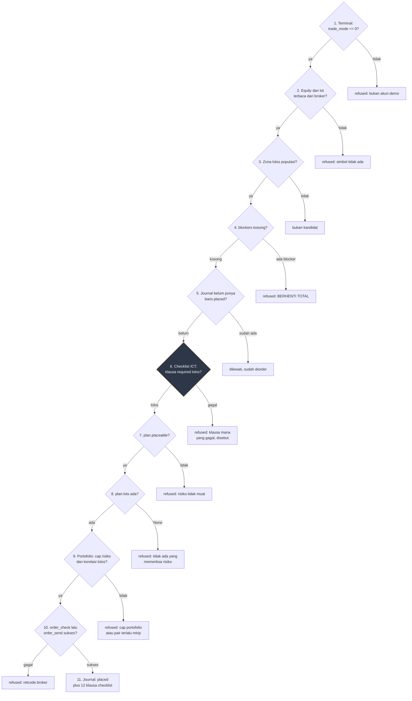
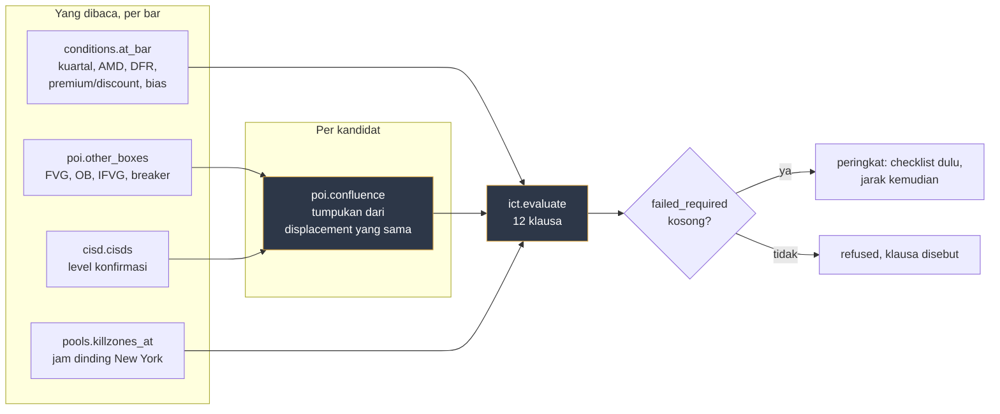
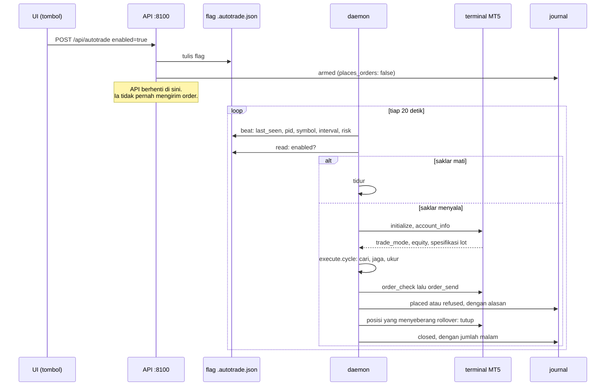
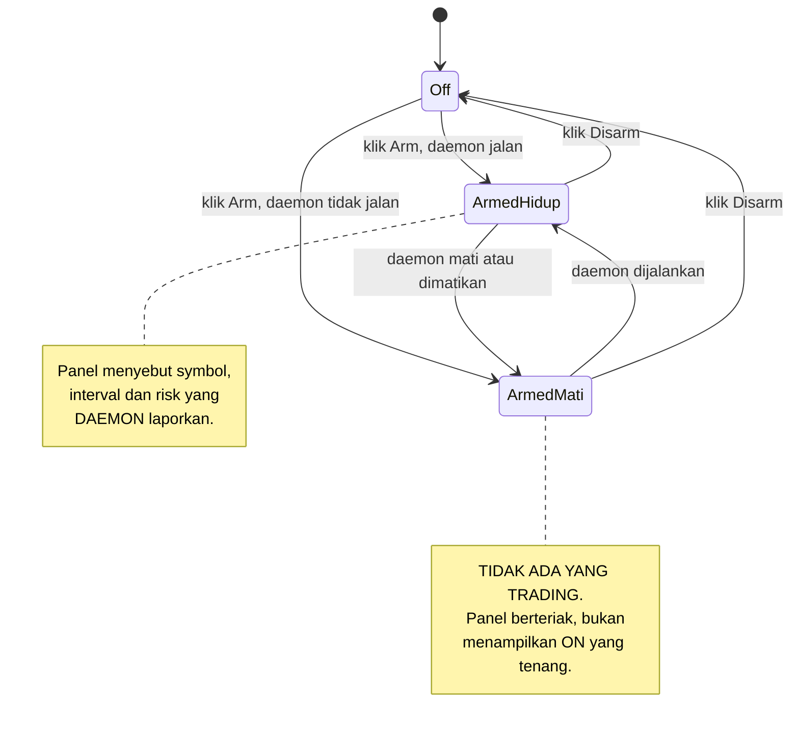
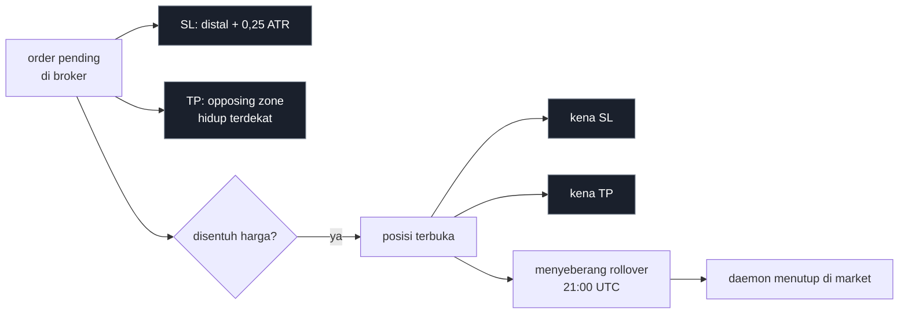

# Alur order Zonelab, dari gambar sampai ticket broker

Dokumen ini menjawab satu pertanyaan: **apa yang terjadi, urut, ketika Zonelab
memasang order.** Setiap gerbang di bawah bisa menghentikan yang berikutnya, dan
tiap penghentian meninggalkan baris di journal dengan alasannya.

> [!IMPORTANT]
> Server web **tidak bisa** mengirim order. Penempatan order hidup di `tools/`,
> di luar `app/`, dan `tests/test_autotrade.py` menegakkan itu di graf impor:
> tidak ada modul di `app/` yang boleh memuat `order_send` atau mengimpor
> eksekutor. Tombol di UI menulis flag; sebuah daemon yang dijalankan operator
> yang membaca flag itu.

## 1. Dua pintu masuk, satu jalur keputusan



Yang berbagi adalah `execute.cycle`. Daemon **tidak** punya salinan logikanya
sendiri, karena daemon dengan salinannya sendiri adalah dua mesin, dan yang
berbeda pendapat adalah yang sedang memegang akun.

### Yang dipindai: banyak pair, banyak timeframe, HTF ikut menilai

`--symbol` dan `--interval` keduanya menerima daftar. Satu pass memindai seluruh
basket, dan urutannya penting karena klausa SSMT membaca partner.



Tiga hal yang bukan detail implementasi:

1. **Semua deret dimuat sebelum kandidat pertama dinilai.** Satu pass yang memuat
   sambil menilai akan memberi pair pertama nol partner dan pair terakhir seluruh
   basket, jadi verdict klausa `ssmt` akan tergantung urutan `--symbol`. Itu bukan
   fakta pasar. `tests/test_gather.py` menegakkannya, dan pola lama itu memang
   membuat test gagal dengan `('XAUUSD',)` untuk pair pertama.
2. **Scan multi-pair dan SSMT itu mekanisme yang sama.** SSMT butuh instrumen
   pembanding, dan basket sudah memuatnya. Sebelum ini klausa `ssmt` membaca
   `unknown` pada setiap kandidat karena tidak ada partner yang dikirim, padahal
   deretnya sudah ada di memori. Sekarang, diukur pada basket XAU/XAG/XPT 4 jam:
   ketiganya menjawab, dan sisi divergensinya tidak sama untuk semuanya.
3. **Peringkat satu kali, global.** Memindai lima pair lalu mengambil dua terbaik
   dari masing-masing bukan memindai lima pair, itu lima scan yang kebetulan jalan
   bersamaan.

Feed yang tertinggal pada satu pair menghentikan **pair itu saja**. Diukur pada
Sabtu 22 Agustus 2026, basket enam deret: 3 diblokir karena feed weekend, 38
kandidat tetap keluar dari sisanya, dan EURUSD 4 jam yang menang peringkat.

## 2. Sebelas gerbang, urut



Rinciannya, dan apa yang membuat tiap gerbang ada:

| # | Gerbang | Kenapa ia ada |
|---|---|---|
| 1 | `trade_mode == 0` dan `trade_allowed` | Tidak ada flag untuk melewatinya. Hari seseorang menginginkannya, perubahan itu harus terlihat di diff, bukan tersedia dari riwayat shell |
| 2 | Equity dan `volume_min`, `volume_step`, `contract_size` dari terminal | Broker adalah pemilik angka itu. Nilai terbitan kalah dari jawaban broker pada hari ia berubah |
| 3 | Belum tersentuh, departure >= 2,0 ATR, ada opposing zone hidup | Populasi yang diukur adalah **first touch**. Zona yang sudah dikunjungi harga bukan anggotanya, jadi angkanya tidak berlaku |
| 4 | `actionable.blockers` | Riwayat terpotong, interval tak dikenal, atau feed tertinggal lebih dari satu bar. Zona yang hilang karena barnya hilang tidak bisa dibedakan dari zona yang tidak pernah terbentuk |
| 5 | `journal.for_zone` | Idempotensi. Kuncinya `zone.id`, dan sejak 21 Agustus 2026 id itu tidak lagi memuat harga, jadi repaint tidak mengubah identitas |
| 6 | `ict.Setup.failed_required` | **Checklist metode.** Dua belas klausa, semuanya dievaluasi, dan hanya yang disebut `--require` yang boleh memblokir. Duduk sebelum gerbang risiko karena setup yang ditolak metode tidak boleh memakan slot |
| 7 | `plan.placeable` | Anggaran risiko. Lot minimum yang melebihi anggaran adalah penolakan, bukan pembulatan ke atas |
| 8 | `plan.lots is None` | `placeable` default **True** pada plan yang tidak pernah diberi equity. `lots is None` yang berkata "tidak ada yang memeriksa" |
| 9 | `portfolio.admits` | **Dua penjaga dalam satu penolakan.** `--risk-pct` itu per trade, jadi lima pair sekaligus adalah lima kali angka itu tanpa ada yang memilihnya. Dan pair yang berkorelasi bukan dua bet: XAU lawan XAG terbaca +0,794 pada 1.999 return berpasangan 4 jam, jadi dua short di sana lebih dekat ke satu short dobel |
| 10 | `order_check` sebelum `order_send` | Check yang tidak menghentikan send adalah hiasan |
| 11 | Journal `placed` | Order tanpa alasan bernomor ditolak di level API journal-nya. Sejak checklist ada, kedua belas klausa ikut tercatat |

### Gerbang 8 pernah bocor, dan ini catatannya

Versi pertama eksekutor membaca `placeable == True` sebagai izin lalu mengirim
0.01 lot yang di-hardcode. `plan.build` memang mengembalikan `True` ketika ia
tidak pernah diberi equity, karena plan yang tidak diminta menghitung ukuran
tidak bisa menolak berdasarkan ukuran. Jadi gerbang risiko yang dijanjikan
docstring-nya sendiri **kosong**. Ditemukan 21 Agustus 2026 saat menuliskan alur
ini, dan sekarang `lots is None` adalah penolakan tersendiri.

## 3. Checklist ICT: apa yang dibaca gerbang 6

Ditambahkan 21 Agustus 2026, karena sampai hari itu jalur order membaca **satu**
detektor dan nol overlay. Bukti waktu itu satu baris: `tools/execute.py` memanggil
`DETECTORS["supply_demand"]` dan tidak ada yang lain.



Kedua belas klausa, dan **label sumbernya yang paling penting**:

| Klausa | Sumber | Isinya |
|---|---|---|
| `killzone` | doctrine | Bar ada di kill zone yang diaktifkan |
| `discount_or_premium` | doctrine | Supply di premium, demand di discount |
| `manipulation_quarter` | doctrine | Bar ada di kuartal manipulasi profile-nya, Q2 di AMDX atau Q3 di XAMD |
| `manipulation_seen` | doctrine | Sweep sudah mengambil ekstrem kuartal sebelumnya di dalam kuartal itu |
| `poi_families` | doctrine | Jumlah keluarga PD array yang menumpuk >= `--min-families` |
| `poi_clean` | doctrine | Box sisi berlawanan di band <= `--max-conflicts` |
| `cisd_in_band` | doctrine | Ada level CISD di dalam box |
| `dfr_side` | doctrine | Supply di atas ekuilibrium defining range, demand di bawah |
| `htf_nested` | **measured** | Zona ini ada di dalam zona sisi sama satu derajat naik, yang lahir lebih dulu dan masih hidup. Diukur, dan **tidak memisahkan**: 497 lawan 456, delta +0,031 R, t=+0,47, tanda berbalik antar paruh |
| `bias_agrees` | **measured** | Bias HTF searah sisi zona. H7 mengukur kontribusi zona di atas bias ini **nol** |
| `ssmt` | **measured** | Divergensi terbaru di sisi yang benar, dijawab dari partner di basket. Tidak ada yang menghubungkan divergensi ke outcome |
| `draw_agrees` | **nominated** | Draw yang **dinominasikan pemanggil**. Zonelab tidak menyimpulkannya |

> [!IMPORTANT]
> `doctrine` berarti sumbernya menyatakan begitu dan **belum ada yang mengukurnya
> di sini**. Itu alasan sah untuk menerapkan sebuah aturan, dan bukan alasan sah
> untuk menyebutnya bukti. Checklist yang mencampur ketiga label tanpa
> mengatakannya terbaca sebagai dua belas pengukuran padahal isinya tiga
> pengukuran dan delapan kutipan, plus satu yang dinominasikan.

Klausa yang **required tapi tidak diketahui** dihitung **gagal**. Diam tidak boleh
lewat sebagai setuju, aturan yang sama dipakai `bias.alignment` untuk Daily tanpa
bias terbaca.

### Angka tiap klausa di populasi 953 trade

Diukur 21 Agustus 2026 pada `mt5:XAUUSD` 1 jam, 50.000 bar, exit flat di rollover,
dan diukur ulang 22 Agustus 2026 setelah `htf_nested` masuk kolom. Ekspektasi
populasi +0,221 R. Delapan puluh tiga grup dinilai, jadi `|t|` kritis setelah
koreksi Bonferroni adalah **3,43**. Delapan klausa lain tidak bergerak sedikit pun
di antara dua run itu, karena definisinya tidak berubah dan populasinya sama.

| Klausa terpenuhi | n | exp R | delta lawan sisanya | t | delta per paruh |
|---|---|---|---|---|---|
| `poi_clean` | 373 | +0,328 | **+0,176** | +2,46 | +0,181 / +0,168 |
| `manipulation_quarter` | 356 | +0,327 | **+0,169** | +2,44 | +0,227 / +0,111 |
| `killzone` | 701 | +0,262 | **+0,154** | +2,28 | +0,120 / +0,193 |
| `bias_agrees` | 489 | +0,266 | +0,092 | +1,40 | +0,047 / +0,136 |
| `manipulation_seen` | 185 | +0,277 | +0,069 | +0,75 | +0,097 / +0,041 |
| `dfr_side` | 546 | +0,197 | -0,057 | -0,87 | -0,095 / -0,020 |
| `discount_or_premium` | 312 | +0,182 | **-0,059** | -0,83 | -0,086 / -0,033 |
| `poi_families` | 808 | +0,215 | -0,042 | -0,42 | -0,063 / -0,022 |
| `htf_nested` | 497 | +0,236 | +0,031 | +0,47 | +0,160 / **-0,096** |
| `cisd_in_band` | 893 | +0,221 | -0,006 | -0,04 | +0,503 / -0,161 |

**Nol dari sepuluh melewati 3,43.** Tiga teratas adalah sinyal terkuat yang
pernah diukur di project ini untuk pengkondisian, dan ketiganya bertanda sama di
kedua paruh: `poi_clean` bahkan +0,181 lawan +0,168, hampir identik.

Empat bacaan yang langsung berguna untuk menyetel `--require`:

1. **`poi_clean` mengalahkan `poi_families`.** Yang berbayar bukan berapa banyak
   alat menumpuk, tapi tidak adanya box sisi berlawanan. Lebih banyak keluarga
   justru sedikit lebih buruk. Jadi `--max-conflicts 0` lebih layak dipakai
   daripada `--min-families 3`.
2. **`discount_or_premium` mengukur negatif**, dan negatif di kedua paruh. Aturan
   inti doktrin tidak memisahkan di populasi ini.
3. **`cisd_in_band` terpenuhi 893 dari 953.** Level CISD terlalu rapat untuk
   memfilter apa pun.
4. **Hitungan checklist mengurut ke arah yang benar, dan ujung lemahnya yang
   paling tajam.** Setelah `htf_nested` ikut dihitung: pita 2-3 memberi +0,059
   (delta **-0,190**, t=-2,15, n=136, negatif di kedua paruh), pita 4-5 +0,205,
   pita 6-7 +0,277 (delta +0,078, t=+1,08, n=279). Jadi yang terukur bukan
   "checklist tinggi bagus", tapi **checklist rendah buruk**. Angka pita ini
   berubah dari run 21 Agustus karena menambah satu klausa menggeser sebarannya,
   bukan karena pasarnya berubah.
5. **`htf_nested` tidak memisahkan.** 497 lawan 456, delta +0,031 R, t=+0,47, dan
   tandanya berbalik antar paruh. Konsisten dengan H2 di `CALIBRATION.md` yang
   mengukur nesting p=0,33. Klausanya tetap dilaporkan dan tetap tidak diwajibkan.

> [!CAUTION]
> Run pertama studi ini melaporkan `cisd_in_band` **False untuk semua 953 trade**.
> Itu bukan fakta pasar: harness tidak pernah mengirim level CISD ke
> `poi.confluence`, jadi ia menghitung nol karena diberi nol. Setelah
> disambungkan angkanya 893 True. Tanpa pemeriksaan itu, ia akan terbit sebagai
> temuan "CISD tidak pernah kena zona".
>
> **Kelas yang sama terulang sehari kemudian.** Run pertama dengan `htf_nested`
> melaporkan False untuk **semua 953 trade**, yang terbaca sebagai "emas tidak
> pernah nesting". Harness-nya yang melewatkan langkahnya: `candidates()`
> me-resample satu derajat naik, mendeteksi di sana, lalu memanggil `mark_nesting`,
> dan `tools/conditioned.py` tidak melakukan satu pun dari itu. Setelah
> disambungkan: 497 True. Dua kali dalam dua hari, satu kolom False yang berbunyi
> seperti fakta pasar.

### Replikasi 15 menit, dan hanya satu klausa yang bertahan

`--interval 15m --bars 50000`, 22 Agustus 2026. Populasi n=1447, ekspektasi
+0,202 R, 89 grup layak dinilai, `|t|` kritis **3,45**, dan `|t|` terbesar di
seluruh run **2,39**. Nol yang memisahkan, lagi.

| Klausa | 1 jam: delta / t | 15 menit: delta / t | 15 menit: paruh |
|---|---|---|---|
| `poi_clean` | +0,176 / +2,46 | **+0,142 / +2,27** | +0,088 / +0,197 |
| `killzone` | +0,154 / +2,28 | +0,020 / +0,33 | +0,097 / **-0,067** |
| `manipulation_quarter` | +0,169 / +2,44 | +0,019 / +0,32 | +0,063 / **-0,024** |
| `htf_nested` | +0,031 / +0,47 | +0,018 / +0,31 | +0,014 / +0,016 |
| `discount_or_premium` | -0,059 / -0,83 | -0,014 / -0,22 | -0,035 / +0,007 |
| `cisd_in_band` | -0,006 / -0,04 | +0,095 / +0,71 | -0,020 / +0,210 |

**`poi_clean` satu-satunya yang bertahan.** Tanda sama, besaran sama urutannya,
dan kedua paruh positif di kedua timeframe. Itu perilaku yang diharapkan dari
efek, bukan dari kebetulan, dan ia masih di bawah 3,45 jadi ia masih tidak
diwajibkan.

`killzone` dan `manipulation_quarter` adalah dua dari tiga terkuat di 1 jam, dan
keduanya runtuh ke nol di 15 menit dengan tanda berbalik antar paruh. Itu tanda
tangan kebetulan yang sama seperti yang dicatat `PRAREGISTRASI-KONDISI.md` untuk
`quarter_day` Q3.

`ict_met` pita 6-7 tetap yang terbaik di kedua timeframe (+0,078 di 1 jam, +0,098
di 15 menit, kedua paruh positif), tapi pita 8-9 di 15 menit **negatif** (-0,043,
n=112). Jadi hubungannya bukan monoton, dan "checklist makin tinggi makin baik"
bukan pernyataan yang boleh dibuat dari data ini.

### Definisi POI yang pertama salah, dan ukurannya yang memberi tahu

Versi pertama `poi.confluence` menghitung setiap box sisi sama yang tumpang tindih
harga zona, kapan pun ia terbentuk. Diukur pada 3000 bar emas broker: **14 dari 14
kandidat hidup** dapat keempat keluarga, dukungan sampai 75 dan konflik sampai 68.
Kondisi yang dipenuhi setiap kasus tidak membedakan apa pun, jebakan yang sama
sudah tercatat di `confluence.py` untuk nesting any-overlap.

Setelah dibatasi ke box yang lahir di dalam bracket pembentukan zona itu sendiri,
sebarannya jadi 1/2/3/4 keluarga di 22 zona. Itu juga klaim doktrinnya yang
sebenarnya: satu displacement meninggalkan satu gap, satu block, dan satu level
retracement di harga yang sama.

## 3b. Gerbang kedua belas, `--htf-gate`, dan kenapa ia dicabut

Ditambahkan 5 September 2026 di commit `068d657` dan DIARMED di `AT_FLAGS`
pada hari yang sama, sebelum ada satu angka pun. Dicabut hari itu juga, setelah
diukur.

Apa yang ia lakukan: `tools/execute.py:daily_fvg_bias` mencari FVG harian
terbaru yang belum terisi dan yang memuat harga saat ini. Zona yang sisinya
berlawanan dengan bias FVG itu ditolak, dicatat di journal, dan tidak pernah
diorder. Kalau harga tidak berada di dalam FVG harian mana pun, gerbangnya
diam dan trade lewat.

Diukur di `tools/htf_gate_outcomes.py`, praregistrasi ditulis sebelum satu
angka dihitung, populasi diimpor dari `tools/checklist_outcomes.py:rows_for`
tanpa diubah. Delapan instrumen, 1 jam, resolusi intrabar 5 menit, biaya
`exness_raw`, n=1828. Ambang Bonferroni `critical_t` 2,638.

| Kohort | Nasib di gerbang | n | exp R |
|---|---|---|---|
| di dalam FVG yang setuju | diambil | 425 | - |
| **di dalam FVG yang tidak setuju** | **DIBLOKIR** | **176** | **+0,1265** |
| tidak di dalam FVG apa pun | diambil | 1227 | - |
| gabungan yang diambil | - | 1652 | +0,0129 |

**Kohort yang gerbang ini buang punya ekspektansi LEBIH TINGGI daripada yang
ia simpan.** Selisihnya +0,1137 R dengan tanda TERBALIK dari klaimnya, t=+1,54
mentah dan +1,77 di-demean per instrumen, keduanya di bawah 2,638, dan tandanya
berbalik antar paruh (+0,282 lalu -0,020). Jadi ia tidak memisahkan; yang bisa
dikatakan adalah tidak ada satu angka pun yang mendukungnya dan titik
estimasinya menunjuk ke arah yang berlawanan.

Efek di akun kalau ia dibiarkan menyala: ekspektansi turun dari +0,0238 ke
+0,0129, yaitu -0,0109 R per trade, sambil membuang 176 dari 1828 trade.

Kontrol arah ikut dijalankan dan ikut null: sekadar BERADA di dalam FVG harian,
terlepas dari arahnya, memberi -0,0000 lawan +0,0355 di luar, t=-0,74. Jadi
efeknya juga bukan efek keberadaan di dalam gap.

> [!NOTE]
> Pada dua instrumen yang daemon-nya benar-benar jalankan, XAUUSD dan BTCUSD
> sendirian, gerbang ini cuma menyala 21 kali dari 442 trade, yaitu 4,8 persen,
> DI BAWAH `MIN_GROUP` 30. Di sana ia tidak bisa dinilai sama sekali. Angka di
> atas datang dari delapan instrumen justru supaya ada n yang cukup untuk
> menguji ATURANNYA. Untuk mendapat 30 kohort terblokir di XAU dan BTC saja
> butuh sekitar 631 trade, dan untuk 100 butuh 2104.

Dua batas metode, dinyatakan: rig menilai gerbang ini di bar SENTUHAN sementara
produksi menilainya di bar keputusan, dan bar sentuhan adalah bacaan yang lebih
MENGUNTUNGKAN gerbang karena di sana harga ada di zona. Dan bar harian yang
sedang berjalan dibuang, karena di riwayat ia lengkap sementara live ia separuh
jadi.

Artifact: `docs/htf_gate_outcomes.json`.

## 4. Satu siklus daemon



Heartbeat ditulis **sebelum** saklar dibaca. Siklus yang mati di dalam pass
keputusan tetap sudah berkata "saya di sini", jadi UI bisa membedakan daemon
yang crash dari daemon yang tidak menemukan apa pun.

## 5. Tiga keadaan saklar, dan yang ketiga yang berbahaya



| Keadaan | `enabled` | `daemon_alive` | Artinya |
|---|---|---|---|
| Off | false | apa saja | Tidak ada order baru. Pending yang sudah di broker tetap hidup dengan SL dan TP |
| Armed, daemon hidup | true | true | Trading. Parameter yang ditampilkan berasal dari daemon, bukan dari panel |
| Armed, daemon mati | true | false | **Tidak ada yang trading.** Peringatan paling keras dari ketiganya |

> [!WARNING]
> Keadaan ketiga adalah alasan `enabled` dan `daemon_alive` tidak pernah
> digabung jadi satu field. Saklar yang menyala di atas daemon mati adalah kelas
> cacat yang sama dengan suite test melapor hijau setelah crash sebelum
> memeriksa satu file, dan proyek ini sudah tiga kali kena.

## 6. Setelah order terpasang



Yang dipegang **broker**: SL dan TP. Mematikan daemon atau menekan Disarm tidak
menyentuh keduanya.

Yang butuh **daemon**: exit rollover saja. Itu satu-satunya aturan yang tidak
bisa dititipkan ke broker.

## 7. Kenapa exit-nya rollover, dan bukan horizon

Terukur pada `mt5:XAUUSD` 1 jam, 50.000 bar, biaya Exness Zero, populasi yang
lolos gerbang:

| Aturan exit | n | menang | exp R | t | fold |
|---|---|---|---|---|---|
| Tahan sampai 80 bar | 953 | 63,1% | +0,198 | 5,10 | 8/8 |
| **Flat di rollover** | 953 | 64,5% | **+0,221** | 6,74 | 8/8 |

Seluruh selisihnya berasal dari satu kohort. Dipisah per hari fill:

| Hari fill | n | Tahan 80 bar | Flat di rollover |
|---|---|---|---|
| Senin | 140 | +0,276 | +0,203 |
| Selasa | 207 | +0,236 | +0,269 |
| Rabu | 201 | +0,191 | +0,272 |
| Kamis | 193 | +0,179 | +0,147 |
| **Jumat** | 195 | **+0,128** (t=1,55) | **+0,218** (t=3,12) |

Jumat adalah hari terlemah kalau ditahan, dan aturan flat yang mengangkatnya.
Rata-rata malam ditahan pada fill Jumat turun dari 0,98 ke 0,58, dan maksimumnya
dari 34 ke 3. Biayanya nyata: Exness menagih 200 USD per lot per malam untuk
XAUUSD yang ditahan lewat 21:00 UTC, yaitu 4,545 bp, lebih dari tiga belas kali
komisi round turn per rollover.

## 8. Anggaran risiko menentukan apakah ada order sama sekali

Diukur pada akun demo ini, equity sekitar 1004:

| `--risk-pct` | Anggaran | Hasil |
|---|---|---|
| 0,01 | 10,04 | **Nol order.** Lot minimum 0.01 mempertaruhkan 23 sampai 39, semuanya ditolak gerbang 6 |
| 0,03 | 30,12 | Dua order. Yang stop-nya 39,28 tetap ditolak |

Angka itu dinyatakan di command line dan masuk ke journal sebagai bagian dari
`rule`, karena anggaran yang tersembunyi di default adalah anggaran yang tidak
dipilih siapa pun.

## 9. Apa yang tercatat

Satu baris per peristiwa di `backend/.journal/YYYY-MM-DD.jsonl`, append-only,
tidak pernah di-commit.

<details><summary>Bentuk satu baris placed</summary>

```json
{
 "at": 1787304694,
 "event": "placed",
 "zone_id": "DBD-1778810400",
 "ticket": 4573230378,
 "plan": {"entry": 4604.221, "stop": 4628.043, "tp": 4489.567},
 "why": [
  "departure 6.273 ATR clears the 2.0 gate",
  "cohort above the gate held 85.8% against 64.4% below it, 8/8 walk-forward",
  "target is the nearest live opposing zone, 4.81R from the entry"
 ],
 "blockers": [],
 "rule": {
  "gate": "departure_atr >= 2.0",
  "exit_rule": "flat at the 21:00 UTC rollover",
  "risk_pct": 0.03,
  "horizon_bars": 80
 },
 "extra": {"volume": 0.01, "equity_at_decision": 1006.34}
}
```
</details>

| Event | Kapan |
|---|---|
| `placed` | order terkirim. Wajib punya `why` tidak kosong, ditegakkan di API journal |
| `filled` | baris **kedua** dengan ticket yang sama, bukan suntingan yang pertama |
| `closed` | ditutup, dengan jumlah malam, profit, dan swap |
| `refused` | gerbang mana pun menolak, dengan blocker-nya apa adanya |
| `armed` / `disarmed` | saklar dibalik, plus apakah ada daemon saat itu |

Keputusan dan fill adalah dua momen dengan harga berbeda, jadi fill tidak boleh
menyunting baris keputusan. Log yang bisa disunting di tempat tidak bisa jadi
bukti tentang momen yang ia jelaskan.

## 10. Yang belum ada, dinyatakan

- [ ] **Penjadwal untuk jalur sekali-jalan.** `tools.execute` harus dipanggil
      sesuatu. Task Scheduler sekali per bar tutup cukup, karena order-nya
      pending jadi tidak perlu ketat.
- [ ] **Idempotensi melepas zona.** Kunci `placed` mengunci zona selamanya, jadi
      order pending yang dibatalkan atau kedaluwarsa membuat zona itu tidak akan
      diorder lagi. Sisi aman yang benar untuk sekarang; memperbaikinya berarti
      membaca status order dari broker, bukan cuma dari journal.
- [ ] **Arah.** Kedua sisi diorder kalau dua-duanya lolos, karena itu populasi
      yang angkanya diukur. Tiga belas percobaan mengeluarkan arah atau
      pengkondisian dari gambar ini, tiga belas nol. Lihat
      [PRAREGISTRASI-KONDISI.md](PRAREGISTRASI-KONDISI.md).

## 11. Perintahnya

```bash
cd backend

# lihat levelnya tanpa mengirim, tanpa memeriksa ukuran
.venv/Scripts/python.exe -m tools.execute

# lihat levelnya DAN periksa apakah risikonya muat
.venv/Scripts/python.exe -m tools.execute --equity 1000 --risk-pct 0.03

# sekali jalan, benar-benar mengirim
.venv/Scripts/python.exe -m tools.execute --risk-pct 0.03 --send

# daemon: hitung tiap 20 detik, jangan kirim apa pun
.venv/Scripts/python.exe -m tools.autotrade --risk-pct 0.03

# daemon: benar-benar kirim, dikendalikan tombol Arm di UI
.venv/Scripts/python.exe -m tools.autotrade --risk-pct 0.03 --send

# tutup manual apa yang sudah menyeberang rollover
.venv/Scripts/python.exe -m tools.flatten --send

# stress test jalur keputusan, tidak mengirim apa pun
.venv/Scripts/python.exe -m tools.stress_decision
```

Uji tombolnya di browser sungguhan, dengan API dan web menyala:

```bash
cd frontend && node e2e/autotrade.mjs
```

---

Copyright 2026 PT Surya Inovasi Prioritas (SURIOTA).
