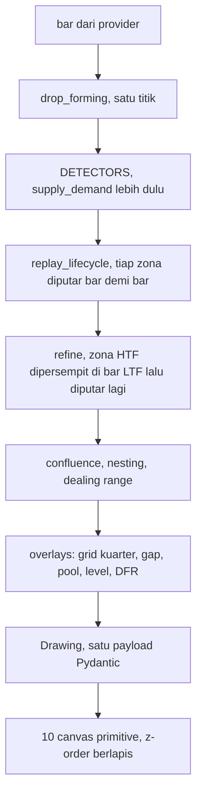
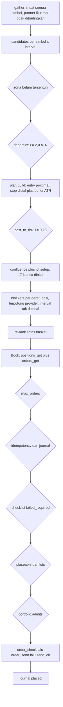

# Audit menyeluruh Zonelab, 29 Agustus 2026

Dokumen ini menjawab satu pertanyaan: apa Zonelab sebenarnya, apa yang benar
benar dibangun, apa yang benar benar terukur, dan di mana jarak antara
keduanya. Ditulis dari pembacaan langsung atas repo pada commit `eb74b5e`,
ditambah transkrip brainstorming sepanjang 483 KB yang dirender lewat
`frontend/e2e/_scrape-share.mjs`.

Setiap angka di sini berasal dari perintah yang benar benar dijalankan atau
dari file yang benar benar dibaca. Klaim tanpa angka ditulis sebagai belum
terukur.

> [!NOTE]
> Daemon autotrade tidak dijalankan selama audit ini, saklar tidak disentuh,
> dan tidak ada order yang ditempatkan atau dibatalkan.

## Daftar Isi

| | Bagian | Isinya sebaris |
|---|---|---|
| 1 | [Jawaban satu paragraf](#1-jawaban-satu-paragraf) | apa Zonelab menurut repo-nya sendiri |
| 2 | [Dua Zonelab](#2-dua-zonelab) | blueprint yang beredar lawan kode yang ada |
| 3 | [Arsitektur](#3-arsitektur) | jalur gambar dan jalur order, ujung ke ujung |
| 4 | [Fitur dan function](#4-fitur-dan-function) | 17 layer, 17 endpoint, 10 primitive, 18 harness |
| 5 | [Metode yang dianut](#5-metode-yang-dianut) | model siklus, AMDX, dan provenance tiap aturan |
| 6 | [Modul yang tidak terwire](#6-modul-yang-tidak-terwire) | yang terkompilasi tapi tidak menyentuh keputusan |
| 7 | [Yang benar benar terukur](#7-yang-benar-benar-terukur) | ledger hipotesis, dan satu yang bertahan |
| 8 | [Korelasi](#8-korelasi) | triad, SSMT, dan gap yang tersisa |
| 9 | [Gap dan blindspot](#9-gap-dan-blindspot) | diurutkan menurut apa yang bisa merugikan |
| 10 | [Sisi frontend](#10-sisi-frontend) | termasuk cacat yang dibuat saat audit ini berlangsung |
| 11 | [Yang mungkin belum diketahui](#11-yang-mungkin-belum-diketahui) | delapan fakta yang tidak muncul di ringkasan mana pun |
| 12 | [Urutan kerja](#12-urutan-kerja) | sepuluh langkah, diurutkan menurut risiko |

---

## 1. Jawaban satu paragraf

Zonelab adalah **mesin gambar teknikal** yang menggambar zona Supply dan Demand
beserta alasannya, dengan lapisan ICT/SMC opsional di atasnya, sebuah jalur
order ke MetaTrader 5, dan yang paling tidak biasa: sebuah arsip pengukuran
yang mendokumentasikan kegagalannya sendiri secara obsesif.

Deskripsi itu bukan karangan auditor. Itu deskripsi yang dipakai repo ini
sendiri di `README.md`:

> [!CAUTION]
> Zonelab menggambar struktur, bukan sinyal dagang. Kalibrasi inti mengukur
> apakah zona bertahan saat harga kembali, tanpa spread, tanpa slippage, tanpa
> biaya. Hanya lengan biaya dan rencana di layar yang membebankan ongkos; sisa
> angka di halaman ini tetap angka tanpa gesekan, dan tidak satu pun dari
> keduanya adalah hasil perdagangan.

Badge statusnya `tahap awal`. Setelah resolusi intrabar yang jujur, **tidak ada
satu pun bagian sistem ini yang punya ekspektansi positif, tereplikasi, dan di
luar sampel**. Yang bertahan satu: gerbang departure 2,0 ATR memisahkan
populasi secara nyata. Ia menunjukkan di mana harga *kurang buruk*, bukan di
mana harga menguntungkan.

Kontrol bebas sinyal yang dijalankan 29 Agustus 2026 mempertajam kalimat itu,
dan ke dua arah sekaligus. Seluruh populasi zona **null** lawan entry tanpa box
sama sekali (-0,0753 R lawan -0,0808 R, t=+0,28, tanda terbelah 4 lawan 4).
Tapi kohort yang lolos gerbang memisahkan: **+0,125 R, t=+4,28, positif di 8
dari 8 sel**, dan itu komponen pertama Zonelab yang mengalahkan kontrol yang
bukan sekadar box yang dipindahkan. Ekspektansi kohort itu sendiri tetap
+0,0294 R dengan t=+1,22, tidak bisa dibedakan dari nol.

Ringkasnya: **box mengalahkan tanpa-box, dan belum mengalahkan
tidak-trading.**

Kekuatan Zonelab bukan edge-nya. Kekuatannya adalah ia menulis sendiri daftar
hal yang gagal diukurnya, lalu menolak menghapusnya.

### Skala

| Bagian | Baris | Isi |
|---|---:|---|
| `backend/app` | 21.080 | 51 modul |
| `backend/tools` | 15.430 | 49 tool pengukur dan operator |
| `backend/tests` | 17.991 | 896 test |
| `frontend/src` | 14.170 | 10 canvas primitive, 5 panel |
| `frontend/e2e` | 4.587 | 18 harness |
| `docs` | 9.335 | 12 dokumen, 22 artefak JSON |

72 commit dalam 17 hari, 13 sampai 29 Agustus 2026.

---

## 2. Dua Zonelab

Transkrip brainstorming memuat cetak biru berjudul "Zonelab V3.1" yang menyebut
sistem ini *Quantitative Execution Engine tingkat institusi*. Tiap klaimnya
diadu dengan kode lewat grep importer, bukan lewat pembacaan dokumen.

| Klaim di blueprint | Kenyataan di kode | Status |
|---|---|---|
| Fibonacci OTE wajib, limit order ditolak di equilibrium | `Rules.required` default **kosong**, dan docstring-nya menyatakan itu disengaja | Dibantah |
| CVD melabeli zona `LOW_VOLUME_VOID` lalu membatalkan eksekusi | `app/volume_filter.py` tidak ada; string `LOW_VOLUME_VOID` dan `hollow` nol kemunculan | Dibantah |
| VIX sebagai saklar utama regime | Nol importer, tidak ada modul VIX sama sekali | Dibantah |
| IFVG dan Breaker dinonaktifkan untuk eksekusi | Tidak ada pengecualian apa pun untuk keduanya di `execute.py` maupun `autotrade.py` | Dibantah |
| Z-Score memvalidasi SMT di deviasi 2,0 | `app/zscore.py` hanya diimpor `tools/quant.py`, harness pengukur | Tak terwire |
| M4 Freedom Model mengunci eksekusi sampai 09:30 NY | `app/m4.py` hanya menyumbang `in_judas_window`; `current()` nol caller | Tak terwire |
| NY Judas Swing Template A sampai D menentukan arah | `app/judas.py` hanya diimpor harness offline | Tak terwire |
| Full Cycle Ladder merutekan 6H ke 15M ke 5M | `app/ladder.py` importer satu satunya test-nya sendiri | Tak terwire |
| tCISD plus PSP konfirmasi ganda wajib | `app/psp.py` hanya di harness; `in_same_candle` nol caller | Tak terwire |
| Daemon siklus 20 detik | `CYCLE_SECONDS = 20` | Benar |
| Departure gate 2,0 ATR | `app/plan.py:70` | Benar |
| Triad Correlation dan Truth Asset | `app/triad.py` nyata, terwire ke `main.py` | Benar |
| Monday Exception memotong lot 0,5x | Benar di `execute.py:312`, tapi kodenya mengaku tidak punya pengukuran, dan angkanya ditulis dua kali di dua file | Benar, tak terukur |

> [!IMPORTANT]
> Blueprint itu mengaku sendiri soal asal usulnya. Pada giliran lain di
> transkrip yang sama, ketika ditanya referensinya dari mana, jawabannya:
> "referensi tentang Kointegrasi (Z-Score), CVD, dan VIX sama sekali tidak ada
> di dalam direktori analisis lama, jurnal POSKO 618, ataupun catatan diskusi
> Anda dengan Bang Nas ICT. Konsep konsep tersebut saya tarik murni dari
> knowledge base saya."

Jadi tiga dari lima penutup kelemahan yang dijanjikan blueprint bukan bagian
dari metode ini, dan dua di antaranya tidak pernah dibangun.

---

## 3. Arsitektur

### Jalur satu gambar



Frontend tidak menghitung ulang apa pun. Itu keputusan sadar: `app/layers.py`
mencatat bahwa satu daftar nama layer yang ditulis dua kali adalah bagaimana
`dfr` sempat terdaftar, dipanelkan, diberi primitive, dan menggambar nol.

### Jalur satu order



Delapan belas gerbang bisa menolak sebuah trade. Yang punya pengukuran di
belakangnya dua: departure dan cost-to-risk. Sisanya angka pilihan atau
doktrin.

---

## 4. Fitur dan function

### Tujuh belas layer

Semuanya lewat satu registry, dan tiap entry **wajib** membawa field
`evidence`. UI tidak bisa menampilkan toggle tanpa menampilkan apa yang
diketahui tentangnya.

| Layer | Jenis | Yang digambar | Bukti |
|---|---|---|---|
| `supply_demand` | detector | Impulse-Base-Impulse, satu satunya yang menyala bawaan | terukur |
| `fvg` | detector | Celah tiga candle | lawan placebo |
| `order_block` | detector | Candle berlawanan terakhir sebelum impulse | lawan placebo |
| `ifvg` | detector | FVG tertembus, sisi dibalik | negatif |
| `breaker` | detector | Order block tertembus | negatif |
| `structure` | overlay | Swing, BOS, CHoCH, sweep, MSS | itu momentum |
| `session` | overlay | Grid kuarter NY delapan derajat, true open | doktrin |
| `vortex` | overlay | Dial 3-6-9, navigasi murni | dikecualikan |
| `gaps` | overlay | NDOG, NWOG, tier horizon, event horizon | null |
| `cisd` | overlay | Perubahan delivery state | null |
| `dfr` | overlay | Defining range Q1 plus proyeksi | sumber tunggal |
| `ssmt` | overlay | Divergensi lintas instrumen | doktrin |
| `pools` | overlay | Ekstrem sesi Asia dan London | null |
| `liquidity` | overlay | PDH, PDL, PWH, PWL, ERL, IRL | negatif |
| `projections` | overlay | Kelipatan range sesi | null |
| `news` | overlay | Kalender ForexFactory | tak bisa diukur |
| `checklist` | report | Item pra-trade, tanpa pass/fail keseluruhan | doktrin |

Bawaan menyala hanya satu: `supply_demand`.

### Endpoint

Tujuh belas. Yang mahal tiga: `/api/draw` (build 28,65 detik pada 50.000 bar
dengan semua cap dilepas), `/api/triad` (tiga simbol lewat `load_aligned`), dan
`/api/agent/chat` (metered, cap prompt 100.000 karakter).

`/api/draw` mengambil semaphore `_BUILDS` dua kali, bukan satu yang ditahan,
karena blok news, checklist dan SSMT di antaranya melakukan provider call.
Menahan CPU gate melintasi round trip vendor adalah kegagalan yang persis
dicegah semaphore itu.

### Provider

| Provider | Sifat | Catatan |
|---|---|---|
| `mt5` | lokal | sumber pengukuran, TTL cache nol karena lokal |
| `binance` | HTTP keyless | page cap 1000 |
| `dukascopy` | HTTP keyless, lambat | satu satunya sumber dengan spread terukur |
| `yahoo` | HTTP keyless | menambah live quote sebagai pseudo-bar |
| `twelvedata` | metered | 800 request per hari |
| `polygon` | metered | 5 request per menit |
| `synthetic` | lokal, dibangkitkan | seed `crc32(symbol)` |

### AI Agent

Model tidak dipatok; endpoint OpenAI-compatible yang dipilih operator. Ia
**dilarang** memanggil tool apa pun selamanya, dilarang menulis numeral yang
tidak ada di data (ditegakkan mekanis oleh `grounding.check`), dilarang
melakukan **aritmetika apa pun**, dan system message dari client ditolak karena
akan naik di atas constitution-nya.

---

## 5. Metode yang dianut

Payungnya POSKO 618: Quarterly Theory pada jam New York, dengan objek ICT/SMC
di atasnya dan geometri Supply/Demand ala Seiden sebagai satu satunya detektor
yang menyala bawaan.

### Model siklus

Semua batas dibangun dari field wall-clock New York lalu dikonversi, tidak
pernah dari UTC plus konstanta, karena hari DST panjangnya 23 atau 25 jam.

| Derajat | Siklus dibuka | Potongan kuarter |
|---|---|---|
| `quadrennial` | 1 Januari, setahun sebelum tahun pemilu | satu tahun kalender tiap kuarter |
| `year` | 1 Januari | 1 Jan / 1 Apr / 1 Jul / 1 Okt |
| `month` | Minggu 18:00 sebelum Senin pertama | empat siklus mingguan |
| `week` | Minggu 18:00 NY | Senin / Selasa / Rabu / Kamis |
| `day` | 18:00 NY | 18:00 / 00:00 / 06:00 / 12:00 |
| `session` | satu kuarter hari, 6 jam | seperempat parent, nominal 90 menit |
| `micro` | satu kuarter 90 menit | nominal 22,5 menit |
| `nano` | satu kuarter 22,5 menit | nominal 337,5 detik |

Dua hal yang sering disalahpahami:

1. **Jumat bukan kuarter kelima.** Minggu punya empat kuarter, Senin sampai
   Kamis. Jumat tidak masuk mana pun, dan fungsinya mengembalikan nol alih
   alih Q5 sintetis. Begitu juga minggu kelima dalam sebulan.
2. **True open adalah Q2 open sebuah siklus.** Karena itu true day open jatuh
   di 00:00 NY dan bukan 18:00, dan justru itu yang memaksa anchor 18:00:
   tengah malam hanya jadi Q2 kalau siklusnya dibuka pukul 18:00. True year
   open jatuh 1 April.

### AMDX

Role kuarter posisional menurut definisi, dibaca setelah faktanya, dan kodenya
menolak meramal. Profil AMDX (Q1 tertutup di dalam range Q4 sebelumnya) lawan
XAMD (Q1 menembus keluar) baru dapat diketahui setelah Q1 tutup, dan
`profile()` mengembalikan `None` alih alih menebak.

Manipulasi adalah **konjungsi**, waktu DAN harga, dan tidak ada setengahnya
yang cukup.

### Provenance

Bagian ini yang membuat repo ini layak dipercaya. Tiap aturan menyebut asalnya,
termasuk saat asalnya lemah.

<details>
<summary>Empat pengakuan provenance, dikutip apa adanya</summary>

- `app/detect/imbalance.py`, tentang FVG dan order block: "Sumber primer untuk
  kedua pola ini adalah sebuah kanal YouTube. Tidak ada buku, tidak ada paper,
  tidak ada kanon."
- `app/refine.py`, setelah memeriksa paten OTA US8650115B1: "Tidak satu pun
  sumber primer di garis keturunan ini mempublikasikan prosedur refinement
  sama sekali."
- `app/quarterly.py`, tentang DFR: "Status verifikasi, dan ini mata rantai
  lemahnya: aturan sepertiga sampai ke kita dari sumber tunggal, lewat fetch
  yang meringkas, dikuatkan hanya oleh situs penulisnya sendiri. Itu satu
  suara, dua kali."
- `app/dealing_range.py`, tentang pita premium/discount: nol implementasi open
  source yang disurvei menggambar tangga 0,25 / 0,5 / 0,75, dan ambangnya
  dinyatakan "sebuah penilaian, bukan kutipan".

</details>

---

## 6. Modul yang tidak terwire

Wiring dibuktikan lewat grep importer, bukan lewat nama file.

| Modul | Importer nyata | Yang tidak jalan |
|---|---|---|
| `app/ladder.py` | hanya test-nya sendiri | seluruhnya; docstring-nya: "STILL NOT WIRED" |
| `app/judas.py` | `tools/conditioned.py` | Template A sampai D tidak menyentuh keputusan |
| `app/m4.py` | hanya `in_judas_window` ke dua harness | `current()`, `M4State`, `bias_from_opens` nol caller |
| `app/psp.py` | `tools/conditioned.py` | `in_same_candle`, yang justru definisi PSP-nya, nol caller |
| `app/zscore.py` | `tools/quant.py` | tidak pernah memvalidasi SMT di jalur mana pun |
| `ssmt.GAP_TO_SSMT` | nol pembaca | `"15m": "90m"`, dan `90m` bukan derajat sah; akan raise kalau dibaca |

> [!WARNING]
> **Ada dua permukaan checklist, dan hanya satu yang bisa memblokir.**
> `app/main.py` tidak pernah mengimpor `app/ict.py`. Web app menghitung
> laporannya lewat `app/checklist.py`, yang nol kemunculan kata `required`.
> Seluruh kosakata gerbang `Rules` hanya terjangkau dari `tools/execute.py`,
> `tools/autotrade.py` dan `tools/conditioned.py`. Pengguna web tidak bisa
> menyalakan gerbang; pengguna CLI bisa.

> [!NOTE]
> **Koreksi, 29 Agustus 2026 sore.** Versi pertama bagian ini menutup dengan
> "dan tidak ada apa pun yang memeriksa keduanya sepakat". Itu terlalu keras,
> dan ditelusuri lebih jauh ternyata salah menggambarkan bahayanya.
>
> Keduanya bukan dua implementasi hal yang sama. `app/ict.py` memancarkan
> klausa bernama dengan gerbang; `app/checklist.py` menghasilkan
> `ChecklistReport`, bacaan terstruktur yang sengaja tanpa pass/fail. Keduanya
> menjawab pertanyaan berbeda, jadi menyatukannya bukan perbaikan.
>
> Dan keduanya **bermuara di satu sumber**: `app/checklist.py` memanggil
> `quarterly.defining_range` dan `quarterly.manipulation_done` langsung,
> sementara `app/conditions.py` memanggil dua fungsi yang sama lalu menaruh
> jawabannya ke state dict yang dibaca `app/ict.py`. Jadi tidak ada dua
> implementasi yang bisa berbeda soal faktanya.
>
> Yang nyata tinggal dua, dan keduanya sudah ditutup:
> `tests/test_checklist_seam.py` memaku bahwa keduanya tetap membaca fungsi
> yang sama dan tidak ada yang mendefinisikan salinan lokalnya, plus bahwa
> hanya satu yang punya kosakata gerbang; dan panel checklist di web sekarang
> menyatakan sendiri bahwa tidak ada apa pun di sana yang bisa menghentikan
> sebuah trade.

Satu klausa doktrin yang dekoratif: `day_of_week` menghitung
`day_ok = ny_day in (0,1,2,3,4)`, jadi setiap hari kerja lolos. Seluruh doktrin
Senin-Q1, Selasa-Q2, Rabu-Q3 hanya hidup di dalam string keterangan.

---

## 7. Yang benar benar terukur

### Standar

Praregistrasi bertanggal dengan daftar kolom tertutup, Bonferroni dihitung
sebelum satu baris pun dicetak, dan tiga syarat kelulusan sekaligus:

- [x] `n >= 30` per grup
- [x] `|t|` melewati ambang terkoreksi, alpha 0,05 dibagi jumlah grup layak
- [x] tanda sama di kedua paruh, dipotong menurut **waktu**

Lulus ketiganya berhak atas walk-forward. Ia **tidak** berhak atas shipping,
dan tidak berhak atas `--require`.

> [!NOTE]
> Satu detail syarat ketiga diperiksa 29 Agustus 2026, karena rumusnya
> `cut = rows[len(rows)//2]["at"]` mengasumsikan `rows` terurut menurut waktu
> dan ternyata tidak: pada XAUUSD 1h ada 169 inversi dari 534 pasangan
> berurutan. Diukur, akibatnya dapat diabaikan. Titik potong yang dipakai jatuh
> di bar 10.253 sementara median sejatinya 10.277, selisih 24 bar dari sekitar
> 20.000, dan pembagiannya 265/270 lawan 267/268. Potongannya tetap menurut
> WAKTU (`at >= cut`), hanya bukan persis di median. Rumusnya tidak diubah:
> ia ditetapkan sebelum satu angka pun ada, dan mengubahnya sekarang akan
> mengubah kriteria di tengah jalan.

### Ledger hipotesis arah

| Hipotesis | n | Statistik | Putusan |
|---|---:|---|---|
| H1 Peluruhan per sentuhan | 27.000 | turun 27,1 pp mentah, mati di dalam band umur | gagal |
| H2 HTF nesting sebagai arah | 2.711 | p=0,33, tanda terbalik | gagal |
| H3 Reversal awal per road ahead | ~2.700 | tidak monoton di tiap horizon | gagal |
| H5 Kontinuasi terarah | 11.469 | t = 1,01 / 0,13 / 0,27 | gagal |
| H6 Struktur pasar sebagai arah | 9.210 | t=2,27, magnitudo runtuh 13x antar paruh | gagal |
| H7 Zona searah bias struktur | - | kontrol random-bar sendiri memberi +0,271; zona menambah +0,134 (t=1,25) | itu momentum |
| H8 Sentuhan pasca-inversi | 38.058 | zona menambah -0,179 / -0,165 / -0,274, t sampai -4,22 | negatif signifikan |
| H9 Sweep lalu MSS | 5.961 | sweep menambah -0,280; paruhnya terbalik | gagal |
| H10 Momentum, sampel tak tumpang tindih | - | t = 2,17 / 2,00 / 0,18 | gagal |
| H11 Konjungsi tiga bagian | 3.826 | displacement menambah -1,1853 (t=-2,91) | gagal empat konfigurasi |
| H12 Return ke true day open | 592 | +0,037 (p=0,37); tanda terbalik di BTC dan ETH | null terukur |

### Kolom pengkondisi

| Studi | Grup | `t` kritis | Hasil |
|---|---:|---:|---|
| COLUMNS, XAUUSD 1h | 52 | 3,30 | 0 dari 52 |
| Replikasi 15m | 58 | 3,33 | 0 dari 58; Q3 jatuh dari +0,182 ke -0,007 |
| ICT_COLUMNS 1h | 83 | 3,43 | 0 dari 10 |
| ICT_COLUMNS 15m | 89 | 3,45 | 0; `t` terbesar 2,39 |
| ORPHAN_COLUMNS | 87 | 3,44 | 0 dari 5 |
| `true_opens_in_zone`, 12 instrumen | 47 | 3,27 | 0 dari 12; sinyal terkuat USOIL t=-3,27, arah berlawanan |
| `ote_band`, 12 instrumen | 36 | 3,20 | 0 dari 12; `t` tertinggi 2,04 |

### Satu yang bertahan

Gerbang departure 2,0 ATR, pada resolusi intrabar yang jujur:

| | exp R | n |
|---|---:|---:|
| Di atas gerbang | **-0,0153** | 3.928 |
| Di bawah gerbang | **-0,1258** | 10.885 |
| Selisih | **+0,1105** | Welch t = **+7,19** |

Positif di 17 dari 18 sel. Buktinya multi-sumbu:

- Walk-forward 8 dari 8 slice di tiga geometri reward, p=0,0078, direproduksi
  di emas broker nyata
- Ambang dipilih **buta** di paruh pertama, dinilai sekali di paruh kedua:
  separasi luar sampel +0,878 melebihi in-sample +0,854, yaitu kebalikan dari
  tanda tangan overfitting
- Direproduksi di instrumen lain, timeframe lain, periode lain (Yahoo `GC=F`,
  13.725 bar) tanpa satu parameter pun disentuh
- Margin atas placebo ber-anchor positif di 6 dari 6 deret

> [!CAUTION]
> Level absolutnya tidak bertahan. Sisi yang lolos gerbang ada di -0,0153 R
> dengan CI95 [-0,043, +0,012]. Ambang Bonferroni untuk 18 sel adalah
> `|t| > 2,88`, dan satu satunya sel yang mencapainya adalah USOIL, di kedua
> timeframe, negatif.

### Kontrol bebas sinyal, dijalankan 29 Agustus 2026

Kontrol yang selama ini belum pernah ada. Semua kontrol lama adalah **box yang
dipindahkan**: placebo seukuran sama di tempat lain, atau box di sekitar swing
yang tidak berhubungan. Semuanya menjawab "apakah box di sini lebih baik
daripada box di sana". Tidak satu pun menjawab **"apakah box lebih baik
daripada TANPA box"**.

`tools/baseline.py` menjawabnya: entry pada frekuensi yang sama, geometri
bracket yang sama, biaya yang sama, dan resolver yang sama persis, karena
zona-nya disuntikkan ke `tools/intrabar.py` alih alih diresolusi ulang.
Delapan sel, sampel tidak tumpang tindih, resolusi intrabar yang jujur.

**Seluruh populasi zona: null.**

| Lengan | n | exp R | t lawan lengan nyata |
|---|---:|---:|---:|
| nyata | 2.964 | -0,0753 | - |
| baseline uniform | 3.763 | -0,0808 | +0,28 |
| baseline hour-matched | 3.841 | -0,0913 | +0,82 |

Tanda per sel terbelah 4 lawan 4. Keduanya rugi setelah biaya.

**Kohort yang lolos gerbang: memisahkan.**

| Lengan | n | exp R | t lawan lengan nyata |
|---|---:|---:|---:|
| nyata | 1.361 | +0,0294 (t sendiri +1,22) | - |
| baseline uniform | 2.636 | -0,0958 | **+4,28** |
| baseline hour-matched | 2.661 | -0,0813 | **+3,76** |

Positif di **8 dari 8 sel** pada kedua kebijakan waktu entry, uji tanda
p = 0,0078.

> [!IMPORTANT]
> Ini komponen pertama Zonelab yang mengalahkan kontrol yang **bukan** box
> yang dipindahkan. Dan bacaannya harus lengkap: margin +0,125 R lawan "tanpa
> box" hampir sama dengan +0,124 R yang sudah tercatat lawan box di bawah
> gerbang, jadi ia menguatkan temuan lama, bukan menambah temuan kedua.
>
> Yang tetap berlaku: ekspektansi kohort itu sendiri +0,0294 R dengan t=+1,22,
> tidak bisa dibedakan dari nol. Jadi **box mengalahkan tanpa-box, dan belum
> mengalahkan tidak-trading.**

Yang tidak dikontrol dan dinyatakan: dependensi lintas instrumen (penipisan
hanya di dalam deret, jadi t=+4,28 gabungan adalah batas atas, dan itu sebabnya
uji tanda 8/8 dilaporkan di sebelahnya), pilihan sisi, wick extreme, clustering
volatilitas, dan satu venue.

### Dua temuan yang menentukan segalanya

**Biaya menentukan tandanya, bukan sinyalnya.** Sampai 22 Agustus hanya XAUUSD
punya baris biaya; sebelas lainnya jatuh ke jadwal fee spot Binance.

| Sel | Dengan tabel rusak | Dengan biaya terukur |
|---|---:|---:|
| EURUSD 1h | -0,422 R | +0,172 R |
| USDCAD 1h | -0,463 R | +0,156 R |
| GBPUSD 1h | -0,386 R | +0,221 R |
| Sel positif | 8 dari 24 | 22 dari 24 |

Korelasi cost-to-risk lawan ekspektansi -0,9879, R kuadrat 0,976, silang nol di
0,2491. Dari situ `COST_TO_RISK_MAX = 0,25` berasal.

**Urutan intrabar.** Backtest OHLC tidak bisa tahu urutan kejadian di dalam
satu bar. Terukur pada 6.569 trade: **62 sampai 68 persen pemenang selesai di
bar entry, lawan hanya 20 sampai 40 persen pecundang.** Asimetri itu properti
asumsinya, bukan properti pasarnya. Setelah diadili di bar 5m dan 15m, titik
estimasi bergerak dari +0,0214 R ke -0,0153 R sementara CI-nya menyempit.

### Tujuh kontrol yang ternyata cacat

<details>
<summary>Daftar lengkap</summary>

1. Placebo dimasukkan pada bar sentuhan zona aslinya. Memperbaikinya mengayun
   jawaban dari +0,284 ke -0,120.
2. Kontrol random-time di `tools/detectors.py` dibuang, bukan diperbaiki: ia
   skor 50 sampai 52 persen untuk tiap detektor di tiap geometri, tanda tangan
   lempar koin.
3. Setiap kontrol berjendela tumpang tindih menggelembungkan t sampai 7x
   (t=5,46 jadi 2,17).
4. `conditioned.py` mula mula menguji tiap grup lawan nol, bukan lawan
   komplemennya.
5. Dua kolom terbit sebagai seragam False dan itu keluhan harness, bukan fakta
   pasar: `cisd_in_band` dan `htf_nested`, berselang satu hari.
6. `_dedupe` yang dipinjam untuk FVG/OB memilih pemenang lewat
   `formation_score`, yang 0,0 untuk tiap zona imbalance.
7. `tools/three_pushes.py` ship dengan polaritas terbalik dan melaporkan
   +13,7 persen yang tampak seperti temuan kuat.

</details>

---

## 8. Korelasi

### Yang dibangun dengan benar

- **Triad.** Empat keluarga (Moneter, Komoditas, Risiko, FX). Truth Asset
  dipilih sebagai skor konsolidasi terendah, yaitu rasio range terhadap ATR-nya
  sendiri. Kodenya menyatakan tegas bahwa Truth Asset bukan arah.
- **Correlation.** Pearson atas **log return**, bukan harga, pada grid hasil
  irisan ketat tanpa fill dan tanpa interpolasi. Dua deret trending berkorelasi
  0,9 tanpa alasan selain sama sama trending, dan modul ini menolak jebakan itu.
- **Angka terukur.** XAU/XAG 0,850, XAU/XPT 0,750. Emas lawan perak
  berdivergensi di 14,9 persen pembacaan, lawan DXY 59,5 persen.

### Yang diukur dan gagal

SSMT sebagai sinyal duduk tepat di null: akurasi 51,1 / 50,9 / 47,1 persen
lawan 50 persen pada 3.324 sampai 3.452 divergensi. Gerbang volatilitas yang
diusulkan hanya menyala 12 sampai 13 kali dari sekitar 3.400, yaitu 0,4 persen,
dan tandanya berbalik saat lebar bracket diubah.

### Yang tidak pernah diuji

1. **Korelasi partner sebagai pengkondisi: DIUKUR 29 Agustus 2026, dan nol.**
   Praregistrasinya di [`PRAREGISTRASI-KORELASI.md`](PRAREGISTRASI-KORELASI.md),
   ditulis sebelum satu angka pun ada. XAUUSD 1h lawan partner XAGUSD, grid
   irisan ketat 35.306 bar, n=958. K=101 grup dihitung sebelum satu baris hasil
   keluar, kritis t 3,48. `t` terbesar **0,19**, selisih 18 kali lipat dari
   ambang, dan dua dari tiga pita berbalik tanda antar paruh. Nol invalidasi:
   `unknown` 0,00 persen, pita terbesar 54,80 persen, anti-lookahead lolos.
2. **Deret partner dimuat pada satu interval saja.** Dengan
   `--interval 1h,4h`, klausa SSMT dan penjaga korelasi untuk scan 4h dihitung
   dari bar 1h.
3. **Penjaga korelasi lolos saat tidak tahu.** Ia melewati pembacaan `None`,
   dan `None` persis yang dikembalikan saat pasangan di bawah `MIN_PAIRS = 30`.

---

## 9. Gap dan blindspot

### Kritis, menyentuh uang

| Cacat | Letak | Akibat |
|---|---|---|
| Harga dibulatkan ke 3 desimal keras | `tools/execute.py:499-501` | Entry 1,08234 jadi 1,082 pada FX 5 desimal, menggeser entry dan stop 3,4 pip sekaligus |
| Test penjaganya hanya menjalankan XAUUSD | `tests/test_execute.py:89-98` | Namanya `test_prices_are_rounded_to_the_symbol_s_digits`, fixture-nya menyandi cacatnya |
| Daemon berjalan pada 3 persen risiko | proses hidup | Tiga kali default yang dikirim; `QA-QUANT.md` menaruh 3 persen di 40,97 persen kemungkinan kehilangan separuh akun dalam 500 trade |
| Dua daemon berjalan bersamaan | PID 12948 dan 19912 | File saklar hanya punya satu `daemon_pid`; kalau `--send` ditambahkan, keduanya berbalapan di journal idempotency yang sama |
| Posisi tanpa stop dihitung nol risiko | `tools/execute.py:724-726` | Hal paling berisiko yang bisa dipegang akun tidak terlihat oleh cap |
| `symbol_info` hilang jadi contract size 1,0 | `tools/execute.py:730` | `getattr(None, ...)` mengembalikan default, jadi posisi emas di-understate 100x alih alih ditolak |
| Tidak ada konversi mata uang | jalur sizing | `risk_per_unit` dalam mata uang quote dibandingkan equity seolah 1:1 |
| Tidak ada yang membatalkan order | seluruh jalur | Semua `ORDER_TIME_GTC`; pending basi memakan cap dan mengunci zona selamanya; `magic` tidak pernah diset |

### Serius

- **Daemon tidak punya penanganan exception.** Satu raise menghentikan loop
  sementara saklar tetap terbaca menyala selama 60 detik. Sudah pernah terjadi
  pada 27 Agustus, dan 861 test lolos karena tak satu pun memanggil `main()`.
- **Journal tidak durable dan tidak pernah direkonsiliasi.** Ia gitignored dan
  satu satunya catatan untuk idempotency sekaligus kepemilikan posisi. Satu
  baris rusak diam diam dilewati.
- **`base_url` agent menerima host apa pun.** Hanya scheme yang diperiksa, lalu
  server mengirim `Bearer <api_key>` ke host itu. Tidak ada allowlist, dan API
  ini tidak punya autentikasi sama sekali.
- **Delapan endpoint tanpa satu pun test HTTP:** `/api/snapshot`,
  `/api/snapshots`, `/api/snapshots/{id}`, `/api/deduce`, `/api/forming`,
  `/api/triad`, `/api/agent/models`, `/api/agent/chat`.
- **Nested params menerima field asing diam diam.** Nol class di
  `models/params.py` punya `extra="forbid"`, padahal `DrawRequest` punya
  setelah insiden lima provider yang diukur dengan field yang tidak pernah ada.
- **`/api/triad` mengganti provider tanpa melaporkannya.** Satu satunya route
  yang mengganti sumber tanpa mengembalikan field yang menyatakannya.

### Kebersihan

- Dua `.pyc` yatim dari modul yang sudah dihapus, `fibonacci` dan
  `volume_filter`, cukup untuk menyesatkan grep.
- `backend/.env.example` menulis "Ten pre-registered directional hypotheses" [sic]
  sementara enam dokumen lain menulis dua belas. Guard
  `test_prose_consistency.py` hanya memindai empat direktori source, jadi ia
  buta terhadap `.env.example` dan seluruh `docs/`, padahal ia ditulis persis
  untuk cacat ini.
- Sebuah kandidat zona bisa hilang tanpa masuk bucket mana pun
  (`atr_base <= EPS: continue`) enam baris di atas komentar yang menjelaskan
  mengapa pola itu cacat, dan bertentangan dengan janji docstring modulnya:
  "Nothing is dropped silently".
- `bars=-5` ke `/api/candles` jadi 50 dengan HTTP 200, sementara ke
  `/api/draw` jadi 422. Dua kontrak untuk satu knob.

---

## 10. Sisi frontend

### Yang dibangun dengan sangat baik

- **Peta tabrakan label tunggal.** Canvas tidak bisa ditanya soal teks, jadi
  seluruh pass berbagi satu daftar klaim, dan nama yang tidak muat dibuang alih
  alih ditimpa. Kepadatan terukur: 98 objek berjangkar harga, 86 pasang lebih
  dekat dari 12 pixel, 27 pasang lebih dekat dari 1 pixel.
- **Identitas detektor lewat pola garis, bukan warna.** FVG titik titik (celah
  adalah ketiadaan), order block solid (candle nyata), IFVG dan breaker putus
  putus (level yang dibaca terbalik). Hijau dan salmon dikunci untuk demand dan
  supply, gold dikunci untuk setelan yang dipilih user.
- **Anggaran tinta sebagai token.** Lima detektor rata rata mengecat 31,6
  persen chart dan 42,3 persen pada kasus terburuk; hanya 12 zona terdekat ke
  harga yang mempertahankan isian.
- **Disclosure bukti sistematis.** Summary disclosure berubah dari "Apa ini"
  jadi "Bukti" pada baris layer, teksnya berprefiks "Diukur" dan dirender lebih
  terang, dan teksnya diambil dari registry backend, tidak pernah diketik di
  frontend.

### Cacat yang dibuat saat audit ini berlangsung

Menambah layer dial pada 29 Agustus meninggalkan tiga hal, dan gate yang ada
persis untuk menangkapnya tidak pernah dijalankan.

```
FAIL  vortex draws into drawing.undefined :: 0 objects
FAIL  vortex shows its ink :: 0 swatch parts
```

Yang pertama blind spot harness-nya sendiri: penghitungnya membaca
`(payload.drawing[key] ?? []).length`, yang mengasumsikan tiap layer menggambar
list. Dial menaruh satu objek, jadi panjangnya `undefined`. Yang kedua
kelalaian biasa: `LAYER_SWATCH` tidak pernah ditambahi. Ditambah enam tempat
yang masih menulis registry berisi enam belas layer, dua di antaranya prosa
yang dibaca pengguna.

Akar penyebabnya: gate list yang dipakai sepanjang sesi (pytest, pyflakes, npm
check, npm build) tidak memuat satu pun harness browser. Diperbaiki di commit
`eb74b5e`; harness sekarang 66 dari 66.

### Gap frontend lain

| Cacat | Akibat |
|---|---|
| Harga panel dibulatkan ke 2 desimal | Axis menampilkan 1,09234, panel menampilkan 1,09. Kembaran persis dari bug 3 desimal di jalur order, di satu satunya tempat `price.ts` tidak dipakai |
| Grid Fibonacci tanpa toggle, swatch, maupun entri handbook | Sembilan ray selebar pane tanpa syarat, dan satu satunya keluarga ray yang mengabaikan `LABEL_GUTTER` |
| Break marker mengklaim label sebelum reset frame | `resetLabels()` jalan di pass session yang di-attach sesudah break, jadi klaimnya dihapus tiap frame. Cacat DFR yang sudah didokumentasikan dua kali, hidup lagi |
| Caption struktur menggambar di x tak diklem | Plate diisi pada `box.x` yang diklem, `fillText` memakai `x1` yang belum |
| Panel POSKO memakai provider mentah | Chart menggambar dari satu venue, panel triad dari venue lain, tanpa tulisan apa pun di layar |
| Picker sumber tidak bisa memilih ulang tampilannya | `value` dan handler menunjuk state berbeda |
| Sekitar 90 nilai default masih cermin manual | `ServerConfig` membawa id, label dan evidence, tapi bukan default parameter |
| `bg-panel-elevated` tidak pernah didefinisikan | Tombol triad non-aktif render transparan |

### Kontras yang tidak lagi sesuai klaimnya

Angka di `ink.ts` sendiri terverifikasi tepat: grid 3,49, dfr 5,00, structure
6,12, ssmt 7,45, levels 9,02 lawan `#0b0d10`. Angka per-file di
`structure-primitive.ts` tidak, dan keempatnya meleset ke arah yang sama.

| Objek | Alpha | Diklaim | Terukur | Lantai yang disebut file itu |
|---|---:|---:|---:|---:|
| Garis minor | 0,55 | 3,11 | **2,61** | 3,0 |
| Caption minor | 0,80 | 5,36 | **4,28** | 4,5 |
| Garis major | 0,85 | 5,87 | 4,70 | 3,0 |
| Caption major | 1,00 | 7,18 | 6,12 | 4,5 |

> [!NOTE]
> Kedua baris caption dikoreksi setelah versi pertama dokumen ini terbit. Versi
> itu menulis 2,08 dan 4,70, angka yang keluar kalau caption dikomposit dengan
> `s.alpha * s.text`. Kodenya tidak begitu: `ctx.fillStyle = ink(s.text)`
> memakai `s.text` sendirian, jadi alpha-nya 0,80 dan 1,00. Kesimpulannya
> bertahan, tapi angkanya tidak, dan angka yang salah di dokumen audit adalah
> persis jenis cacat yang dokumen ini ada untuk menghitungnya.

Yang benar-benar di bawah lantai tinggal satu, caption minor di 4,28:1 lawan
4,5:1 yang docstring-nya klaim ia lewati, ditambah garis minor di 2,61:1 lawan
lantai 3:1. Caption major di 6,12:1 justru aman. Selisihnya lebih kecil dari
yang dilaporkan mula-mula, dan tetap nyata.
Perbaikannya bukan sekadar mengganti angka di komentar: menaikkan alpha akan
mengubah hierarki visual yang justru diargumentasikan file itu.

### Aksesibilitas

Yang baik: tiap `select` membawa `aria-label` eksplisit, slider dinamai
terpisah dari nilai live-nya, `Toggle` adalah `role="switch"` dengan label
wajib, dan grup non-aktif memakai `fieldset disabled` sungguhan. Yang kurang:
canvas tidak terjangkau keyboard, dan transkrip agent tidak punya `aria-live`
sehingga balasannya senyap bagi screen reader.

---

## 11. Yang mungkin belum diketahui

1. **Chart referensi itu bukan gambar owner.** Ke-82 gambar yang jadi dasar
   seluruh `ADOPSI.md` ber-watermark `Tango618 created with TradingView.com`.
   Yang milik repo ini adalah seleksinya, bukan chart-nya.
2. **Literatur akademiknya bukan tidak setuju, melainkan tidak ada.**
   Pencarian OpenAlex "stop hunting" semua tahun: 58 hasil, 100 persen ekologi
   satwa liar. "Volume profile", "point of control", "value area": nol artikel
   empiris.
3. **Turnover-nya menempatkan strategi ini di kelas yang literatur bilang
   mati.** 55 round trip per bulan di emas 15m, dan satu round trip sudah 100
   persen turnover.
4. **Empat reviewer visual sepakat dan aritmetika membantah keempatnya.** Semua
   melaporkan box dipadding 2 sampai 3 kali; diukur, padding-nya 0,0 persen di
   tiap zona. Catatan repo: "Konvergensi bukan bukti."
5. **Walk-forward saja tidak cukup, dan repo ini menyimpan buktinya.**
   `age_bars` lolos uji tanda lintas bracket dan walk-forward 8 dari 8, rekor
   lebih bersih daripada apa pun di repo. Ia ternyata gerbang departure dalam
   samaran, dan sengaja ditinggalkan di kode sebagai negatif terdokumentasi.
6. **Tiga XAUUSD yang bukan instrumen yang sama.** `mt5:XAUUSD` spot CFD
   broker, `yahoo:XAUUSD` future COMEX, `XAUUSD` telanjang Dukascopy spot,
   terukur terpisah 56 dolar pada menit yang sama.
7. **Rekam jejak live-nya: 83 record journal, 6 placed, 1 filled.** Satu trade,
   kena stop, -23,82 USD. Sisanya probe dan pembatalan.
8. **Display cap sudah empat kali diam diam merusak pengukuran.**
   `max_zones_per_side=100` terbaca seperti mati padahal memilih menurut
   kebaruan. Sekarang hanya `0` yang berarti tanpa cap.

---

## 12. Urutan kerja

Diurutkan menurut apa yang paling bisa merugikan, bukan menurut kemudahan.
Status diperbarui 29 Agustus 2026 sore, setelah sepuluh butir ini dikerjakan.

- [x] **1.** Pembulatan harga sekarang dari `info.digits`, dan simbol yang tidak
      terbaca MENOLAK alih alih memakai default. Fixture test-nya diberi tabel
      digit per simbol, jadi ia menjalankan XAUUSD tiga desimal DAN EURUSD lima
      desimal. Gate dibuktikan tidak kosong: `assert 1.082 == 1.08234`
- [x] **2.** Daemon tidak diturunkan oleh audit ini, karena mengubah proses yang
      sedang berjalan adalah keputusan operator. Yang dikerjakan: peringatan
      startup yang mengutip angka 40,97 persen dari `docs/QA-QUANT.md` apa
      adanya saat `--risk-pct` melewati rekomendasi, dan risikonya TIDAK
      di-clamp. Dua daemon yang hidup sekarang dimulai sebelum perubahan ini,
      jadi keduanya belum pernah mencetak peringatan itu
- [x] **3.** Posisi tanpa stop dan `symbol_info` yang hilang sekarang masuk
      `Book.unbounded`, dan `portfolio.admits` MENOLAK setiap order baru selama
      daftar itu tidak kosong. Penolakannya ditaruh SEBELUM uji cap, karena cap
      yang longgar akan menutupi jumlah yang tidak lengkap
- [x] **4.** Siklus daemon dibungkus penanganan exception dengan traceback,
      dicatat ke journal, dan lima kegagalan berturut turut mengeskalasi lewat
      exit code. Eskalasinya sengaja mematikan loop, karena loop yang menelan
      kegagalan selamanya menjaga `daemon_alive` tetap hijau di atas daemon yang
      tidak menganalisis apa pun
- [x] **5.** Daemon kedua menolak start kalau saklar menyebut PID lain yang
      masih hidup, dengan flag override yang mencetak peringatan. PID basi dari
      daemon yang crash TIDAK memblokir start baru. Diuji langsung ke saklar
      nyata: `MENOLAK START ... sudah dipegang PID 19912`, exit 4
- [x] **6.** `magic` diset di tiap order, dan sapuan pending basi disambungkan
      ke siklus daemon. Kepemilikan dibaca dari `magic` dan bukan dari journal,
      karena journal-nya gitignored dan tidak pernah direkonsiliasi. Order
      tangan di terminal yang sama tidak pernah ikut tersapu, dan itu dites
- [x] **7.** Dua permukaan checklist TIDAK disatukan, dan setelah ditelusuri
      itu memang jawaban yang benar: keduanya menjawab pertanyaan berbeda dan
      sudah berbagi satu sumber bacaan. Yang dikerjakan adalah menutup bahaya
      yang sebenarnya: `tests/test_checklist_seam.py` memaku sumber bersamanya
      dan memaku bahwa hanya satu yang punya gerbang, dan panel web sekarang
      menyatakan sendiri bahwa tidak ada apa pun di sana yang bisa menghentikan
      trade
- [x] **8.** Korelasi partner diukur, dan hasilnya nol: `t` terbesar 0,19
      lawan kritis 3,48. Bagian 7 praregistrasinya sudah diisi apa adanya
- [x] **9.** `test_prose_consistency.py` sekarang memindai `docs/`, `README.md`
      dan `.env.example`, dari 4 pohon jadi 224 file. Satu instansi yang salah
      diperbaiki, dan pengecualian `[sic]` dibatasi per baris supaya dokumen
      bertanggal yang MENGUTIP cacatnya tidak dipaksa berbohong
- [x] **10.** Kontrol bebas sinyal dijalankan, dan ia mengubah bacaan utama
      dokumen ini: seluruh populasi zona null lawan tanpa-box (t=+0,28), tapi
      kohort yang lolos gerbang memisahkan (+0,125 R, t=+4,28, 8 dari 8 sel).
      Komponen pertama yang mengalahkan kontrol yang bukan box dipindahkan

> [!TIP]
> Yang paling disarankan tidak dilakukan: menambah pilar kuantitatif baru
> sebelum sepuluh hal di atas selesai. Empat pilar terakhir yang diusulkan
> tidak berasal dari metode ini, dan dua di antaranya tidak pernah dibangun.

---

Copyright 2026 PT Surya Inovasi Prioritas (SURIOTA).
