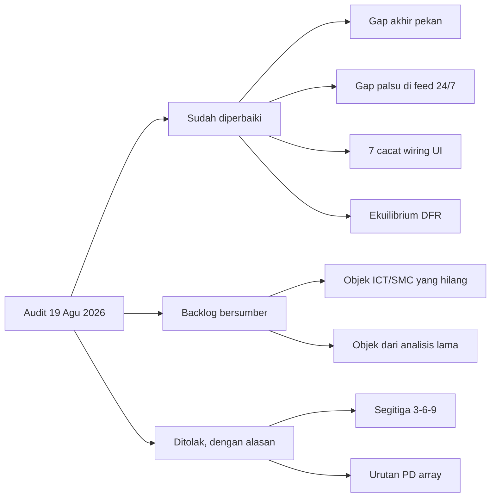

# Backlog Zonelab, hasil audit 19 Agustus 2026

Dokumen ini mencatat apa yang **belum** ada di Zonelab, dari tiga audit yang
dijalankan pada 19 Agustus 2026: audit wiring UI, audit folder `analisis lama`,
dan riset sumber ICT, Quarterly Theory serta SMC.

> [!IMPORTANT]
> Setiap butir di bawah membawa **sumbernya**, entah berupa `file:baris` di repo
> ini atau URL sumber luar. Butir tanpa sumber tidak dimasukkan. Kalau sumbernya
> saling bertentangan, itu dinyatakan sebagai bertentangan, bukan dipilihkan
> salah satu.

> [!NOTE]
> **Kolom status disegarkan 21 Agustus 2026.** Empat butir sudah tidak sesuai
> kode. Tiga karena `d63b813` mengirimkannya pada hari yang sama, yaitu Bagian 3
> nomor 1, Bagian 4 nomor 1, dan Bagian 6 nomor 5. Satu karena klaimnya salah
> sejak ditulis, yaitu Bagian 4 nomor 7. Audit ulang yang membaca halaman ini
> tanpa memeriksa kode akan menemukan kembali gap yang sudah tertutup, dan itu
> sudah terjadi sekali.

## Ringkasan status

## Bagian 1: sudah diperbaiki pada 19 Agustus 2026

| Cacat | Bukti sebelum | Sesudah |
|---|---|---|
| Gap akhir pekan tidak tergambar pada jendela sempit | `bars` 150, 200, 250 menghasilkan NWOG = 0 walau bar pertama chart adalah pembukaan Minggu | Overlay gaps mengambil riwayat sendiri, minimal 10 hari. NWOG bertahan di semua lebar jendela |
| Gap dipalsukan pada instrumen 24/7 | binance BTCUSDT 1h menghasilkan 29 band, semuanya berlabel `approximate=False` | Nol band, 29 dihitung sebagai `traded_through` |
| Provider sintetis tidak pernah tutup | Nol lubang sesi, jadi tes gap menguji objek fabrikasi | 21 lubang sesi per 500 bar, termasuk akhir pekan 50 jam, plus lompatan harga saat buka |
| Jeda sesi tidak terlihat di chart | Lilin Jumat menempel di lilin Minggu, 49 jam hilang tanpa jejak | Primitif `break-primitive.ts`, garis vertikal plus label durasi dan lompatan harga |
| Tujuh cacat wiring UI | Lihat Bagian 2 | Semua tersambung |
| DFR tanpa ekuilibrium | Panel menampilkan dua angka, pembaca membagi dua sendiri | `DefiningRange.equilibrium` sampai ke panel |

## Bagian 2: cacat wiring UI yang ditemukan dan diperbaiki

1. **`require_structure_break` tanpa UI.** Backend menyebutnya "the contested
   rule and the engine's biggest ICT departure". Diukur ulang di XAUUSD 1 jam,
   600 bar, `max_zones_per_side` 0: gerbang mati 23 zona, gerbang hidup 10 zona
   dengan 84 ditolak. Panel zona sudah **menyebut** gerbang ini ke pengguna
   sementara kontrolnya tidak ada di mana pun.
2. **`chain_degrees` tanpa picker**, sehingga blok "Quarter chain" di panel
   checklist tidak pernah bisa tampil.
3. **SSMT membuang 8 dari 9 field bukti.** Panel hanya mencetak jumlah.
4. **Kesegaran feed tidak ditampilkan.** Satu panggilan mengembalikan
   `feed_lag_seconds` 2850, yaitu 47 menit basi, tanpa cara pengguna tahu.
5. **Empat detektor tanpa jejak filter.** Chart kosong sementara server sudah
   menjelaskan sebabnya.
6. **`news_error` di jalur tipe yang salah** dan tidak pernah dirender.
7. **Nilai "tanpa cap" tidak terjangkau** pada dua slider zona.

## Bagian 3: objek ICT dan SMC yang belum ada

Diurutkan menurut seberapa sentral di sumber dikali seberapa murah dibangun di
atas primitif yang sudah ada.

| # | Objek | Aturan menurut sumber | Status di repo |
|---|---|---|---|
| 1 | Equal highs / equal lows | Dasar dari turtle soup; kutipan MSS di repo sendiri menyebut "above this old, relative equal high" | **Dibangun 21 Agustus 2026**, `liquidity.equal_levels` menggambar `REQH`/`REQL` dengan hitungan sentuhannya. Toleransi `0.1 x ATR(200)`, dijaga `test_an_equal_high_shelf_never_moves`. Aturannya dipilih dengan pengukuran, bukan dikarang: `docs/QA-PRODUKSI.md` bagian 13 |
| 2 | Optimal Trade Entry | Retracement 0.5, 0.62, 0.705, 0.79, invalidasi di 1.0 | Tidak satu pun angka itu ada. `dealing_range.py` sudah membangun input yang persis dibutuhkan |
| 3 | Balanced Price Range | FVG bullish dan bearish tumpang tindih di harga yang sama. Tingkat S di hierarki modern | Tidak ada. `detect_fvg` sudah mengeluarkan kedua polaritas |
| 4 | Mitigation block | Pembeda dari breaker adalah **tidak ada** sweep sebelumnya | Tidak ada. `walk_breaks` sudah membedakan SWEEP dari BOS |
| 5 | Killzone yang hilang | Sumber memberi empat: Asia 19-22, London 02-05, New York 07-09, London Close 10-12 | `pools.SESSIONS` hanya punya dua, dan jendela Asia pun berbeda dari sumber |
| 6 | Silver Bullet | 03-04, 10-11, 14-15 New York | Nol kemunculan di seluruh repo |
| 7 | Consequent encroachment pada FVG dan OB | 50% dari array, digambar sebagai harga | `imbalance.py` mengklaim `penetration_pct` setara. Bukan setara: satu harga, satu peristiwa |
| 8 | Unicorn model | FVG duduk persis di dalam breaker block | Kedua induknya sudah ada |
| 9 | Opening Range Gap | Antara harga pertama sesi 09:30 dan penutupan hari sebelumnya | `gaps.py` hanya menangani batas 17:00/18:00 |
| 10 | IPDA data range | Tertinggi dan terendah bergulir 20, 40, 60 hari perdagangan | Tidak ada |
| 11 | Rejection block | Zona **sumbu** panjang lilin yang menyapu likuiditas lalu ditolak | Tidak ada. OB didefinisikan pada badan, ini pada sumbu |
| 12 | Volume imbalance | Celah badan ke badan, sumbu boleh tumpang tindih | Dinamai lalu ditolak di `imbalance.py` |

> [!WARNING]
> **Dua tempat sumber benar-benar tidak sepakat, jangan dikarang satu aturan.**
> Pertama, urutan PD array: ada tiga urutan yang beredar dan satu sumber resmi
> tidak memberi urutan sama sekali. Kedua, liquidity void lawan vacuum block:
> satu sumber menyamakannya, sumber lain membedakan berdasarkan jumlah lilin.

## Bagian 4: objek dari `analisis lama` yang belum diadopsi

Frekuensi dihitung dari 51 gambar di folder tersebut.

| # | Objek | Frekuensi | Status |
|---|---|---|---|
| 1 | Divergensi lintas instrumen digambar **di chart** | ~33 dari 51 | **Tergambar 21 Agustus 2026.** Entri `ssmt` ada di `layers.py:196`, memakai blok param `checklist` daripada menyalinnya, dan primitifnya `frontend/src/components/ssmt-primitive.ts`. Yang tetap tidak ada: apa pun yang menghubungkan satu divergensi ke outcome |
| 2 | Notasi transisi rantai `A => B` | ~23 dari 51 | `sequence.chain` sudah menghasilkan kedua ujungnya. Transisinya, digit `0` untuk rantai belum selesai, dan rantai lebih dari tiga digit belum ada |
| 3 | Kotak sesi dan kotak hari bernama, dengan garis tengah | 18 dari 51 | `pools.py` menghasilkan **ray**, bukan kotak. Tidak ada kotak hari, tidak ada jendela NY AM/PM |
| 4 | `tCISD` | 13 dari 51 | Dinyatakan di luar lingkup di `cisd.py`. Ini objek konfirmasi paling sering digambar di folder, dan yang dikirim justru varian yang lebih jarang |
| 5 | Ray gap bernama timeframe (`H4 Gap`, `Gap/D`) | ~9 | Tidak ada label timeframe pada gap |
| 6 | Tabel header `EV / Top / Bot / Dist` | 7 | Aritmetikanya sudah dipecahkan, tabelnya belum dibuat |
| 7 | Derajat `quarter` tiga bulan, penghasil `TQO` | 6 | **Butir ini salah, dikoreksi 21 Agustus 2026.** Derajat `year` ADALAH kuartal tiga bulan: `quarters("year")` memotong di 1 Jan, 1 Apr, 1 Jul, 1 Okt, dan true open tiap kuartal itu sudah tergambar. Yang berbeda cuma namanya, `TYO` lawan `TQO` di gambar, dan `TQO` sudah dipakai derajat quadrennial (`session-primitive.ts:121`). Jadi ini keputusan label, bukan derajat yang hilang |
| 8 | Template NY Judas Swing | 1 gambar, tapi spesifikasi 2x2 lengkap | Ditolak sebagai diskresioner. Gambarnya justru deterministik dan semua primitifnya sudah ada |

> [!NOTE]
> **Koreksi atribusi.** Ke-51 gambar di `analisis lama` berwatermark
> `Tango618 created with TradingView.com`, dan ekspor WhatsApp menunjukkan
> pengirimnya "Bang Nas ICT". Sedikitnya sepuluh tempat di kode menyebutnya
> "the owner's own diagram" atau "his own annotated charts". Yang milik pemilik
> repo adalah **pemilihannya**, bukan gambarnya. `docs/ADOPSI.md` juga menulis
> "53 gambar" sementara jumlahnya 51.

## Bagian 5: dua ketidakcocokan yang perlu diputuskan, bukan dibangun

1. **Definisi "stage" pada SSMT.** `ssmt.py` menyatakan dengan huruf besar bahwa
   stage adalah derajat, dan menyebut pembacaan alternatif "wrong". Gambar 21,
   satu-satunya artefak yang **mendefinisikan** dua stage, menulis: stage 1
   adalah level horizontal ekstrem kuartal sebelumnya, stage 2 adalah divergensi
   yang masuk ke level itu. Itu bukan salah satu dari dua pembacaan yang sudah
   dinamai. Panel checklist saat ini menjawab pertanyaan yang tidak diajukan
   sumbernya.
2. **TLO lawan TDO.** `quarters.py` memaku "TLO IS TDO" berdasar satu baris
   percakapan. Gambar 26 menggambar `TLO`, `TDO`, `TWO` dan `TNYO` sebagai empat
   ray terpisah pada empat harga berbeda, dan gambar 9 menggambar empat lagi.
   Satu kalimat lawan empat tangkapan layar.

## Bagian 5b: audit lookahead, 20 Agustus 2026

Metode: invarian prefiks. Jalankan jalur kode yang dikirim atas prefiks yang
membesar dari deret MT5 yang sama, dengan **semua cap tampilan dimatikan**, lalu
periksa objek yang sudah terbit tidak berubah.

### Ditemukan dan sudah diperbaiki

**`formation_score` dinormalkan terhadap rata-rata volume SELURUH jendela.**
Zona yang terbentuk 2024 dinilai terhadap bar bertahun-tahun di masa depannya.
Komentar di atas pemakaiannya menulis "everything here is fixed when the zone
forms and never moves again", dan `Zone.settled` menjanjikan hal yang sama.
Keduanya salah.

Terukur lewat API yang dikirim, XAUUSD 15m, mt5: sembilan zona hadir di jendela
500 bar dan 3000 bar dengan geometri identik, **tujuh membawa skor berbeda**.
Dari 3000 ke 50.000 bar, rata-rata jendela bergeser 77 persen.

Lebih buruk dari kosmetik: `_dedupe` memeringkat zona bertindihan dengan skor
itu, jadi **kotak mana yang digambar** juga tergantung masa depan.

Diperbaiki jadi baseline **trailing 200 bar**, dan diverifikasi: pada 3000 lawan
3020 bar sekarang **nol** zona terhapus dan **nol** skor berubah.

### Warm-up yang tersisa, dinyatakan bukan disembunyikan

Zona di dalam 200 bar pertama jendela tidak punya baseline dan faktor volumenya
netral. Diverifikasi bahwa itu memang persis batasnya: kedelapan zona yang masih
berbeda antara 500 dan 3000 bar seluruhnya ada di indeks 48 sampai 168 dan
semuanya membawa netral 0,1667, sementara yang di indeks 484 dan 671 identik.
Tidak ada informasi masa depan di jawaban mana pun.

### Belum diputuskan: `_dedupe` tidak punya jendela waktu

Zona di harga yang sama tapi terpaut tahun tetap dilebur jadi satu. Terukur:
memperlebar jendela 3000 ke 20.000 bar menghapus 18 zona, dan **12 di antaranya
digantikan zona yang LEBIH TUA** yang hanya ada karena jendelanya menjangkau
lebih ke belakang. Semua bar tambahan itu di masa lalu, jadi ini bukan lookahead
melainkan ketergantungan ke belakang.

Di chart hidup itu bisa dibela sebagai doktrin ("dua zona di satu harga adalah
satu level"). Untuk pembacaan historis artinya populasi zona yang kamu dapat
bukan populasi yang ada saat itu. Belum terdokumentasi di mana pun, dan butuh
keputusan, bukan tambalan.

### Repaint, 20 Agustus 2026: dua cacat nyata, keduanya dari kerja hari itu

Repaint adalah indikator yang **mengubah apa yang sudah digambarnya di masa lalu**
ketika data baru datang. Ia tampak hebat di belakang dan tidak berguna secara
langsung, karena gambar yang Anda baca sekarang bukan gambar yang ada di sana saat
keputusan harus diambil. Setiap properti lain di proyek ini bisa dinegosiasikan
dengan bukti; yang ini tidak, karena chart yang menulis ulang dirinya tidak bisa
menjadi bukti apa pun.

Diuji **dua arah**, karena keduanya aksi pengguna nyata: tumbuh ke kanan (chart
hidup) dan **tumbuh ke kiri** (mengubah picker Bars). Arah kedua yang biasa
terlupakan, dan di situlah kedua cacat berada.

| objek | tumbuh kanan | tumbuh kiri | putusan |
|---|---|---|---|
| true open (ketat + approximate) | 0 | **7** | cacat, diperbaiki |
| defining range + proyeksinya | 0 | **3** | cacat, diperbaiki |
| opening gap dan gap stack | 0 | 0 | bersih |
| geometri zona | 0 | 0 | bersih |
| state zona | 5 maju | 5 maju, **0 mundur** | siklus hidup, benar |
| `range_pos` SSMT | geometri 0 | geometri 0, nilai ke nilai **0** | warm-up, benar |
| `formation_score` | dalam warm-up saja | dalam warm-up saja, **0 di luar** | batas terukur |

**Cacat 1, tujuh true open.** Batas yang jatuh sebelum bar pertama jendela tidak
bisa dibedakan dari batas yang pasarnya tutup, jadi fallback approximate
menjangkau maju melewatinya. Satu true open mingguan terbaca **4827,589
approximate pada 2.000 bar dan 4827,612 EXACT pada 20.000** - level bernama yang
sama, dua harga, satu dropdown. Guard `quarter.start < candles[0].time`
dipulihkan; ia sempat saya hapus karena sebuah tes menuntutnya, dan tes itulah
yang salah - jendela yang mulai sehari setelah batas adalah kasus ambigu itu
sendiri.

**Cacat 2, tiga defining range.** `_closed` membuktikan Q1 sudah berakhir dan
tidak ada yang membuktikan Q1 sudah **mulai** di dalam data, jadi band yang
dua-pertiganya mulai sebelum bar pertama dihitung dari pecahan yang kebetulan ada
di jendela - dan bergeser bersama seluruh proyeksi yang diturunkan darinya.
Aturannya sudah ada di repo ini untuk period high: *a partial high is not the
high*. Sekarang DFR memakainya. 1048 band jadi 1047; yang hilang yang tertua, dan
memang tidak bisa diketahui.

**Yang terlihat seperti repaint tetapi bukan.** `None` berarti tidak diklaim, dan
kanvas tidak mencetak huruf apa pun untuknya - jadi 200 selisih `range_pos` adalah
sesuatu yang **absen menjadi ada**, bukan sesuatu yang tergambar bergeser. Nol
nilai yang berubah menjadi nilai lain, dan nol perubahan geometri. Sama untuk
`formation_score`: kelima selisihnya ada di dalam warm-up volume 200 bar dan
**nol** di luarnya, yang berarti baseline-nya membaca bar sebelum leg dan bukan
jendelanya.

Ditegakkan di `tests/test_no_repaint.py`, tujuh tes. **Dibuktikan tidak vakum**:
guard DFR dilepas sementara, tesnya gagal, guard dipulihkan.

### Area yang diperiksa dan BERSIH

Dinyatakan eksplisit karena hasil negatif juga hasil.

| Area | Cara diuji | Hasil |
|---|---|---|
| `fvg`, `order_block`, `ifvg`, `breaker` | 433/596/410/536 zona settled, tiga pasang prefiks | nol perubahan field |
| `SwingPoint.confirmed_at` | 161 prefiks berurutan plus 400 lagi | lag +0 pada seluruh 20 dan 51 swing |
| BOS / CHoCH / SWEEP / MSS | 372 peristiwa, prefiks 2800..3200 | nol pelanggaran |
| `quarterly.py` DFR, profile, manipulation | 21 siklus hari, 17 sesi, 35 hari EURUSD | DFR memang tidak ada sampai Q1 tutup |
| `ssmt.py` | 1338 peristiwa, tiga derajat | nol terbit sebelum `knowable_at` |
| `gaps.py` | prefiks 2600..3400 | 35 gap, 12 stack, 35 tier, lag +0 |
| `cisd`, `pools`, `liquidity`, `dealing_range` | prefiks 2600..3400 | lag +0 pada 96, 112, 138, 138 |
| `clock.py` DST di data MT5 nyata | keempat transisi 2025 dan 2026 | nol batas salah, Q2 5 jam saat maju dan 7 jam saat mundur |

## Bagian 6: bahaya yang tercatat, belum diperbaiki

1. **Arah proyeksi terbalik di docstring.** `projections.py` menyebut kotak Asia
   sebagai perjalanan **turun** dan London **naik**; diagonal di gambar 27
   mengatakan sebaliknya. Harganya sama karena `origin` dan tanda ikut bertukar,
   tapi siapa pun yang menyambungkan `direction` dari kaki terdeteksi akan
   mencerminkan seluruh level. `test_projections.py` akan gagal keras, bukan
   diam, tapi kalimatnya tetap terbalik.
2. **Kuartal mikro 1350 detik tidak membagi habis 900, 3600 maupun 14400.**
   Akibatnya sudah diukur tiga cara, dan enam dari sepuluh rantai berprobabilitas
   tinggi menjadi **mustahil**, bukan jarang, pada bar 1 jam.
3. **`replay_lifecycle` adalah 72% biaya chart yang penuh, dan sengaja belum
   dioptimasi.** cProfile pada 50.000 bar dengan dua belas bar layer: 26,60 detik
   dari 37,06 detik tottime, 55.322 panggilan, entri terbesar berikutnya 0,97
   detik. Ia loop skalar Python di atas array numpy, dipanggil sekali per
   kandidat kotak **sebelum** filter state, jadi mayoritas kerjanya dibuang - pada
   1500 bar `order_block` melaporkan 1.493 kandidat dan menggambar 7 kotak.
   Alasan tidak disentuh ada di komentar fungsinya: jalur dengan display cap
   terbatas bisa berhenti lebih awal tetapi jalur itu sudah cepat (500 bar, 18
   ms), sementara jalur cap 0 sedang MENGUKUR dan wajib memutar setiap kandidat.
   Perbaikan sebenarnya adalah memvektorkan jalannya, dan itu penulisan ulang
   semantik lifecycle. Di atas kira-kira 5.000 bar, setiap detik milik fungsi
   ini; provider dan serialisasi bukan penyebabnya (terminal MT5 menjawab
   50.001 bar dalam 2,8 ms, `model_dump_json` 5,65 MB dalam 75 ms).
4. **Panel samping tidak menyusut di bawah `xl`.** Sudah diperbaiki setengah:
   lebarnya kini 232 dan 244 antara `lg` dan `xl`, bukan 276 dan 300, sehingga
   pane pada 1024x768 naik dari 374x322 ke 474x380. Tetap belum ada breakpoint
   yang benar-benar **melipat** salah satu panel, jadi pada 390px pane hanya
   316x170. Itu keputusan desain, bukan tambalan.
5. **Toleransi `REQH`/`REQL` diadopsi, bukan diukur.** Objeknya sendiri sudah
   dibangun pada 21 Agustus 2026, dan aturan yang bertentangan itu tidak
   diselesaikan dengan mengarang jalan tengah: dari dua aturan terbitan, yang
   memakai `0.01 x (tinggi - rendah seluruh data)` ditolak karena toleransinya
   jadi fungsi dari berapa bar yang kebetulan dimuat pembaca, dan penolakan itu
   terukur, `test_an_equal_high_shelf_never_moves` gagal saat aturan itu
   dipasang. Bahaya yang tersisa ada di angka yang menang: `0.1 x ATR(200)`
   dipakai karena itu yang beredar di sumber terbuka, dan belum ada apa pun yang
   mengukur apakah 0,1 lebih baik dari 0,05 atau 0,2 di sini.
6. **Bagian "continuation ke arah DOL" dari koreksi 20 Agustus sengaja tidak
   dibangun.** Aturannya jelas dan bisa dikode - kalau DOL di premium dan SSMT
   terjadi di discount, harapkan SSMT itu gagal dan harga lanjut ke DOL - tetapi
   ia sebuah klaim ARAH, dan `dol_candidates` menolak menamai satu sisi sebagai
   draw karena dua belas hipotesis arah pre-registered sudah gagal di sini. Yang
   dibangun adalah bacaannya (`SSMTDivergence.range_pos` plus likuiditas tegak
   di kedua sisi); menyimpulkannya tetap pekerjaan pembaca. Membangunnya sebagai
   sinyal butuh gerbang walk-forward, bukan kutipan.
7. **Logo atribusi library menempati sudut kiri bawah pane.** `#tv-attr-logo`,
   anchor DOM 35x19, jadi ia di ATAS kanvas dan menang di setiap tumpang tindih.
   Persegi panjangnya sekarang diklaim di peta label supaya tidak ada nama yang
   digambar di bawahnya, tetapi garis masih lewat di belakangnya. Menghilangkannya
   (`layout.attributionLogo: false` plus kredit yang terlihat di tempat lain)
   adalah keputusan lisensi milik pemilik, bukan keputusan rendering.

## Reduksi 20 Agustus 2026: apa yang dihapus, dan tiga yang ditolak

Dijalankan dari daftar audit ponytail, **tiap butir diverifikasi sendiri** sebelum
disentuh - dan pemeriksaan itu terbukti perlu, karena tiga butir di daftar itu
salah.

### Dihapus

| butir | bukti |
|---|---|
| `docs/walkforward_detectors.json` | 605 baris, nol referensi |
| `tools/side_balance.py` | digantikan `drift_gate_impact.py`, nol referensi |
| `tools/anatomy_shape.py` | keluarannya tidak muncul di dokumen mana pun |
| `IMPACTS` di `news.py` | komentarnya menyebut caller yang menyimpan salinannya sendiri |
| `_DEPARTURE_SATURATION` | komentarnya menyebut harness yang tidak ada |
| `HELD_OLDEST` | angka yang sama dengan `AGE_BANDS[-1][1]`, di file yang komentarnya sendiri menuntut satu sumber |
| `@runtime_checkable` | tidak ada `isinstance` di mana pun; Protocol-nya tetap |
| `.hair` di globals.css | seluruh kecocokan "hair" lainnya adalah kata "crosshair" |
| `htf_stats["nested_local_zones"]` | satu tulis, nol pembaca |
| `meta["dealing_range"]` | **assignment**-nya saja; call-nya tetap karena ia yang menstempel `zone.dealing_range_pos` |
| 5 impor mati + 3 variabel mati | dikonfirmasi pyflakes, bukan mata |

`app/`, `tools/`, dan `tests/` sekarang **nol** temuan pyflakes.

### Ditolak, dan alasannya

**`tests/test_prose_consistency.py`.** Audit menyarankan hapus. Audit salah: test
itu tidak mengunci angka apa pun, ia hanya menuntut setiap situs menyebut angka
yang **sama**, dan itu properti yang memang pernah pecah. Yang dilakukan justru
sebaliknya - ia diajari bahasa kedua, karena sisi Inggris sepakat "twelve" di 35
file sementara dua situs Indonesia yang **dilihat pembaca** bilang "Sembilan", dan
guard-nya buta pada keduanya.

**`Drawing.gap_stacks`.** Audit menyarankan hapus karena nol referensi di
frontend. Betul soal faktanya, salah soal kesimpulannya: itu konstruk yang
diadopsi dari indikator referensi dan membawa pengukuran. Ia **diwire**, bukan
dibuang, dan sekarang tergambar sebagai region berkerangka dengan persentasenya.

**`SSMTDivergence.partner_prior` dan `partner_now`.** Audit menyebutnya
test-only. Keduanya **provenance**: tanpa mereka aritmetika satu divergensi tidak
bisa diulang dari objeknya sendiri, yang justru dijanjikan docstring kelasnya.
Aturan audit itu sendiri berbunyi "hanya buang field yang bukan dibaca DAN bukan
provenance".

**`catalogue()` menjadi `asdict`.** `Layer` punya tepat enam field dan
`catalogue()` menyebut keenamnya, jadi ekuivalen hari ini - tetapi `asdict` akan
mengirim field masa depan ke wire tanpa keputusan siapa pun. Di proyek yang
seluruh disiplinnya soal apa yang sampai ke pembaca, whitelist eksplisit layak
sepuluh baris.

**`__all__` di `detect/__init__.py`.** `imbalance` memang diimpor dari paket
(`tests/test_imbalance_structure.py:31`), jadi baris itu load-bearing untuk
`reportPrivateImportUsage`. Membuang dua nama lain menghemat nol baris dan
membuat impor submodul yang wajar gagal pyright.

### Satu yang seharusnya dimunculkan, bukan dihapus

`meta.truncated_by_provider` ada di setiap respons sejak field itu lahir dan
sudah dideklarasikan di `types.ts`, tetapi **tidak pernah dirender**. Jadi sumber
yang cuma bisa memberi 400 dari 1000 bar yang diminta menggambar chart lebih
pendek dan **terlihat persis seperti pasar yang sepi**. Sekarang dikatakan, dengan
kedua hitungannya, karena "400 dari 1000" yang memberi tahu pembaca apakah zona
yang hilang itu hilang karena formasinya tidak ada atau karena riwayatnya tidak
ada.

---

## Bagian 7: yang sengaja tidak dibangun

- Segitiga 3-6-9. Aritmetika akar digitalnya konsisten dan tidak mengatakan apa
  pun tentang harga.
- Gambar jalur forecast. Mesin ini tidak meramal, dan itu keputusan.
- Varian NWOG yang mengukur ke Senin 09:30. Jalan yang tidak diambil, dan kalau
  suatu saat diinginkan ia `kind` kedua, bukan suntingan pada yang sekarang.

---

Copyright 2026 PT Surya Inovasi Prioritas (SURIOTA).
