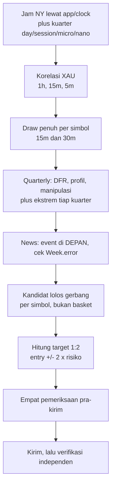

# Template prompt sesi trading

Template yang dipakai untuk membuka sesi analisis pasar plus order di
Zonelab. Bagian pertama adalah prompt yang di-copy apa adanya. Bagian kedua
adalah daftar jebakan yang sudah memakan waktu nyata, ditulis di sini supaya
prompt-nya tidak perlu memuat semuanya dan sesi yang membacanya tetap tahu.

> [!IMPORTANT]
> Prompt ini meminta order di akun SUNGGUHAN. Bagian 5 di bawah memuat
> empat hal yang harus diperiksa SEBELUM mengirim apa pun, dan keempatnya sudah
> pernah salah setidaknya sekali.

## 1. Prompt, copy apa adanya

```text
Analisa dan cek kondisi market saat ini. Tarik semua fitur, function, news dan
tools yang ada di Zonelab. Cek juga korelasi XAU. Tentukan order untuk XAU dan
BTC. Kita entry di low timeframe, 30M ke bawah, Risk Reward 1:2. Berikan
advisor: di price berapa, SL berapa, TP berapa.

Jenis order ADAPTIF, tergantung hasil analisa: pending limit kalau harga masih
jauh dari zona, dan boleh langsung market kalau harga sudah mendekat DAN
gerbangnya lolos. Aturan pemilihannya di bagian 3 dokumen ini - jangan
memutuskannya dengan perasaan, karena batas antara keduanya menentukan apakah
trade-nya masih anggota populasi yang diukur.

Aturan yang tidak boleh dilanggar:

1. PISAHKAN apa yang MENYELEKSI order dari apa yang cuma DIBACA. Sebutkan
   secara eksplisit kriteria mana yang memilih tiap order, dan layer mana yang
   hanya konteks. Kalau order-nya dipilih oleh gerbang supply_demand, jangan
   sebut ia berbasis ICT.
2. Jangan berikan klaim arah. Dua belas hipotesis arah praregistrasi mati di
   project ini dan skor checklist tidak memisahkan hasil. Berikan lokasi, jam,
   dan kondisi.
3. Setiap angka harus dari command yang benar-benar dijalankan. Kalau belum
   diukur, tulis bahwa belum diukur.
4. Jam New York dibaca lewat `app/clock.py`, bukan lewat variabel TZ.
5. RR 1:2 harus di-override manual. `app/plan.py` menurunkan target dari
   `profit_zone_rr * tinggi zona`, jadi RR adalah konsekuensi bukan setelan.
6. Sebelum mengirim order, periksa `.autotrade.json`, journal, cap portofolio,
   dan apakah lot minimum melanggar anggaran risiko. Lapor keempatnya.
7. Verifikasi order yang terkirim lewat pembacaan INDEPENDEN dari order book,
   bukan dari output script pengirimnya.
```

## 2. Urutan kerja yang diharapkan



## 3. Pending limit lawan market, dan kenapa batasnya bukan selera

Pending limit BUKAN default karena kehati-hatian. Ia default karena populasi
yang seluruh angka di project ini dihitung padanya adalah SENTUHAN PERTAMA, dan
sebuah limit yang duduk di garis proksimal terisi tepat pada sentuhan pertama
itu. Order pending adalah cara menangkap event yang diukur, bukan versi
konservatif dari market order.

`tools/execute.py` baris 343 membuang setiap zona yang `first_test_time`-nya
terisi, dan docstring-nya menyatakan alasannya apa adanya: "the measured
population is a FIRST touch, so a zone price has already visited is not a member
of it and its number does not apply."

Jadi ketiga keadaannya berbeda, dan hanya dua di antaranya diukur:

| Keadaan harga | Jenis order | Status populasi |
|---|---|---|
| Belum menyentuh zona | **pending limit di proksimal** | anggota populasi yang diukur |
| Sedang menyentuh SEKARANG, belum ada bar tutup di dalam | **market boleh**, event-nya sama dengan pengisian limit | anggota, selama bar-nya belum tutup di dalam |
| Sudah ada bar TUTUP di dalam zona | market adalah trade lain | `first_test_time` terisi, BUKAN anggota |

`state` box menyatakan yang mana: `fresh` berarti belum ada sentuhan, `tested`
berarti harga masuk tapi tidak melewati ambang mitigasi, `mitigated` berarti
sudah dimakan melewatinya. `state` dihitung dari bar yang SUDAH TUTUP, jadi
sebuah box yang harganya baru masuk di bar yang masih terbentuk tetap `fresh`
sampai bar itu tutup.

### Kalau memilih market, tiga angka berubah

1. **Entry** jadi harga sekarang, bukan garis proksimal.
2. **Risiko per unit** jadi jarak harga-sekarang ke stop, yang untuk zona demand
   LEBIH KECIL daripada dari proksimal, karena harga sudah di dalam. R-nya
   membaik dan itu bukan keuntungan gratis: zonanya sudah sebagian terpakai.
3. **Target 1:2 ikut bergerak**, karena ia `entry +/- 2 x risiko` dan kedua
   sukunya berubah. Hitung ulang, jangan pakai target yang dihitung untuk entry
   proksimal.

### Yang harus dilaporkan saat memilih market

- `state` box-nya pada saat order, dan apakah ada bar tutup di dalamnya
- entry market, risiko per unit, dan target 1:2 yang DIHITUNG ULANG
- satu kalimat yang menyatakan trade ini masih anggota populasi terukur atau
  bukan, dan kalau bukan, bahwa angka-angka kalibrasi tidak berlaku untuknya

> [!WARNING]
> Jangan pakai `tools/execute.py --send` untuk market entry pada zona yang sudah
> tersentuh: jalur itu akan membuang zonanya di baris 343 dan tidak mengirim apa
> pun. Yang keluar bukan penolakan yang menjelaskan, melainkan zona yang hilang
> dari daftar kandidat tanpa suara.

## 4. Command yang menghasilkan angkanya

| Yang dicari | Command |
|---|---|
| Jam NY plus kuarter | `app.clock.to_ny` dan `app.quarters.quarters` di keempat degree |
| Killzone aktif | `app.pools.killzones_at(epoch)` |
| Korelasi | `app.aligned.load_aligned` lalu `app.correlation.correlations` |
| Semua layer | `POST /api/draw` dengan daftar layer penuh |
| DFR, profil, manipulasi | field `checklist` di response `/api/draw` |
| Ekstrem tiap kuarter | `app.quarterly.profile` plus `manipulation_done` per cycle |
| News di depan | `app.news.read()` lalu saring `e.time > now` |
| Kandidat lolos gerbang | `python -m tools.execute --symbol <satu> --interval 15m` |
| Advisor per zona | field `advice` di response `/api/draw` |
| Akun, posisi, pending | `MetaTrader5.account_info`, `positions_get`, `orders_get` |

Layer yang WAJIB dikirim parameternya, karena tanpa itu keempatnya menggambar
nol dan terlihat seperti layer rusak:

```json
{
  "dfr":      {"degrees": ["day", "session"]},
  "session":  {"quarters": ["day", "session", "micro"],
               "true_opens": ["day", "session"]},
  "checklist": {"ssmt_symbols": ["XAGUSD"], "ssmt_degrees": ["day"]}
}
```

`ssmt` dan `psp` membaca divergensi LINTAS instrumen, jadi tanpa partner
keduanya benar-benar tidak punya apa pun untuk digambar. Diukur 2 September
2026 di XAUUSD 1h 900 bar: ssmt 0 objek, smt 0, psp 0.

## 5. Empat pemeriksaan pra-kirim, dan kenapa masing-masing ada

### 5.1 Saklar auto-trade bisa menyala di atas daemon yang mati

```bash
cat backend/.autotrade.json
```

Periksa `daemon_pid` benar-benar ada di daftar proses. Pada 2 September 2026
`enabled: true` dengan `daemon_pid: 25920` yang **tidak ada**, dan heartbeat
`last_seen` sudah 44,9 jam basi sementara `updated_at` baru 2 jam. Konsekuensinya
dua arah: `tools/mt5_backtest.py:guard_daemon` memblokir setiap tool pengukuran,
dan tidak ada yang menjaga akun.

### 5.2 Lot minimum bisa melanggar anggaran risiko

XAUUSD `trade_contract_size` 100, jadi lot minimum 0,01 pada stop selebar 13
poin sudah berisiko 13 USD. Di akun 1000 USD itu 1,3% dalam satu trade, dan
pada kandidat berstop lebar ia mencapai 35 USD alias 3,5%.

Diukur 2 September 2026: pada risiko 1%, **nol dari tujuh** kandidat XAU 1h bisa
dipasang. Engine melaporkannya dengan benar - "dinaikkan ke lot minimum justru
melanggar batas risikonya sendiri" - dan yang salah adalah menganggap nol
kandidat berarti nol setup.

### 5.3 Journal mengunci zona atas ticket yang sudah dibatalkan

Journal append-only dan pemeriksaannya "sudah pernah diorder". Ia TIDAK
membedakan placed-dan-hidup dari placed-dan-dibatalkan. Pada 2 September 2026
empat zona BTC terkunci atas ticket 4626368007-010, keempatnya `state=2`
(canceled) sejak 30 Agustus. Periksa `history_orders_get(ticket=...)` sebelum
menyimpulkan sebuah zona memang sudah dipegang.

### 5.4 Cap portofolio berlaku PER PASS, dan urutannya alfabetis

`tools/execute.py:by_method_ranked` mengurutkan `(symbol, zone.id)`, jadi
"BTCUSD" selalu mendahului "XAUUSD". Di run basket dengan 6 slot, keenamnya
habis di BTC dan XAU tidak pernah dilihat sama sekali.

> [!WARNING]
> Jalankan **satu simbol per pass** untuk melihat kandidatnya, lalu jumlahkan
> risikonya sendiri terhadap cap 6%. Basket gabungan akan menyembunyikan
> kandidat simbol kedua.

Dan sizing ke anggaran risiko memakan cap jauh lebih cepat daripada lot
minimum: dua order BTC yang di lot minimum berisiko 4,25 dan 4,90 USD memakan
59,21 dari cap 60,01 begitu di-size ke 3%.

## 6. Yang harus muncul di jawabannya

- [ ] Jam UTC dan New York, plus kuarter di keempat degree dan sisa menitnya
- [ ] Killzone yang aktif dan kapan yang berikutnya mulai
- [ ] Korelasi XAU lawan BTC di tiga timeframe, plus partner terketat
- [ ] Per simbol: hitungan detector, box yang memuat harga, gerbang yang lolos
- [ ] Per simbol: DFR, profil AMDX/XAMD, status manipulasi, ekstrem tiap kuarter
- [ ] Level terdekat, dan mana yang MASIH BERDIRI lawan sudah ditembus
- [ ] Event news di DEPAN dengan jarak menitnya, plus catatan kalau feed gagal
- [ ] Tabel order: entry, SL, TP 1:2, risiko dalam USD dan persen equity
- [ ] Jenis order per baris (pending limit atau market) plus `state` box-nya,
      dan untuk market: target 1:2 yang sudah dihitung ulang
- [ ] Kriteria yang MENYELEKSI tiap order, dipisah dari layer yang cuma dibaca
- [ ] Empat pemeriksaan pra-kirim, masing-masing dengan hasilnya
- [ ] Verifikasi independen order book setelah kirim
- [ ] Satu kalimat tentang apa yang angka-angka itu TIDAK katakan

## 7. Dua hal yang bergantung timeframe, dan sering disalahbaca

**`manipulation_done` bergantung lebar fraktal.** Ia memanggil
`structure.breaks(candles, n, n)` dengan `n=2`, sementara layer `structure` di
API memakai `StructureParams` yang berbeda. Pada 2 September 2026 pukul 11:57
UTC harga XAU sudah menembus high Q2 sebesar 1,226 poin, layer `structure`
sudah melaporkan `SWEEP +1`, dan `manipulation_done` masih BELUM - karena bar
yang mencetak high itu adalah bar terakhir dan sebuah swing fraktal butuh 2 bar
di kanannya untuk confirmed.

Konsekuensinya: flag manipulasi bisa BELUM di 15m dan SUDAH di 1h pada instrumen
dan cycle yang sama. Itu bukan bug, itu knob, dan docstring-nya menyatakan
`n` adalah knob bukan angka dari sumber mana pun.

**`gaps` dan `event_horizons` kosong di instrumen 24/7.** BTC tidak pernah tutup,
jadi ia tidak punya interval tanpa perdagangan dan tidak punya opening gap. Nol
di situ adalah gambar yang BENAR, bukan layer yang gagal.

## 8. Batas yang harus disebut, bukan disembunyikan

Yang terukur positif di seluruh survei cuma tiga: `fvg` (+10 sampai +25 poin
lawan placebo, walk-forward 8/8), `order_block` (rig sama, hasil sama), dan box
`supply_demand` mengalahkan tanpa-box (8/8, t = +4,28).

Enam layer terukur NULL, dua terukur NEGATIF signifikan sebagai klaim arah
(`ifvg`, `breaker`), satu dari tujuh belas klausa checklist memisahkan dan ia
memisahkan ke arah SEBALIKNYA (`dfr_side`, t = -3,543), dan skor agregat
checklist tidak memisahkan sama sekali. Rinciannya di
[QA-DETEKTOR.md](QA-DETEKTOR.md) bagian 11 sampai 15.

Jadi sebuah pending order di Zonelab adalah pernyataan tentang LOKASI dan JAM.
Tidak ada satu angka pun di repo ini yang mengatakan harga akan datang ke situ,
atau ke mana ia pergi sesudahnya. Advisor bawaan engine menutup setiap zona
dengan kalimat itu, dan jawaban sesi tidak boleh melampauinya.

Copyright 2026 PT Surya Inovasi Prioritas (SURIOTA)
