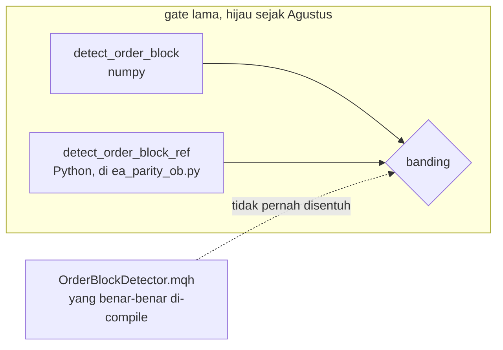

# QA tiga detektor: Supply & Demand, Order Block, Fair Value Gap

Catatan pengukuran, 1 September 2026. Pertanyaan yang dijawabnya: apakah ketiga
detektor itu valid, terkalibrasi, dan tergambar di tempat yang benar, di
**Zonelab** maupun di **MQL5 yang berjalan di MT5**, pada XAUUSD dan BTCUSD.

Setiap angka di sini datang dari perintah yang benar-benar dijalankan pada
tanggal itu. Klaim yang tidak punya angka ditulis sebagai belum diukur.

> [!IMPORTANT]
> Temuan terbesar bukan sebuah cacat detektor. Detektornya cocok. Yang tidak
> cocok adalah **cara ia diukur**: tiga gate parity tidak pernah menjalankan
> satu baris pun MQL5, dan tidak satu pun dari ketiganya bisa berakhir merah.

## Daftar isi

- [1. Ringkasan vonis](#1-ringkasan-vonis)
- [2. Gate yang tidak bisa merah](#2-gate-yang-tidak-bisa-merah)
- [3. Parity yang tidak pernah menjalankan MQL5](#3-parity-yang-tidak-pernah-menjalankan-mql5)
- [4. Divergensi Python lawan MQL5 di luar core detektor](#4-divergensi-python-lawan-mql5-di-luar-core-detektor)
- [5. Reproducibility backtest](#5-reproducibility-backtest)
- [6. Visualisasi](#6-visualisasi)
- [7. Matriks backtest, 40 sel](#7-matriks-backtest-40-sel)
- [8. ATR stop: bar terakhir lawan zona](#8-atr-stop-bar-terakhir-lawan-zona)
- [9. Walk-forward, empat periode](#9-walk-forward-empat-periode)
- [10. Apa yang masih belum diukur](#10-apa-yang-masih-belum-diukur)

## 1. Ringkasan vonis

| Pertanyaan | Vonis | Bukti |
|---|---|---|
| Detektor Python dan MQL5 menghasilkan zona yang sama | **YA**, 0 mismatch, 6 sel, 2 pair, 3 timeframe | [bagian 3](#3-parity-yang-tidak-pernah-menjalankan-mql5) |
| Klaim itu sudah pernah dibuktikan sebelumnya | **BELUM**, gate lama Python lawan Python | [bagian 3](#3-parity-yang-tidak-pernah-menjalankan-mql5) |
| Gate parity bisa berakhir merah | **TIDAK**, sampai diperbaiki hari ini | [bagian 2](#2-gate-yang-tidak-bisa-merah) |
| Jalur order Python dan MQL5 sama | **TIDAK**, lima divergensi terukur | [bagian 4](#4-divergensi-python-lawan-mql5-di-luar-core-detektor) |
| Angka backtest README bisa direproduksi | **SEBAGIAN**, dan yang positif tidak punya artifact | [bagian 5](#5-reproducibility-backtest) |
| Edge-nya bertahan di luar jendela yang melahirkannya | **TIDAK**, nol dari 16 sel menang di keempat periode | [bagian 9](#9-walk-forward-empat-periode) |
| Box tergambar di harga yang dilaporkan API | **YA** untuk supply_demand, fvg, order_block dan ifvg. breaker masih merah, sebabnya ambiguitas probe dan bukan gambar yang meleset | [bagian 6](#6-visualisasi) |

## 2. Gate yang tidak bisa merah

`backend/tools/ea_parity.py`, `ea_parity_ob.py` dan `ea_parity_fvg.py`
mencetak vonis lalu keluar dengan status 0, apa pun vonisnya:

```python
print("PARITY OK" if mismatches == 0 and len(zones_np) == len(zones_ref)
      else "PARITY FAIL")
```

Dibuktikan, bukan disimpulkan. Test "last" dicabut dari port referensi order
block, lalu gate dijalankan:

```
checked 415 order block, 414 mismatch
PARITY FAIL
SHELL_EXIT=0
```

Gate-nya **menangkap** cacatnya, dan **melaporkannya sebagai hijau** ke setiap
pembungkus yang membaca exit code. Ini bentuk yang sama dengan tiga insiden di
`docs/QA-PRODUKSI.md`. Sudah diperbaiki jadi `raise SystemExit(0 if ok else 1)`
di ketiganya.

Sapuan kelas yang sama di seluruh `backend/tools/`: tiga file lain mencetak
kata `BLOCKER` atau `GAGAL` tanpa exit code, yaitu `execute.py`, `flatten.py`
dan `reality_check.py`. Ketiganya diperiksa dan **tidak diubah**: itu status
per-item di tool operasional, bukan vonis keseluruhan, dan string-nya justru
mekanisme alarm yang dibaca `tools/monitor.py`.

## 3. Parity yang tidak pernah menjalankan MQL5

Ketiga gate lama membandingkan detektor numpy dengan **port referensi Python
yang tinggal di file gate itu sendiri**:



Nol baris `.mqh` pernah dieksekusi. `SupplyDemandDetector.mqh:3` menulis "port
faithful" dan `README.md:307` menulis "parity-proven"; yang dibuktikan adalah
Python cocok dengan Python.

### Yang menggantikannya

`mql5/ZonelabSupplyDemand/ZonelabParityDump.mq5` berjalan di Strategy Tester,
memanggil `SDDetect`, `SDDedupe`, `DetectOrderBlock` dan `DetectFVG` yang
sesungguhnya, lalu menulis dua hal ke folder Common: zona yang dihasilkan, dan
**bar yang dipakai menghasilkannya**. `backend/tools/mqh_parity.py` membaca bar
itu, bukan membaca MT5 sendiri, jadi window-nya tidak ditebak dan selisih apa
pun yang muncul adalah selisih logika.

Itu juga yang membuatnya deterministik. Gate lama membaca ekor MT5 hidup, jadi
hitungannya bergeser antar-run di tree yang sama: README menulis 1033 order
block dan 769 gap, hari ini file yang sama menjawab 1032 dan 771.

Hasil, 3000 bar per sel dari terminal Exness. Angkanya Python lawan MQL5, dan
setiap pasangan di bawah ini sama persis:

| Detektor | XAU H1 | XAU H4 | XAU M15 | BTC H1 | BTC H4 | BTC M15 |
|---|---|---|---|---|---|---|
| `supply_demand`, dedupe 0,6 | 57 | 81 | 63 | 57 | 75 | 61 |
| `order_block` | 618 | 579 | 612 | 608 | 630 | 589 |
| `fvg` | 464 | 496 | 498 | 449 | 450 | 456 |
| `ifvg` | 425 | 424 | 443 | 418 | 421 | 414 |
| `breaker` | 551 | 474 | 541 | 553 | 570 | 527 |

`TOTAL MISMATCH: 0` dan exit 0 di keenam sel. Baris `supply_demand` tanpa dedupe
ikut dibandingkan di tiap sel dan juga nol; ia tidak ditabelkan karena tercetak
di luar potongan log yang tersimpan.

Yang dibandingkan per zona: `kind`, `side`, `state`, `time_from`, `time_to`,
`base_from`, `top`, `bottom`, `proximal`, `distal`, `departure_atr`.

`base_from` masuk ke kunci pengurutan pembanding, dan itu bukan kerapian. Box
inversi memakai bar inversinya sebagai `time_from`, jadi belasan breaker bisa
berbagi satu stempel waktu dan hanya origin induknya yang membedakan -
`inversion.py` mencatat persis kasus itu. Mengurutkan tanpa `base_from` akan
memasangkan zona yang salah dan melaporkan mismatch palsu, atau menyembunyikan
yang asli.

### Gate ini dibuktikan tidak kosong

Dua suntikan, dan yang pertama gagal menggigit, yang juga informasi:

1. `low[i]<=top` diubah jadi `low[i]<top` di `SDLifecycle`. Recompile, jalan
   ulang: **0 mismatch**. Suntikan itu no-op pada data ini, karena `low`
   persis sama dengan `top` nyaris tidak pernah terjadi di harga ter-kuantisasi
   tick. `.ex5` terbukti dibangun ulang (19:02:26) dan CSV terbukti ditulis
   ulang (19:02:37), jadi yang tidak menggigit adalah cacatnya, bukan pipeline.
2. `penetration>=mitigation_pct` diubah jadi `>=mitigation_pct*0.9`. Recompile,
   jalan ulang: **exit 1**, satu mismatch, ditunjuk namanya:

   ```
   MISMATCH #1 FVG-1787709600:
       state TESTED != MITIGATED
   TOTAL MISMATCH: 1
   MQH PARITY FAIL
   ```

Dikembalikan dari repo, recompile, jalan ulang: 0 mismatch, exit 0.

> [!NOTE]
> Satu mismatch dari 1239 zona di sel pertama, untuk pergeseran ambang 10
> persen, berarti gate
> ini jauh lebih peka pada geometri daripada pada `state`. Ia mengikat, tapi
> jangan dibaca sebagai jaring rapat untuk cacat lifecycle.

### Yang baru pertama kali tercakup

`SDDedupe` dipanggil di `ZonelabSD.mq5:149` dengan ambang 0,6 yang dikirim, dan
**tidak pernah tersentuh gate mana pun**, karena `tools/ea_parity.py:213`
memasang `merge_overlap_pct=1.0`. Karena `overlap/smaller <= 1.0` selalu benar
secara aljabar, syarat `> max_overlap` tidak pernah terpenuhi, jadi dedupe
adalah no-op di bawah gate lama. Sekarang ia punya kolomnya sendiri.

Dan di situ ada divergensi algoritmik yang nyata, walau tidak muncul di 3000
bar ini. `SDDedupe` mengurutkan dengan selection-by-swap yang **tidak stabil**,
sementara `_dedupe` memakai `sorted(..., reverse=True)` yang stabil:

| Kunci masukan | MQL5 | Python |
|---|---|---|
| `[(1,9), (2,9), (1,9), (2,9)]` | `b, d, c, a` | `b, d, a, c` |

Ditambah `departure_atr` sudah dibulatkan 3 desimal di sisi Python
(`supply_demand.py:619`) dan mentah di sisi MQL5, dua zona yang selisih
departure-nya di bawah 0,001 ATR adalah tie di Python dan tegas di MQL5.
Dedupe menyimpan yang pertama ditemui, jadi survivor-nya bisa beda box.

Statusnya: **divergensi terbukti ada di algoritmanya, dan tidak terjadi di 3000
bar XAUUSD H1 yang diuji.** Belum diperbaiki.

## 4. Divergensi Python lawan MQL5 di luar core detektor

Core-nya cocok. Yang di sekitarnya tidak, dan empat dari lima duduk di
jalur order.

### 4.1 Stop buffer dibaca di bar ATR yang berbeda

| | Sumber ATR | Lokasi |
|---|---|---|
| Python | `scale = float(atr[-1])`, bar TERAKHIR, sama untuk semua zona | `app/main.py:991` |
| MQL5 | `atr[MathMax(0, base_from - 1)]`, per zona | `ZonelabSD.mq5:172` |

Rumus stop-nya identik (`distal - way * buffer`); yang beda inputnya. Akibatnya
harga stop berbeda hampir di setiap zona, jadi `risk` berbeda, jadi lot dan R
berbeda. Ini divergensi numerik terbesar di jalur trade dan tidak ada satu gate
pun yang menyentuhnya.

### 4.2 Target default OB dan FVG EA tidak punya padanan di Zonelab

`mark_profit_zones` hanya dipanggil dari `supply_demand.py:673` dan
`drawing.py:401`, dan `drawing.py:386` membatasi jalur kedua ke
`name == "supply_demand"`. Jadi **setiap zona FVG dan order block keluar dari
Python dengan `profit_zone_rr = None`**, dan `plan.py:156` menghasilkan
`target = None`.

`ZonelabOB.mq5:131` dan `ZonelabFVG.mq5:130` memanggil `SDMarkProfitZones` di
atas output detektor mentah, dan memakainya sebagai target **default**
(`InpTargetMode=0`).

Artinya backtest OB dan FVG di bawah ini mengukur strategi yang backend-nya
tidak mengimplementasikan. Angkanya benar tentang EA-nya, dan tidak berlaku
untuk Zonelab.

### 4.3 Window-nya berbeda, dan itu membuat parity tidak cukup

Parity di bagian 3 dibuktikan **pada bar yang sama**. Di produksi kedua sisi
tidak melihat bar yang sama:

| | Window | Sumber |
|---|---|---|
| Zonelab, default API | 500 bar | `app/models/api.py:67` |
| `ZonelabSD.mq5` | sampai 20.000, tumbuh | `ZonelabSD.mq5:32` |
| `ZonelabOB.mq5` dan `ZonelabFVG.mq5` | 3.000, tetap | keduanya baris 26 |

Itu penting karena `_dedupe` bergantung window. `docs/BACKLOG.md` sudah
mengukurnya: memperlebar 3.000 ke 20.000 bar menghapus 18 zona, dan **12 di
antaranya digantikan zona yang lebih tua** yang hanya ada karena window-nya
menjangkau lebih ke belakang.

Akibatnya, pada instrumen dan menit yang sama, **himpunan zona supply/demand di
layar Zonelab tidak dijamin sama dengan himpunan yang di-trade EA.** Bukan cacat
di salah satu sisi, dan bukan sesuatu yang bisa ditangkap gate parity mana pun,
karena gate itu memberi kedua sisi bar yang identik. Yang belum ada adalah
pernyataan bahwa keduanya memang dikonfigurasi berbeda.

Efek kedua dari tabel yang sama: `supply_demand` diukur pada kedalaman lookback
yang berbeda dari `fvg` dan `order_block`, dan selisihnya melebar saat timeframe
mengecil. Di M5, 20.000 bar lawan 3.000 adalah 6,7 kali. README menyandingkan
`S&D 1,71` dengan `OB 1,06` sebagai perbandingan detektor.

### 4.4 Pembulatan profit zone

`profit_zone.py:53` memakai `round(x, 2)` (banker's rounding), MQL5
`SupplyDemandDetector.mqh:390` memakai `MathRound` (half away from zero).
`round(1.125, 2)` memberi 1,12 di Python dan 1,13 di MQL5, dan `profit_zone_rr`
masuk langsung ke harga target, jadi selisihnya `0,01 x height`.

### 4.5 Doji, hanya terjangkau kalau slider ditarik ke nol

`np.sign(0.0)` adalah 0, jadi bar exciting dengan `close == open` dilabeli base
di Python (`indicators.py:125`) dan exciting-down di MQL5
(`SupplyDemandDetector.mqh:123`). Hanya terjangkau kalau
`impulse_body_ratio = 0`, dan `params.py:48` mengizinkan nilai itu.

## 5. Reproducibility backtest

### 5.1 Keadaan sebelum hari ini

`git ls-files` untuk `*.htm`, `*.html`, `*.xml`, `*.csv`, `*.set`
mengembalikan **nol**. Yang ada cuma tiga report di folder terminal, di luar
git, dan `ReplaceReport=1` dengan nama tetap membuat setiap run baru menghapus
run sebelumnya. Ketiganya adalah run TERAKHIR tiap EA, bukan run yang
menghasilkan angka headline, dan **ketiganya rugi**:

| Artifact | Isi sebenarnya | PF |
|---|---|---|
| `ZonelabSD_M15_report.htm` | ZonelabSD **BTCUSD H1** (bukan M15, bukan XAU) | 0,82 |
| `ZonelabOB_report.htm` | ZonelabOB BTCUSD H1, gate 2,5, fixed 2R | 0,93 |
| `ZonelabFVG_report.htm` | ZonelabFVG XAUUSD H1, fixed ATR 2,0 | 0,81 |

`tester.ini` di HEAD menunjuk `ZonelabFVG`, padahal README dan
`run_backtest.bat` sama-sama menyatakan file itu menjalankan `ZonelabSD`, dan
**tidak pernah men-set satu baris input pun** di kelima revisinya. MT5 lalu
memakai compiled default, yang berarti setiap angka non-default di README
(gate 4,0, target 0,5R dan 1R, SMA 100 dan 200, OB 2,5 ATR) di-set di GUI dan
tidak tersimpan di mana pun.

Yang menentukan keputusan: **sisi yang menyuruh berhenti punya artifact, sisi
yang menyuruh jalan tidak.**

Satu kontradiksi langsung: README menulis FVG fixed ATR 2,0 sebagai "PF ~0,6".
Artifact yang justru ada untuk baris itu menyebut **PF 0,81**.

### 5.2 Yang menggantikannya

`backend/tools/mt5_backtest.py`. Tiap sel menulis `.set`-nya sendiri, nama
report unik per sel, dan `.htm` plus `.set` disalin ke
`mql5/ZonelabSupplyDemand/reports/` supaya ikut masuk git.

```bash
cd backend
PYTHONPATH=. .venv/Scripts/python.exe -m tools.mt5_backtest > ../docs/mt5-backtest.json
```

Tool itu juga menolak jalan kalau `.autotrade.json` menyala, dan menutup
terminal yang hidup sebelum tiap sel. Yang kedua bukan kerapian: MT5 satu
instance per data folder, dan sebuah `terminal64.exe /config:` yang dijalankan
saat terminal lain sudah hidup **keluar diam-diam tanpa menjalankan apa pun**.
Itu terjadi hari ini, ketika `history.load("mt5:...")` dari Python menyalakan
terminal lebih dulu dan launch tester berikutnya exit 0 tanpa satu file pun
ditulis.

## 6. Visualisasi

### 6.1 Palette harness yang basi sebelas hari

`e2e/pixel-truth.mjs` membaca border box dari bitmap, dan menghitung ambang
deteksinya **dari warna yang ia simpan sendiri**:

```js
const RGB = { demand: [46, 163, 111], supply: [212, 87, 79] };
```

Renderer memakai `{ demand: [31, 143, 95], supply: [239, 143, 134] }`
(`zone-primitive.ts:87`), dan `globals.css:38` setuju dengan renderer. Commit
`d63b813` (21 Agustus) memindahkan pasangan itu di CSS dan di renderer, dan
menyentuh `pixel-truth.mjs` di commit yang sama tanpa memperbarui tabel ini.

Karena ambangnya diturunkan dari warna, salinan basi tidak membuat harness
gagal. Ia membuat probe-nya **mis-kalibrasi dan tetap hijau**.

`globals.css:34` sudah memuat peringatannya: "FIVE PLACES HOLD THIS PAIR and
they must move together". Peringatan itu sudah ada dan tidak cukup. Sekarang
`pixel-truth.mjs` membaca `--demand`, `--supply` dan `--bg` langsung dari
halaman, jadi tempatnya tinggal empat, dan
`tests/test_frontend_defaults.py::test_one_place_owns_the_demand_and_supply_colours`
gagal kalau salinan itu kembali. Dibuktikan tidak kosong: salinan lama
dipasang lagi, test merah; dikembalikan, test hijau.

### 6.2 Dua detektor tidak pernah dibaca dari kanvas

`pixel-truth.mjs:36` menerima argumen detektor, dan komentarnya sendiri
menjelaskan kenapa argumen itu ada. `package.json:20` tidak pernah
memberikannya, jadi setiap run yang pernah dijalankan membaca
`supply_demand` saja. Klaim bahwa box `fvg` dan `order_block` tergambar di
harga yang dilaporkan API bersandar pada "keduanya lewat primitive yang sama",
yang penalaran, bukan pengukuran.

Sudah ditambah `e2e:pixels-fvg`, `e2e:pixels-ob`, `e2e:pixels-ifvg` dan
`e2e:pixels-brk`, dan keempatnya sudah benar-benar dijalankan. Hasilnya di
bagian 6.4.

### 6.3 Repaint hanya diuji untuk satu detektor dari lima

`tests/test_no_repaint.py::test_a_zone_never_moves_and_its_lifecycle_never_runs_backwards`
memanggil `DETECTORS["supply_demand"]` saja. Uji proyeksi HTF di file yang sama
sudah diparametrisasi ke kelima detektor lewat `HTF_LAYERS`, tapi uji timeframe
dasar tidak, jadi satu-satunya bukti bahwa `fvg`, `order_block`, `ifvg` dan
`breaker` tidak repaint adalah bahwa keempatnya memakai `replay_lifecycle` yang
sama. Itu penalaran tentang kode bersama, dan bagian yang TIDAK bersama justru
bagian yang berisiko: tiap detektor menentukan bar `born`-nya sendiri.

Sudah diparametrisasi ke `HTF_LAYERS`, jadi 13 test jadi 17.

Dibuktikan tidak kosong, dan percobaan pertama gagal, yang juga informasi:

1. Tepi box FVG dibuat membaca tiga bar SETELAH gap terbentuk. Test **lolos**.
   Offset tetap ke depan tidak menggerakkan geometri antar-window: nilai
   `low[third+3]` sama di window mana pun yang memuat bar itu. Yang dicacatkan
   adalah kapan box boleh digambar, bukan apakah ia bergerak.
2. Tepi box FVG dibuat bergantung pada `close[n-1]`, bar terakhir window. Test
   **merah**, dan merahnya di dua tempat sekaligus:

   ```
   FAILED test_a_zone_never_moves_and_its_lifecycle_never_runs_backwards[fvg]
   FAILED test_a_zone_never_moves_and_its_lifecycle_never_runs_backwards[ifvg]
   ```

   `ifvg` ikut jatuh karena ia memanggil `detect_fvg` sebagai induknya. Sebelum
   parametrisasi, kedua kegagalan itu tidak akan muncul sama sekali.

> [!NOTE]
> Batas uji ini perlu dinyatakan, bukan disembunyikan. Ia menangkap
> ketergantungan pada UJUNG WINDOW, dan tidak menangkap lookahead ber-offset
> tetap. Yang menjaga kelas kedua adalah `confirmed` dan `settled` pada `Zone`,
> yang punya uji sendiri di sebelas file test.

### 6.4 Hasil pixel-truth, lima detektor

Lawan provider MT5, XAUUSD, 500 bar. Toleransi 2,0 px.

| Detektor | TF | Vonis | Terukur | Error top | Error bottom |
|---|---|---|---|---|---|
| `supply_demand` | 15m | **7/7** | 4 dari 4 | 0,2 px | 0,5 px |
| `fvg` | 15m | **7/7** | 6 dari 6 | 0,5 px | 1,5 px |
| `order_block` | 15m | **7/7** | 4 dari 6 | 0,3 px | 0,5 px |
| `ifvg` | 15m | **7/7** | 4 dari 6 | 0,4 px | 0,7 px |
| `breaker` | 1h | 5/7 | 7 dari 12 | 0,5 px | lihat di bawah |

Empat detektor pertama terbukti tergambar di harga yang dilaporkan API. Untuk
`fvg`, `order_block` dan `ifvg` ini pengukuran pertama yang pernah ada.

Sampai ke sana butuh empat koreksi pada harness-nya sendiri, dan tiap koreksi
adalah temuan:

1. **Ia tidak membuat direktori output-nya.** Setiap pengukuran diambil lalu
   dijatuhkan di baris terakhir dengan ENOENT. Tidak pernah terlihat karena
   satu-satunya path yang dipakai sudah ada.
2. **Ia membingkai tiap zona lewat `anatomy`, bukan lewat box-nya.** Sebuah box
   inversi menyimpan bar INDUKNYA di `anatomy` dengan sengaja, jadi bingkainya
   melebar ke seluruh umur induk dan box-nya terhimpit di ujung: jarak bar
   median 9 px untuk `breaker` dan 22 px untuk `ifvg`, lawan 38 sampai 44 px
   untuk yang lain. Setelah dibingkai pada box sendiri, dua-duanya jadi 39 px.
3. **Box yang bertumpuk tidak bisa dipisahkan probe, dan itu bukan salah
   renderer.** Probe mengukur warna; dua box sesisi yang berbagi pita harga
   saling menimpa border. Difoto: empat box BRK di satu pita, dan satu box
   sendirian di sebelah kanannya terbaca sempurna. Sekarang dihitung dan
   dilaporkan, bukan dibebankan ke gambarnya. `order_block` punya 2 dari 6
   bertumpuk di window yang sama; ketiga detektor lain nol.
4. **Box yang lebih pendek dari 14 px tidak bisa memisahkan kedua border-nya
   sendiri.** Jendela pencarian +-6 px, jadi pada box 7 px kedua border jatuh di
   satu jendela dan profilnya membaca dua puncak, `[.. 0,58 .. 0,57 ..]`, alih-
   alih satu. `ifvg` menggambar box setinggi 7,0 dan 9,5 px di XAUUSD 15m,
   karena IFVG setinggi gap yang ia balik dan gap itu kecil. Itu sekaligus
   angka keterbacaan: `zone-primitive.ts` sudah membuang caption di bawah
   `LABEL_MIN_HEIGHT = 15`, jadi box di pita itu juga tidak bernama.

### Dua check yang tidak berlaku untuk inversi, dan alasannya

Sebuah box inversi MULAI di lilin yang menembus induknya, karena `time_from`
digeser ke bar itu dengan sengaja. Akibatnya dua pertanyaan harness jadi salah
alamat untuk `ifvg` dan `breaker`:

- **"box menutupi base bar yang membentuknya"**: base bar sebuah inversi adalah
  bar INDUKNYA, yang berada di luar box-nya menurut konstruksi.
- **"border kiri terbaca lawan lilin base-nya sendiri"**: border kiri sebuah
  inversi selalu digambar di atas lilin displacement yang menciptakannya.

Keduanya dikecualikan dengan alasan tertulis, dan angkanya tetap dicetak, supaya
"tidak bisa dijawab" tidak terlihat sama dengan "nol".

### `breaker`, satu-satunya yang masih merah, dan apa yang sebenarnya diukur

Di 1h, tepi bawah `breaker` melaporkan error terburuk **3,58 px**, di atas
toleransi. Profilnya menjelaskan kenapa, dan jawabannya bukan box yang salah
tempat: **setiap tepi bawah punya DUA garis tercat** dalam jendela +-6 px,
terpisah sekitar 3 px, misalnya `[0,05 0,05 0,69 0,05 0,05 0,70 ...]`. Probe
memilih dengan benar di 6 dari 7 zona, semuanya di bawah 1,11 px, dan memilih
garis yang salah sekali.

Jadi 3,58 px itu **ambiguitas probe**, bukan bukti gambar yang meleset. Yang
tidak dilakukan, dan disebutkan supaya tidak dilakukan diam-diam: membuat probe
memilih puncak yang paling dekat dengan ekspektasi akan membuat check ini lolos
dengan sendirinya dan berhenti mengukur apa pun. Gate-nya dibiarkan merah dan
sebabnya dicatat.

### `pixel-truth` tidak bisa dijalankan di provider synthetic

Diukur pada tree bersih: `supply_demand` di synthetic memberi 4/6 dengan 0 dari
3 tepi terbaca, sel yang sama di MT5 memberi 7/7. Harness ini butuh feed
sungguhan. Ketika ia tidak bisa mengukur, dua assertion geometrinya mencetak
PASS "over 0 zones"; suite-nya tetap exit 1 karena check legibility adalah
penjaganya, jadi itu keterbacaan log dan bukan false-green.

### 6.5 Label terpotong tepi pane, dan dua salah tuduh sebelum ketemu

`e2e/labels.mjs` melaporkan satu box straddle. Perjalanan mencarinya layak
dicatat karena dua langkah pertamanya salah:

1. **Ditebak caption zona.** `zone-primitive.ts` men-clamp `x` sebuah plate dan
   tidak men-clamp `y`, dan loop penghindar tabrakannya hanya mendorong ke
   ATAS. Tambalan ditulis, harness tetap merah. Tambalan dikembalikan, asimetri
   dicatat ke `docs/BACKLOG.md` bagian 6 nomor 8 sebagai bahaya yang ditemukan
   lewat membaca dan belum punya kasus yang menjatuhkannya.
2. **Ditebak layer `projections`, lewat eliminasi.** Mencabut layer itu dari
   daftar harness mengubah 8/9 jadi 9/9, dan itu terlihat meyakinkan. Ternyata
   **confounded**: `claimedLabels` first-come-first-served, jadi mematikan layer
   mana pun mengubah label mana yang menang klaim. Tambalan kedua dipasang di
   `levels-primitive.ts`, harness TETAP merah di grid yang sama dengan `y`
   identik. Dikembalikan juga.
3. **Ditemukan lewat stack trace.** `claimedLabels.push` dibungkus Proxy yang
   mencatat `new Error().stack`, dan pelakunya `DFRRenderer.draw`. Filternya
   menyaring pada titik TENGAH baris (`r.y >= 0`) lalu menggambar box terpusat
   di titik itu, jadi baris di y = 5 lolos filter dan plate-nya mulai di -1.

Diperbaiki di `dfr-primitive.ts` dengan clamp yang sama dengan ray name di
`levels-primitive.ts`. Dibuktikan dengan sapuan delapan jam terpatok:

| | pin 1788267600 | tujuh pin lain |
|---|---|---|
| tanpa clamp | **8/9**, straddle y = -0,73 | 9/9 |
| clamp di `levels-primitive` | **8/9**, y identik | 9/9 |
| clamp di `dfr-primitive` | **9/9** | 9/9 |

Cacat ini menyala di 1 dari 8 alignment grid, yang juga menjelaskan kenapa ia
tampak seperti harness yang flaky.

### 6.6 Baseline imbalance dihitung lalu dibuang

`tools/drawing_accuracy.py` menjalankan `audit_imbalance` untuk fvg dan order
block, mencetak hasilnya, lalu menulis json **hanya dari baris supply/demand**.
Kedua detektor itu tidak punya satu angka tersimpan pun. Sudah diperbaiki.

`docs/drawing_accuracy.json` sendiri terakhir ditulis 14 Agustus, sementara
lantai tinggi-minimum detektor pindah dua kali sesudahnya (`1afe266` dan
`596016e`). Skemanya masih cocok, yang justru membuatnya terlihat mutakhir.

## 7. Matriks backtest, 40 sel

Exness real tick, 1 Januari sampai 31 Agustus 2026, deposit 10.000 USD, risk 1
persen, semuanya di config yang DIKIRIM. Setiap sel meninggalkan `.htm` dan
`.set`-nya di `mql5/ZonelabSupplyDemand/reports/`.

### XAUUSD

| TF | S&D | OB | FVG | IFVG |
|---|---|---|---|---|
| H4 | 1,28 / +4,9% / DD **4,5%** | 1,01 / +0,7% / DD 18,6% | 0,86 / -8,4% | 0,91 / -2,8% |
| H1 | **1,71 / +49,1% / DD 10,0%** | 1,06 / +13,3% / DD 21,4% | 0,90 / -15,7% / DD 44,5% | 1,24 / +39,9% / DD 30,8% |
| M30 | 1,34 / +58,2% / DD 21,9% | 0,92 / -33,8% | 0,86 / -50,5% | 1,14 / +45,3% / DD 37,5% |
| M15 | 1,00 / -1,8% | 0,89 / -63,3% | 0,91 / -52,8% | 1,08 / +47,2% / DD 35,2% |
| M5 | 0,88 / -76,6% | 0,95 / -92,2% | 0,97 / -64,1% | 0,82 / -88,1% |

### BTCUSD

| TF | S&D | OB | FVG | IFVG |
|---|---|---|---|---|
| H4 | **1,28 / +7,2% / DD 6,4%** | 1,16 / +11,2% / DD 9,5% | 0,78 / -16,6% | 0,62 / -15,8% |
| H1 | 0,82 / -16,6% | 0,85 / -46,4% | 1,04 / +9,6% / DD 32,5% | 0,75 / -37,7% |
| M30 | 0,94 / -11,3% | 1,00 / -2,5% | 0,87 / -63,3% | 0,84 / -46,2% |
| M15 | 0,96 / -17,9% | 0,94 / -53,3% | 0,86 / -92,0% | 0,99 / -10,3% |
| M5 | 0,97 / -57,7% | 0,78 / **-99,6%** | 0,83 / **-100,0%** | 0,79 / **-99,2%** |

**11 sel dari 40 untung.** Kalau ukurannya bukan PF tapi drawdown, yang lolos
tinggal empat: S&D di H4 pada kedua instrumen (4,5% dan 6,4%), S&D XAU H1
(10,0%), dan OB BTC H4 (9,5%). Baris M5 menghapus akun di tiga dari empat
detektor pada BTC.

> [!WARNING]
> Dua puluh enam sel di tabel ini mengukur strategi yang Zonelab **tidak punya
> jalurnya**. `tools/execute.py:192` hanya memanggil `DETECTORS["supply_demand"]`,
> dan `mark_profit_zones` tidak pernah dipanggil untuk imbalance mana pun, jadi
> setiap zona OB, FVG dan IFVG keluar dari Python dengan `profit_zone_rr = None`
> dan `target = None`. Target `profit_zone` di ketiga EA itu dipakai supaya
> sebanding di dalam matriks, bukan karena Zonelab menghitungnya.

### Yang direproduksi dari README lama

| Klaim README | Diukur ulang | Cocok |
|---|---|---|
| S&D XAU H1 profit_zone, PF 1,71, +49,1%, 108 trade | PF 1,71, +49,06%, 108 | ya |
| S&D XAU M15 profit_zone, PF 1,00, -1,75% | PF 1,00, -1,75%, 450 | ya |
| S&D BTC H1, PF 0,82 | PF 0,82, -1.663,05, 148 | ya |
| FVG XAU H1 profit_zone, PF 0,90, -15,7%, win 35,2% | PF 0,90, -15,70%, win 35,18% | ya |
| OB XAU H1, PF 1,06, +14,7%, 451 trade | PF 1,06, +13,30%, 445 | mendekati |
| FVG fixed ATR 2,0, "PF ~0,6" | artifact-nya sendiri menyebut **PF 0,81** | **tidak** |

Yang README tidak pernah sebut untuk satu baris pun: **drawdown**. Angka
terbesar di tabel ini 100,01 persen.

### Kesimpulan README yang tidak bertahan di dua instrumen

README menyimpulkan "H1 sweet spot" dan "BTC tidak punya edge untuk detektor
mana pun". Keduanya diambil dari satu timeframe:

- **BTC punya edge di H4.** S&D 1,28 dengan drawdown 6,4 persen, praktis setara
  emas, dan OB 1,16 dengan 9,5 persen.
- **S&D XAU M30 net-nya lebih besar dari H1** (+58,2 lawan +49,1) dengan
  drawdown dua kali lipat (21,9 lawan 10,0). Mana yang "terbaik" bergantung
  apakah yang diminimalkan kerugian atau dimaksimalkan profit, dan README
  memilih satu tanpa menyebut yang lain.
- **IFVG XAU untung di tiga timeframe** (H1 1,24, M30 1,14, M15 1,08) sementara
  induknya FVG rugi di semua. Prediksi yang ditulis SEBELUM angkanya ada -
  bahwa kepadatan 425 zona per 3000 bar akan menjatuhkannya di bawah 1 - salah,
  dan dicatat di sini sebagai salah.

## 8. ATR stop: bar terakhir lawan zona

Pertanyaan yang tersisa dari bagian 4.1, dijawab dengan 16 sel di mana **hanya
sumber ATR yang berbeda**: empat detektor lawan dua instrumen lawan H4 dan H1,
real tick, saklar `InpStopAtrMode` di ketiga EA.

| | Menang |
|---|---|
| ATR bar sebelum base zona | **11** |
| ATR bar terakhir | 5 |

Rata-rata delta PF -0,0312, simpangan baku 0,0674. Delta terbesar -0,24 memihak
per-zona, +0,05 memihak bar terakhir.

**LEAN, BUKAN LOLOS.** Paired t = -1,854 lawan kritis 2,13 di df 15, sign test
satu sisi p = 0,105. Yang memutuskan bukan signifikansinya: dua sisi HARUS
sepakat pada satu angka, dan ini angka yang dipakai oleh setiap sel backtest
yang pernah dijalankan.

`app/main.py` sekarang membaca `atr[max(0, base_from - 1)]` per zona, dengan
**zona HTF dikecualikan** karena `anatomy.base_from` sebuah zona HTF meng-index
deret HTF-nya sendiri dan membacanya di situ akan menamai bar yang salah tanpa
error. Dikunci oleh
`tests/test_plan.py::test_the_stop_reads_the_volatility_that_formed_the_zone_not_todays`,
dibuktikan merah dengan mengembalikan `atr[-1]`.

## 9. Walk-forward, empat periode

64 sel: empat detektor lawan dua instrumen lawan H4 dan H1, dijalankan terpisah
di 2023, 2024, 2025, dan Januari sampai Agustus 2026. Real tick, deposit 10.000,
config yang dikirim. Bukti mentahnya `docs/mt5-walkforward.json`.

> [!IMPORTANT]
> AMBANGNYA DINYATAKAN SEBELUM ANGKANYA DIBACA. Tidak ada yang di-fit di sini,
> jadi ini bukan walk-forward atas parameter melainkan stabilitas antar-periode
> dari aturan tetap. Dengan empat periode, sel yang menang KEEMPAT-EMPATNYA
> memberi sign test satu sisi p = 1/16 = 0,0625, dan itu **tidak** melewati
> 0,05. Empat periode cukup untuk menyatakan sebuah sel GAGAL dan tidak pernah
> cukup untuk menyatakannya LOLOS.

| Sel | 2023 | 2024 | 2025 | 2026 Jan-Agu | Menang |
|---|---|---|---|---|---|
| SD XAU H1 | 0,97 | 1,04 | 0,75 | **1,71** | 2/4 |
| SD XAU H4 | 1,25 | 0,87 | 0,63 | 1,28 | 2/4 |
| SD BTC H4 | 0,74 | 0,90 | 1,07 | 1,28 | 2/4 |
| FVG BTC H1 | 0,69 | 0,82 | 1,02 | 1,03 | 2/4 |
| SD BTC H1 | 0,84 | 0,91 | 1,04 | 0,82 | 1/4 |
| OB XAU H4 | 0,66 | 0,88 | 0,83 | 1,01 | 1/4 |
| OB XAU H1 | 0,82 | 0,87 | 0,75 | 1,06 | 1/4 |
| OB BTC H4 | 0,61 | 0,63 | 0,97 | 1,16 | 1/4 |
| IFVG XAU H1 | 0,73 | 0,83 | 0,85 | 1,24 | 1/4 |
| FVG XAU H1 | 0,83 | 1,01 | 0,97 | 0,90 | 1/4 |
| FVG XAU H4 | 1,20 | 0,72 | 0,94 | 0,86 | 1/4 |
| FVG BTC H4 | 0,55 | 0,68 | 0,95 | 0,78 | **0/4** |
| IFVG XAU H4 | 0,89 | 0,86 | 0,94 | 0,91 | **0/4** |
| IFVG BTC H1 | 0,75 | 0,52 | 0,83 | 0,75 | **0/4** |
| IFVG BTC H4 | 0,53 | 0,76 | 0,81 | 0,62 | **0/4** |
| OB BTC H1 | 0,85 | 0,77 | 0,92 | 0,85 | **0/4** |

### Nol dari 16 sel menang di keempat periode

Yang terbaik 2 dari 4, dan sign test satu sisi untuk itu adalah **p = 0,6875**.
Tidak bisa dibedakan dari lemparan koin.

### 2026 adalah tahun yang menyimpang, bukan aturannya yang baik

| Periode | Sel untung |
|---|---|
| 2023 | 2 dari 16 |
| 2024 | 2 dari 16 |
| 2025 | 3 dari 16 |
| **2026 Jan-Agu** | **8 dari 16** |

Setiap angka headline di `mql5/ZonelabSupplyDemand/README.md`, dan setiap sel di
bagian 7 dokumen ini, diukur di jendela terakhir itu.

### Dijumlahkan lintas empat periode

| Sel | Net total | Trade | DD terburuk | Tahun rugi |
|---|---|---|---|---|
| SD XAU H1 | **+29,9%** | 546 | 24,9% | 2 dari 4 |
| SD XAU H4 | +1,5% | 151 | 12,6% | 2 dari 4 |
| SD BTC H4 | -7,1% | 280 | 20,2% | 2 dari 4 |
| FVG BTC H1 | **-80,2%** | 2129 | 62,3% | 2 dari 4 |

Baris terakhir layak dibaca dua kali: FVG BTC H1 menang di 2 dari 4 periode dan
tetap kehilangan 80 persen akun, karena dua tahun rugi-nya jauh lebih besar dari
dua tahun untungnya. Menghitung periode yang menang bukan mengukur uang.

### Vonis

Satu-satunya sel yang net positif lintas empat periode adalah **supply/demand
XAUUSD H1: +29,9 persen dalam 3,7 tahun, 546 trade, drawdown terburuk 24,9
persen, rugi di dua tahun dari empat.** Itu bukan nol, dan itu juga bukan
PF 1,71 yang jendela delapan bulan menjanjikan.

Yang runtuh, dinyatakan langsung:

- **"S&D punya edge tradeable, PF 1,71"** tidak bertahan. Sel yang sama membaca
  0,97, 1,04 dan 0,75 di tiga tahun sebelumnya.
- **"H4 paling aman, drawdown 4,5 persen"** tidak bertahan. Sel itu 0,63 di
  2025, dan totalnya +1,5 persen dalam 3,7 tahun.
- **"IFVG untung di XAU"** adalah properti 2026 saja. IFVG XAU H4 menang nol
  dari empat, dan IFVG XAU H1 hanya 2026.
- Lima sel tidak pernah menang di satu periode pun, dan empat di antaranya
  inversi atau BTC.

## 10. Apa yang masih belum diukur

- Divergensi 4.3 (window 500 lawan 20.000) dan 4.4 (pembulatan profit zone)
  **terukur tapi belum diperbaiki**. 4.1 sudah ditutup di bagian 8; 4.5 hanya
  terjangkau kalau `impulse_body_ratio` ditarik ke nol.
- **`ifvg` dan `breaker` belum terbukti tergambar di tempat yang benar**, bukan
  karena terbukti salah melainkan karena border-nya tidak terbaca di kepadatan
  yang mereka hasilkan sendiri. Itu pertanyaan terbuka, bukan lulus.
- **`breaker` masih merah di pixel-truth**, dan sebabnya ambiguitas probe yang
  sudah diukur, bukan gambar yang meleset. Menyelesaikannya butuh probe yang
  bisa memilih di antara dua garis tercat tanpa memakai ekspektasi sebagai
  petunjuk, dan itu belum dirancang.
- **Empat periode tidak cukup untuk menyatakan sebuah sel LOLOS**, hanya untuk
  menyatakannya gagal. Menjawab pertanyaan sebaliknya butuh lebih banyak
  periode, dan history BTC 1h di terminal ini hanya sampai Februari 2022.
- `plan.build` tidak punya harness parity sama sekali.
- `require_structure_break` tidak punya padanan MQL5, jadi run Python dengan
  flag itu menyala tidak bisa dicocokkan dengan EA.
- `pixel-truth.mjs` menggambar paling banyak 12 box, jadi semua zona yang
  dibacanya ada di tier "near". Jalur menggambar tier "far" tidak tercakup.
- `--dash-sd` dan `--dash-ob` sama-sama `0`, jadi box S&D dan box OB di harga
  yang sama hanya dibedakan caption, yang hilang di bawah tinggi 15 px.
- IFVG dan breaker **tidak punya port MQL5 sama sekali**.
