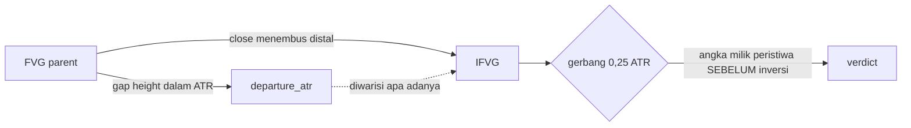

# Gerbang departure IFVG, diukur 5 September 2026

Sebuah asumsi yang dipakai kode selama satu commit, lalu diukur. Dokumen ini
mencatat angkanya, keputusannya, dan satu hal yang membalik cara gerbang ini
harus dibaca.

> [!IMPORTANT]
> Gerbang ini **tidak menyentuh satu order pun**. Layer `ifvg` dan `breaker`
> tidak `orderable` dan `tools/execute.py` tidak pernah memanggil keduanya.
> Yang dipengaruhi arah gerbang di sini adalah teks panel PLAN, teks ADVISOR,
> dan badge verdict di zone card. Sensusnya:
>
> | layer | orderable | gerbang | timeframe terukur |
> |---|---|---|---|
> | `supply_demand` | ya | floor 2,0 ATR | semua |
> | `fvg` | ya | ceiling 0,25 ATR | 30m |
> | `order_block` | ya | floor **2,5** ATR | semua, lihat QA-OB-GATE.md |
> | `ifvg` | **tidak** | ceiling 0,25 ATR | 15m sampai 4h, dokumen ini |
> | `breaker` | **tidak** | floor 2,5 ATR, ikut induknya | **belum pernah** |

## Kenapa diukur

Plafon 0,25 ATR lahir dari sweep FVG di commit `44196e2`. Sweep itu menyuntik
`detect_fvg` ke `DETECTORS` dan tidak menyentuh satu zona inversi pun, tetapi
commit yang sama memasukkan `ZoneKind.IFVG` ke `CEILING_KINDS`. Jadi selama satu
commit, IFVG dinilai dengan ambang yang tidak pernah diukur untuknya.

Ada alasan spesifik untuk meragukan analogi itu, bukan sekadar ketiadaan angka.
`app/detect/inversion.py:130` **membawa** `departure_atr` milik parent alih-alih
menghitungnya ulang, dengan alasannya sendiri: sebuah inversi dibuat oleh close
yang menembus level, dan close tidak punya kaki yang bisa diukur.



## Praregistrasi

Ditulis sebelum angkanya dilihat, ada di docstring `tools/gate_sweep.py`:

- [x] Sel, ambang dan geometri sama dengan sweep FVG supaya sebanding
- [x] **Kedua arah** diuji untuk setiap ambang, karena menguji satu arah saja
      adalah cara paling mudah menemukan gerbang yang tidak ada
- [x] Ambang `|t|` Bonferroni atas seluruh sel grid, 14 sel, jadi 2,914
- [x] Gerbang dinyatakan ada hanya bila lolos `|t|` **dan** walk-forward 8 dari 8
- [x] `MIN_GROUP` 30, karena `BACKLOG.md` bagian 3c mencatat satu t=+2,92 yang
      lolos Bonferroni di atas tujuh trade

## Populasi

12 sel, XAUUSD dan BTCUSD kali enam timeframe, diadili bar halus:
15m lewat 1m, 30m dan 1h lewat 5m, 4h lewat 15m, 1d lewat 1h, 1w lewat 4h.

> [!NOTE]
> 1m dan 5m **tidak ada** dan tidak bisa ditambahkan. Tidak ada deret lebih
> halus dari keduanya di provider ini, jadi urutan stop lawan target di dalam
> satu bar cuma bisa diasumsikan. Asumsi itu pernah memakan +0,2 R jadi
> -0,0153 R begitu resolusinya dihaluskan, jadi mengukur di 1m tanpa pengadil
> bukan versi kasar dari pengukuran ini, ia pengukuran yang berbeda.

Total n = 11.068. Sebaran `departure_atr` stabil di semua timeframe: median
0,30 sampai 0,41 dan 30 sampai 43 persen populasi di bawah 0,25. Jadi plafon
0,25 adalah gerbang yang hidup, bukan saklar mati.

## Hasil, gabungan

Baseline tanpa gerbang: n=11.068, exp_r **+0,2348**, t=+14,60.

| ambang | n | exp_r | win rate | PF | mean win | mean loss | Welch t | wf |
|---|---|---|---|---|---|---|---|---|
| 0,1 ceiling | 1.989 | +0,4018 | 0,3967 | 1,725 | 2,4106 | -0,9189 | +3,68 | 8/8 |
| **0,25 ceiling** | **4.484** | **+0,3450** | **0,4208** | **1,652** | 2,0781 | -0,9142 | **+5,18** | **8/8** |
| 0,5 ceiling | 7.300 | +0,2944 | 0,4460 | 1,596 | 1,7672 | -0,8915 | +6,09 | 8/8 |
| 1,0 ceiling | 9.683 | +0,2598 | 0,4662 | 1,559 | 1,5539 | -0,8702 | +6,88 | 8/8 |
| 1,5 ceiling | 10.436 | +0,2494 | 0,4738 | 1,552 | 1,4801 | -0,8589 | +7,62 | 8/8 |
| 3,0 ceiling | 10.964 | +0,2374 | 0,4777 | 1,535 | 1,4256 | -0,8491 | +4,97 | 8/8 |

Arah plafon menang di **setiap** ambang, dan lawan arah lantai selisihnya
signifikan sampai t=+7,62. Jadi keanggotaan IFVG di `CEILING_KINDS` sekarang
terukur.

## Yang membalik cara membacanya

Perhatikan kolom win rate. Ia **turun** secara monoton saat gerbang diperketat,
0,4777 di 3,0 menjadi 0,3967 di 0,1, sementara mean win naik dari 1,43 R ke
2,41 R dan mean loss hampir tidak bergerak di sekitar -0,9 R.

Itu tanda tangan mekanis, dan mekanismenya bisa dinamai. `app/plan.py:190`
menaruh target di zona lawan terdekat sementara stop duduk di luar distal, jadi
reward adalah jarak **absolut** ke zona lawan dan risk adalah tinggi box plus
buffer. Untuk FVG, `departure_atr` **adalah tinggi gap dalam ATR**
(`imbalance.py:359`, `size = (top - bottom) / scale`), bukan jarak kaki keluar.
Jadi plafon yang lebih ketat menyimpan gap yang lebih kecil, gap yang lebih
kecil memberi stop yang lebih rapat, dan R dinormalisasi terhadap risk.

> [!WARNING]
> Gerbang ini menyortir **kerapatan stop**, bukan kemungkinan berhasil. Harga
> justru lebih sering kena stop pada kohort yang dipertahankannya. exp_r dan
> PF tetap naik karena keduanya dinormalisasi risiko, dan itu membuatnya tetap
> berguna sebagai penyortir, tetapi siapa pun yang membaca plafon ini sebagai
> "setup yang lebih sering benar" membacanya terbalik.
>
> **Ini berlaku sama untuk gerbang FVG yang sudah dikirim**, karena field dan
> mekanismenya identik. Kalimat itu ditambahkan ke sisi FVG di commit yang
> sama dengan dokumen ini.

## Hasil, per timeframe

| tf | n | baseline exp_r | ambang terbaik | exp_r terbaik | verdict |
|---|---|---|---|---|---|
| 15m | 1.903 | +0,3037 | 1,0 ceiling | +0,3292 | lolos |
| 30m | 4.635 | +0,2703 | 0,1 ceiling | +0,5324 | lolos |
| 1h | 2.171 | +0,2209 | 1,5 ceiling | +0,2392 | lolos |
| 4h | 1.632 | +0,1505 | 1,0 ceiling | +0,1773 | lolos |
| 1d | 711 | +0,0679 | tidak ada | - | **tidak memisahkan** |
| 1w | 16 | -0,3657 | tidak ada | - | **tidak terukur, n=16** |

Di 1d tanda semua ambang positif tetapi `|t|` tertinggi cuma 2,909 di ambang
0,5, di bawah Bonferroni 2,914, dan walk-forward-nya 6 dari 8. Jadi 1d
konsisten arah tapi tidak signifikan. Di 1w populasinya 16 trade.

Baseline juga meluruh dengan timeframe, +0,3037 di 15m menjadi +0,0679 di 1d
dan negatif di 1w. Itu pola yang sama yang sudah tercatat untuk detector lain
di repo ini.

### Rincian per timeframe, plafon 0,25 dan 1,0

Plafon 0,25 adalah yang dikirim; 1,0 disertakan karena ia ambang yang paling
sering jadi optimum per timeframe, jadi pembaca bisa melihat pilihannya.

| tf | n | baseline | plafon | n kohort | exp_r | win rate | PF | Welch t | wf |
|---|---|---|---|---|---|---|---|---|---|
| 15m | 1.903 | +0,3037 | 0,25 | 766 | +0,3818 | 0,3995 | 1,677 | +1,34 | 8/8 |
| 15m | | | 1,0 | 1.691 | +0,3292 | 0,4589 | 1,656 | +2,92 | 8/8 |
| 30m | 4.635 | +0,2703 | 0,25 | 1.975 | +0,4150 | 0,4182 | 1,745 | **+4,30** | 8/8 |
| 30m | | | 1,0 | 4.088 | +0,2944 | 0,4628 | 1,587 | +3,99 | 8/8 |
| 1h | 2.171 | +0,2209 | 0,25 | 872 | +0,3045 | 0,4048 | 1,550 | +1,76 | 7/8 |
| 1h | | | 1,0 | 1.892 | +0,2449 | 0,4582 | 1,500 | +2,91 | 8/8 |
| 4h | 1.632 | +0,1505 | 0,25 | 623 | +0,2031 | 0,4462 | 1,449 | +1,26 | 8/8 |
| 4h | | | 1,0 | 1.381 | +0,1773 | 0,4989 | 1,487 | +3,39 | 8/8 |
| 1d | 711 | +0,0679 | 0,25 | 240 | +0,1951 | 0,5083 | 1,641 | +2,48 | 7/8 |
| 1d | | | 1,0 | 618 | +0,0849 | 0,4644 | 1,317 | +1,91 | 6/8 |
| 1w | 16 | -0,3657 | 0,25 | 8 | -0,4806 | 0,250 | 0,053 | tidak terukur | - |
| 1w | | | 1,0 | 13 | -0,3908 | 0,2308 | 0,059 | tidak terukur | - |

> [!IMPORTANT]
> **Di plafon 0,25 hanya 30m yang lolos Bonferroni sendirian**, t=+4,30 lawan
> ambang 2,914. Lima timeframe lain berada di bawahnya jika diuji terpisah.
> Signifikansi gabungan t=+5,18 karena itu datang dari 30m ditambah tanda yang
> konsisten di seluruh sel, bukan dari enam timeframe yang masing-masing kuat.
> Di plafon 1,0 sebarannya lebih merata, empat dari enam melewati 2,914, dan
> itulah kenapa optimum per timeframe cenderung berkumpul di sana.
>
> Ambang Bonferroni 2,914 dihitung untuk 14 sel grid gabungan. Menguji enam
> timeframe secara terpisah berarti 84 sel, jadi ambang yang benar-benar adil
> per sel lebih ketat lagi. Angka per timeframe di atas layak dibaca sebagai
> deskripsi, bukan sebagai enam pengujian yang masing-masing lulus.

Win rate juga naik dengan timeframe pada plafon yang sama (0,3995 di 15m
menjadi 0,5083 di 1d pada 0,25), sementara exp_r turun. Itu konsisten dengan
mekanisme kerapatan stop di bagian sebelumnya: bar yang lebih besar memberi
box yang lebih besar relatif terhadap buffer, jadi stopnya lebih longgar,
lebih jarang kena, dan tiap kemenangan berharga R lebih kecil.

## Kenapa ambangnya TETAP 0,25

Gabungan memberi exp_r tertinggi di 0,1, dan ambang itu **tidak** diambil. Tiga
alasan, semuanya bisa dicek:

1. **Total R.** 0,1 menangkap 1.989 x 0,4018 = 799 R. 0,25 menangkap
   4.484 x 0,3450 = 1.547 R, hampir dua kali lipat, walau ekspektasi per
   trade-nya lebih rendah.
2. **Optimum per timeframe berkeliaran**: 1,0 di 15m, 0,1 di 30m, 1,5 di 1h,
   1,0 di 4h. Sebuah ambang yang benar-benar struktural tidak berpindah
   sejauh itu. Mengambil argmax grid gabungan berarti memilih satu titik dari
   14 dan menyebutnya temuan, dan itu persis yang praregistrasi di atas
   ditulis untuk mencegah.
3. **Satu angka untuk dua kind.** FVG sudah memakai 0,25 dan diukur pada
   ambang itu. Dua ambang plafon yang berbeda berarti dua angka yang bisa
   melenceng, dan `layers.py:100-106` sudah mencatat bentuk kegagalan itu.

## Parity geometri lawan tiga script komunitas

Sebelum outcome-nya diukur, geometrinya diperiksa. `Zonelab IFVG` ditulis di
Pine sebagai cermin baris per baris `app/detect/inversion.py`, dijalankan pada
feed yang **sama** dengan pembandingnya di FX:XAUUSD 30m. Feed-nya harus sama:
Zonelab membaca terminal MT5 dan TradingView membaca FXCM, jadi perbandingan
lintas feed tidak bisa membedakan "aturan berbeda" dari "data berbeda".

Toleransi satu sen, dihitung di `tools/box_parity.py`, hanya di dalam jendela
harga kotak kita:

| pembanding | cocok persis | catatan |
|---|---|---|
| Inversion Fair Value Gaps (IFVG) [LuxAlgo] | **5/5, 100%** | definisi identik |
| Inversion Fair Value Gaps (IFVG) [ChartPrime] | 2/7, 28,6% | lima kotaknya lebih lebar, aturan gap berbeda |
| Inversion Fair Value Gaps [TradingFinder] | tidak bisa dibandingkan | menandai dengan garis dan label, bukan box |

Pine kita di 30m, sepanjang riwayat yang dimuat: 6.356 parent gap, 6.050
ter-inversi, 306 masih terbuka. Jadi **95,2 persen** FVG akhirnya ditembus
sebuah close, yang membuat IFVG hampir sama umum dengan induknya.

## Yang tidak ditanyakan di sini

Arah. `docs/CALIBRATION.md` bagian H8 sudah mengukur sentuhan pasca-inversi
sebagai klaim arah pada n=38.058 dan hasilnya negatif signifikan: kotak
menambah -0,179 / -0,165 / -0,274 dengan t sampai -4,22 di atas kontrol yang
hanya tahu gerak 20 bar terakhir. Dokumen ini menanyakan pertanyaan
penyortiran, bukan pertanyaan arah, dan keduanya bisa punya jawaban berbeda
tanpa saling bertentangan.

## Yang belum diukur, dan sengaja disebut

`breaker` (BRK) memakai lantai 2,0 ATR dan **tidak pernah diukur untuk itu**.
Ia mewarisi `departure_atr` dari order block induknya lewat mekanisme yang
persis sama dengan IFVG, jadi ia membawa bentuk keraguan yang sama. Tidak
diukur di sesi ini supaya lingkupnya tetap satu pertanyaan, dan dicatat di
sini supaya tidak dilupakan.

## IFVG diukur, dan dua cacat jendela ditemukan lebih dulu

Diminta 7 September 2026 sesudah OB. Yang ditemukan pertama bukan hasil IFVG-nya
melainkan dua cacat di harness, dan keduanya membatalkan angka yang sudah
dilaporkan. Ditulis lebih dulu karena itu.

### Cacat 1: jendela tidak mengikat mode inversi

Blok kelahiran digerbangi `in_win`, tapi blok yang memasang order untuk IFVG dan
BRK **tidak**. Jadi induk didaftarkan hanya di dalam jendela sementara inversinya
menembak kapan saja SESUDAHNYA - termasuk belasan tahun di luar `win_to`.

Terlihat begitu satu fold diminta: jendela 1990-1994 memberi n=968 sementara
sampel penuh 56 tahun cuma 1.311, dan satu fold 4,6 tahun tidak bisa memuat 74
persen trade.

**DIBATALKAN karena ini:** hold-out IFVG (1,001 lalu 1,101 bergerbang; 1,237 lalu
1,123 tanpa gerbang) dan hold-out BRK (1,412 lalu 0,861). Angka jendela-penuh
TIDAK terpengaruh, karena di sana `win_from`/`win_to` memuat seluruh deret.

Isolasi jendela BRK **selamat** dan sudah diperiksa: jendelanya berakhir 2038,
jadi inversinya memang di dalam. Diukur ulang, n=620 dan PF 1,128 identik.

### Cacat 2: jendelanya tidak ada di cfg echo, jadi tabel BASI tak terdeteksi

Ini yang lebih halus dan lebih berbahaya. Setiap knob lain ada di baris `cfg`
justru supaya run yang salah setelan bisa dikenali - jendelanya tertinggal.

Terbukti: `[1970, 2038]` terbaca n=1.311, lalu sub-jendelanya `[1970, 2000]`
memberi n=5.585. Sub-jendela tidak bisa lebih besar dari induknya, jadi bacaan
pertamanya basi - dan tanpa jendela di echo, tabel basi tidak bisa dibedakan dari
tabel yang sudah dihitung ulang.

Tabel sekarang punya baris `win`, dan baris lama `span` diganti nama jadi `data`
karena ia SELALU rentang deret dan bukan jendela aktif.

### Dan itu memperbaiki satu label yang salah di seluruh dokumen ini

`win_from` default 2000-01-01. Di XAUUSD harian TradingView memberi satu bar tua
di 1970, jadi baris `span` mencetak "1970-02-26" dan setiap tabel harian di sesi
ini dilabeli **"56 tahun"**. Jendelanya sebenarnya **2000-2026, 26 tahun**.
Angkanya sah; labelnya salah, dan itu berlaku untuk baris harian FVG (1,112), OB
(0,972) dan IFVG di bawah.

Data pra-2000 memang ada dan kaya - 1970-2000 memberi cand 9.259 dan n=5.585 -
tapi biayanya 0,1084 R per trade lawan 0,0134 di 2000-2026, delapan kali, karena
emas diperdagangkan di 35 sampai 400 dolar. Itu bukan instrumen yang sama dan
tidak dipakai.

### Hasil IFVG, jendela terverifikasi

| sel | jendela | n | win% | PF | placebo PF |
|---|---|---|---|---|---|
| **XAU 1d** | 2000-2026 | 547 | 57,59 | **1,067** | 0,859 |
| XAU 4h | 2013-2026 | 1.613 | 53,69 | 0,965 | 0,811 |
| XAU 1h | 2023-2026 | 1.724 | 47,33 | 0,781 | - |
| **BTC 1d** | 2011-2026 | 406 | 46,55 | **1,117** | 0,812 |
| BTC 4h | 2017-2026 | 1.466 | 50,07 | 0,910 | - |
| BTC 1h | 2024-2026 | 2.115 | 49,17 | 0,850 | - |

**Dua sel di atas satu, dan kontrolnya kalah di ketiga sel yang punya kontrol.**
Margin: +0,208 PF di XAU harian (+10,1 poin win rate), +0,154 di XAU 4 jam
(+8,5 poin), +0,305 di BTC harian (+7,8 poin).

**BTC harian adalah satu-satunya sel tempat kontrol IFVG kalah sementara kontrol
FVG dan OB MENANG.** Di sana FVG memberi 1,402 lawan placebo 1,468 dan OB 1,200
lawan 2,010 - keduanya kalah dari kotak yang digeser. IFVG 1,117 lawan 0,812.

> [!NOTE]
> Kontrol placebo untuk mode inversi lebih lemah daripada untuk FVG dan OB, dan
> itu harus dikatakan. Geseran 1 ATR memindahkan kotaknya SEBELUM gerbang, jadi
> untuk induk yang harus PECAH ia menggeser ambang pecahnya juga - bukan cuma
> harga limitnya. Jadi lengan geser IFVG memakai peristiwa inversi yang berbeda,
> bukan kotak yang sama di harga yang salah. n-nya tetap cocok (400 lawan 406 di
> BTC harian), tapi mekanismenya bukan satu perubahan melainkan dua.

### Plafonnya disapu, dan gerbangnya MERUGIKAN di harian

XAUUSD harian, 2000-2026:

| plafon | n | win% | PF |
|---|---|---|---|
| 0,1 | 248 | 56,05 | 1,089 |
| 0,25 (ter-ship) | 547 | 57,59 | 1,067 |
| 0,5 | 900 | 57,44 | 1,067 |
| **mati** | 1.311 | 59,34 | **1,158** |

Dan di sel lain, plafon mati lawan 0,25:

| sel | plafon 0,25 | plafon mati |
|---|---|---|
| XAU 1d | 1,067 | **1,158** |
| XAU 4h | **0,965** | 0,916 |
| BTC 1d | 1,117 | **1,190** (placebo 0,994) |

Dua dari tiga bilang gerbang-mati lebih baik - **kebalikan dari FVG**, tempat dua
dari tiga bilang gerbangnya membayar.

### Hold-out yang benar, dan gerbang-mati bertahan

XAUUSD harian, jendela 2000-2026 dibelah di 2013, jendela DIVERIFIKASI di baris
`win` tiap run:

| lengan | IS 2000-2013 | OOS 2013-2026 | n OOS |
|---|---|---|---|
| plafon 0,25 | 1,001 (n=266) | 1,103 | 268 |
| **plafon mati** | **1,165** (n=625) | **1,034** | **656** |

Pilih di paruh pertama dan yang menang gerbang-mati (1,165 lawan 1,001), lalu
luar-sampelnya 1,034 di 2,4 kali sampel. **Kedua lengan di atas satu luar
sampel** - satu-satunya konfigurasi di sesi ini yang bisa dikatakan begitu.

### Putusan IFVG

Ia detektor terkuat dari empat di harness ini, dan itu bukan yang diperkirakan:

- **dua sel di atas satu** (XAU 1d 1,067, BTC 1d 1,117), sementara FVG punya satu
  dan OB serta BRK nol
- **kontrolnya kalah di ketiga sel yang diuji**, dengan margin terbesar +0,305
- **hold-out tidak roboh** - kedua lengan di atas satu luar sampel
- dan ia satu-satunya yang **selamat dari perangkap drift BTC harian**

Yang menahannya: gerbangnya sendiri merugikan di harian, jadi konfigurasi terbaik
bukan yang ter-ship. Dan `DEPARTURE_GATE_ATR_CEILING` SATU konstanta untuk FVG
dan IFVG - `docs/QA-IFVG-GATE.md` menyebut itu sebagai alasan ketiga
mempertahankan 0,25 - jadi memberi IFVG plafon sendiri berarti memisahkan dua
angka yang selama ini sengaja disatukan. Itu keputusan yang belum diambil.

`ifvg.orderable` tetap mati. Tapi ia satu-satunya dari empat yang alasan
matinya sekarang "aturan 8 dari 8 belum diuji", bukan "tidak ada edge".

### Yang belum untuk IFVG

- **Stabilitas delapan periode** di XAU harian. Sekarang bisa dijalankan dengan
  benar karena jendelanya sudah mengikat, dan itu aturan yang menggerbangi
  `orderable`.
- **30 menit**, satu-satunya sel positif IFVG di rig produksi (1,081). Chart mati.
- **Plafon sendiri lawan plafon bersama**: keputusan desain, bukan pengukuran.

## Autodrawing IFVG, diperiksa 7 September 2026

### Pipanya hidup

`/api/draw` XAUUSD harian, 1.500 bar: **283 zona IFVG, 98 lolos gerbang**,
`gate_measured` benar untuk 283 dari 283, dan **`inverted_at` terisi untuk 283
dari 283** - setiap zona di layer ini memang hasil inversi, bukan sebagian.
Lifecycle terisi (9 fresh, 5 tested, 20 mitigated, 249 broken).

### Masalah legibilitas FVG BERLAKU di sini, dan terukur

Gerbang IFVG plafon - sama dengan FVG - jadi kohort yang lolos adalah kotak
terkecil. Diukur di 283 zona XAUUSD harian:

| kohort | tinggi USD |
|---|---|
| LOLOS gerbang | median **3,18**, maksimum 21,94 |
| gagal gerbang | median **17,49**, minimum 4,88 |

**Yang lolos 5,5 kali lebih kecil di median.** Terlihat langsung di jendela
audit: dua zona yang GAGAL (86 dan 63 USD) memajang caption penuh
`IFVG ○ flipped`, sementara satu zona yang LOLOS (20,6 USD, 11,8 CSS px)
kehilangan namanya dan cuma memajang titik. Sama seperti FVG, dan berbeda dari
OB yang gerbangnya lantai sehingga tidak punya bias itu.

### Geometrinya akurat di tempat yang bisa diukur, tapi harness piksel MERAH

`e2e/pixel-truth.mjs` diarahkan ke `ifvg`, 10 zona:

| pemeriksaan | hasil |
|---|---|
| zona ditemukan di canvas | 10 dari 10 |
| tepi ATAS di tempat skala harga menaruhnya | terburuk **0,5px** |
| tepi BAWAH di tempat skala harga menaruhnya | terburuk **0,4px** |
| **cukup tepi terbaca untuk diukur** | **GAGAL: atas 4 dari 7, bawah 5 dari 7** |

6 dari 7 lolos. Ambangnya menuntut 80 persen tepi atas terbaca dan IFVG memberi
57 persen.

**Itu merah pertama di harness piksel sepanjang sesi ini, dan ia TIDAK
dilonggarkan.** Bacaannya: tepi yang DITEMUKAN akurat sampai setengah piksel,
jadi yang gagal bukan geometrinya melainkan keterbacaannya - kotak IFVG
berdesakan. Sebabnya struktural: setiap kotak terbalik duduk tepat di tempat
induknya baru pecah, dan induk berkerumun, jadi tepi-tepinya saling menimbun.
Auditor visual melihat hal yang sama tanpa diberi tahu: "this stacks the outer
border, the inner inverted border, and the proximal rule of both boxes into a
narrow vertical span".

`pixel-truth` sudah punya dua pengecualian khusus untuk layer ini - satu untuk
stroke dalam, satu untuk tepi kiri ("an inverted box starts ON the candle that
broke its parent") - jadi kerumunan ini yang ketiga dan yang pertama tidak
tertutup.

### Dua cacat legenda lagi, keduanya membuat auditor melapor palsu

**Stroke dalam tidak dinyatakan.** Setiap zona dengan `inverted_at` digambar
dengan border KEDUA beberapa piksel di dalam yang pertama - kotak di dalam
kotak, satu-satunya isyarat yang selamat di kotak tiga piksel. Auditor
melihatnya dan melaporkannya sebagai "an extra rectangle the list does not
account for" - benar tentang legendanya, bukan tentang gambarnya. Untuk `fvg`
dan `order_block` ini tidak pernah muncul karena tak satu pun zonanya terbalik;
untuk `ifvg` dan `breaker` SETIAP kotak begitu.

**Penempatan caption tidak dinyatakan.** Plate-nya didorong ke KIRI supaya muat
di pane, bukan teksnya yang dipotong - pilihan yang disengaja karena caption
terpotong terbaca seperti salah tulis. Konsekuensinya di kotak yang tepi
kanannya di ujung pane, plate bisa duduk di kiri border kotaknya sendiri, di
atas kotak tetangga. Auditor menyebutnya risiko salah atribusi, dan itu adil.

Sesudah keduanya masuk legenda, auditnya bersih di sisi geometri: "three
rectangles are drawn; no extra or missing boxes" dan "both supply boxes show the
inner second border, as expected for IFVG zones".

### Yang tersisa di sisi gambar

- **Kerumunan tepi**, yang membuat `pixel-truth` merah. Ini yang paling layak
  dikerjakan dan ia bukan cacat satu baris: ia konsekuensi dari zona terbalik
  yang berdesakan di tempat induknya pecah.
- **Dua caption identik.** Dua zona supply sama-sama `IFVG ○ flipped` dengan
  titik kosong yang sama, jadi dari gambar saja tidak bisa dibedakan mana yang
  mana - dan salah satunya tergeser ke wilayah yang lain.
- **Lifecycle tidak terbaca dari opacity border.** Keluhan yang sama untuk
  keempat kalinya di sesi ini. Terukur 1,33 sampai 1,82 banding satu antar state
  bersebelahan, jadi sinyalnya ada dan di bawah ambang mata. Keputusan desain.

### Dan satu hal yang ter-ship dan sekarang salah

`layers.py` memberi `ifvg` `measured_intervals=("15m", "30m", "1h", "4h")`.
`tools/execute.py` menurunkan `MEASURED_INTERVALS` dari situ, jadi baris itu
menyatakan timeframe mana yang punya pengukuran.

Pengukuran hari ini membalik dua ujungnya: **1 jam ada di daftar dan memberi
0,781**, sementara **harian TIDAK ada di daftar dan memberi 1,067** - sel terbaik
IFVG. Daftar itu diisi 5 September dari pengukuran pra-perbaikan lifecycle, dan
ia sekarang salah di kedua arah. Tidak diubah di sini karena `ifvg.orderable`
mati sehingga baris itu tidak menggerbangi order apa pun, tapi ia tetap salah dan
akan menggerbangi begitu layer ini dinyalakan.

## Cara mengulang

```bash
cd backend && PYTHONPATH=. .venv/Scripts/python.exe -m tools.gate_sweep --detector ifvg
```

Tool-nya dinamai `gate_sweep` sejak 6 September 2026, saat order block
diukur di rig yang sama: sebuah modul bernama `ifvg_gate` yang mengukur
order block adalah drift yang persis project ini hindari. Baris hasil
resolusi bar halus di-cache per detector di `docs/ifvg_rows_cache.json`,
jadi run kedua menjawab dalam hitungan detik. Hapus file itu untuk mengukur
ulang dari nol.

---

Copyright 2026 PT Surya Inovasi Prioritas (SURIOTA).
