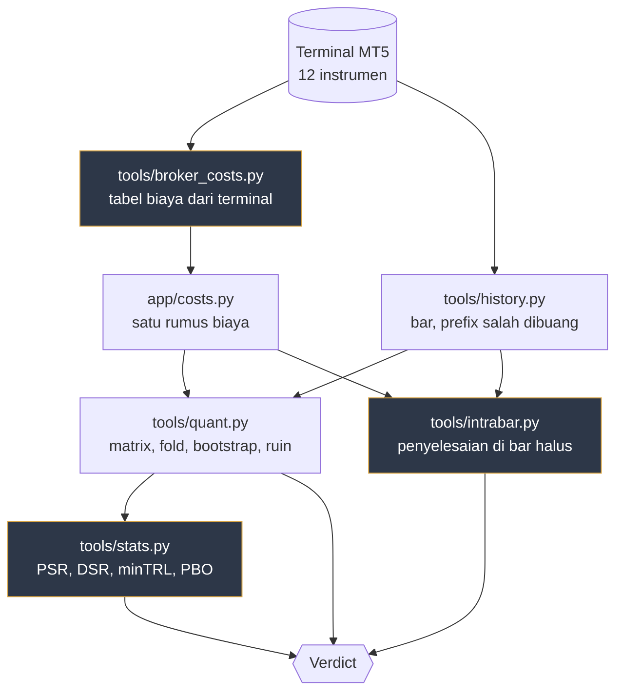
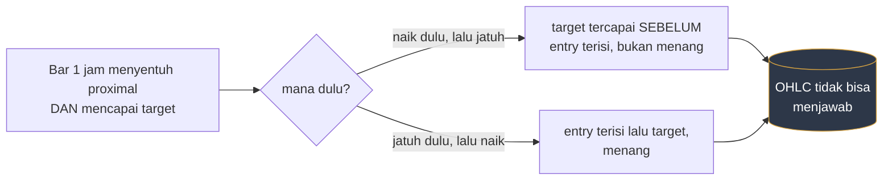

# QA kuantitatif Zonelab, 22 Agustus 2026

Dokumen ini melaporkan satu program pengukuran: backtest lintas instrumen,
walk-forward, statistik yang menghakimi, forecast bootstrap, dan deep dive per
trade. Semua angka di bawah berasal dari command yang benar-benar dijalankan di
mesin ini terhadap terminal MetaTrader 5 akun demo 434083797.

> [!CAUTION]
> **Temuan utamanya membatalkan angka utama project ini.** Ekspektasi +0,198 R
> dan +0,221 R yang dikutip di `CALIBRATION.md` dan `WALKFORWARD-MT5.md` bertumpu
> pada satu asumsi yang tidak bisa dibuktikan dari bar 1 jam: bahwa target yang
> tersentuh **di bar entry sendiri** sudah tersentuh setelah entry terisi.
> Diadili dengan bar 5 menit dan 15 menit pada **3.928 trade di 18 sel**,
> ekspektasi sebenarnya **-0,0153 R dengan CI95 [-0,043, +0,012] dan t = -1,11**.
> Tidak bisa dibedakan dari nol.
>
> Yang **tidak** batal, dan justru menguat dengan cakupan yang lebih lebar:
> gerbang departure memisahkan **+0,1105 R dengan Welch t = +7,19** pada 14.813
> trade, positif di 17 dari 18 sel. Gambarnya menunjukkan di mana harga kurang
> buruk. Ia belum menunjukkan di mana harga menguntungkan.

## Daftar isi

- [1. Apa yang diukur dan dengan apa](#1-apa-yang-diukur-dan-dengan-apa)
- [2. Inventaris data, dan tiga hal yang salah di dalamnya](#2-inventaris-data-dan-tiga-hal-yang-salah-di-dalamnya)
- [3. Tabel biaya yang membalik seluruh kesimpulan](#3-tabel-biaya-yang-membalik-seluruh-kesimpulan)
- [4. Matrix backtest, 24 sel](#4-matrix-backtest-24-sel)
- [5. Biaya terhadap risiko, dan gerbang yang lahir darinya](#5-biaya-terhadap-risiko-dan-gerbang-yang-lahir-darinya)
- [6. Urutan di dalam bar, temuan terbesar](#6-urutan-di-dalam-bar-temuan-terbesar)
- [7. Statistik yang menghakimi](#7-statistik-yang-menghakimi)
- [8. Forecast, drawdown, dan sizing](#8-forecast-drawdown-dan-sizing)
- [9. Deep dive per trade](#9-deep-dive-per-trade)
- [10. Verdict: perbaiki, setel, jangan](#10-verdict-perbaiki-setel-jangan)
- [11. Apa yang masih belum diukur](#11-apa-yang-masih-belum-diukur)

## 1. Apa yang diukur dan dengan apa

Empat file baru. `tools/stats.py` diuji terhadap contoh numerik yang diterbitkan
di paper aslinya, bukan terhadap dirinya sendiri: PSR 0,781821, E[max SR] 3,2551
pada 1000 percobaan, DSR 0,527762, minTRL 1112,98 observasi. Kalau salah satu
formula itu keliru, `tests/test_stats.py` gagal.

## 2. Inventaris data, dan tiga hal yang salah di dalamnya

| Instrumen | 1 jam | bersih | mulai bersih | 4 jam | bersih |
|---|---|---|---|---|---|
| XAUUSD | 35.199 | 33.861 | 2020-12-03 | 10.558 | 9.221 |
| XAGUSD | 35.191 | 33.853 | 2020-12-03 | 10.558 | 9.221 |
| XPTUSD | 14.936 | 14.936 | 2024-02-04 | 4.046 | 4.046 |
| EURUSD, GBPUSD, USDJPY, GBPJPY, AUDUSD, USDCAD | 36.765 | 35.413 | 2020-12-18 | 10.566 | 9.214 |
| BTCUSD | 48.297 | 47.584 | 2021-03-18 | 12.610 | 11.898 |
| US30 | 33.645 | 33.316 | 2020-11-19 | 9.478 | 9.149 |
| USOIL | 57.597 | 57.597 | 2017-01-03 | 15.544 | 15.544 |

Tiga hal yang salah, semuanya sudah diperbaiki:

1. **"50.000 bar" di dokumen lama adalah ukuran request, bukan ukuran data.**
   XAUUSD 1 jam hanya punya 35.199 bar di terminal ini. Setiap dokumen yang
   menulis "50.000 bar" sebenarnya mengukur 35.199, dan setelah prefix dibuang,
   33.861.
2. **Prefix yang spacing-nya salah ikut dihitung.** 1.338 bar pertama XAUUSD 1
   jam (3,8%) dan 1.337 dari 10.558 bar 4 jam (12,7%) berjarak SEHARI sambil
   berlabel 1h dan 4h. `costed.py` mencetak WARNING dan tetap menghitungnya;
   detektor membaca bar berurutan sebagai berdampingan, jadi setiap zona di
   rentang itu dihitung dengan step yang salah. `tools/quant.py` membuangnya.
3. **Batas 100.000 adalah batas keras terminal.** `copy_rates_from_pos` dengan
   count 99.999 berhasil, 100.000 menjawab `Invalid params`, dan pesan yang
   muncul di provider berbunyi "mt5 returned no bars" yang menyesatkan.

## 3. Tabel biaya yang membalik seluruh kesimpulan

Sampai hari ini hanya **XAUUSD** punya baris biaya. Sebelas instrumen lain jatuh
ke `_default`, yaitu jadwal fee spot Binance: 20bp komisi plus 2bp slippage.
Dibebankan ke EURUSD, itu 22bp round turn untuk pair yang membayar sekitar 1,1bp.

Akibatnya bukan pergeseran kecil:

| Sel | dengan `_default` Binance | dengan biaya terukur |
|---|---|---|
| EURUSD 1h | -0,422 R, t = -28,87 | +0,172 R, t = +5,85 |
| USDCAD 1h | -0,463 R, t = -37,07 | +0,156 R, t = +5,61 |
| GBPUSD 1h | -0,386 R, t = -27,44 | +0,221 R, t = +7,88 |
| Sel positif | 8 dari 24 | 22 dari 24 |

Run pertama menyimpulkan "aturan ini gagal di FX". Yang gagal adalah tabelnya.
`row_for` sudah ada di `app/costs.py` justru untuk membuat fallback itu
kelihatan, dan harness barunya tidak mencetaknya.

`tools/broker_costs.py` menurunkan tabelnya dari terminal dan bisa dijalankan
ulang. Yang **diukur**: contract size, point, harga, currency_profit, swap dalam
point, dan spread median dari 20.000 bar. Yang **diasumsikan**: 7 USD per lot
round turn, dan itu terukur di gold dari deal nyata, 0,07 USD pada 0,01 lot di
harga 4604,221 yaitu 0,152bp. Tabel lama menulis 0,25bp; akun ini memungut 3,50
per sisi, bukan 5,50.

> [!NOTE]
> Validasinya bukan formalitas. `--check` menghitung komisi gold dari terminal
> dan menolak mencetak tabel kalau hasilnya tidak cocok 0,152bp dari deal nyata.
> Aritmetika notional gampang salah: memakai `margin * leverage` memberi USOIL
> 4.318 USD per lot padahal 1000 barel kali 86 USD adalah 86.354, dan memakai
> `currency_base` memberi GBPJPY 21,7 juta padahal 136.461.

## 4. Matrix backtest, 24 sel

`python -m tools.quant --matrix`, biaya terukur, exit flat di rollover, prefix
salah dibuang, target di bar entry MASIH diizinkan (lihat bagian 6).

| Sel | n | exp R | t | win | fold+ | cost_r |
|---|---|---|---|---|---|---|
| BTCUSD 1h | 1252 | +0,241 | +8,41 | 67,3% | 8/8 | 0,055 |
| XAUUSD 1h | 899 | +0,233 | +6,75 | 64,4% | 8/8 | 0,069 |
| EURUSD 4h | 263 | +0,235 | +5,19 | 70,3% | 8/8 | 0,114 |
| XAUUSD 4h | 270 | +0,225 | +4,10 | 63,3% | 8/8 | 0,105 |
| BTCUSD 4h | 408 | +0,225 | +5,63 | 71,8% | 8/8 | 0,060 |
| GBPUSD 1h | 1039 | +0,221 | +7,88 | 67,4% | 8/8 | 0,080 |
| AUDUSD 4h | 305 | +0,221 | +4,84 | 66,9% | 8/8 | 0,080 |
| US30 1h | 865 | +0,205 | +5,68 | 60,5% | 8/8 | 0,128 |
| AUDUSD 1h | 1111 | +0,203 | +7,00 | 64,3% | 8/8 | 0,099 |
| XAGUSD 1h | 893 | +0,198 | +6,10 | 64,6% | 8/8 | 0,118 |
| XPTUSD 4h | 88 | +0,198 | +3,11 | 75,0% | 6/8 | 0,189 |
| US30 4h | 282 | +0,190 | +3,90 | 58,9% | 8/8 | 0,141 |
| EURUSD 1h | 1019 | +0,172 | +5,85 | 62,7% | 7/8 | 0,120 |
| USDJPY 1h | 958 | +0,165 | +5,44 | 61,6% | 8/8 | 0,135 |
| GBPUSD 4h | 273 | +0,158 | +3,73 | 67,4% | 8/8 | 0,067 |
| XAGUSD 4h | 286 | +0,156 | +3,56 | 66,4% | 8/8 | 0,099 |
| USDCAD 1h | 1029 | +0,156 | +5,61 | 63,8% | 7/8 | 0,139 |
| USDCAD 4h | 263 | +0,141 | +3,34 | 65,0% | 7/8 | 0,138 |
| GBPJPY 1h | 1008 | +0,114 | +4,42 | 61,0% | 6/8 | 0,154 |
| USDJPY 4h | 288 | +0,088 | +1,72 | 54,9% | 6/8 | 0,167 |
| GBPJPY 4h | 287 | +0,050 | +1,20 | 54,7% | 5/8 | 0,182 |
| USOIL 1h | 1833 | +0,050 | +2,36 | 52,2% | 7/8 | 0,188 |
| USOIL 4h | 485 | -0,005 | -0,15 | 43,7% | 4/8 | 0,249 |
| XPTUSD 1h | 431 | -0,013 | -0,41 | 65,7% | 4/8 | 0,273 |

**22 dari 24 positif, 20 dengan t > 2, sign test dua sisi p = 3,6e-05.** 15.835
trade, ekspektasi berbobot n +0,1598 R. Per kelas aset: FX 12/12 positif, metal
5/6, crypto 2/2, index 2/2, energy 1/2. Per timeframe: 1 jam 11/12, 4 jam 11/12.

Dua sel yang negatif adalah dua `cost_r` tertinggi, dan itu bukan kebetulan.

### Replikasi 15 menit, timeframe yang tidak dipakai menurunkan apa pun

12 instrumen di 15 menit, biaya terukur, arm yang sama. **11 dari 12 positif, 11
dengan t > 2, rata-rata +0,105 R.** Satu yang negatif adalah XPTUSD pada -0,095
R, dan `cost_r`-nya 0,441, tertinggi di seluruh 36 sel yang pernah diukur.

| Sel | n | exp R | t | fold+ | cost_r |
|---|---|---|---|---|---|
| XAUUSD 15m | 2851 | +0,179 | +8,53 | 8/8 | 0,074 |
| BTCUSD 15m | 2519 | +0,217 | +9,58 | 8/8 | 0,077 |
| GBPUSD 15m | 2849 | +0,155 | +7,79 | 8/8 | 0,116 |
| USDJPY 15m | 2755 | +0,132 | +6,44 | 8/8 | 0,142 |
| USOIL 15m | 3105 | +0,128 | +6,76 | 8/8 | 0,156 |
| GBPJPY 15m | 2625 | +0,119 | +5,71 | 8/8 | 0,147 |
| AUDUSD 15m | 2944 | +0,095 | +4,95 | 8/8 | 0,133 |
| XAGUSD 15m | 2848 | +0,092 | +4,79 | 7/8 | 0,194 |
| EURUSD 15m | 2805 | +0,091 | +4,76 | 8/8 | 0,149 |
| US30 15m | 2670 | +0,078 | +3,58 | 7/8 | 0,180 |
| USDCAD 15m | 3066 | +0,038 | +2,21 | 5/8 | 0,199 |
| XPTUSD 15m | 1781 | -0,068 | -4,02 | 2/8 | 0,441 |

Ini holdout yang sah untuk hubungan biaya di bagian 5: regresinya diturunkan dari
sel 1 jam dan 4 jam, dan tanda di 15 menit diramalkan benar oleh satu-satunya sel
yang `cost_r`-nya melewati ambang. Ia BUKAN holdout untuk masalah urutan intrabar
di bagian 6, karena arm-nya sama.

## 5. Biaya terhadap risiko, dan gerbang yang lahir darinya

Korelasi antara biaya-terhadap-risiko dan ekspektasi, lintas 24 sel:

| | dengan `_default` Binance | dengan biaya terukur |
|---|---|---|
| korelasi | -0,9879 | -0,8591 |
| regresi | exp R = +0,3348 - 1,3441 cost_r | exp R = +0,3104 - 1,1507 cost_r |
| R kuadrat | 0,976 | 0,738 |
| silang nol | cost_r = 0,2491 | cost_r = 0,2698 |

Mekanismenya terlihat langsung, bukan disimpulkan dari korelasi. Membandingkan
arm tanpa biaya dengan arm berbiaya pada tabel yang rusak:

| Sel | tanpa biaya | dengan biaya | selisih | cost_r | rasio | win tanpa | win dengan |
|---|---|---|---|---|---|---|---|
| XAUUSD 1h | +0,362 | +0,231 | -0,131 | 0,071 | 1,85 | 70,6% | 64,4% |
| USOIL 1h | +0,309 | -0,003 | -0,312 | 0,233 | 1,34 | 67,0% | 52,5% |
| GBPUSD 1h | +0,326 | -0,386 | -0,711 | 0,535 | 1,33 | 71,4% | 14,4% |
| USDCAD 1h | +0,345 | -0,463 | -0,808 | 0,593 | 1,36 | 71,2% | 9,9% |

Edge kotornya **sama di semua instrumen**, +0,31 sampai +0,41 R dengan win rate
67% sampai 80%. Yang berbeda hanya biayanya. Dan selisihnya kira-kira -1,34 kali
`cost_r`, cocok dengan kemiringan regresi yang diturunkan dari arah yang berbeda.
Kemiringan **di bawah** -1 punya sebab: biaya dibebankan ke fill, jadi ia
menggeser entry mendekat ke stop dan mengubah calon pemenang menjadi stop-out.
Win rate yang jatuh dari 71,2% ke 9,9% adalah mekanisme itu, bukan gejalanya.

Karena itu `COST_TO_RISK_MAX = 0.25` dipasang di `app/costs.py` dan menggerbangi
jalur order. Ambangnya diturunkan dari aritmetikanya sendiri, bukan dipilih
karena rapi: edge kotor +0,31 dibagi kemiringan 1,15 memberi 0,27.

> [!IMPORTANT]
> Dengan tabel biaya NYATA, gerbang ini menolak 1 sampai 4 zona per deret, bukan
> seluruh FX. Klaim sementara bahwa EURUSD menghasilkan nol kandidat hanya benar
> di bawah tabel yang rusak.

## 6. Urutan di dalam bar, temuan terbesar

Sebuah backtest yang membaca OHLC 1 jam tidak bisa tahu urutan kejadian di dalam
satu bar.

`costed.py` memilih D secara implisit. Diukur pada 6.569 trade di 8 sel:

| | selesai di bar entry |
|---|---|
| PEMENANG | 62% sampai 68% |
| YANG KALAH | 20% sampai 40% |

Asimetri sebesar itu bukan sifat pasar. Terminal ini punya bar 5 menit (514 hari
untuk gold) dan 15 menit (1.544 hari), jadi pertanyaannya bisa diadili, bukan
diperdebatkan. `tools/intrabar.py` mendeteksi zona di timeframe aslinya lalu
menyelesaikan trade di bar halus: entry diisi di bar halus pertama yang menyentuh
proximal, stop atau target diputuskan oleh bar halus mana yang lebih dulu.

| Sel | izinkan bar entry | tunda bar entry | **resolusi halus** | n |
|---|---|---|---|---|
| XAUUSD 1h | +0,321 | +0,076 | **+0,156** (t=2,12) | 224 |
| GBPUSD 1h | +0,237 | +0,015 | **+0,122** (t=2,05) | 261 |
| BTCUSD 1h | +0,185 | -0,037 | **-0,003** | 214 |
| EURUSD 4h | +0,255 | -0,092 | **-0,007** | 192 |
| XAUUSD 4h | +0,224 | -0,149 | **-0,015** | 186 |
| AUDUSD 1h | +0,197 | -0,092 | **-0,044** | 258 |
| EURUSD 1h | +0,105 | -0,153 | **-0,073** | 234 |

**Gabungan 1.569 trade: +0,0214 R, SE 0,0232, t = +0,92, CI95 [-0,024, +0,067].**

### Diperlebar ke 18 sel, dan angkanya mengeras

Tujuh sel di atas adalah yang pertama diresolusi. Diperlebar ke seluruh 12
instrumen di 1 jam plus 6 sel 4 jam, semuanya di bar halus:

| Sel | n | exp R | t | Sel | n | exp R | t |
|---|---|---|---|---|---|---|---|
| XAUUSD 1h | 224 | +0,156 | +2,12 | USDCAD 1h | 240 | -0,116 | -2,09 |
| GBPUSD 1h | 261 | +0,122 | +2,05 | BTCUSD 1h | 214 | -0,003 | -0,05 |
| XAGUSD 1h | 228 | +0,092 | +1,31 | US30 1h | 199 | -0,032 | -0,40 |
| AUDUSD 4h | 202 | +0,027 | +0,58 | AUDUSD 1h | 258 | -0,044 | -0,77 |
| GBPUSD 4h | 190 | +0,001 | +0,01 | EURUSD 1h | 234 | -0,073 | -1,26 |
| BTCUSD 4h | 201 | -0,000 | -0,00 | USOIL 4h | 199 | -0,156 | -3,29 |
| GBPJPY 1h | 206 | -0,004 | -0,06 | USOIL 1h | 234 | -0,210 | -3,76 |
| EURUSD 4h | 192 | -0,007 | -0,15 | XPTUSD 1h | 236 | -0,014 | -0,33 |
| USDJPY 1h | 224 | -0,009 | -0,14 | XAUUSD 4h | 186 | -0,015 | -0,26 |

**Gabungan 3.928 trade: -0,0153 R, SE 0,0139, t = -1,11, CI95 [-0,043, +0,012],
total -60,2 R.**

Titik estimasinya bergerak dari +0,0214 ke -0,0153 dan lebar CI-nya menyempit
dari 0,091 ke 0,054. Keduanya memuat nol. Ambang Bonferroni untuk 18 sel adalah
`|t| > 2,88`, dan satu-satunya sel yang mencapainya adalah USOIL, di kedua
timeframe, ke arah NEGATIF. Tidak ada sel yang positif secara signifikan.

Gerbangnya justru menguat di sampel yang lebih besar: atas -0,0153 (n=3.928),
bawah -0,1258 (n=10.885), selisih **+0,1105 R dengan Welch t = +7,19**, dan
tandanya positif di 17 dari 18 sel. Satu pengecualiannya USOIL 1 jam pada -0,047.

Ambang Bonferroni untuk 7 sel pada alpha 0,05 adalah `|t| > 2,69`. Tidak ada sel
yang mencapainya. Dua sel positif dengan t sekitar 2,1 adalah kira-kira yang
diberikan kebetulan dari tujuh percobaan.

### Kenapa implementasinya bisa dipercaya

Uji yang paling menentukan: trade yang di arm 1 jam TIDAK selesai di bar entry
tidak ambigu, jadi kedua resolusi harus sepakat di sana.

| Bucket | n | 1 jam | halus | tanda sama | identik dalam 0,01 R |
|---|---|---|---|---|---|
| selesai belakangan | 121 | +0,176 | +0,162 | 90,9% | 64,5% |
| selesai di bar entry | 103 | +0,491 | +0,150 | 81,6% | 76,7% |

Seluruh selisihnya duduk di bucket yang ambigu, persis seperti yang diramalkan.
Bucket yang tidak ambigu sepakat.

### Yang tidak batal

| Populasi, resolusi halus | n | exp R |
|---|---|---|
| lolos gerbang departure >= 2,0 ATR | 3.928 | -0,0153 |
| di bawah gerbang | 10.885 | -0,1258 |

**Selisih +0,1105 R, Welch t = +7,19, positif di 17 dari 18 sel.** Gerbangnya
memisahkan. Sisi baiknya break-even, dan pada sampel penuh sedikit di bawahnya.

## 7. Statistik yang menghakimi

Untuk XAUUSD 1 jam, arm izinkan-bar-entry, n=899:

| | nilai |
|---|---|
| Sharpe per trade | +0,2253 |
| trade per tahun | 157 pada 5,7 tahun |
| Sharpe tahunan naif | +2,798 |
| Sharpe tahunan koreksi Lo (2002) | +3,050 |
| minTRL pada 95% | 42 trade, punya 899 |
| PSR di atas nol | 1,0000 |
| Ljung-Box Q(5) | 4,92 lawan kritis 11,070, tidak ada ketergantungan |
| konkurensi | 2 dari 899 trade (0,2%), puncak 2 posisi |

Konkurensi 0,2% yang membuat annualisasi sqrt sah di sini, dan itu diukur bukan
diasumsikan. Kalau posisi tumpang tindih, tidak ada versi sqrt yang valid.

Deflated Sharpe, memakai `sigma_N` sampling di bawah H0 (0,1072):

| Percobaan | E[max SR] | DSR |
|---|---|---|
| 1 | 0,0000 | 1,0000 |
| 16 | 0,1930 | 0,8675 |
| 108 | 0,2742 | 0,0452 |

108 adalah hitungan literal percobaan project ini: 12 hipotesis arah yang gagal,
2 aturan exit, 1 gerbang, 83 grup pengkondisian, 10 klausa checklist. Percobaan
yang saling berkorelasi memberi `n_eff = rho + (1 - rho) m`, jadi angka
sebenarnya di antara 16 dan 108 dan tidak ada yang tahu rho-nya.

> [!WARNING]
> Memakai SD Sharpe **lintas sel** (0,0915) sebagai `sigma_N` adalah kesalahan
> yang menggoda. Sebaran itu memuat heterogenitas biaya yang nyata dan terukur,
> bukan tarikan noise. Di run dengan tabel biaya rusak, SD lintas sel 0,4100
> menaikkan ambang ke 0,74 dan membuat DSR nol untuk setiap sel termasuk yang
> jelas bekerja. Itu menjawab pertanyaan yang salah.

Dan pertanyaan DSR sendiri adalah pertanyaan SELEKSI: seberapa mungkin sel
terbaik dari banyak percobaan hanya menang undian. Klaim di bagian 4 bukan itu,
melainkan bahwa aturannya bekerja hampir di mana-mana, dan buktinya sign test
lintas sel p = 3,6e-05.

**PBO lewat CSCV tidak dijalankan pada aturan ini**, dan itu keputusan bukan
kelalaian. CSCV degenerate pada satu aturan tanpa parameter yang di-fit: rank
selalu 1 dari 1 dan logit selalu nol, jadi ia mengembalikan angka yang terlihat
seperti pengukuran dan tidak mengukur apa pun. `tools/stats.pbo` menolak N=1
dengan pesan yang menyebut alasannya, dan `tests/test_stats.py` menegakkan
penolakan itu.

## 8. Forecast, drawdown, dan sizing

Bootstrap 20.000 path pada XAUUSD 1 jam, tiga panjang blok untuk memeriksa
apakah kesimpulannya bergantung pada asumsi ketergantungan:

| Blok | total R p05 | p50 | p95 | maxDD p50 | p95 | p99 |
|---|---|---|---|---|---|---|
| 1 | +157,3 | +207,1 | +258,6 | 8,5 | 13,2 | 16,4 |
| 5 | +159,8 | +207,3 | +256,2 | 8,4 | 13,2 | 16,1 |
| 10 | +158,3 | +207,3 | +256,1 | 8,6 | 13,4 | 16,3 |

Ketiganya sepakat, jadi panjang blok tidak menentukan apa pun di sini.

**Max drawdown teramati 7,0 R, p95 bootstrap 13,4 R.** Yang teramati adalah satu
tarikan dari sebaran, dan ia tidak punya alasan menjadi yang terburuk. Sizing
harus memakai p95, bukan yang teramati.

Risk of ruin, kehilangan 50% equity dalam 500 trade berikutnya, fixed fractional:

| Risk per trade | P(ruin) kalau edge ada | P(ruin) kalau edge NOL |
|---|---|---|
| 0,5% | 0,00% | 0,00% |
| 1,0% | 0,00% | 0,24% |
| 2,0% | 0,00% | 16,20% |
| 3,0% | 0,00% | 40,97% |
| 5,0% | 0,07% | 70,69% |
| 10,0% | 3,71% | 93,83% |

Kolom kanan adalah deret R yang sama digeser ke mean nol: bentuk sebarannya utuh,
edge-nya hilang. **Bagian 6 menunjukkan kolom kanan adalah kolom yang berlaku.**
Order live yang dipasang 21 Agustus 2026 memakai risk 3%, yang di kolom itu
berarti 41% peluang kehilangan separuh akun dalam 500 trade.

Kelly penuh terhitung 0,40 (40% equity per trade) dan setengah Kelly 20%. Angka
itu benar untuk sebaran yang diestimasi dan tidak boleh dipakai: Kelly
mengasumsikan sebarannya diketahui persis, sementara ini diestimasi dari 899
trade dengan ekspektasi yang bagian 6 tunjukkan sekitar nol.

## 9. Deep dive per trade

### Exit rule, 8 sel dan 6.718 trade

| | exp R | t | max DD |
|---|---|---|---|
| flat di rollover | +0,2147 | +18,07 | lebih rendah di 8 dari 8 sel |
| hold sampai horizon | +0,2136 | +14,70 | |

Seri dalam ekspektasi, selisih +0,0011 R. Nilai aturan flat adalah **pengurangan
variansi**, bukan ekspektasi. Klaim lama bahwa flat memberi +0,221 lawan +0,198
benar untuk gold sendiri dan tidak bertahan sebagai klaim ekspektasi lintas sel.

### Excursion

| | XAUUSD 1h | EURUSD 1h | BTCUSD 4h |
|---|---|---|---|
| MAE pemenang, median | -0,226 R | -0,244 R | -0,268 R |
| pemenang yang pernah di bawah -0,9 R | 1,0% | 0,8% | 0,7% |
| MAE yang kalah, median | -1,035 R | -0,978 R | -1,027 R |
| MFE yang kalah, median | +0,747 R | +0,676 R | +0,866 R |
| yang kalah pernah di atas +1 R | 35,9% | 27,1% | 42,6% |

Dua bacaan yang bisa dikerjakan. Pemenang hampir tidak pernah mendekati stop,
jadi stop yang lebih rapat akan membunuh sedikit pemenang. Dan sepertiga sampai
empat persepuluh yang kalah pernah di atas +1 R sebelum berbalik, jadi partial
take atau stop ke breakeven bisa mengubah sebagian dari mereka.

Keduanya adalah kandidat, bukan temuan. Menguji banyak nilai di data yang sama
adalah cara tercepat menemukan yang palsu.

### Waktu isi dan waktu selesai, dari bar halus

Entry terisi setelah median 4 sampai 8 bar halus dari awal bar besar, jadi
asumsi "terisi di awal bar" salah arah. Hanya 34,8% trade gold 1 jam selesai
masih di dalam bar 1 jam yang sama.

## 10. Verdict: perbaiki, setel, jangan

### Sudah diperbaiki hari ini

| # | Apa | Buktinya |
|---|---|---|
| 1 | Sebelas baris biaya hilang, jatuh ke jadwal Binance | 8/24 sel positif jadi 22/24 |
| 2 | Komisi gold 0,25bp dikutip, 0,152bp terukur | deal nyata 0,07 USD pada 0,01 lot |
| 3 | Prefix spacing salah ikut dihitung | 3,8% bar 1 jam, 12,7% bar 4 jam |
| 4 | Max drawdown tidak menghitung jatuh dari modal awal | deret -1 -1 -1 +3 +3 menjawab 2,0 alih-alih 3,0 |
| 5 | Target di bar entry dianggap menang | default dibalik, +0,20 R jadi -0,06 R, kebenaran +0,02 R |
| 6 | Rumus biaya ada dua salinan | disatukan di `app/costs.cost_to_risk` |
| 7 | Gerbang biaya tidak ada | `COST_TO_RISK_MAX = 0.25` di jalur order |

### Setel

| Apa | Dari | Ke | Alasan berangka |
|---|---|---|---|
| Risk per trade | 3% | 1% | P(ruin) edge-nol 40,97% jadi 0,24% |
| Ambang biaya | tidak ada | cost_r <= 0,25 | silang nol regresi 0,2698 |
| Resolusi backtest | bar besar | bar halus kalau ada | bias +0,165 sampai +0,262 R per sel |

### Jangan

**Jangan aktifkan auto-trade dengan uang sungguhan.** Ekspektasi terukur di
resolusi jujur adalah +0,0214 R dengan CI95 yang memuat nol. Tidak ada satu sel
pun yang melewati ambang Bonferroni. Saklarnya sudah OFF dan harus tetap OFF
sampai ada aturan yang bertahan di resolusi halus.

**Jangan buang gerbang departure.** Ia satu-satunya hal yang memisahkan, +0,124 R
dengan t = +4,82 dan 7 dari 7 sel.

## 11. Apa yang masih belum diukur

1. **Entry yang lebih dalam.** Fine bar memperlihatkan entry terisi 4 sampai 8
   bar halus ke dalam bar besar. Limit yang lebih dalam di zona akan memberi
   harga lebih baik dengan biaya fill rate. Bisa diukur dengan data yang sama.
2. **Partial take di +1 R atau stop ke breakeven.** 35,9% yang kalah pernah di
   atas +1 R. Harus diuji sebagai satu aturan yang di-praregistrasi, bukan
   sebagai sapuan nilai.
3. **`HELD_CLEARED_GATE` dan `HELD_BELOW_GATE` di `app/plan.py`** masih angka
   dari arm yang melebihkan, dan eksekutor mencetaknya sebagai alasan setiap
   order. Perlu diukur ulang di resolusi halus.
4. **Replikasi 15 menit dengan biaya nyata** sedang berjalan saat dokumen ini
   ditulis, 7 dari 12 instrumen selesai, semuanya positif kecuali XPTUSD.
5. **Apakah `admin_bp` 4,545 berlaku di luar gold.** Kalau ya, EURUSD kena
   17,1bp per malam dan setiap angka FX di sini berubah tanda.
6. **Forward test.** Satu trade live sudah selesai, kena stop loss, -23,82 USD.
   n=1 tidak mengukur apa pun.

---

Copyright 2026 PT Surya Inovasi Prioritas (SURIOTA).
