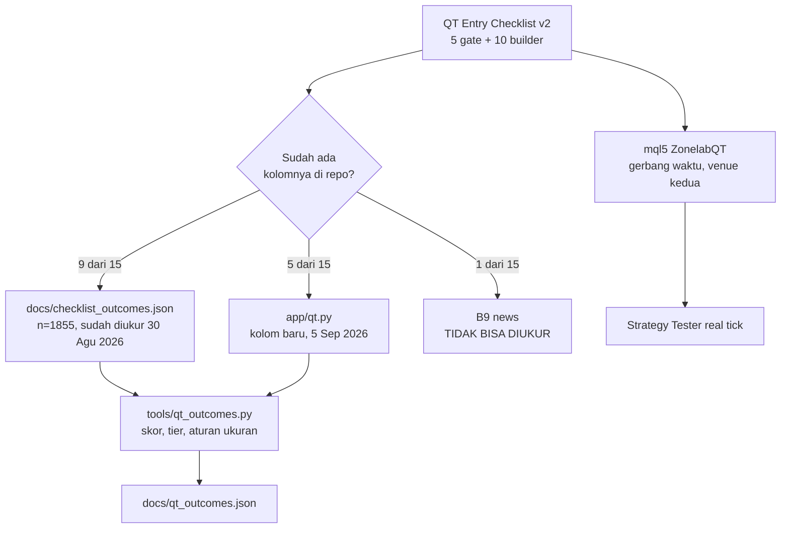

# Checklist Quarterly Theory, diukur

Dokumen ini menjawab satu pertanyaan: apakah QT Entry Checklist v2 bisa dipakai
Zonelab untuk memutuskan entry. Sumbernya
`Pictures/Bang Nas/QT-Auto-Scanner/qt-entry-checklist.html`, 120 KB, lima gate
wajib plus sepuluh builder berbobot plus tabel ukuran posisi.

> [!IMPORTANT]
> Setiap angka di halaman ini datang dari perintah yang benar-benar dijalankan,
> dan perintahnya dicantumkan. Yang belum diukur ditulis sebagai belum diukur,
> bukan diberi kata sifat.

## Peta bacaan



## 1. Apa yang sudah ada sebelum pekerjaan ini

Sembilan dari lima belas item QT sudah punya klausa di `app/ict.py` dan sudah
diukur pada 30 Agustus 2026, `docs/checklist_outcomes.json`: delapan instrumen,
timeframe 1 jam, resolusi intrabar 5 menit, biaya `exness_raw`, flat di
rollover, n=1855, 8 fold walk-forward.

Hasilnya, dan ini titik berangkat seluruh dokumen ini:

| Yang diuji | Hasil |
|---|---|
| Skor agregat `met` memisahkan hasil | `separates: false` |
| Monoton naik antar level skor | `false`, 5 dari 7 pasangan |
| Spearman rho skor lawan R | -0,0268 (t = -1,15 lawan kritis 3,267) |
| Split median | +0,0458 R (t = +0,84) |
| Walk-forward | 5 dari 8 fold positif |
| Klausa yang memisahkan | **satu**, `dfr_side`, dengan tanda TERBALIK |

`dfr_side` adalah builder B5 di checklist QT. Terpenuhi memberi -0,0660 R
(n=1141, 8 dari 8 instrumen setanda); tidak terpenuhi memberi +0,1481 R
(n=341). Jadi satu dari dua belas poin builder sudah diketahui menunjuk ke arah
yang salah sebelum skornya dijumlahkan.

## 2. Enam divergensi antara sumbernya dan repo ini

Ditemukan 5 September 2026 saat menyandingkan referensi QT dengan kode yang
sudah ada. Semuanya dibawa sebagai kolom terpisah, bukan diselesaikan dengan
memilih pemenang, karena memilih sebelum mengukur adalah cara sebuah checklist
berubah jadi keyakinan.

### 2.1 Batas kuarter berbeda 90 menit

Ini yang terbesar.

| Kuarter | Grid repo ini (`app/quarters.py`) | Grid sumbernya |
|---|---|---|
| Q1 Asia | 18:00 - 00:00 NY | 19:30 - 01:30 NY |
| Q2 London | 00:00 - 06:00 NY | 01:30 - 07:30 NY |
| Q3 NY AM | 06:00 - 12:00 NY | 07:30 - 13:30 NY |
| Q4 NY PM | 12:00 - 18:00 NY | 13:30 - 19:30 NY |

Keduanya beririsan 4,5 dari 6 jam. `app/sequence.py` sudah menulis selisih ini
di barisnya sendiri, jadi ia bukan bug di sisi mana pun: grid 18:00 adalah
konvensi lini ICT yang jadi dasar repo ini. Tapi artinya rantai kuarter yang
dibaca dari grid repo BUKAN rantai yang daftar sepuluh itu ditulis untuknya.

Konsekuensinya: kolom `qt_sequence` (grid repo) dan `qt_sequence_src` (grid
sumber) dihitung dua-duanya, dan sisi MQL5 memakai grid sumbernya supaya kedua
venue mengukur objek yang sama.

### 2.2 Judas: repo ini memberi arah yang BERLAWANAN dengan tabel sumbernya

`app/judas.py` menurunkan arah expansion dari bias London saja: London bullish
menghasilkan Template A dan expansion BUY.

Tabel empat template di sumbernya menurunkannya dari gerakan New York yang
teramati: London naik ditambah Judas yang menyapu BSL (naik) adalah Template A,
dan distribusinya TURUN. Di tabel itu kaki London hanya memberi label; arahnya
murni fungsi dari sapuan Judas, dan selalu kebalikannya.

Jadi keduanya memberi panggilan berlawanan setiap hari ketika Judas bergerak
searah London. Kolom `qt_judas_repo` membaca versi repo; `qt_judas_source`
membaca versi sumbernya.

### 2.3 Truth asset: dua metrik berbeda

`app/triad.py` memberi skor konsolidasi sebagai range dibagi ATR pada lookback
20 bar. Implementasi referensinya (`QT-Auto-Scanner/python/triads.py`) memakai
standar deviasi return sederhana atas seluruh jendela lalu mengambil argmin.
Keduanya tanpa ambang, jadi keduanya selalu menyebut satu aset bahkan ketika
ketiganya sama-sama choppy.

### 2.4 B8 adalah klaim LOKASI, bukan klaim arah

Sumbernya mendefinisikan builder volume sebagai OR tiga hal: entry dalam 1 ATR
dari anchored VWAP, ATAU VWAP sejajar dengan sebuah True Open, ATAU CVD
mendukung arah. Aturan berarah "harga di atas POC berarti bullish" ada di
sumber yang sama tapi BUKAN salah satu dari tiga klausa itu. Keduanya dipisah
di sini.

### 2.5 Anchor VWAP di sini 18:00 NY, bukan True Day Open

`conditions.at_bar` melaporkan awal CYCLE hari, dan di repo ini itu 18:00 New
York. True Day Open adalah tengah malam, yaitu pembukaan Q2 dari cycle itu.
Kolom `qt_vwap_near`, `qt_vwap_side` dan `qt_value_area` karena itu di-anchor
ke 18:00, yang adalah pembukaan sesi Asia di grid repo ini. Sumbernya menyebut
"session open" sebagai salah satu anchor yang sah, jadi pilihan ini ada
dasarnya, tapi ia BUKAN TDO dan tidak boleh disebut begitu.

### 2.6 Jumat: tidak diketahui lawan tidak

Sisi Python menjawab "tidak diketahui" untuk rantai kuarter dari Jumat sampai
Minggu, karena tidak ada kuarter minggu di sana. Implementasi referensi dan
sisi MQL5 menjawab "tidak", karena sebuah EA harus memutuskan. Selisih ini
dinormalkan di `tools/qt_clock_parity.py` dan bukan dilaporkan sebagai
ketidaksepakatan.

## 3. Yang tidak bisa diukur, dengan buktinya

> [!WARNING]
> Dua item bukan "belum sempat", tapi terhalang secara struktural. Keduanya
> diukur dari mesin ini pada 5 September 2026, bukan dikutip dari forum.

### B9 News calendar clear

`app/news.py` menyajikan `ff_calendar_thisweek.json`. Endpoint `_lastweek`,
`_nextweek`, `_thismonth` dan `_thisyear` semuanya HTTP 404, jadi tidak ada
riwayat. Paket MetaTrader5 di mesin ini versi 5.0.6090 dan tidak punya satu pun
fungsi kalender:

```bash
.venv/Scripts/python.exe -c "import MetaTrader5 as mt5; print([a for a in dir(mt5) if 'calendar' in a.lower()])"
# []
```

Kolom B9 yang diisi kalender hari ini akan mengukur minggu ini lawan bar tahun
lalu. Implementasi referensinya juga tidak menyelesaikannya: `scoring.py`
menetapkan `news_clear=True` tanpa syarat, jadi builder itu selalu dapat poin
di sana.

### CVD, paruh kedua B8

Tick MT5 pada CFD FX dan logam tidak membawa sisi transaksi yang bisa
dipercaya. CVD di atas feed ini akan jadi inferensi aturan tick Lee-Ready, bukan
pengukuran, jadi ia tidak dijadikan kolom.

## 4. GEX: terjangkau hidup, tidak bisa di-backtest

Diprobe dari mesin ini, 5 September 2026:

| Yang dicoba | Hasil |
|---|---|
| `query2.finance.yahoo.com/v7/finance/options/GLD` tanpa crumb | HTTP 401, 89 byte, 0,72 detik |
| Sama, dengan alur cookie plus crumb | HTTP 200, 41.109 byte |
| Field yang tersedia | `strike`, `openInterest`, `impliedVolatility`, `bid`, `ask`, `lastPrice`, `inTheMoney` |
| Greeks di feed | tidak ada |
| Riwayat chain | tidak ada endpoint gratis |

Bacaan hidup pertama, XAUUSD lewat proxy GLD:

```
proxy=GLD spot=406.77 expirations=3 contracts=313
total_gex = -22.545.909 USD per 1%
flip=375.0 call_wall=410.0 put_wall=404.0
```

Empat batas yang dibawa `app/gex.py` di docstring-nya sendiri:

1. Tidak ada riwayat, jadi tidak ada backtest, jadi ia tidak boleh jadi gerbang.
2. Tidak ada opsi atas spot XAUUSD di mana pun. GLD adalah proxy sekitar 1:10
   yang rasionya MELOROT karena trust-nya menjual emas untuk membayar expense
   ratio.
3. Feed tidak menerbitkan Greeks, jadi gamma dihitung Black-Scholes dari
   implied volatility feed itu sendiri. Ia output model, bukan observasi.
4. Konvensi call positif dan put negatif adalah ASUMSI tentang inventory
   dealer, bukan matematika opsi. Long call dan long put dua-duanya bergamma
   positif; open interest publik tidak membedakan dealer dari nasabah sama
   sekali.

Karena itu GEX dikirim sebagai tool (`tools/gex.py`) dan sengaja TIDAK
disambungkan ke `/api/draw`. Alasannya tercatat: `docs/BACKLOG.md` Bagian 2
nomor 6 mencatat `news_error` pernah dikirim backend lewat jalur tipe yang
salah dan tidak pernah dirender, jadi menambah field ke `ChecklistReport` tanpa
panel yang menggambarnya akan mengulang cacat yang sama.

## 5. Hasil

Dijalankan 5 September 2026. Perintahnya di bagian 7.

### 5.1 Populasi

Dua bacaan dilaporkan, dan keduanya dari baris yang sama.

**Bacaan utama, XAUUSD plus BTCUSD**, n=442. Ini lingkup yang diminta pemilik
repo. BTCUSD BUKAN anggota `SYMBOLS` praregistrasi rig kelima, karena riwayat
5 menitnya baru mulai September 2025; ia dijalankan di sini sebagai sel
TAMBAHAN dan dilabeli begitu.

| Instrumen | n | exp R |
|---|---|---|
| XAUUSD | 222 | +0,1709 |
| BTCUSD | 220 | +0,0001 |

**Bacaan konteks, tujuh instrumen praregistrasi**, n=1608: XAUUSD, XAGUSD,
EURUSD, GBPUSD, USDJPY, AUDUSD, US30. Artifact-nya `docs/qt_outcomes_seven.json`;
bacaan utama ada di `docs/qt_outcomes.json`.

> [!WARNING]
> Tujuh, bukan delapan. USOIL tidak dijalankan karena lingkupnya dipersempit ke
> XAU dan BTC di tengah jalan, bukan karena hasilnya. Arah biasnya dinyatakan:
> di `docs/checklist_outcomes.json` USOIL punya ekspektansi TERENDAH dari
> kedelapan instrumen, -0,2015 R, jadi ketidakhadirannya MENYANJUNG angka
> gabungan tujuh instrumen di bawah. Praregistrasi rig ini melarang membuang
> instrumen setelah melihat hasil; yang terjadi di sini adalah keputusan
> lingkup, dan dicatat supaya bisa dibedakan.

### 5.2 Skor QT tidak memisahkan hasil, di kedua bacaan

Ambang Bonferroni dihitung terpisah per bacaan, sebelum satu hasil pun
dilaporkan. XAU plus BTC: K=37, `critical_t` 3,205 untuk kolom dan 3,642 untuk
vonis varian. Tujuh instrumen: K=42, 3,241 dan 3,675. Ambang varian lebih ketat
karena H-QT-A, B dan C dilaporkan sekali per varian, jadi lima keluarga uji.

| Uji | XAU+BTC (n=442) | Tujuh instrumen (n=1608) |
|---|---|---|
| Spearman rho skor lawan R | -0,0248 (t = -0,52) | -0,0222 (t = -0,89) |
| Split median | +0,0090 R (t = +0,08) | -0,0295 R (t = -0,55) |
| Monoton antar level | 2 dari 5 pasangan | 1 dari 7 pasangan |
| Walk-forward positif | 3 dari 8 | 3 dari 8 |
| **Vonis** | **tidak memisahkan** | **tidak memisahkan** |

Kelima varian memberi vonis yang sama, termasuk yang memakai bacaan Judas dari
tabel sumbernya dan yang memakai grid kuarter 19:30 milik sumbernya:

| Varian | Apa yang ditukar | Memisahkan |
|---|---|---|
| `b9_zero` | headline, B9 tidak diberi | tidak |
| `b9_one` | B9 selalu diberi, seperti implementasi referensinya | tidak |
| `judas_source` | B6 dari tabel sumbernya, bukan `app/judas.py` | tidak |
| `truth_vol` | B7 argmin stdev return, bacaan referensinya | tidak |
| `seq_source` | B2 di grid kuarter 19:30 milik sumbernya | tidak |

### 5.3 Tabel ukuran posisi bergerak ke arah yang salah

Ini temuan yang paling mahal kalau diabaikan. Checklist QT memerintahkan tier F
TIDAK di-trade dan tier A di-trade pada 125 persen ukuran.

XAU plus BTC, n=442:

| Tier | Perintah QT | n | exp R terukur |
|---|---|---|---|
| F | 0%, jangan trade | 17 | **+0,6335** |
| C | 50% | 281 | +0,0497 |
| B | 100% | 133 | +0,1048 |
| A | 125% | 11 | **-0,0633** |

Tujuh instrumen, n=1608:

| Tier | Perintah QT | n | exp R terukur |
|---|---|---|---|
| F | 0%, jangan trade | 52 | **+0,1637** |
| C | 50% | 1058 | +0,0299 |
| B | 100% | 464 | +0,0055 |
| A | 125% | 34 | +0,0228 |

Di kedua bacaan, kohort yang checklist itu suruh LEWATI adalah kohort dengan
ekspektansi tertinggi.

Menerapkan tabel ukurannya sebagai aturan portofolio:

| | XAU+BTC | Tujuh instrumen |
|---|---|---|
| exp R ukuran rata | +0,0859 | +0,0270 |
| exp R berbobot tier | +0,0698 | +0,0187 |
| **Selisih** | **-0,0161** | **-0,0084** |
| Uji kovarians `cov(ukuran, R)` | t = -0,69 | t = -0,82 |
| Ambang | 3,642 | 3,675 |
| **Mengalahkan ukuran rata** | **tidak** | **tidak** |

Selisihnya negatif di kedua bacaan dan tidak signifikan di kedua-duanya. Jadi
yang terukur bukan "aturan ukurannya merugikan", melainkan "aturan ukurannya
tidak membawa informasi, dan menerapkannya menaikkan varians tanpa menaikkan
ekspektansi".

### 5.4 Kelima gate wajib tidak menyaring

Kohort yang kelima gate-nya lolos, XAU plus BTC: n=31, exp R +0,2397 lawan
+0,0743 di sisanya. Selisihnya +0,1653 R terlihat besar, dan ia GUGUR di dua
dari tiga syarat: t=0,53 lawan ambang 3,642, dan tandanya BERBALIK antar paruh
sampel (-0,1642 lalu +0,5684). Satu paruh yang membawa seluruh selisih adalah
bentuk yang paling sering menipu di repo ini.

### 5.5 Tidak satu pun dari dua belas kolom builder memisahkan

XAU plus BTC, diurutkan dari |t| terbesar, ambang 3,205:

| Kolom | Sebaran | \|t\| maks |
|---|---|---|
| `qt_sequence` | 268 / 63 / 111 tak diketahui | 3,03 |
| `qt_sequence_src` | 266 / 50 / 126 | 2,51 |
| `qt_judas_source` | 69 / 73 / 300 | 2,02 |
| `qt_vwap_side` | 405 / 37 | 1,65 |
| `qt_value_area` | 337 / 105 | 1,48 |
| `qt_judas_repo` | 258 / 125 / 59 | 1,32 |
| `qt_truth_pair` | 269 / 173 | 0,86 |
| `qt_vwap_at_open` | 153 / 289 | 0,57 |
| `qt_vwap_near` | 264 / 178 | 0,47 |
| `qt_true_opens` | 283 / 159 | 0,33 |
| `qt_b8` | 83 / 359 | 0,31 |
| `qt_truth_volatility` | 2 / 440 | 0,00 |

Dua catatan tentang kolomnya sendiri, bukan tentang pasarnya:

`qt_truth_volatility` hampir degenerat, 440 dari 442. Metrik referensinya
adalah argmin standar deviasi return, dan itu memeringkat instrumen menurut
volatilitas bawaannya: emas selalu lebih tenang dari perak, BTC selalu lebih
tenang dari ETH. Jadi ia menjawab pertanyaan tentang instrumen, bukan tentang
setup. Kolom repo ini, `qt_truth_pair` (269 lawan 173), bervariasi jauh lebih
banyak.

`qt_judas_source` tidak diketahui pada 300 dari 442 baris. Itu bukan cacat:
jendela 09:00-10:00 New York harus sudah tutup di bar keputusan, dan sapuan
harus mengambil SATU sisi saja. Sentuhan sebelum jam sepuluh pagi New York
memang tidak punya jawaban.

## 6. Venue kedua: MT5 Strategy Tester

`mql5/ZonelabSupplyDemand/ZonelabQT.mq5` adalah ZonelabSD ditambah satu
gerbang jam. Jalur trade-nya, yaitu entry, stop, target dan ukuran lot, adalah
salinan persis, dan `tests/test_mql5_contract.py` mengikat kedua blok itu
supaya lengan kontrolnya tidak bisa diam-diam berhenti jadi kontrol.

**Kontrol identitas, dan ia deterministik.** Lengan `a0control` pada XAUUSD
dijalankan DUA KALI dan memberi angka yang identik sampai sen: 450 trade,
PF 1,00, net -100,56, 66.441.717 tick, 15.585 bar. Jadi Strategy Tester real
tick di mesin ini reproducible, dan selisih apa pun antar lengan adalah selisih
lengan.

Lawan artifact lama `ZonelabSD_XAUUSD_M15`: jumlah trade, PF, tick dan bar
IDENTIK; net berbeda, -100,56 lawan -175,16. Sebabnya terlacak dan bukan
misteri: `reports/ZonelabSD_XAUUSD_M15.set` kehilangan baris `InpStopAtrMode`,
jadi run lama itu memakai compiled default dari `.ex5` yang berlaku saat itu
dan konfigurasinya tidak terbukti sama. Perbandingan antar lengan di bawah
tidak terpengaruh, karena semuanya lahir dari EA dan generator `.set` yang
sama. `zones blocked by QT gate` = 0 pada lengan kontrol, seperti seharusnya.

Lengan yang dijalankan, semuanya M15 real tick, XAUUSD dan BTCUSD:

| Lengan | Filter | Klaim yang diuji |
|---|---|---|
| a0control | tidak ada | harus sama dengan ZonelabSD |
| a1wed | kuarter mingguan 3 | "Rabu HARI TERBAIK" |
| a2nyam | kuarter harian 3 | "NY AM adalah distribusi" |
| a3q3 | kuarter 90m 3 | "Q3 prime time" |
| a4highprob | rantai di daftar sepuluh | "rantai lebih panjang, probabilitas lebih tinggi" |
| a5_333 | ketiganya sekaligus | "3-3-3 PRIME TIME" |

M15 dan bukan H1 karena daya uji: H1 memberi 108 trade di XAUUSD, jadi lengan
"Rabu saja" tinggal sekitar 22 dan lengan 3-3-3 tinggal sekitar 2. M15 memberi
450 dan 656.

> [!WARNING]
> **Kedua venue tidak menguji hal yang persis sama, dan ini dinyatakan bukan
> disembunyikan.** Rig Python menilai checklist di BAR SENTUHAN, yaitu saat
> entry benar-benar terjadi. EA MT5 menilainya di bar KEPUTUSAN, saat limit
> order dipasang, dan order itu GTC sehingga bisa terisi berjam-jam kemudian
> ketika kuarternya sudah berganti.
>
> Jadi Python menjawab "kapan setup boleh DIMASUKI", MT5 menjawab "kapan setup
> boleh DIBUAT". Membuat gerbang MT5 mengikat di waktu isi butuh kedaluwarsa
> pending di ujung kuarter, dan itu mengubah tingkat isi sekaligus, yaitu dua
> efek dalam satu angka. Satu lengan, satu efek.

### 6.1 Gerbangnya bocor, dan kebocorannya terukur

Order yang dipasang EA ini LIMIT dan GTC, jadi setup yang dibuat di dalam
jendela yang diizinkan bisa terisi jauh di luarnya. Besarnya terukur, XAUUSD:

| Lengan | Jendela yang diizinkan | Trade | Persen kontrol | Keputusan diblokir |
|---|---|---|---|---|
| a0control | seluruh waktu | 450 | 100% | 0 |
| a1wed | Rabu saja | 176 | 39% | 23.728 |
| a2nyam | NY AM saja | 310 | 69% | 10.228 |
| a3q3 | kuarter 90m ketiga | 324 | 72% | 2.747 |
| a4highprob | rantai di daftar sepuluh | 229 | 51% | 9.408 |
| a5_333 | Rabu dan NY AM dan Q3 | 98 | 22% | 48.636 |

Aritmetika jendela waktunya memperkirakan a5_333 menyisakan sekitar 1,5 persen
trade. Yang terjadi 22 persen. Jadi lengan ini mengukur "kapan setup boleh
DIBUAT", dan sebagian besar trade tetap terisi di luar jendelanya. Membuat
gerbangnya mengikat di waktu isi butuh kedaluwarsa pending, dan itu mengubah
tingkat isi sekaligus.

### 6.2 Hasil lengan, XAUUSD

Ringkasan report, plus uji Welch pada P/L per trade yang dibaca
`tools/mt5_trades.py` dari tabel Deals report yang sama.

| Lengan | Trade | PF | Net | Mean per trade | Delta lawan kontrol | Welch t | Paruh |
|---|---|---|---|---|---|---|---|
| a0control | 450 | 1,00 | -100,56 | -0,22 | - | - | - |
| a1wed | 176 | 1,10 | +1.812,08 | +10,30 | +10,52 | +0,41 | +85,42 lalu -64,38, **BERBALIK** |
| a2nyam | 310 | 0,85 | -3.220,29 | -10,39 | -10,16 | -0,68 | -4,30 lalu -16,03 |
| a3q3 | 324 | 0,91 | -2.275,99 | -7,02 | -6,80 | -0,44 | -4,64 lalu -8,96 |
| a4highprob | 229 | 0,97 | -728,38 | -3,18 | -2,96 | -0,14 | +29,42 lalu -34,90, **BERBALIK** |
| a5_333 | 98 | 1,19 | +1.966,51 | +20,07 | +20,29 | +0,49 | +75,95 lalu -35,37, **BERBALIK** |

|t| terbesar dari lima lengan adalah **0,68**. Dua lengan yang mean-nya positif,
a1wed dan a5_333, keduanya tandanya BERBALIK antar paruh sampel: satu paruh
membawa seluruh selisihnya dan paruh lain menghapusnya. Itu bentuk yang paling
sering menipu di repo ini, dan ia muncul persis di dua lengan yang PF-nya
terlihat paling menarik.

Perhatikan juga a1wed: PF 1,10 dan net +1.812 di atas kontrol yang PF 1,00.
Dibaca dari ringkasan saja, itu terlihat seperti klaim "Rabu hari terbaik"
terbukti. Dibaca dari deret per-trade-nya, t=0,41.

### 6.3 Hasil lengan, BTCUSD

| Lengan | Trade | PF | Net | Mean per trade | Delta lawan kontrol | Welch t | Paruh |
|---|---|---|---|---|---|---|---|
| a0control | 656 | 0,95 | -1.827,65 | -2,79 | - | - | - |
| a1wed | 205 | 0,91 | -1.237,37 | -6,04 | -3,25 | -0,21 | -18,08 lalu +11,45, **BERBALIK** |
| a2nyam | 439 | 1,13 | +4.831,65 | +11,01 | +13,79 | +0,95 | +9,18 lalu +18,39 |
| a3q3 | 484 | 1,11 | +4.278,37 | +8,84 | +11,63 | +0,90 | +8,43 lalu +14,83 |
| a4highprob | 242 | 1,06 | +1.260,51 | +5,21 | +7,99 | +0,38 | +42,84 lalu -26,85, **BERBALIK** |
| a5_333 | 115 | 1,02 | +192,95 | +1,68 | +4,46 | +0,16 | -3,74 lalu +12,54, **BERBALIK** |

Kontrol BTCUSD juga cocok dengan artifact lama: 656 trade lawan 656.

### 6.4 Setiap lengan berbalik tanda antara XAU dan BTC

Ini bacaan yang paling menentukan dari venue kedua, dan ia hanya terlihat kalau
kedua instrumen dibaca bersama.

| Lengan | Welch t di XAUUSD | Welch t di BTCUSD | Tanda |
|---|---|---|---|
| a1wed, Rabu | **+0,41** | **-0,21** | BERBALIK |
| a2nyam, NY AM | **-0,68** | **+0,95** | BERBALIK |
| a3q3, kuarter 90m ketiga | **-0,44** | **+0,90** | BERBALIK |
| a4highprob, rantai sepuluh | **-0,14** | **+0,38** | BERBALIK |
| a5_333, prime time | +0,49 | +0,16 | sama, tapi keduanya berbalik antar paruh |

Empat dari lima lengan memberi tanda yang berlawanan di dua instrumen, dan yang
kelima tandanya sama tapi berbalik di dalam sampelnya sendiri. Tidak ada satu
pun lengan yang memberi tanda yang sama di kedua instrumen DAN di kedua paruh.
|t| terbesar dari sepuluh perbandingan adalah **0,95**.

Bacalah dua baris ini bersebelahan: klaim "Rabu hari terbaik" memberi PF 1,10
di emas dan 0,91 di BTC. Klaim "NY AM adalah distribusi" memberi PF 0,85 di
emas dan 1,13 di BTC. Dibaca satu instrumen saja, masing-masing terlihat
seperti bukti. Dibaca berdua, keduanya saling menghapus.

### 6.5 Jam di kedua venue terbukti sama

`ZonelabQTDump` menulis rantai kuarter tiap 30 menit sepanjang 2026, lalu
`tools/qt_clock_parity.py` membandingkannya dengan `app/qt.py:source_chain`:

```
17520 baris, mismatch_weekly 0, mismatch_daily 0, mismatch_q90 0,
mismatch_highprob 0, agree true
```

Nol ketidaksepakatan pada 17.520 titik waktu, termasuk kedua transisi DST New
York. Jadi ketika venue MT5 dan venue Python berbeda hasil, penyebabnya bukan
jamnya. Artifact-nya `docs/qt_clock_parity.json`.

Jam di kedua sisi diikat dua kali. `tests/test_mql5_contract.py` membandingkan
konstanta batas sesi dan kesepuluh rantai dengan membaca teks `QTClock.mqh`;
`tools/qt_clock_parity.py` membandingkan JAWABANNYA pada grid waktu setahun
penuh, termasuk kedua transisi DST New York, karena `SDNyIsDst` ditulis tangan
di MQL5 sementara Python memakai `zoneinfo` dan selisih satu jam di sana akan
menggeser setiap kuarter tanpa satu pun test merah.

## 7. Putusan

Diukur di dua venue yang saling bebas, dan keduanya menjawab sama.

**Jangan port skor QT, tabel tier, atau tabel ukuran posisinya.**

| Yang diklaim checklist QT | Yang terukur |
|---|---|
| Skor lebih tinggi memberi hasil lebih baik | rho -0,0248 dan -0,0222, walk-forward 3 dari 8 di kedua bacaan |
| Tier F jangan di-trade | tier F ekspektansi TERTINGGI: +0,6335 R dan +0,1637 R |
| Tier A layak 125 persen ukuran | -0,0633 R dan +0,0228 R |
| Tabel ukuran menaikkan hasil | delta -0,0161 dan -0,0084, uji kovarians t -0,69 dan -0,82 |
| Kelima gate wajib menyaring | t 0,53, tanda berbalik antar paruh |
| Rabu hari terbaik | PF 1,10 di emas dan 0,91 di BTC, t +0,41 dan -0,21 |
| NY AM adalah distribusi | PF 0,85 di emas dan 1,13 di BTC, t -0,68 dan +0,95 |
| Q3 90 menit prime time | t -0,44 dan +0,90, tanda berbalik |
| Rantai sepuluh lebih tinggi probabilitasnya | t -0,14 dan +0,38, tanda berbalik |
| Sepuluh builder membangun keyakinan | nol dari dua belas kolom memisahkan |

Dua puluh dua uji, dari dua venue, dan tidak satu pun melewati ambangnya.

**Yang layak diambil, dan alasannya.** Sebelas kolom builder sekarang ADA di
`app/qt.py` dan sudah punya angkanya. Itu nilainya: pertanyaan yang sebelumnya
tidak bisa dijawab sekarang punya jawaban yang bisa dijalankan ulang, dan siapa
pun yang mengusulkan checklist ini lagi akan menemukan halaman ini lebih dulu.
Kolomnya sengaja TIDAK disambungkan ke `app/ict.py:evaluate`, supaya `Setup.met`
dan urutan kandidat di `tools/execute.py` tidak berubah oleh sebelas klausa yang
baru saja terukur null.

**Yang tidak bisa dijawab, dan tidak boleh dilupakan.** B9 news dan CVD
terhalang secara struktural, bukan karena waktu. GEX terjangkau hidup tapi tidak
punya riwayat, jadi ia tidak akan pernah bisa jadi gerbang di sumber ini.

**Satu batas metode yang berlaku untuk seluruh bagian 6.** Venue MT5 menilai
gerbangnya di bar keputusan, dan ordernya GTC, jadi 22 sampai 73 persen trade
tetap terisi di luar jendela yang diizinkan. Jadi bagian 6 menguji "kapan setup
boleh DIBUAT". Yang menguji "kapan setup boleh DIMASUKI" adalah bagian 5, dan
bagian 5 juga null.

## 8. Perintahnya

```bash
cd backend

# Studi utama: skor QT, tier, aturan ukuran, dan sebelas kolom builder
PYTHONPATH=. .venv/Scripts/python.exe -m tools.qt_outcomes > ../docs/qt_outcomes.json

# Selftest tiap komponen
PYTHONPATH=. .venv/Scripts/python.exe -m app.qt
PYTHONPATH=. .venv/Scripts/python.exe -m app.gex
PYTHONPATH=. .venv/Scripts/python.exe -m tools.qt_outcomes --selftest
PYTHONPATH=. .venv/Scripts/python.exe -m tools.qt_clock_parity --selftest

# GEX hidup
PYTHONPATH=. .venv/Scripts/python.exe -m tools.gex --symbol XAUUSD

# Venue kedua: MT5 Strategy Tester, real tick. Satu lengan per invocation,
# dan tiap lengan menulis JSON plus report .htm-nya sendiri.
PYTHONPATH=. .venv/Scripts/python.exe -m tools.mt5_backtest \
    --experts ZonelabQT --symbols XAUUSD,BTCUSD --periods M15 \
    --set InpDailyQuarters=3 --tag-suffix _a2nyam > ../docs/mt5-qt-a2nyam.json

# Dump jam untuk parity, sekali saja. Ia berhenti di tick pertama.
PYTHONPATH=. .venv/Scripts/python.exe -m tools.mt5_backtest \
    --experts ZonelabQTDump --symbols XAUUSD --periods M15 \
    --tag-suffix _clock > ../docs/mt5-qt-clockdump.json

# Parity jam antara MQL5 dan Python, setelah dump di atas ada
PYTHONPATH=. .venv/Scripts/python.exe -m tools.qt_clock_parity

# P/L per trade dari report, dan uji satu lengan lawan kontrol
PYTHONPATH=. .venv/Scripts/python.exe -m tools.mt5_trades     --control ZonelabQT_XAUUSD_M15_a0control     --arm ZonelabQT_XAUUSD_M15_a1wed

# Analisis ulang tanpa membayar MT5 lagi, dari cache baris
PYTHONPATH=. .venv/Scripts/python.exe -m tools.qt_outcomes \
    --rows-in <cache>.json > ../docs/qt_outcomes.json
```
