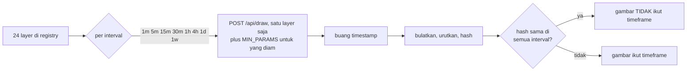
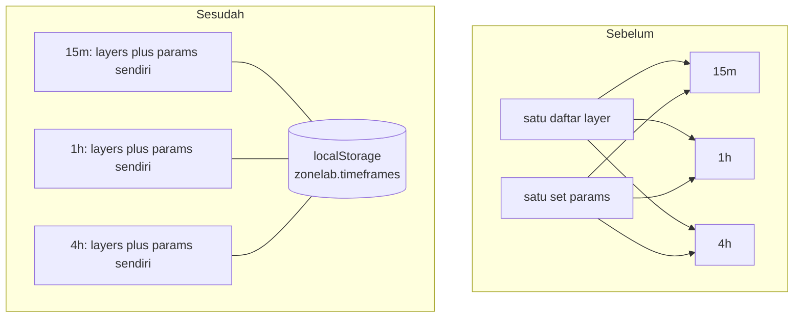

# Autodrawing per timeframe, diukur 11 September 2026

Keluhannya satu kalimat: gambar otomatis yang dinyalakan di 1H ikut terbawa ke
M1, M15 dan H4. Pertanyaannya ternyata dua, dan hanya satu yang benar benar
rusak.

1. **Geometrinya**: apakah kotak yang digambar di M15 sebenarnya kotak 1H yang
   dicetak ulang, bukan hasil pembacaan bar M15?
2. **Saklarnya**: apakah pilihan layer yang dinyalakan di satu timeframe ikut
   menyala di timeframe lain?

> [!IMPORTANT]
> Jawabannya: **geometri sudah benar sejak awal, saklarnya yang salah.** Dua
> puluh empat layer diukur di kedelapan timeframe untuk kedua puluh enam simbol
> - 4.992 sel - dan tidak satu pun mengembalikan himpunan harga yang sama dua
> kali. Yang mengikuti pembaca lintas timeframe adalah pilihan layer-nya beserta
> knob-nya, dan itu yang diperbaiki.

## Daftar isi

- [Cara mengukurnya](#cara-mengukurnya)
- [Kontrol](#kontrol)
- [Hasil per layer](#hasil-per-layer)
- [Apa yang berubah di aplikasi](#apa-yang-berubah-di-aplikasi)
- [Dampak ke harness](#dampak-ke-harness)
- [Permukaan gambar yang lain](#permukaan-gambar-yang-lain)
- [Yang belum dijawab](#yang-belum-dijawab)

## Cara mengukurnya

Satu layer sekali jalan, simbol dan jumlah bar yang sama, SETIAP interval yang
ditawarkan aplikasi - kedelapannya dibaca dari `/api/config`, bukan daftar yang
diketik di alatnya. Versi pertama alat ini mengetik enam dan diam diam melewati
1m dan 1w, dua ujung rentangnya, justru tempat cacat timeframe paling mungkin
muncul. Setiap
angka pembawa harga di dalam `drawing` dikumpulkan, dibulatkan ke 5 desimal,
diurutkan, lalu di-hash. Timestamp DIBUANG sebelum hashing, karena bentuk yang
terpaku pada bar memang WAJIB bergeser waktunya begitu panjang bar berubah, dan
itu bukan pertanyaannya. Pertanyaannya apakah HARGA-nya himpunan yang sama.



Parameter run: 500 bar, 11 September 2026, tiap simbol lewat provider yang
membawanya (18 di `mt5`, 8 di `yahoo`). Bisa diulang:

```bash
cd backend
.\.venv\Scripts\python.exe -m tools.tf_audit --all 500   # 26 simbol -> ../docs/tf_audit/
.\.venv\Scripts\python.exe -m tools.tf_audit BTCUSD 900  # satu simbol saja
```

`--all` MELEWATI simbol yang filenya sudah ada. Itu bukan kenyamanan: sapuan
penuh adalah ribuan panggilan draw selama berjam-jam, dan run yang mati di
simbol kesembilan belas tidak boleh mulai lagi dari simbol satu.

Alatnya menolak melaporkan sapuan kalau kontrolnya kotor: begitu ada satu layer
yang fingerprint-nya bergerak padahal tidak ada yang berubah, ia keluar dengan
kode 1 dan tidak menulis apa apa.

## Kontrol

MT5 adalah feed hidup. Kalau harga bergerak di antara panggilan, hash akan beda
tanpa ada hubungannya dengan timeframe, dan seluruh vonis di bawah jadi tidak
berarti. Jadi kontrolnya dijalankan lebih dulu: **request yang sama persis, dua
kali, di 15m, untuk tiap layer**.

| Kontrol | Hasil |
|---|---|
| Request identik dua kali, per layer, di 15m, di **26 simbol** | **stabil di semua, 0 melenceng** |

Satu simbol sempat gagal kontrol ini dan itu bukan noise: XAGUSD menjawab HTTP
500 dua kali, yang ternyata cacat aplikasi sungguhan. Lihat lipatan di bawah.

Baru setelah itu sapuannya dibaca. Alatnya keluar dengan kode 1 dan tidak
menulis apa apa kalau kontrolnya kotor.

## Hasil per layer

Seluruh registry, di kedelapan interval, untuk **setiap simbol** yang dibawa
registry: 26 simbol x 24 layer x 8 interval = **4.992 sel terukur**, nol error
provider.

| Simbol | Provider | Sel terukur | Sama di semua TF | Layer kosong |
|---|---|---|---|---|
| `BRENT` | mt5 | 192 | **0** | `expectation` |
| `BTCUSD` | mt5 | 192 | **0** | `expectation` |
| `COPPER` | mt5 | 192 | **0** | `expectation` |
| `DE30` | mt5 | 192 | **0** | `expectation` |
| `DXY` | mt5 | 192 | **0** | `expectation` |
| `ETHUSD` | mt5 | 192 | **0** | `expectation` |
| `EURFX` | yahoo | 192 | **0** | `expectation` |
| `EURUSD` | mt5 | 192 | **0** | - |
| `GBPFX` | yahoo | 192 | **0** | `expectation` |
| `GBPJPY` | mt5 | 192 | **0** | `expectation` |
| `IDX` | yahoo | 192 | **0** | `expectation`, `news` |
| `NAS100` | mt5 | 192 | **0** | `expectation` |
| `NGAS` | mt5 | 192 | **0** | `expectation` |
| `RBOB` | yahoo | 192 | **0** | `expectation` |
| `RUS2000` | yahoo | 192 | **0** | `expectation` |
| `SPX500` | mt5 | 192 | **0** | `expectation` |
| `ULSD` | yahoo | 192 | **0** | `expectation` |
| `US10Y` | yahoo | 192 | **0** | `expectation` |
| `US30` | mt5 | 192 | **0** | - |
| `US30Y` | yahoo | 192 | **0** | `expectation` |
| `USDJPY` | mt5 | 192 | **0** | - |
| `WTI` | mt5 | 192 | **0** | `expectation` |
| `XAGUSD` | mt5 | 192 | **0** | - |
| `XAUUSD` | mt5 | 192 | **0** | - |
| `XPDUSD` | mt5 | 192 | **0** | `expectation` |
| `XPTUSD` | mt5 | 192 | **0** | `expectation` |
| **26 simbol** | | **4992** | **0** | |

**Nol.** Tidak ada satu pun layer, di satu pun simbol, yang menggambar himpunan
harga yang sama di semua timeframe.

`expectation` kosong di 21 simbol karena ia MEMBACA hasil pengukuran, bukan
menghitung dari bar: sel yang belum pernah diukur memang tidak punya kipas, dan
itu memang perilaku yang dikehendaki. `news` kosong di IDX karena kalendernya
tidak membawa mata uang itu.

### XAUUSD, per layer

Angka di tiap kolom adalah jumlah objek yang digambar layer itu di interval
tersebut, dari `docs/tf_audit/XAUUSD.json`.

> [!NOTE]
> Jumlah objeknya BERGERAK antar run karena feed-nya hidup - dua run terpisah
> satu hari memberi `structure` 108 lalu 107 di 15m. Yang tidak bergerak adalah
> vonisnya. Kontrol mengukur kestabilan pada satu momen, bukan lintas hari.

| Layer | 1m | 5m | 15m | 30m | 1h | 4h | 1d | 1w | Vonis |
|---|---|---|---|---|---|---|---|---|---|
| `supply_demand` | 4 | 6 | 4 | 5 | 4 | 5 | 6 | 6 | ikut timeframe |
| `fvg` | 7 | 7 | 6 | 8 | 9 | 10 | 10 | 7 | ikut timeframe |
| `order_block` | 9 | 7 | 7 | 9 | 8 | 10 | 11 | 8 | ikut timeframe |
| `ifvg` | 6 | 6 | 6 | 7 | 6 | 11 | 10 | 6 | ikut timeframe |
| `breaker` | 1 | 6 | 6 | 6 | 6 | 8 | 10 | 7 | ikut timeframe |
| `ote` | 4 | 7 | 7 | 7 | 5 | 11 | 11 | 7 | ikut timeframe |
| `cisd_zone` | 7 | 7 | 7 | 8 | 6 | 10 | 11 | 8 | ikut timeframe |
| `liquidity_pool` | 2 | 2 | 4 | 1 | 1 | 3 | 1 | 1 | ikut timeframe |
| `structure` | 108 | 94 | 108 | 107 | 108 | 105 | 95 | 103 | ikut timeframe |
| `session` | 2 | 9 | 36 | 72 | 141 | 281 | 200 | 200 | ikut timeframe |
| `vortex` | 1 | 1 | 1 | 1 | 1 | 1 | 1 | 1 | ikut timeframe |
| `gaps` | 10 | 10 | 10 | 10 | 11 | 11 | 11 | 0 | ikut timeframe |
| `chart_gaps` | 1 | 2 | 3 | 1 | 1 | 5 | 10 | 4 | ikut timeframe |
| `psp` | 0 | 4 | 15 | 26 | 60 | 68 | 69 | 73 | ikut timeframe |
| `wyckoff` | 107 | 123 | 93 | 104 | 113 | 112 | 120 | 120 | ikut timeframe |
| `cisd` | 40 | 40 | 40 | 40 | 40 | 40 | 40 | 40 | ikut timeframe |
| `dfr` | 0 | 1 | 4 | 4 | 4 | 4 | 4 | 4 | ikut timeframe |
| `ssmt` | 0 | 4 | 13 | 22 | 51 | 61 | 69 | 73 | ikut timeframe |
| `pools` | 0 | 6 | 12 | 12 | 12 | 12 | 12 | 12 | ikut timeframe |
| `liquidity` | 2 | 4 | 14 | 16 | 16 | 16 | 16 | 16 | ikut timeframe |
| `projections` | 0 | 4 | 4 | 4 | 4 | 4 | 0 | 0 | ikut timeframe |
| `expectation` | 1 | 1 | 1 | 1 | 1 | 1 | 1 | 1 | ikut timeframe |
| `news` | 0 | 5 | 5 | 5 | 5 | 5 | 0 | 0 | ikut timeframe |
| `checklist` | 1 | 1 | 1 | 1 | 1 | 1 | 1 | 1 | ikut timeframe |

<details><summary>Lima layer nyaris lolos tanpa terukur</summary>

Run pertama melaporkan `session`, `dfr`, `ssmt`, `psp` dan `checklist` sebagai
"kosong di semua TF". Itu BUKAN hasil - itu lima layer yang tidak terjawab,
dilaporkan dengan nada seolah terjawab. Tiga yang pertama memang menggambar nol
dengan params default, disengaja dan sudah dicatat di
`components/toolbox.tsx`; `psp` butuh partner SSMT yang sama; `checklist` panel,
bukan bentuk.

Alatnya sekarang membawa `MIN_PARAMS` (tabel yang sama dengan
`frontend/e2e/wiring.mjs`) dan mem-fingerprint blok laporan `checklist`
alih-alih `drawing`. Kelimanya terukur, dan keempat yang menggambar ternyata
sangat bergantung timeframe: `session` 2 objek di 1m sampai 281 di 4h, `psp` 0
sampai 73, `ssmt` 0 sampai 73.

</details>

<details><summary>Satu cacat aplikasi yang ditemukan sapuan ini</summary>

Menyapu XAGUSD dengan tabel partner tetap berarti meminta perak berdivergensi
dari perak. API menjawab **HTTP 500**, dua kali, di kontrolnya - dan `_draw_ssmt`
punya docstring yang berjanji setiap kegagalan di sana dilaporkan, tidak pernah
dilempar. Penyebabnya: `ssmt()` melempar `ValueError` kalau diberi kurang dari
dua instrumen, sementara blok itu hanya menangkap `ProviderError`.

Bisa dicapai dari UI, bukan cuma dari request buatan tangan: picker partner
mengeluarkan simbol chart dari OPSI-nya tapi tidak memangkas pilihan yang sudah
dibuat, jadi memilih perak sebagai partner emas lalu memindahkan chart ke perak
meninggalkan bentuk itu persis. Sekarang dijaga di `app/main.py` dan dikunci
`tests/test_api_boundary.py`.

</details>

<details><summary>Kenapa news, projections dan gaps kosong di interval ujung</summary>

Diukur, bukan diduga:

| Layer | Interval | Angka mesinnya | Sebab |
|---|---|---|---|
| `news` | 1m | `news_found 81, news 0` | jendela 500 bar 1m cuma ~8 jam, tidak ada rilis di dalamnya |
| `news` | 1d, 1w | `news_found 81, news 0` | bar tertutup TERAKHIR di 1d adalah 2026-09-10 00:00 dan di 1w 2026-08-30 00:00, sementara kalender cuma membawa jendela 5,28 hari yang berakhir di masa depan. Layer ini hanya menggambar rilis yang jatuh di antara bar pertama dan bar tertutup terakhir |
| `projections` | 1m, 1d, 1w | `projections 0` | proyeksi dibangun dari sesi harian; bar 1d dan 1w tidak punya sesi di dalamnya, dan jendela 1m tidak memuat satu sesi utuh |
| `gaps` | 1w | `gaps_found 0, gaps_no_bars 2495` | 2.495 opening gap tidak punya bar mingguan untuk ditempeli |

Ketiganya konsisten dengan konstruksi masing masing layer, bukan cacat
timeframe. Satu jebakan pemakaian yang layak dicatat: di 1d dan 1w layer `news`
praktis selalu kosong, karena kalendernya hanya sepanjang minggu berjalan
sedangkan bar tertutup terakhir di sana bisa berumur seminggu.

</details>

## Apa yang berubah di aplikasi

Pilihan layer **dan knob-nya** sekarang disimpan per timeframe, di
`frontend/src/lib/timeframes.ts`.



Knob-nya ikut karena `impulse_atr`, `base_max_bars` dan `min_gap_atr` dibaca
dalam satuan bar dan ATR timeframe chart itu sendiri: ambang yang disetel sampai
15m terlihat benar adalah ambang yang tidak pernah dipilih siapa pun untuk 1d.
Memisah saklarnya sambil berbagi knob akan menyisakan separuh gambarnya tetap
mengikuti pembaca.

Aturannya:

- [x] Menyalakan layer di 1H hanya berlaku di 1H.
- [x] Hanya timeframe boot (15m) yang lahir dengan default `supply_demand`.
      Timeframe yang belum pernah dikonfigurasi mulai dari kosong, karena kalau
      semuanya diberi default yang sama, keluhan aslinya cuma pindah rute.
- [x] Preset mendarat di timeframe yang sedang dibuka, bukan di semuanya.
- [x] Header menyebut timeframe-nya: `1 of 24 layers on 15m`.
- [x] Rail kosong menyebut timeframe mana yang kosong, dan menawarkan tombol
      menyalin set dari timeframe yang sudah punya. Menyalin, bukan berbagi:
      begitu mendarat keduanya terpisah.
- [x] Knob tiap layer ikut per timeframe. Tombol "Reset parameters" menyebut
      timeframe yang direset dan tidak mematikan layernya.
- [x] Tombol salin membawa knob-nya juga, bukan cuma daftar layernya.
- [x] Peta ini DIPERSIST di `localStorage` (`zonelab.timeframes`), lewat store
      yang polanya sama dengan `lib/rails.ts`. Setup per timeframe yang terhapus
      tiap refresh lebih buruk daripada tidak ada, karena pembaca jadi punya
      delapan yang harus dibangun ulang, bukan satu.
- [x] `localStorage` diperlakukan sebagai trust boundary: daftar layer disaring
      ke string, tiap blok params di-merge DI ATAS default, dan store yang korup
      jatuh ke default alih-alih ke panel yang menolak render. Diuji dengan
      store yang sengaja dirusak di `e2e/timeframe-layers.mjs`.

## Dampak ke harness

Enam harness dulu bergantung pada default 15m ikut terbawa saat mereka
mengganti timeframe. Jebakannya bukan sekadar "layer mati" - `click()` itu
TOGGLE, jadi harness yang mengklik supply and demand untuk MEMATIKANNYA, di
timeframe tempat ia tak pernah menyala, justru MENYALAKANNYA lalu mengukur
chart yang salah sementara semua assertion tetap hijau. Bentuk kegagalan yang
sama dengan salah argumen di `docs/CALIBRATION.md`.

Karena itu ada `e2e/_layers.mjs`: ia membaca `aria-checked` dulu dan mengklik
hanya kalau keadaannya memang harus berubah.

| Harness | Yang berubah |
|---|---|
| `pixel-truth.mjs` | `onlyLayers` menggantikan dua klik buta |
| `chart-audit.mjs` | sama |
| `nonbox-truth.mjs` | satu klik buta jadi `setLayer(..., false)` |
| `offscreen-zones.mjs` | `pickTimeframe` menyalakan layer di interval tujuan |
| `zone-audit.mjs` | sama |
| `visual-audit.mjs` | sama, sekali per timeframe di loop-nya |
| `expectation-path.mjs` | layer dinyalakan ulang setelah pindah ke 1h |

Harness baru: `e2e/timeframe-layers.mjs` (`npm run e2e:timeframe`), **28
check**, dan ia menguji setiap sisi klaimnya:

- saklarnya tidak ikut pindah, dan timeframe asalnya tidak tersentuh;
- dua timeframe menggambar kotak yang berbeda, dengan kontrol "request yang
  sama dua kali memberi himpunan yang sama" di dalamnya;
- knob yang disetel di 15m tetap default di 1h dan masih 7 saat kembali;
- isi `localStorage` diperiksa langsung, per timeframe;
- reload mengembalikan layer DAN knob-nya;
- store yang sengaja dirusak (`layers: ["supply_demand", 42]`,
  `max_zones_per_side: "nonsense"`, plus field yang tidak dikenal) tetap
  merender chart tanpa banner error.

Yang terakhir itu menemukan lubang di guard versi pertama: merge per-blok
meloloskan nilai bertipe salah ke request body, backend menjawab 422, dan
pembaca dapat banner error dari store yang tidak pernah ia sunting. Sekarang
tiap field di-whitelist menurut bentuk default-nya.

## Permukaan gambar yang lain

Aplikasi web bukan satu satunya tempat repo ini menggambar. Ketiganya diperiksa,
dan tidak satu pun punya masalah yang sama:

| Permukaan | Keadaan |
|---|---|
| Pine (`mql5/pine/*.pine`) | `request.security(..., timeframe.period, ...)` dan `box.new(bar_index[2], ...)`: keduanya memakai timeframe chart itu sendiri, tidak ada TF yang dipatok |
| EA MQL5 (`mql5/ZonelabSupplyDemand/*`) | nol `ObjectCreate` di seluruh direktori, jadi tidak ada objek chart yang menetap dan `OBJPROP_TIMEFRAMES` tidak relevan |
| Halaman `/agent` | `SCAN_LAYERS` tetap, dengan picker interval sendiri, dan tiap scan menarik ulang di interval itu - tidak ada saklar yang bisa ikut pindah |

> [!WARNING]
> Satu hal SENGAJA masih menggambar timeframe lain di chart Anda: picker **HTF**
> di header. Itu proyeksi top-down ICT yang diminta secara eksplisit, kotaknya
> diberi badge nama timeframe asalnya, dan defaultnya `off`. Ia tidak disentuh
> perubahan ini. Kalau Anda melihat kotak 4h di chart 15m, cek picker itu dulu.

## Yang belum dijawab

Yang tersisa, dan tidak ada yang menyangkut pertanyaan timeframe:

- Satu jumlah bar (500) dan satu tanggal. Sapuan ini tidak menanyakan apakah
  vonisnya berubah pada jendela yang jauh lebih panjang.
- Di 1d dan 1w layer `news` praktis selalu kosong, sebab kalendernya cuma
  seminggu sementara bar tertutup terakhir di sana bisa berumur seminggu. Itu
  perilaku yang benar untuk layer-nya dan jebakan pemakaian yang nyata; belum
  diputuskan apakah rail-nya harus mengatakannya.
- `expectation` kosong di 21 simbol karena selnya belum pernah diukur. Itu
  pertanyaan kalibrasi, bukan pertanyaan timeframe.
- **Registry tumbuh jadi 25 layer** pada 11 September 2026 dengan masuknya
  `smt_fill` (lihat `docs/ADOPSI.md`). Sapuan di halaman ini menyapu 24; layer
  ke-25 belum termasuk. Hapus `docs/tf_audit/` lalu jalankan
  `tools.tf_audit --all` lagi kalau angka penuhnya dibutuhkan.

---

Copyright 2026 PT Surya Inovasi Prioritas (SURIOTA).
