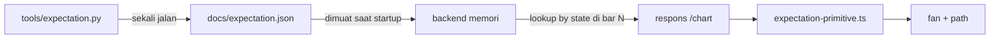

# Spec: Overlay Conditional Expectation

- Tanggal: 2026-08-31
- Slice: S1 dari decomposition 2026-08-31
- Status: menunggu review owner

## 1. Ringkasan

Layer baru `expectation` yang menampilkan distribusi outcome forward yang terukur,
dikondisikan pada state chart di bar terakhir. Fan persentil sebagai default, garis
"expected path" opsional dan off by default. Semua angka datang dari tabel lookup
yang di-precompute offline, bukan dihitung live di render time.

## 2. Keputusan yang direkonsiliasi

Fitur ini bertabrakan dengan keputusan terdokumentasi di `docs/BACKLOG.md` bagian 7:
"Gambar jalur forecast. Mesin ini tidak meramal, dan itu keputusan." Owner memutuskan
resolusinya pada 2026-08-31: **keduanya, terpisah jelas**.

Artinya:

- Band probabilitas terukur = default. Ia distribusi historis, bukan prediksi.
- Jalur forecast = off by default, digate terpisah, dan dilabel "historical average,
  not a forecast".

Pembedaan yang membuat ini konsisten dengan disiplin repo: forecast path (satu garis
prediksi harga) berbeda dari conditional expectation (distribusi outcome terukur,
dikondisikan pada state sekarang). Repo sudah menghitung yang kedua di
`tools/checklist_outcomes.py`, `tools/conditioned_gaps.py`, `tools/dfr_outcomes.py`,
dan `tools/ssmt_outcomes.py`; layer ini memindahkannya ke chart.

## 3. Apa yang ditampilkan

Di bar terakhir chart, sebuah fan ke kanan yang menjawab: "dari N setup historis yang
mirip state sekarang, harga berakhir di sini H bar kemudian".

| Elemen | Isi |
|---|---|
| Fan persentil | garis persentil 5 / 25 / 50 / 75 / 95 dari pergerakan forward |
| Base rate | distribusi forward tak bersyarat instrumen itu, sebagai pembanding |
| Count | n setup historis yang membentuk bucket |
| Confidence | interval kepercayaan 95 persen untuk median |
| Verdict | status terukur kondisioner: `null` atau `memisahkan` (dengan tanda) |

Satuan fan adalah ATR, dikonversi ke harga saat render memakai ATR bar terakhir.
Horizon `H` adalah parameter, default 96 bar, angka reach yang sudah dipakai
layer-layer lain di `app/layers.py`.

Garis "expected path" (opsional) adalah rata-rata lintasan forward historis sebagai
fungsi horizon, digambar sebagai satu garis ke kanan. Ia dan fan membaca tabel yang
sama; bedanya cuma rendering.

## 4. Arsitektur: precompute, bukan live

Intrabar resolution (bar 5 menit) memakan sekitar 80 menit terminal MT5 per run dan
riwayat 5 menit terbatas ke April 2025. Menghitung distribusi di render time tidak
mungkin dan juga salah arah, karena distribusi itu milik populasi yang sudah diukur,
bukan milik bar tertentu.



- `tools/expectation.py` reuse intrabar resolution dan populasi yang sudah dipakai
  `tools/checklist_outcomes.py`, lalu mengeluarkan tabel lookup berjenjang.
- Backend memuat tabel itu ke memori saat startup. Tidak ada panggilan network dan
  tidak ada komputasi berat di jalur render.
- Endpoint chart menambahkan satu objek `expectation` per bar yang diminta. Lookup
  hanya membaca state yang knowable di bar itu.

## 5. Kondisioner: coarse, bukan match eksak

Match eksak 17 klausa checklist plus SSMT plus DFR akan menghasilkan state yang
nyaris selalu n=0. Populasi yang ada cuma n=1855 di delapan instrumen. Jadi bucket
dibentuk dari dimensi berdimensi rendah, dengan lantai `n >= 30` per bucket (angka
`MIN_GROUP` yang sudah dipakai `tools/conditioned.py`):

| Dimensi | Nilai |
|---|---|
| side zona | demand / supply |
| `dfr_side` | terpenuhi / gagal / tidak knowable |
| bucket `met` | skor checklist dibucket |
| degree | 1h (sel yang diukur) |

Dimensi ini dipilih karena sudah diukur, bukan dikarang. Hasil terukurnya: aggregate
`met` null (rho -0,027), 29 kolom `tools/conditioned.py` null, dan `dfr_side`
satu-satunya yang memisahkan dengan tanda terbalik. Fan akan mencerminkan itu.

## 6. Anti-lookahead dan no-repaint

Dua sifat yang tidak bisa dinegosiasikan di repo ini, keduanya ditegakkan oleh test:

1. **Anti-lookahead.** Lookup memakai state yang knowable di bar N saja. Sebuah
   klausa yang belakangan tidak boleh mengubah distribusi yang sudah tampil di bar
   sebelumnya.
2. **No repaint.** Fan yang sudah tergambar di bar N tidak boleh berubah saat data
   baru datang. Diverifikasi lewat invariant prefiks, pola yang sama dengan
   `tests/test_no_repaint.py`.

Konsekuensi jujur yang harus ditulis: distribusi ini diukur atas seluruh sampel
(walk-forward terlipat), jadi ia descriptive statistic, bukan prediksi live. Label
"measurement" menempel di setiap render.

## 7. Data shape

`docs/expectation.json`, satu tabel berjenjang:

```json
{
  "preregistered": "tools/expectation.py, 2026-08-31",
  "horizon_bars": 96,
  "cells": {
    "XAUUSD@1h": {
      "base_rate": { "n": 1234, "q5": -1.2, "q25": -0.4, "q50": 0.0, "q75": 0.5, "q95": 1.4 },
      "buckets": {
        "demand|dfr_false|met_0_3": { "n": 87, "q5": -1.0, "q50": 0.1, "q95": 1.1, "verdict": "null" }
      }
    }
  }
}
```

Quantile dalam satuan ATR, relatif terhadap harga entry. `verdict` menyalin status
terukur bucket itu. Endpoint `/chart` menambahkan satu objek `expectation` per bar
berisi fan yang cocok, atau `null` untuk sel yang belum diukur.

## 8. Frontend

- Satu entri `Layer` baru di `app/layers.py`: `id="expectation"`,
  `kind="overlay"`, `params="expectation"`.
- `frontend/src/components/expectation-primitive.ts` menggambar fan dan path.
- Toggle on/off lewat registry dan toolbox yang sudah ada, tidak ada mekanisme baru.

## 9. Testing dan gate

- **Selfcheck.** Gate tidak kosong: suntik cacat ke aritmetika verdict, pastikan
  gagal, kembalikan. Pola `--selfcheck` yang sudah dipakai `tools/conditioned_gaps.py`.
- **No repaint.** Prefiks membesar, fan yang sudah terbit tidak berubah.
- **Anti-lookahead.** Klausa yang belakangan tidak mengubah distribusi bar sebelumnya.
- **Walk-forward.** Bucket dilipat 8 dan tanda diverifikasi, sama dengan pola
  `docs/checklist_outcomes.json`.

## 10. Di luar scope

- Tidak ada kondisioner full-state (ditolak demi lantai n>=30).
- Tidak ada forecast path yang masuk jalur keputusan; ia murni rendering.
- Tidak menambah instrumen atau timeframe baru di layer ini. Sel baru menunggu S0
  lalu `tools/expectation.py` dijalankan ulang atas sel itu.
- Tidak ada bobot kondisioner. `formation_score` pernah memeringkat terbalik
  (AUC 0,464 dan 0,477), jadi bobot dilarang di repo ini.
