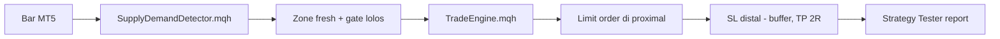

# EA MQL5 Zonelab SupplyDemand - Spec v1

> [!NOTE]
> Status: desain disetujui, siap implementasi. Tanggal 31 Agustus 2026.

## Tujuan

Membuat Expert Advisor (EA) MQL5 yang mem-port detektor `supply_demand` dari
Python (`backend/app/detect/supply_demand.py`) dan menjalankan aturan entry
doctrine di MT5 Strategy Tester, supaya drawing Zonelab bisa di-backtest di
terminal Exness yang sebenarnya.

## Kenapa ini ada

Rig Python (`tools/costed.py`, `tools/walkforward.py`, `tools/drawing_accuracy.py`)
sudah mengukur drawing dan hasilnya: presisi 0 error, valid out-of-sample, tapi
tidak meramalkan arah. Yang belum diukur adalah eksekusi di tick data nyata
dengan model fill, slippage, margin, dan swap broker. EA ini menutup celah itu,
dan hasilnya bisa dibandingkan 1:1 dengan angka Python.

## Scope v1

- Satu detektor: `supply_demand` (DBR/RBR/RBD/DBD).
- Entry doctrine: zona demand = long, supply = short (arah = sisi zona, karena
  10 hipotesis arah gagal dan `app/plan.py` tidak menciptakan arah).
- Target = 2R konvensional, bukan zona lawan terdekat. `profit_zone` = v2.
- Tanpa checklist rules (killzone/OTE/CISD/bias) = v2.

## Arsitektur

Tiga file:

1. `SupplyDemandDetector.mqh` - port logika deteksi, faithful ke Python.
2. `TradeEngine.mqh` - geometri trade (entry/stop/target/sizing).
3. `ZonelabSD.mq5` - EA main (OnTick, scan, place, manage).

## Spesifikasi port detektor

Port harus menghasilkan zona yang identik dengan Python pada bar yang sama.
Algoritma persis (`backend/app/indicators.py` + `backend/app/detect/supply_demand.py`):

| Step | Rumus | Default shipped |
|---|---|---|
| ATR | Wilder RMA dari true range | `atr_period=14` |
| Label bar | `body_ratio >= 0.5` DAN `range >= 1.0 * prior_atr` | exciting = sign(body), else 0 |
| Run | kompres label jadi (label, start, end) | - |
| Formasi | triple `leg_in -> base -> leg_out` | DBR/RBR/RBD/DBD |
| Base clip | `base_from = max(base_start, base_to - base_max_bars + 1)` | `base_max_bars=6` |
| Box | distal = ekstrem wick, proximal = wick (default) | `proximal_basis=wick` |
| Floor | `zone_min_atr * flat_atr`, grow dari sisi proximal | `zone_min_atr=0.05` |
| Gate | departure, base height, drift, profit margin | lihat tabel di bawah |

Gate yang menolak kandidat:

| Gate | Kondisi | Default |
|---|---|---|
| `rejected_base_too_tall` | `height > base_max_atr * atr_base` | `base_max_atr=2.5` |
| `rejected_base_drifted` | `drift > max_base_drift` | `max_base_drift=0.6` |
| `rejected_weak_departure` | `departure_atr < departure_min_atr` | `departure_min_atr=2.0` |
| `rejected_thin_profit_margin` | `profit_margin < min_profit_margin` | `min_profit_margin=0.0` (off) |

`EPS = 1e-12`.

## Logika trade

Dari `backend/app/plan.py`:

- `entry = proximal`
- `stop = distal - way * buffer`, `buffer = 0.25 * atr_base`, `way = +1` demand, `-1` supply
- `target = entry + way * 2 * risk` (2R, v1)
- `risk = |entry - stop|`
- sizing = `equity * risk_pct / risk`, floor ke langkah lot, `risk_pct=1%` default

## Parity test (WAJIB, bukan opsional)

Port MQL5 harus identik dengan Python sebelum hasil trade boleh dibanding.
Caranya: reference port Python yang memirror struktur MQL5 (loop eksplisit,
indexing sama), diff vs detektor numpy di 500 bar `mt5:XAUUSD` yang sama.
Target: 0 selisih pada (id, top, bottom, proximal, distal, departure_atr, side).

## Selesai artinya

1. Parity test 0 diff.
2. Compile MQL5 via MetaEditor: 0 error, 0 warning.
3. Strategy Tester di `mt5:XAUUSD` 15m dan 1h menghasilkan R expectancy + drawdown.
4. Bandingkan vs Python `costed`/`walkforward` di simbol+interval sama.

## Risiko tercatat

- Strategy Tester butuh tick/M1 history ter-download di terminal. Kalau belum,
  fill pakai OHLC M1, bukan tick nyata.
- `supply_demand` adalah detektor terlemah di emas MT5 (walk-forward 7/8 di 1.0
  dan 2.0 ATR, lawan `order_block` 8/8). Port dulu buat buktikan pipanya.
- Checklist rules tidak di-port, jadi hasil EA tidak 1:1 dengan daemon yang
  bisa `--require`.

## Di luar scope (v2)

- Detektor `order_block`, `fvg`.
- `profit_zone` (target zona lawan terdekat).
- Checklist rules (`killzone`, `OTE`, `CISD`, `bias_agrees`).
- Live deployment (ganti daemon Python).
