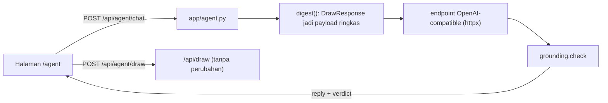

# Desain AI Agent advisor, 21 Agustus 2026

Satu pertanyaan yang dijawab dokumen ini: **bagaimana sebuah language model
dipasang di atas engine Zonelab tanpa memberinya satu keputusan pun yang bukan
miliknya.**

## Masalah

Engine Zonelab sudah menghasilkan data lengkap per drawing: zona (detector),
trade plan (entry, stop, target, lots, risk, cost), advice per zona, checklist,
dan overlay. Semua itu angka terukur. Yang belum ada adalah permukaan diskusi:
cara bertanya "kondisi market sekarang gimana" dan dapat jawaban yang
menyusun angka-angka itu jadi analisa plus checklist order.

## Prinsip yang tidak bisa ditawar

Dua belas hipotesis arah terdaftar sebelumnya gagal semua; `direction_evidence`
selalu None. Maka model diberi pekerjaan yang salahnya murah dan bisa dicek:

1. **Model boleh menjelaskan, dilarang memutuskan.** Ia menyusun diskusi dan
   checklist dari angka engine. Ia tidak boleh memprediksi arah, tidak boleh
   menghasilkan angka baru.
2. **Jaminannya mekanis, bukan permintaan.** Setiap reply melewati
   `grounding.check`: setiap numeral di jawaban harus ada di payload yang
   diberikan. Angka hasil karangan tertolak otomatis. Ini infrastruktur yang
   sudah ada di `app/grounding.py`; dipakai ulang, tidak ditulis ulang.
3. **Key tidak pernah masuk git.** Config runtime (base_url, api_key, model)
   hidup di `backend/.agent.json`, masuk `.gitignore`, pola yang sama dengan
   `.autotrade.json`.

## Arsitektur

- **Context dibuat frontend, bukan server.** Halaman /agent punya picker sendiri
  (symbol, interval, bars, provider), memanggil `/api/draw` yang sudah ada,
  lalu mengirim DrawResponse verbatim sebagai `context` di tiap chat. Server
  stateless, tidak menyimpan sesi, tidak ada cache sesi yang bisa basi.
- **Prompt system dibangun di `app/agent.py`** sebagai konstanta, pola yang
  sama dengan `CHART_AUDITOR` di `app/llm.py`. Konstitusi kejujuran (first
  touch, cohort rate bukan probabilitas, biaya) tertulis di prompt DAN
  ditegakkan grounding.
- **Transport: non-streaming.** Reply utuh, lalu verdict. Streaming bisa
  ditambah kemudian; batasnya ditandai komentar `ponytail:`.

## Komponen

### Backend `backend/app/agent.py`

- `read_config() / save_config()`: `backend/.agent.json`, missing = kosong =
  fitur mati dan bilang begitu (pola provider key).
- `models()`: GET `{base_url}/models`, dipakai UI untuk picker.
- `digest(response: dict) -> dict`: zona (field kunci, cap 40 terbaru), plan
  penuh (cap 40), advice penuh, checklist, meta, overlay utama (ssmt,
  structure, pools, levels, dfr, gaps) dengan field kunci dan cap, candle
  terakhir saja. Semua angka yang boleh dikutip model ada di sini.
- `chat(messages, context)`: susun messages, panggil upstream, jalankan
  `grounding.check`, balas `{reply, grounded, reason, unsupported, model}`.
- Prompt cap: `settings.llm_max_prompt_chars` dipakai ulang.

### Endpoint API (di `main.py`)

| Endpoint | Fungsi |
|---|---|
| `GET /api/agent/config` | config dengan key dimasker + `available` |
| `POST /api/agent/config` | simpan config, probe `/models`, laporkan reachable |
| `POST /api/agent/chat` | satu putaran chat dengan context dan grounding |

### Frontend `frontend/src/app/agent/page.tsx`

URL sendiri (`/agent`), bukan bagian main dashboard. Layout dua kolom:
context panel (picker + Scan + ringkasan drawing) dan chat (message list,
badge grounding per jawaban, input). Settings panel untuk base_url, key,
model. Tema dan token warna dari `globals.css` dipakai apa adanya.

### Folder `AI Agent/`

Dokumen definisi untuk manusia dan sesi Claude di folder itu: `SOUL.md`
(persona dan batas), `README.md` (cara pakai), `CLAUDE.md` (instruksi sesi),
`AGENTS.md` (pembagian peran review). Sumber kebenaran prompt tetap di kode,
karena hanya kode yang dites.

## Testing dan gate

1. `backend/tests/test_agent.py`: config round-trip, digest (cap, tidak ada
   candles), chat dengan upstream mock, grounding menolak angka karangan,
   refusal tanpa key. Ditulis SEBELUM implementasi (merah dulu).
2. `python -m tools.agent_smoke`: end to end dengan endpoint sungguhan:
   simpan config, draw sungguhan (provider mt5), chat sungguhan, cetak reply
   + verdict.
3. `python -m tools.agent_stress`: N chat paralel, ukur latency dan error,
   dan buktikan `/api/health` tetap responsif selama banjiran.
4. `frontend/e2e/agent.mjs`: page render, panel settings, refusal tanpa key,
   round-trip dengan key (skip bila tidak terpasang).
5. Gate lama tetap: `pytest`, `pyflakes`, `npm run check`, `npm run build`.

## Yang sengaja tidak dibangun

- Streaming SSE: reply utuh dulu, verdict ikut sekali jalan.
- Penyimpanan riwayat chat di server: stateless, history di browser.
- Tool-calling / agentic loop: model tidak memanggil apa pun. Ia membaca
  context yang dikirim dan menjawab. Memberi model akses memanggil API sendiri
  berarti memberi API surface baru ke prompt.
- CLI mode: `llm.py` punya backend CLI untuk vision job; agent chat cukup
  HTTP. CLI bisa ditambah belakangan lewat config yang sama.
